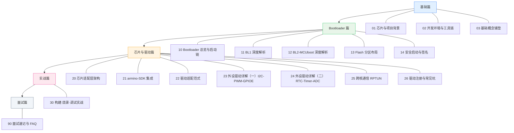

# 开始这里 · 导航与学习路径

> 本文档是 **BK7258 芯片（open-vela / NuttX 移植）初学者学习套件** 的总入口。
> 如果你第一次接触嵌入式、第一次听说"BK7258""NuttX""Bootloader"这些词，从这一页开始就对了。

## 这套文档是给谁看的

打一个比方：你刚拿到一台很特别的"乐高积木机器人"——BK7258 芯片。它脑子里（Flash）已经烧好了一套程序，上电能让 Wi-Fi 连上网、能跑多核任务。但你想**真正搞懂它是怎么从"通电"一步步变成"能干活的操作系统"的**，并且将来能自己改代码、加驱动、修 bug。

这套文档就是为你准备的"从零到能上手"地图。不假设你学过 RTOS、不假设你摸过开发板，遇到术语一律先翻译成"人话"再往下讲。

> 💡 **阅读前置**：你只需要会用电脑、知道什么是"文件夹/命令行"基本操作即可。任何嵌入式专有名词，本文档都会第一次出现时给出白话解释。

---

## 学习路径地图

下面这张图是整个学习套件的"全貌"。方块里的数字就是文件名编号，箭头表示推荐的学习顺序。

**四大篇章速览：**

| 篇章 | 覆盖文件 | 一句话主题 |
|------|----------|------------|
| 基础篇 | 01 / 02 / 03 | 认识芯片和项目，搭好环境，补齐嵌入式"名词" |
| Bootloader 篇 | 10 ~ 14 | 上电后那段"神秘小程序"是如何把系统唤醒的 |
| 芯片与驱动篇 | 20 ~ 26 | 板级适配、SDK 集成、外设驱动、多核通信怎么写 |
| 实战篇 | 30 | 真正动手：构建、烧录、调试一条龙 |
| 面试篇 | 90 | 速记要点与高频问答 |

---

## 建议学习顺序

1. **先读 00（本页）→ 01 → 02 → 03**。基础三篇建议按顺序读，因为 03 的概念在 01/02 里会被反复用到。
2. **再读 10 ~ 14（Bootloader 篇）**。这是理解"芯片怎么启动"的核心，也是本项目最有特色的部分（自研 BL1 + MCUboot BL2）。
3. **然后 20 ~ 26（芯片与驱动篇）**。这一篇最"硬核"，建议结合 `docs/bk7258-t5ai/` 下的源码边读边看。
4. **接着 30（实战篇）** 动手操作，把前面学的跑一遍。
5. **最后 90（面试篇）** 查漏补缺、准备问答。

> 💡 **零基础友好提示**：如果你时间有限，至少读完 00 + 03，你就能和别人聊清楚"BK7258 启动流程大概是怎么回事"；想动手再补 02 + 30。

---

## 各模块预计收获

- **01 芯片与项目背景**：能说清 BK7258 是什么、为什么用三核、本项目的软件栈长什么样。
- **02 开发环境与工具链**：能在自己机器上找到构建入口、知道烧录用什么工具、调试怎么连。
- **03 基础概念铺垫**：把 Bootloader / XIP / SMP / 驱动分层 / 签名验签 等 10 个黑话变成"听得懂的故事"。
- **10 ~ 14**：能画出"上电→BL1→BL2→NuttX"的完整启动链，理解为什么需要两级 Bootloader、分区怎么排、固件怎么验签。
- **20 ~ 26**：知道"板级适配"到底改了哪些文件、"零寄存器访问"的驱动是怎么写出来的、三核之间怎么通信。
- **30**：照着步骤能完成一次真实构建 + 烧录 + 看日志。
- **90**：面试或汇报时能快速回忆关键数字与要点。

---

## 本文档与旧版文档的关系

本套件是 **模块化重构版**。

- 旧版是一份很长的单文件：`BK7258适配技术文档.md`，内容全但像"一整本电话簿"，初学者容易迷路、不好检索。
- 新版把它拆成 **19 个独立文件（00 ~ 90）**，按"基础 / Bootloader / 驱动 / 实战 / 面试"分篇，每个文件聚焦一个主题，文件之间用相对链接互相跳转。
- 两者讲的**是同一套真实工程**，事实一致；区别只在于组织方式——新版更适合"从零开始、按需查阅"。

> 如果你只想快速查某个点，直接用下面的"主题速查索引"跳到对应文件即可。

---

## 主题速查索引

| 我想了解…… | 看哪个文件 |
|------------|-----------|
| 整套怎么学、先读什么 | `./00-开始这里-导航与学习路径.md` |
| 芯片规格 / 三核 / 项目目标 | `./01-芯片与项目背景.md` |
| 怎么构建、烧录用什么、怎么调试 | `./02-开发环境与工具链.md` |
| 什么是 Bootloader / XIP / SMP / 驱动 | `./03-基础概念铺垫.md` |
| 上电启动的整体流程 | `./10-Bootloader总览与启动链.md` |
| 自研 BL1 的细节 | `./11-BL1深度解析.md` |
| MCUboot BL2 / 双副本 | `./12-BL2-MCUboot深度解析.md` |
| Flash 怎么分区、校准尾区 | `./13-Flash分区布局.md` |
| 安全启动 / 签名验签 | `./14-安全启动与签名.md` |
| 板级适配层整体架构 | `./20-芯片适配层架构.md` |
| armino SDK 怎么集成进来 | `./21-armino-SDK集成.md` |
| 驱动适配的通用套路 | `./22-驱动适配范式.md` |
| I2C / PWM / GPIOE 驱动 | `./23-外设驱动详解-一(I2C-PWM-GPIOE).md` |
| RTC / Timer / ADC 驱动 | `./24-外设驱动详解-二(RTC-Timer-ADC).md` |
| 核间通信 RPTUN / RPMsg | `./25-跨核通信-RPTUN.md` |
| 驱动注册流程 / 常见坑 | `./26-驱动注册与常见坑.md` |
| 完整构建·烧录·调试步骤 | `./30-构建-烧录-调试实战.md` |
| 面试速记 / 高频问答 | `./90-面试速记与FAQ.md` |

---

## 文档约定（读之前先看一眼）

- 文中所有 `./NN-xxx.md` 都是本套件内的相互链接，点击即可跳转。
- 代码块里的命令，直接复制粘贴到终端（WSL / Linux）即可执行。
- "📂 本文涉及源码路径"小节列出真实路径，前缀统一为 `/home/lijian/project/open-vela/contest2026_135_yongwangzhiqian/`。
- 不确定或超出本页范围的内容，会写明"详见 XX 模块"指向对应文件，不臆造。

---

## 如何用 Obsidian 打开本套件

本套件就放在 Obsidian 的 vault 里，打开方式很简单：

1. 启动 Obsidian，打开 vault：`BK7258-Learning`（路径 `/home/lijian/project/Obsidian/vault/BK7258-Learning/`）。
2. 在左侧文件树里点开 `00-开始这里-导航与学习路径.md`，这就是首页。
3. 文中所有 `./NN-xxx.md` 链接在 Obsidian 里可以直接 `Ctrl/Cmd + 点击` 跳转；想回首页就点底部"↑返回导航"。
4. 顶部搜索框输入关键词（如"XIP""RPTUN"）可跨文件检索。

> 💡 **小技巧**：Obsidian 的"关系图谱（Graph）"视图会把 19 个文件按链接画成一张网，正好对应上面的学习路径地图——用熟了比翻目录还快。

---

## 底部导航

总览 · 下一篇→ `./01-芯片与项目背景.md`

📂 本文涉及源码路径（本页为导航页，无专属源码；仓库总根见下）
- `/home/lijian/project/open-vela/contest2026_135_yongwangzhiqian/`（team overlay 仓库根）
- `/home/lijian/project/open-vela/contest2026_135_yongwangzhiqian/docs/bk7258-t5ai/`（权威文档目录，含 `nuttx-port/bk7258-build-flash-debug-sop.md` 等）
