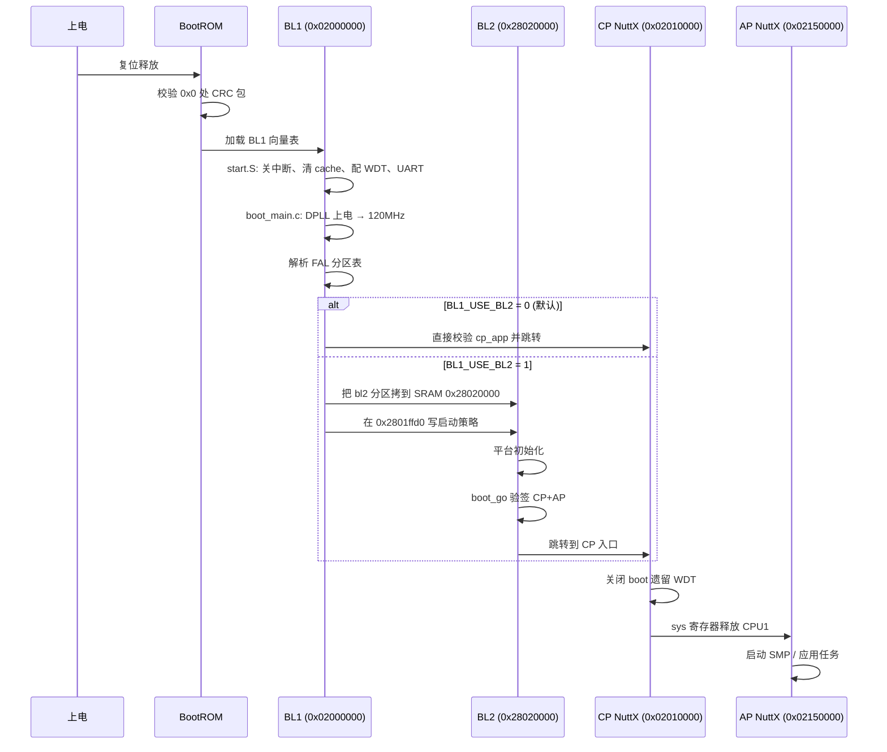

# 10. Bootloader 总览与启动链

> 目标：用一张"地图"讲清 BK7258 上电后到底发生了什么，以及为什么需要 BL1、BL2 两级 Bootloader。

---

## 10.1 理论：为什么上电不能直接跑应用？

芯片刚上电时，就像一个人刚睡醒：身体还没准备好，不能直接跑马拉松。

上电后硬件处于默认状态：
- 时钟可能很慢（甚至没有稳定的时钟）
- Flash 控制器还没配置好，读 Flash 可能不稳定
- 内存没初始化
- 中断没关，可能一进程序就乱跳
- 看门狗可能正在倒计时，不及时喂就会复位

所以需要一段**启动程序**先干这些脏活：初始化时钟、初始化 Flash、关中断、配看门狗、校验主程序、必要时升级主程序，最后才跳到真正的操作系统或应用。

这段启动程序就是 **Bootloader**。

> 💡 **背景知识：Bootloader 是什么？**
> 
> Bootloader 是芯片上电后执行的第一段自己的代码。它不负责"业务功能"，只负责"让业务功能能跑起来"。手机、电脑、汽车 ECU、路由器里都有 Bootloader。

---

## 10.2 理论：BK7258 的完整启动链

BK7258 的启动分 5 个阶段：

```
┌─────────────┐     ┌─────────────┐     ┌─────────────┐
│  ① BootROM  │ ──▶ │  ② BL1      │ ──▶ │  ③ BL2      │
│  (芯片固化)  │     │  自研 Tier-1 │     │  MCUboot    │
└─────────────┘     └─────────────┘     └──────┬──────┘
                                                │
                       ┌─────────────┐         │
                       │  ⑤ AP NuttX │ ◀───────┘
                       │ (CPU1/CPU2) │         │
                       └──────┬──────┘         │
                              │                │
                       ┌──────┴──────┐         │
                       │  ④ CP NuttX │ ◀────────┘
                       │  (CPU0)     │
                       └─────────────┘
```

| 阶段 | 位置 | 运行地址 | 职责 |
|---|---|---|---|
| ① BootROM | 芯片内部固化 ROM | 物理 0x0 | 最开始的引导，校验并加载 BL1 |
| ② BL1 | `board/bk7258/bootloader/` | XIP `0x02000000` | 自研 Tier-1：初始化时钟、Flash、校验/加载 BL2 或直接跳 CP |
| ③ BL2 | `board/bk7258/bootloader/bl2/` | SRAM `0x28020000` | MCUboot 外壳：验签 CP/AP 镜像、选主备槽、跳转 |
| ④ CP NuttX | `nuttx` 编译产物 | XIP `0x02010000` | CPU0 先跑起来，负责系统基础服务 |
| ⑤ AP NuttX | `nuttx` 编译产物 | XIP `0x02150000` | CPU1/CPU2 后被 CP 释放，跑应用与外设驱动 |

> 注意：AP 不在 Bootloader 链路里，是由 CP 启动后再释放的。

---

## 10.3 图解：启动链时序与地址

用更详细的时序图理解：



---

## 10.4 理论：为什么需要 BL1 + BL2 两级？

这是初学者最常问的问题。一句话：**BL1 负责"硬件能跑"，BL2 负责"软件可信"**。

| 层级 | 关注点 | 类比 |
|---|---|---|
| BL1 | 极早期硬件初始化、为 BL2 准备运行环境、可选地加载 BL2 | 医院急诊室：先让人活下来 |
| BL2 | 镜像验签、分区选择、版本管理、安全回滚 | 医院专科：做精确治疗 |

如果只保留 BL1：
- BL1 代码量要同时包含硬件初始化 + 复杂加密验签 + 分区管理，容易臃肿。
- 安全启动的复杂度越高，BL1 出 bug 风险越大；BL1 一旦出问题， recovery 更困难。

如果直接让 BL1 用 MCUboot：
- MCUboot 是通用框架，假设了一些板级抽象；BL1 需要先初始化这些抽象，循环依赖。

所以项目采用：**BL1 做最小必要初始化 + 可选加载 BL2；BL2 专注做 MCUboot 验签与跳转**。

---

## 10.5 关键地址速查表

这些数字是理解启动链的"经纬度"，建议背下来：

| 项 | 地址 | 含义 |
|---|---|---|
| BL1 XIP | `0x02000000` | BL1 代码在 Flash 上的起始地址 |
| BL1 MSP | `0x2809F700` | BL1 启动时栈顶 |
| CP slot A XIP | `0x02010000` | CP NuttX 在 Flash 上的起始地址 |
| AP slot A XIP | `0x02150000` | AP NuttX 在 Flash 上的起始地址 |
| BL2 primary XIP | `0x024d0000` | BL2 主副本在 Flash 上的地址 |
| BL2 secondary XIP | `0x024f0000` | BL2 备用副本在 Flash 上的地址 |
| BL2 SRAM 运行窗 | `0x28020000` ~ `0x2802ffff` | BL2 被拷贝到这里执行 |
| BL2 MSP | `0x28040000` | BL2 自己的栈顶 |
| CP RAM 下界 | `0x28010000` | CP 的 MSPLIM（栈下限） |
| AP 向量 RAM 范围 | `0x28050000` ~ `0x2809f000` | AP 向量表允许使用的 RAM 区域 |
| BL1→BL2 策略记录 | `0x2801ffd0` | BL1 告诉 BL2 首选/回退哪个槽 |

---

## 10.6 实操：在源码里找到启动链入口

打开终端，一步步验证启动链的入口：

```bash
cd $CONTEST

# 1) 找到 BL1 的 Reset_Handler
grep -n "Reset_Handler" board/bk7258/bootloader/start.S

# 2) 找到 BL1 的 C 主函数
grep -n "c_main" board/bk7258/bootloader/boot_main.c

# 3) 找到 BL2 的 main
grep -n "bk7258_bl2_main" board/bk7258/bootloader/bl2/bk7258_bl2_main.c

# 4) 查看 CP 入口
grep -n "__start" board/bk7258/chip/cp/bk7258_start.c

# 5) 查看 AP 入口
grep -n "bk7258_ap_main" board/bk7258/chip/ap/bk7258_ap_main.c
```

观察现象：
- `start.S` 里有向量表和 Reset 初始化汇编。
- `boot_main.c` 里有根据 `BL1_USE_BL2` 做分支的代码。
- `bk7258_bl2_main.c` 里有 `boot_go` 调用和跳转代码。

---

## 10.7 实操：用 readelf 看入口地址

如果已经编译过 BL1：

```bash
cd $CONTEST/board/bk7258/bootloader
make
readelf -h bl.elf | grep Entry
```

预期看到类似：
```
Entry point address: 0x02000101
```

这个地址落在 `0x02000000` 之后，说明 BL1 确实是 XIP 在 Flash 上运行的。

---

## 10.8 常见误区

| 误区 | 真相 |
|---|---|
| "Bootloader 也是操作系统的一部分" | 不是。Bootloader 在 OS 之前跑，跑完就退出或跳走。 |
| "BL2 可以直接从 Flash XIP" | 本项目 BL2 是被 BL1 拷贝到 SRAM 执行的，不直接 XIP。 |
| "AP 也是 Bootloader 启动的" | AP 由 CP 启动，不在 Bootloader 链路。 |
| "上电后直接跑 cp_app" | 默认 BL1_USE_BL2=0 时确实如此；但启用 BL2 后要先验签。 |

---

## 10.9 本节小结

- BK7258 启动链：**BootROM → BL1 → [BL2] → CP → AP**。
- BL1 做早期硬件初始化 + 加载 BL2 或直接跳 CP。
- BL2 基于 MCUboot，负责验签 CP/AP 镜像、选槽、跳转。
- AP 由 CP 在 OS 运行后释放，不在 Bootloader 阶段启动。
- 关键地址：BL1 `0x02000000`、CP `0x02010000`、AP `0x02150000`、BL2 SRAM `0x28020000`。

---

## 底部导航

←上一篇：[03 基础概念铺垫](./03-基础概念铺垫.md) · 下一篇→：[11 BL1 深度解析](./11-BL1深度解析.md) · ↑返回导航：[00 开始这里](./00-开始这里-导航与学习路径.md)

---

## 🔗 相关概念文档

> 概念之间是互相咬合的，下面的文档和本篇讲的是同一个链条上的不同环节：

- [01-芯片与项目背景](./01-芯片与项目背景.md) —— 软件栈总览
- [11-BL1深度解析](./11-BL1深度解析.md) —— 第一级引导细节
- [12-BL2-MCUboot深度解析](./12-BL2-MCUboot深度解析.md) —— 第二级引导细节
- [13-Flash分区布局](./13-Flash分区布局.md) —— 分区与地址
- [14-安全启动与签名](./14-安全启动与签名.md) —— 安全启动

---

## 🔗 对应代码讲解篇

> 想直接看这些概念的**真实源码**？跳到代码讲解篇（逐文件讲解 + 行号注释）：

- [01 BL1 启动核心](./code/01-bl1-启动核心.md) —— start.S / boot_main / boot_clock 逐段讲解
- [02 BL1 安全与策略](./code/02-bl1-安全与策略.md) —— Manifest / policy / handoff
- [03 BL2 MCUboot 外壳](./code/03-bl2-mcuboot外壳.md) —— bl2_start / boot_go / flash_map
- [04 BL2 加密验签](./code/04-bl2-加密验签.md) —— ECDSA-P256 验签实现

---

📂 **本文涉及源码路径**

- `$CONTEST/board/bk7258/bootloader/start.S`
- `$CONTEST/board/bk7258/bootloader/boot_main.c`
- `$CONTEST/board/bk7258/bootloader/bl2/bk7258_bl2_main.c`
- `$CONTEST/board/bk7258/chip/cp/bk7258_start.c`
- `$CONTEST/board/bk7258/chip/ap/bk7258_ap_main.c`
