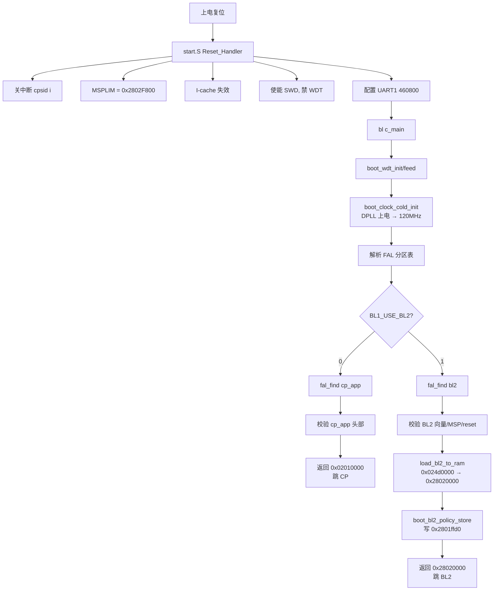

# 11. BL1 深度解析

> 目标：读懂 `board/bk7258/bootloader/` 下的 BL1 源码，理解它上电后到底做了什么。

---

## 11.1 理论：BL1 是谁？

BL1 是仓库**自研的 Tier-1 Bootloader**，代码全在 `board/bk7258/bootloader/` 下。它有两个身份：

1. **默认身份**：直接启动 CP NuttX（`BL1_USE_BL2=0`）。
2. **可选身份**：把 BL2 从 Flash 加载到 SRAM，然后跳过去（`BL1_USE_BL2=1`）。

它是上电后第一段由我们自己完全掌控的代码。

---

## 11.2 源码文件地图

进入 BL1 目录：

```
board/bk7258/bootloader/
├── start.S                      # 汇编入口
├── boot_main.c                  # C 主函数
├── boot_clock.c                 # 冷启动时钟初始化
├── boot_flash.c                 # 原始 Flash 只读访问
├── boot_runtime.c               # cache/MPU/次核/归一化
├── boot_bl1_manifest.c/.h       # BL1 Manifest 解析/校验
├── boot_bl1_manifest_key.c      # 开发根公钥
├── boot_bl1_policy.c/.h         # 槽序/版本策略
├── boot_bl1_boot_flag_core.c/.h # boot flag 核心
├── boot_bl1_handoff_core.c/.h   # 交接核心
├── bk7258_bl1_pack.py           # BL1 打包脚本
├── Makefile                     # 构建
└── bootloader.ld                # 链接脚本
```

---

## 11.3 图解：BL1 启动流程



---

## 11.4 关键代码解析

### start.S：汇编入口

`board/bk7258/bootloader/start.S` 是 BL1 最先执行的代码。它做三件事：

1. **把 CPU 拉到一个已知状态**：关中断、设栈下限、清 cache。
2. **做最小硬件修复**：保持 CPU1/2 复位，防止它们乱跑。
3. **配置调试和日志**：使能 SWD、禁看门狗、配 UART。

关键片段（示意）：

```asm
# 伪代码,真实代码请对照 start.S
Reset_Handler:
    cpsid i                       # 关全局中断
    ldr r0, =0x2802F800
    msr msplim, r0                # 栈下限,防止栈溢出破坏
    dsb sy; isb sy
    # I-cache 失效
    # 使能 SWD
    # 禁 AON/APB WDT
    # 配置 UART1 460800
    bl  c_main                    # 进入 C 世界
```

> 💡 **背景知识：MSPLIM 是什么？**
> 
> MSPLIM 是 ARMv8-M 的 Main Stack Pointer Limit Register。它给栈设置一个"底线"，如果栈用到这个地址以下，CPU 会触发 fault。Bootloader 里设 MSPLIM 是为了防止栈溢出把别的内存踩坏。

---

### boot_main.c：C 主函数

`board/bk7258/bootloader/boot_main.c` 里的 `c_main()` 是 BL1 真正的逻辑大脑。

流程：

```c
void c_main(void) {
    boot_wdt_init();               // 初始化看门狗
    boot_wdt_feed();               // 喂一次
    boot_clock_cold_init();        // DPLL 上电,交付 120MHz
    // 解析 FAL 分区表(4 项)
    // bootloader / cp_app / ap_app / bl2

#if !BK7258_BL1_USE_BL2
    // 直接启动 CP
    app = fal_find("cp_app");
    validate_direct_app(app_vec, app->len);
    return app_vec;                // 0x02010000
#else
    // 启动 BL2
    bl2 = fal_find("bl2");
    validate_bl2(bl2_vec, bl2->len);
    load_bl2_to_ram();             // 拷到 0x28020000
    boot_bl2_policy_store(&policy);// 写 0x2801ffd0
    return BL2_RAM_BASE;           // 0x28020000
#endif
}
```

> 💡 **背景知识：FAL 是什么？**
> 
> FAL（Flash Abstraction Layer）是 Flash 分区抽象层。它把 Flash 划分为多个逻辑分区（如 bootloader、cp_app、ap_app、bl2），每个分区有名字、偏移、大小。Bootloader 通过 `fal_find("cp_app")` 这样的名字来找分区，而不用硬编码地址。

---

## 11.5 链接脚本：代码放哪里

`board/bk7258/bootloader/bootloader.ld` 决定 BL1 编译后放在 Flash 的哪个位置。

关键内容：

```ld
MEMORY
{
  FLASH (rx) : ORIGIN = 0x02000000, LENGTH = 0x10000   /* 64 KiB */
  RAM   (rwx): ORIGIN = 0x28000000, LENGTH = 0x20000   /* 128 KiB */
}
```

- `ORIGIN = 0x02000000`：BL1 烧在 Flash 的 `0x02000000` 处。
- `LENGTH = 0x10000`：BL1 最大 64 KiB。

> 💡 **背景知识：链接脚本是做什么的？**
> 
> 编译器把 .c 变成 .o，链接器把 .o 拼成可执行文件。链接脚本告诉链接器：
> - 代码段（.text）放哪里
> - 数据段（.data）放哪里
> - 未初始化变量（.bss）放哪里
> - 栈从哪里开始
>
> 没有链接脚本，程序就不知道自己的地址，上电后 CPU 也找不到入口。

---

## 11.6 实操：编译并观察 BL1

### 步骤 1：编译 BL1

```bash
cd $CONTEST/board/bk7258/bootloader
make
```

产物：
- `bl.elf`：带调试信息的 ELF
- `bl.bin`：逻辑镜像
- `bl_crc.bin`：带 CRC 的物理烧录镜像

### 步骤 2：看入口地址

```bash
readelf -h bl.elf | grep "Entry point"
```

预期看到 `0x02000xxx`，说明入口在 BL1 XIP 区域。

### 步骤 3：看 map 文件里的符号位置

```bash
arm-none-eabi-nm bl.elf | grep -E "c_main|boot_clock_cold_init|boot_bl2_policy_store"
```

可以看到这些函数被链接到了什么地址。

### 步骤 4：用 hexdump 看物理镜像头

```bash
hexdump -C bl_crc.bin | head -n 8
```

你会看到 CRC 头和代码数据。

---

## 11.7 实操：修改启动模式

BL1 默认 `BL1_USE_BL2=0`，即直接启动 CP。你可以尝试改为启用 BL2：

```bash
# 在 bootloader 目录下
make clean
BK7258_BL1_USE_BL2=1 make   # 如果 Makefile 支持此宏
```

> 注意：实际项目可能在 Makefile 或头文件里控制。修改前请阅读 `boot_main.c` 顶部的宏定义和 `Makefile`。

---

## 11.8 冷复位契约：为什么 BL1 要做这么多清理

`boot_runtime.c` 和 `start.S` 里有一堆清理 cache/MPU/次核/中断/UART 的代码。这不是多余的，而是因为：

- **SYSRESETREQ 软复位**不会把所有硬件状态清干净。
- **Downloader 模式**可能遗留 cache 或中断状态。
- **CPU1/2** 如果没收住，会在 BL1 运行时提前启动，导致不可预期行为。
- **UART ownership** 如果不重置，Bootloader 打印可能和 BootROM/下载工具的输出混在一起。

所以 BL1 第一条原则：**假设硬件处于未知状态，先把环境恢复到一个干净、确定的基线**。

> 💡 **背景知识：冷复位 vs 热复位**
> 
> - 冷复位：芯片彻底断电再上电，所有寄存器回到默认值。
> - 热复位/软复位：通过软件或复位引脚复位 CPU，但部分外设可能保持原状态。
>
> BL1 要同时兼容这两种情况，所以必须主动清理。

---

## 11.9 本节小结

- BL1 是自研 Tier-1 Bootloader，负责从 BootROM 接手后做早期初始化。
- `start.S` 做汇编级初始化；`boot_main.c` 做 C 级逻辑：时钟 → FAL → 选直接启动 CP 或加载 BL2。
- `bootloader.ld` 把 BL1 放在 `0x02000000`，最大 64 KiB。
- BL1 的核心设计哲学：**冷复位契约**——先把硬件恢复到已知状态，再决定下一步。

---

## 底部导航

←上一篇：[10 Bootloader 总览与启动链](./10-Bootloader总览与启动链.md) · 下一篇→：[12 BL2-MCUboot 深度解析](./12-BL2-MCUboot深度解析.md) · ↑返回导航：[00 开始这里](./00-开始这里-导航与学习路径.md)

---

## 🔗 对应代码讲解篇

> 想直接看这些概念的**真实源码**？跳到代码讲解篇（逐文件讲解 + 行号注释）：

- [01 BL1 启动核心](./code/01-bl1-启动核心.md) —— start.S / boot_main / boot_clock / boot_flash
- [02 BL1 安全与策略](./code/02-bl1-安全与策略.md) —— Manifest / policy / boot_flag / handoff / SHA256

---

📂 **本文涉及源码路径**

- `$CONTEST/board/bk7258/bootloader/start.S`
- `$CONTEST/board/bk7258/bootloader/boot_main.c`
- `$CONTEST/board/bk7258/bootloader/boot_clock.c`
- `$CONTEST/board/bk7258/bootloader/boot_flash.c`
- `$CONTEST/board/bk7258/bootloader/boot_runtime.c`
- `$CONTEST/board/bk7258/bootloader/bootloader.ld`
- `$CONTEST/board/bk7258/bootloader/Makefile`
- `$CONTEST/board/bk7258/bootloader/bk7258_bl1_pack.py`
