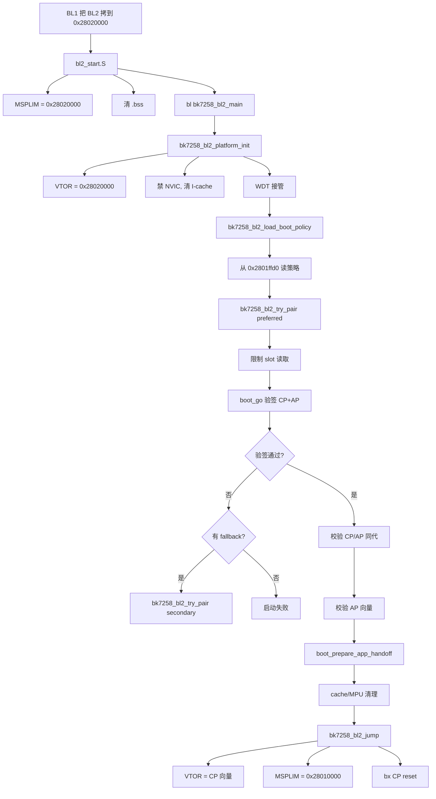
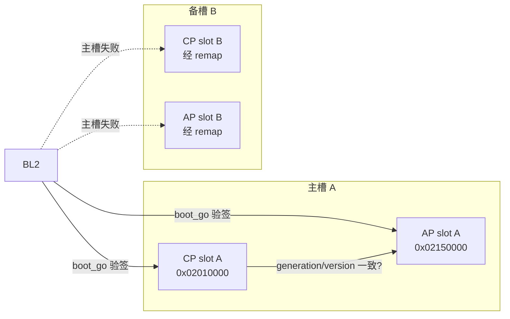

# 12. BL2（MCUboot）深度解析

> 目标：理解 BL2 如何验签 CP/AP 镜像、选主备槽、最后安全跳转到 CP。

---

## 12.1 理论：BL2 是谁？

BL2 是仓库为 BK7258 写的 **MCUboot 裸机外壳**。

- **MCUboot** 是开源的 secure bootloader 框架，被 NuttX 等 RTOS 广泛采用。
- 仓库里的 `board/bk7258/bootloader/bl2/` 不是重写 MCUboot，而是把上游 MCUboot 的 `bootutil` 库**包上一层板级适配代码**，让它能在 BK7258 上跑起来。
- BL2 **运行在 SRAM**（`0x28020000`），由 BL1 拷贝进来；它不直接 XIP。

---

## 12.2 源码文件地图

```
board/bk7258/bootloader/bl2/
├── bk7258_bl2_main.c              # BL2 主流程
├── bk7258_bl2_flash_map.c         # Flash 分区后端
├── bk7258_bl2_keys.c              # 验签公钥
├── bk7258_bl2_security_cnt.c      # 安全计数器
├── bk7258_bl2_mcuboot_{asn1,boot,ecc,ecc_dsa,ecdsa,keys}.c
├── bl2_start.S                    # 汇编入口
├── bl2.ld                         # 链接脚本
├── Makefile
└── include/
    ├── mcuboot_config/
    │   └── mcuboot_config.h       # MCUboot 板级配置
    ├── sysflash/sysflash.h
    └── flash_map_backend/
        └── flash_map_backend.h
```

---

## 12.3 图解：BL2 主流程



---

## 12.4 关键配置：mcuboot_config.h

`board/bk7258/bootloader/bl2/include/mcuboot_config/mcuboot_config.h` 是 BL2 的大脑配置。

关键宏：

```c
#define MCUBOOT_SIGN_EC256              // 用 ECDSA-P256 签名
#define MCUBOOT_USE_TINYCRYPT           // 用 TinyCrypt 库做验签
#define MCUBOOT_DIRECT_XIP              // 直接 XIP,不 swap
#define MCUBOOT_VALIDATE_PRIMARY_SLOT   // 启动前校验主槽
#define MCUBOOT_USE_FLASH_AREA_GET_SECTORS
#define MCUBOOT_MAX_IMG_SECTORS 1
#define MCUBOOT_IMAGE_NUMBER 2          // CP + AP 两个镜像
#define MCUBOOT_HW_ROLLBACK_PROT        // 硬件回滚保护
```

逐项解释：

| 宏 | 含义 |
|---|---|
| `MCUBOOT_SIGN_EC256` | 镜像用 ECDSA-P256 非对称签名算法签名。 |
| `MCUBOOT_USE_TINYCRYPT` | 验签实现用 ARM 的 TinyCrypt 轻量密码库。 |
| `MCUBOOT_DIRECT_XIP` | 验签通过后直接执行 Flash 上的镜像，不搬运到 RAM。 |
| `MCUBOOT_IMAGE_NUMBER 2` | 把 CP 和 AP 视为一个"启动对"一起校验。 |
| `MCUBOOT_HW_ROLLBACK_PROT` | 利用硬件安全计数器防止版本回滚攻击。 |

> 💡 **背景知识：什么是 DIRECT_XIP？**
> 
> 有些 MCUboot 配置会把镜像从 Flash 拷贝到 RAM 再执行（RAM loading）。DIRECT_XIP 表示镜像直接在 Flash 上执行（XIP）。BK7258 的 CP/AP 都是 XIP 执行的，所以用 DIRECT_XIP。

---

## 12.5 关键代码解析

### bl2_start.S：汇编入口

BL2 被 BL1 拷贝到 SRAM `0x28020000` 后，CPU 从这个地址开始执行。

`bl2_start.S` 做：
1. 把 MSPLIM 放宽到 `0x28020000`（BL1 原本设得更严格）。
2. 清 `.bss` 段。
3. 跳 `bk7258_bl2_main`。

### bk7258_bl2_platform_init：平台初始化

```c
static void bk7258_bl2_platform_init(void)
{
  boot_wdt_init();
  REG32(SCB_VTOR) = BK7258_BL2_RAM_BASE;  // 0x28020000
  REG32(SYSTICK_CTRL) = 0;
  REG32(NVIC_ICER0) = 0xffffffffu;        // 关闭所有 NVIC 中断
  REG32(NVIC_ICPR0) = 0xffffffffu;        // 清除所有 pending 中断
  REG32(SCB_ICIALLU) = 0;                 // I-cache 失效
  __asm volatile ("dsb sy; isb" ::: "memory");
}
```

为什么又做一遍清理？因为 BL1 到 BL2 切换时，中断状态、cache、VTOR 都必须以 BL2 的视角重新设置，否则 BL2 可能跑飞。

---

### boot_go：验签核心

`boot_go()` 来自上游 MCUboot 的 `bootutil`。它会：
1. 读取主槽镜像的头部。
2. 用 `bk7258_bl2_keys.c` 里的公钥验签。
3. 检查镜像版本、安全计数器、依赖关系。

`bk7258_bl2_try_pair()` 调用 `FIH_CALL(boot_go, ...)` 来同时验签 CP 和 AP。

### 跳转前的校验

在 `bk7258_bl2_jump()` 里，BL2 会严格检查：

```c
// 伪代码,真实逻辑见 bk7258_bl2_main.c
if (msp < 0x28010000 || msp > 0x28050000)  panic();
if ((reset & 1) == 0)                        panic();  // 必须 Thumb 模式
if (reset_addr < SLOT_A_CP_XIP_START ||
    reset_addr > SLOT_A_AP_XIP_START)        panic();
```

> 💡 **背景知识：为什么 reset 地址最低位必须是 1？**
> 
> ARM Cortex-M 用 Thumb 指令集，入口地址的最低位必须是 1。如果看到 `0x02010001`，实际跳转地址是 `0x02010000`，但 CPU 知道这是 Thumb 模式。如果最低位是 0，CPU 会以为要跑 ARM 模式，Cortex-M 不支持，直接 fault。

---

## 12.6 图解：CP/AP 双镜像启动对



MCUboot 把 CP 和 AP 视为一个启动对（`IMAGE_NUMBER 2`）。只有两个都验签通过、且属于同一代（generation/version + 安全计数一致），BL2 才会跳转。

---

## 12.7 实操：查看 BL2 配置与公钥

### 步骤 1：打开配置文件

```bash
cd $CONTEST
vim board/bk7258/bootloader/bl2/include/mcuboot_config/mcuboot_config.h
```

逐行看每个宏，对照上面的表格理解含义。

### 步骤 2：查看验签公钥

```bash
cat board/bk7258/bootloader/bl2/bk7258_bl2_keys.c
```

你会看到类似：

```c
const unsigned char ecdsa_pub_key[] = {
  0x30, 0x59, 0x30, 0x13, ...
};
```

这就是 MCUboot 用来验证 CP/AP 镜像签名的公钥。

### 步骤 3：编译 BL2

```bash
cd board/bk7258/bootloader/bl2
make
```

产物：
- `bl2.elf`
- `bl2.bin`
- `bl2_crc.bin`（物理烧录格式）

### 步骤 4：看 BL2 链接脚本

```bash
cat bl2.ld
```

重点看 `RAM` 的 `ORIGIN`，应该是 `0x28020000`。

---

## 12.8 实操：模拟启动失败

想验证 BL2 真的会验签，可以：

1. 正常构建并签名 CP/AP 镜像。
2. 用十六进制编辑器修改 `app_crc.bin` 里的一个字节。
3. 重新打包烧录。
4. 看启动日志：BL2 会报告验签失败，然后尝试 fallback；如果没有 fallback，则启动失败。

> ⚠️ 注意：这会破坏签名，只建议在测试环境做。

---

## 12.9 本节小结

- BL2 是 MCUboot 的板级适配外壳，运行在 SRAM `0x28020000`。
- `mcuboot_config.h` 配置了 ECDSA-P256 签名、TinyCrypt 验签、DIRECT_XIP、双镜像启动对。
- 流程：平台初始化 → 读 BL1 策略 → boot_go 验签 CP/AP → 校验同代/向量 → 跳转 CP。
- BL2 跳转前会做严格的地址和模式校验，防止跳转到非法代码。

---

## 底部导航

←上一篇：[11 BL1 深度解析](./11-BL1深度解析.md) · 下一篇→：[13 Flash 分区布局](./13-Flash分区布局.md) · ↑返回导航：[00 开始这里](./00-开始这里-导航与学习路径.md)

---

📂 **本文涉及源码路径**

- `$CONTEST/board/bk7258/bootloader/bl2/bk7258_bl2_main.c`
- `$CONTEST/board/bk7258/bootloader/bl2/bk7258_bl2_flash_map.c`
- `$CONTEST/board/bk7258/bootloader/bl2/bk7258_bl2_keys.c`
- `$CONTEST/board/bk7258/bootloader/bl2/bk7258_bl2_security_cnt.c`
- `$CONTEST/board/bk7258/bootloader/bl2/bl2_start.S`
- `$CONTEST/board/bk7258/bootloader/bl2/bl2.ld`
- `$CONTEST/board/bk7258/bootloader/bl2/include/mcuboot_config/mcuboot_config.h`
