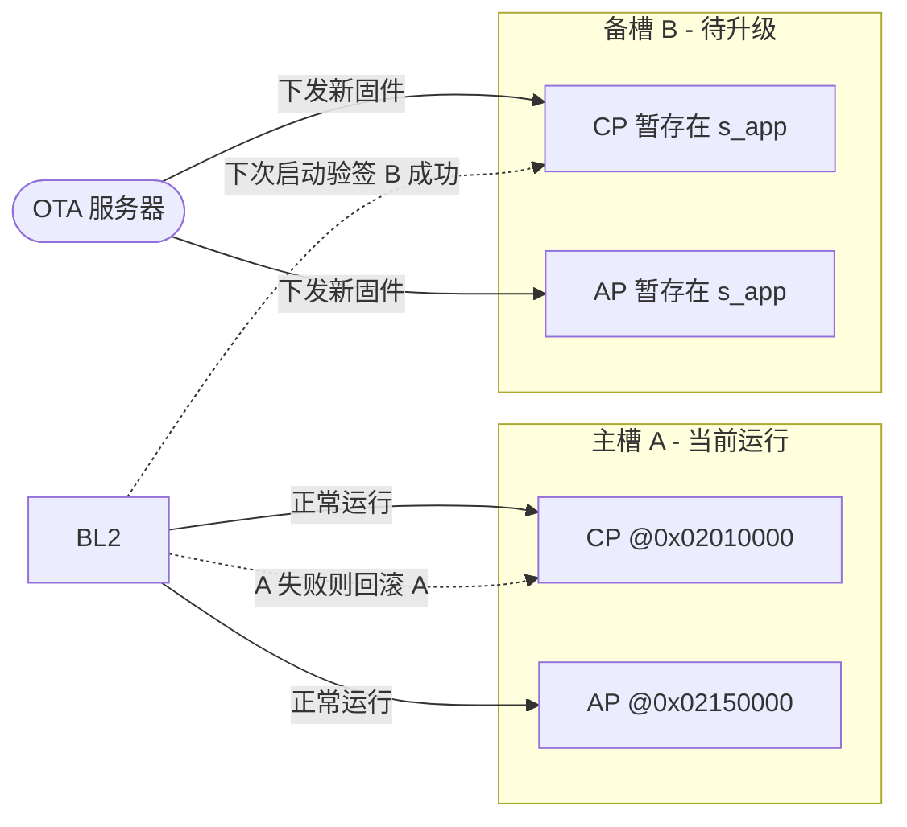

# 13. Flash 分区布局

> 目标：看懂 BK7258 的 8 MiB Flash 是怎么切块的，以及每个分区的用途。

---

## 13.1 理论：为什么 Flash 要分区？

Flash 就像一块硬盘。如果不分区，所有代码和数据挤在一起，会有几个问题：

1. **升级时容易互相覆盖**：Bootloader 升级时可能不小心踩到文件系统。
2. **不好做 A/B 备份**：没有独立区域，就无法保留旧版本做回滚。
3. **配置数据丢失风险**：用户配置、校准数据需要固定位置，不能被升级破坏。
4. **Bootloader/OS/数据混在一起**：查找和维护困难。

所以嵌入式系统通常把 Flash 分成多个**分区**，每个分区有名字、起始地址、大小、用途。

> 💡 **背景知识：Flash 和 RAM 的区别**
> 
> - Flash：掉电不丢，用来存程序、配置、文件系统；写之前要擦除，擦除以 sector 为单位。
> - RAM：掉电丢失，用来跑程序时的变量、栈、堆；读写任意字节。
> - BK7258 的 Flash 逻辑基址是 `0x02000000`，RAM 从 `0x28000000` 附近开始。

---

## 13.2 图解：Flash 分区全景

```
地址从低到高(物理偏移):
0x000000 ┌─────────────────────────────┐
         │  primary_bootloader         │  68 KiB  → BL1
0x011000 ├─────────────────────────────┤
         │  primary_cp_app             │ 1360 KiB → CP NuttX(slot A)
0x165000 ├─────────────────────────────┤
         │  primary_ap_app             │ 1156 KiB → AP NuttX(slot A)
0x286000 ├─────────────────────────────┤
         │  s_app (slot B 暂存)        │ 2516 KiB → 备用 CP/AP 对
0x4fc000 ├─────────────────────────────┤
         │  usr_config                 │  56 KiB  → 厂商配置
0x50b000 ├─────────────────────────────┤
         │  primary_manifest           │   4 KiB  → BL1 manifest A
0x50c000 ├─────────────────────────────┤
         │  secondary_manifest         │   4 KiB  → BL1 manifest B
0x51d000 ├─────────────────────────────┤
         │  bl2                        │ 136 KiB  → MCUboot BL2
0x53f000 ├─────────────────────────────┤
         │  (gap, BL2 secondary 推导)  │
0x600000 ├─────────────────────────────┤
         │  littlefs                   │   1 MiB  → 文件系统
0x7fa000 ├─────────────────────────────┤
         │  easyflash                  │   8 KiB  → 校准/数据
0x7fc000 ├─────────────────────────────┤
         │  easyflash_ap               │   8 KiB  → AP 校准/数据
0x7fe000 ├─────────────────────────────┤
         │  sys_rf                     │   4 KiB  → 射频校准
0x7ff000 ├─────────────────────────────┤
         │  sys_net                    │   4 KiB  → 网络校准
0x800000 └─────────────────────────────┘
```

整个 Flash 约 **8 MiB**（地址空间到 `0x800000`）。

---

## 13.3 分区表（详细版）

来源：`board/bk7258/partitions/bk7258/auto_partitions.csv`（活跃布局）和生成的头文件 `board/bk7258/include/bk7258_partition_layout.h`。

| 分区名 | 物理偏移 | 大小 | 逻辑偏移 | XIP 地址 | 用途 |
|---|---|---|---|---|---|
| primary_bootloader | `0x000000` | `0x11000` (68K) | `0x000000` | `0x02000000` | BL1 自身 |
| primary_cp_app | `0x011000` | `0x154000` (1360K) | `0x010000` | `0x02010000` | CP NuttX slot A |
| primary_ap_app | `0x165000` | `0x121000` (1156K) | `0x015000` | `0x02150000` | AP NuttX slot A |
| s_app | `0x286000` | `0x275000` (2516K) | — | — | slot B 对暂存区 |
| usr_config | `0x4fc000` | `0x0e000` (56K) | — | — | 厂商配置 |
| primary_manifest | `0x50b000` | `0x01000` (4K) | — | — | BL1 primary manifest |
| secondary_manifest | `0x50c000` | `0x01000` (4K) | — | — | BL1 secondary manifest |
| bl2 | `0x51d000` | `0x22000` (136K) | `0x4d0000` | `0x024d0000` | MCUboot BL2 |
| littlefs | `0x600000` | `0x100000` (1M) | — | — | 文件系统 |
| easyflash | `0x7fa000` | `0x02000` | — | — | easyflash_cp |
| easyflash_ap | `0x7fc000` | `0x02000` | — | — | easyflash_ap |
| sys_rf | `0x7fe000` | `0x01000` | — | — | 射频校准 |
| sys_net | `0x7ff000` | `0x01000` | — | — | 网络校准 |

> 注意：bl2 在活跃布局里只有一个 136K 分区；secondary BL2 由 bl2 后面的 gap 推导出来（raw `0x53f000`，XIP `0x024f0000`）。

---

## 13.4 图解：A/B 双区升级思想



A/B 分区的核心：**永远保留一份能跑的旧版本**。升级失败时自动回滚，保证系统不死。

> 💡 **背景知识：什么是 OTA？**
> 
> OTA（Over-The-Air）就是无线升级。汽车、手机、路由器都靠 OTA 修复 bug、增加功能。OTA 的前提是 Flash 有 A/B 分区，升级过程不能破坏当前运行的系统。

---

## 13.5 实操：查看分区表文件

### 步骤 1：打开 CSV 分区表

```bash
cd $CONTEST
cat board/bk7258/partitions/bk7258/auto_partitions.csv
```

观察列：分区名、偏移、大小、类型等。

### 步骤 2：查看生成的头文件

```bash
grep -n "BK7258_PARTITION" board/bk7258/include/bk7258_partition_layout.h | head -n 30
```

你会看到类似：

```c
#define BK7258_PARTITION_BL2_OFFSET 0x0051d000
#define BK7258_ROLE_BL2_XIP_START  0x024d0000
```

这些宏被 Bootloader 和 NuttX 代码引用。

### 步骤 3：在 Bootloader 里找 FAL 表

```bash
grep -n -A 10 "fal_partition" board/bk7258/bootloader/boot_main.c
```

BL1 用的 FAL 表是简化版，只包含 4 项：bootloader、cp_app、ap_app、bl2。

---

## 13.6 实操：用 Python 解析分区表

如果你想自己算某个分区的结束地址：

```python
# 在 $CONTEST 下运行
partitions = {
    "bl2":        (0x51d000, 0x22000),
    "primary_cp_app": (0x011000, 0x154000),
    "primary_ap_app": (0x165000, 0x121000),
}

for name, (offset, size) in partitions.items():
    print(f"{name}: 0x{offset:06x} - 0x{offset+size:06x} ({size//1024} KiB)")
```

输出示例：
```
bl2: 0x051d000 - 0x053f000 (136 KiB)
primary_cp_app: 0x011000 - 0x165000 (1360 KiB)
primary_ap_app: 0x165000 - 0x286000 (1156 KiB)
```

---

## 13.7 易错点

| 易错点 | 说明 |
|---|---|
| 把 bl2 当作用户分区 | bl2 是 Bootloader 的一部分，升级时要特别小心。 |
| 忽略校准尾区 | `0x7fa000..0x800000` 是 easyflash/sys_rf/sys_net，烧录时不能覆盖，否则 Wi-Fi/蓝牙校准丢失。 |
| 混淆物理偏移和逻辑偏移 | 物理偏移是 Flash 芯片上的真实地址；逻辑偏移是去除 CRC/header 后的软件视图。 |
| s_app 是 slot B 对 | 不是单独一个 APP，而是 CP+AP 两个镜像合在一起的暂存区。 |

---

## 13.8 本节小结

- BK7258 Flash 约 8 MiB，按功能切成多个分区。
- 关键分区：BL1(`0x000000`)、CP slot A(`0x011000`)、AP slot A(`0x165000`)、s_app(`0x286000`)、BL2(`0x51d000`)、littlefs(`0x600000`)、校准尾区(`0x7fa000+`)。
- 分区表来源：`auto_partitions.csv` + 生成的 `bk7258_partition_layout.h`。
- A/B 双区设计让 OTA 升级失败时可以安全回滚。

---

## 底部导航

←上一篇：[12 BL2-MCUboot 深度解析](./12-BL2-MCUboot深度解析.md) · 下一篇→：[14 安全启动与签名](./14-安全启动与签名.md) · ↑返回导航：[00 开始这里](./00-开始这里-导航与学习路径.md)

---

📂 **本文涉及源码路径**

- `$CONTEST/board/bk7258/partitions/bk7258/auto_partitions.csv`
- `$CONTEST/board/bk7258/include/bk7258_partition_layout.h`
- `$CONTEST/board/bk7258/bootloader/boot_main.c`
- `$CONTEST/board/bk7258/bootloader/bl2/bk7258_bl2_flash_map.c`
