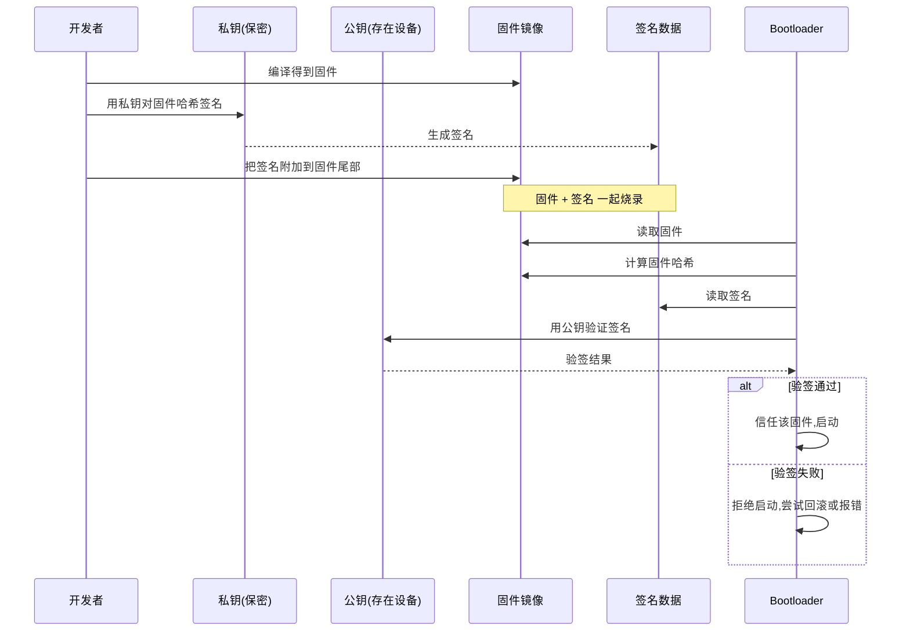
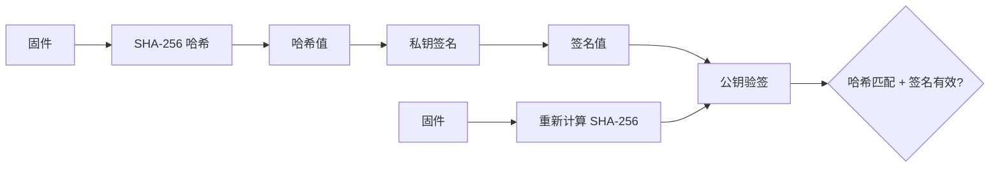

# 14. 安全启动与签名

> 目标：理解 BK7258 的镜像签名、验签机制，以及当前安全启动的真实状态。

---

## 14.1 理论：为什么需要安全启动？

假设你的汽车 ECU 或 IoT 设备被坏人拿到固件，他们：
- 把固件改一下，植入后门
- 把版本降级到有漏洞的旧版
- 烧一个假冒固件进去

如果 Bootloader 不检查固件是否合法，设备就会跑恶意代码。

安全启动要解决三个问题：
1. **完整性**：固件有没有被篡改？
2. **真实性**：固件是不是官方发布的？
3. **防回滚**：能不能阻止降级到漏洞版本？

---

## 14.2 图解：签名与验签的基本流程



> 💡 **背景知识：对称加密 vs 非对称加密**
> 
> - 对称加密：加密解密用同一个密钥。快，但密钥分发困难。
> - 非对称加密：有一对密钥——公钥和私钥。公钥可以公开，私钥必须保密。用私钥签名，用公钥验签。
>
> 安全启动通常用非对称加密（如 ECDSA-P256），因为设备里只需要放公钥，私钥放在开发者的安全环境里。

---

## 14.3 图解：哈希 vs 签名



- **哈希**（如 SHA-256）：把任意长度文件变成固定长度的"指纹"。文件改一个字节，哈希就变。
- **签名**：用私钥对哈希加密。Bootloader 用公钥解密签名，得到原始哈希，再和重新计算的哈希对比。

---

## 14.4 BK7258 的安全启动设计

BK7258 有两套安全机制：

### 1. MCUboot 侧：验签 CP/AP 镜像

- 算法：**ECDSA-P256**
- 实现库：**TinyCrypt**
- 公钥文件：`board/bk7258/bootloader/bl2/bk7258_bl2_keys.c`

公钥片段（示意）：

```c
const unsigned char ecdsa_pub_key[] = {
  0x30, 0x59, 0x30, 0x13, /* ... */
  0x04, 0x01, 0xc4, 0x99, /* ... */
};
const struct bootutil_key bootutil_keys[] = {
  { .key = ecdsa_pub_key, .len = &ecdsa_pub_key_len }
};
```

打包时，`build_package.sh` 会用私钥对 CP/AP 镜像签名；启动时，BL2 用公钥验签。

### 2. BL1 侧：板级 Manifest

- BL1 有自己的 Manifest 校验机制。
- 开发根公钥：`board/bk7258/bootloader/boot_bl1_manifest_key.c`（仅公钥）。
- 打包脚本 `bk7258_bl1_pack.py` 里硬编码了软件开发根哈希：

```python
SOFTWARE_ROOT_XY_SHA256 = bytes.fromhex(
    "e31631bcfcef65c7bb2d122abf5326bf...")
```

> ⚠️ **注意**：这是**软件开发根**，不是芯片 BootROM/OTP 里的厂商根密钥。它是为开发和测试设计的可恢复授权层。

---

## 14.5 当前真实状态：OTP 安全启动未启用

虽然代码里有安全启动框架，但实际项目中：

- `BL1_MANIFEST_ENFORCE` 默认是 **0**，即不强制 Manifest 校验。
- 板子为 CM（空 hash）时，会回退到软件开发根。
- **OTP/eFuse 安全启动没有真正启用**。

这意味着：
- 当前阶段的安全性是"可恢复的开发授权"，不是最终量产级的不可变安全启动。
- 如果要真正量产，还需要把根密钥烧入 OTP/eFuse，并启用强制校验。

> 💡 **背景知识：OTP 和 eFuse 是什么？**
> 
> OTP（One-Time Programmable）和 eFuse 是芯片里只能写一次的存储。它们常用来烧录根密钥、启动配置。一旦写入，就改不了。这是量产安全启动的"信任根"。

---

## 14.6 防回滚机制

`mcuboot_config.h` 开了 `MCUBOOT_HW_ROLLBACK_PROT`。

防回滚思路：
- 每个固件版本对应一个安全计数器（monotonic counter）。
- Bootloader 只接受计数器值 >= 当前值的固件。
- 攻击者不能把版本号改小（回滚到旧版漏洞）。

实现文件：`board/bk7258/bootloader/bl2/bk7258_bl2_security_cnt.c`。

---

## 14.7 实操：查看签名与验签相关文件

### 步骤 1：查看公钥

```bash
cd $CONTEST
cat board/bk7258/bootloader/bl2/bk7258_bl2_keys.c
```

数一下字节数，这就是设备里保存的公钥。

### 步骤 2：查看 Manifest 根哈希

```bash
grep -n "SOFTWARE_ROOT" board/bk7258/bootloader/bk7258_bl1_pack.py
```

你会看到两个 SHA-256 哈希字符串。

### 步骤 3：查看 build_package.sh 的签名参数

```bash
grep -n "mcuboot-key\|bl1-key\|imgtool" tools/bk7258/build_package.sh
```

看看签名私钥是怎么传给打包脚本的。

### 步骤 4：用 imgtool 验签一个镜像（如果本地有）

```bash
# 假设 firmware.bkpack 已解压出 app.bin 和 app_sig.bin
# 具体命令参考 MCUboot imgtool 文档
imgtool verify -k ~/.bk7258/keys/mcuboot-signing-dev.pem app.bin
```

> 注意：需要 Python imgtool 环境和私钥文件。

---

## 14.8 实操：手动"破坏"签名看效果

1. 正常构建并签名 CP 镜像，得到 `app_crc.bin`。
2. 用十六进制编辑器改镜像里的任意一个字节（例如把某个字符串改一个字母）。
3. 重新打包并烧录。
4. 在串口日志里观察：BL2 会报告 `boot_go` 失败，然后尝试 fallback；fallback 如果是旧版合法镜像，则回滚成功。

> ⚠️ 警告：只在测试板、测试环境做，且保留可恢复的旧版本。

---

## 14.9 本节小结

- BK7258 安全启动分两层：BL2(MCUboot) 验签 CP/AP 镜像（ECDSA-P256 + TinyCrypt），BL1 校验板级 Manifest。
- 验签公钥存在 `bk7258_bl2_keys.c`；BL1 软件开发根在 `bk7258_bl1_pack.py`。
- 当前 OTP/eFuse 安全启动**未启用**，属于可恢复开发授权。
- 防回滚由 `bk7258_bl2_security_cnt.c` 实现。
- 修改已签名镜像会导致 BL2 拒绝启动，触发 fallback/回滚。

---

## 底部导航

←上一篇：[13 Flash 分区布局](./13-Flash分区布局.md) · 下一篇→：[20 芯片适配层架构](./20-芯片适配层架构.md) · ↑返回导航：[00 开始这里](./00-开始这里-导航与学习路径.md)

---

## 🔗 相关概念文档

> 概念之间是互相咬合的，下面的文档和本篇讲的是同一个链条上的不同环节：

- [10-Bootloader总览与启动链](./10-Bootloader总览与启动链.md) —— 信任链位置
- [11-BL1深度解析](./11-BL1深度解析.md) —— BL1 板级 Manifest
- [12-BL2-MCUboot深度解析](./12-BL2-MCUboot深度解析.md) —— MCUboot 验签
- [13-Flash分区布局](./13-Flash分区布局.md) —— 分区只读保护

---

## 🔗 对应代码讲解篇

> 想直接看这些概念的**真实源码**？跳到代码讲解篇（逐文件讲解 + 行号注释）：

- [02 BL1 安全与策略](./code/02-bl1-安全与策略.md) —— SHA256 / Manifest / 防降级策略
- [04 BL2 加密验签](./code/04-bl2-加密验签.md) —— ECDSA-P256 验签与公钥字节

---

📂 **本文涉及源码路径**

- `$CONTEST/board/bk7258/bootloader/bl2/bk7258_bl2_keys.c`
- `$CONTEST/board/bk7258/bootloader/bl2/bk7258_bl2_security_cnt.c`
- `$CONTEST/board/bk7258/bootloader/bl2/include/mcuboot_config/mcuboot_config.h`
- `$CONTEST/board/bk7258/bootloader/boot_bl1_manifest_key.c`
- `$CONTEST/board/bk7258/bootloader/bk7258_bl1_pack.py`
- `$CONTEST/tools/bk7258/build_package.sh`
