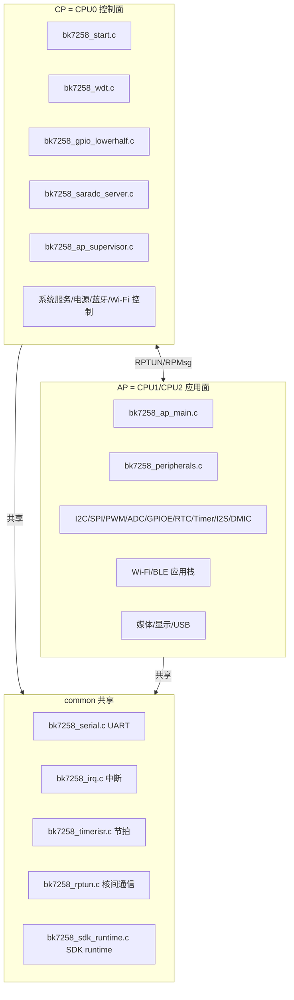

# 20. 芯片适配层架构

> 目标：搞懂 `board/bk7258/chip/` 目录是怎么组织的，CP/AP/common 各自负责什么。

---

## 20.1 理论：芯片适配层是干什么的？

NuttX 是一个通用的 RTOS，它不可能一开始就认识 BK7258 这颗芯片。需要有人告诉 NuttX：

- BK7258 有几颗 CPU？
- 中断怎么映射？
- 有哪些外设？
- 内存怎么划分？
- 怎么启动其他核？

这些"告诉 NuttX 的话"就是**芯片适配层**（chip adaptation layer）。

在 BK7258 项目里，芯片适配层主要位于：

```
board/bk7258/chip/
```

---

## 20.2 图解：芯片适配层目录树

```
board/bk7258/chip/
├── chip.h                 # NuttX 芯片头桥接
├── Kconfig                # 芯片级 Kconfig(所有 BK7258_* 配置)
├── Make.defs / CMakeLists.txt
├── ap/                    # AP 核独有(CPU1/CPU2)
│   ├── bk7258_ap_main.c       # AP 主函数
│   ├── bk7258_ap_start.c      # AP 复位入口
│   ├── bk7258_ap_vectors.c    # AP 向量表
│   ├── bk7258_peripherals.c   # AP 外设总注册入口 ★
│   ├── bk7258_i2c.c           # I2C 驱动
│   ├── bk7258_spi.c           # SPI 驱动
│   ├── bk7258_pwm.c           # PWM 驱动
│   ├── bk7258_saradc.c        # SARADC 驱动
│   ├── bk7258_sdmadc.c        # SDMADC 驱动
│   ├── bk7258_gpioe.c         # GPIOE(ioexpander)
│   ├── bk7258_rtc.c           # RTC 驱动
│   ├── bk7258_timer.c         # Timer 驱动
│   ├── bk7258_i2s.c           # I2S 驱动
│   ├── bk7258_dmic.c          # DMIC 辅助
│   ├── bk7258_wifi.c          # Wi-Fi
│   ├── bk7258_bt_hci.c        # 蓝牙 HCI
│   └── ...
├── cp/                    # CP 核独有(CPU0)
│   ├── bk7258_start.c         # CP 复位入口
│   ├── bk7258_vectors.c       # CP 向量表
│   ├── bk7258_clock.c         # 时钟初始化
│   ├── bk7258_wdt.c           # 看门狗驱动
│   ├── bk7258_gpio_lowerhalf.c# CP 板级 GPIO
│   ├── bk7258_saradc_server.c # CP SARADC mailbox 服务端
│   ├── bk7258_ap_supervisor.c # AP 监管
│   ├── bk7258_pm_coord_cp.c   # CP 电源管理协调
│   └── ...
├── common/                # CP/AP 共享代码
│   ├── bk7258_serial.c        # UART 驱动
│   ├── bk7258_irq.c           # 中断分发
│   ├── bk7258_timerisr.c      # 系统节拍
│   ├── bk7258_allocateheap.c  # 堆初始化
│   ├── bk7258_psram.c         # PSRAM
│   ├── bk7258_sdk_irq.c       # SDK IRQ 桥
│   ├── bk7258_sdk_runtime.c   # SDK IPC runtime
│   ├── bk7258_os_adapt.c      # OS 适配层
│   ├── bk7258_rptun.c         # RPTUN lower-half
│   ├── bk7258_rptun_mbox.c    # Mailbox 实现
│   └── ...
└── include/               # 芯片公共头
    ├── irq.h                  # IRQ 定义(NR_IRQS=80)
    ├── bk7258_memorymap.h     # 内存映射
    ├── bk7258_amp.h           # AMP 相关
    ├── bk7258_rptun.h         # RPTUN 头
    ├── bk7258_i2c.h / pwm.h / gpioe.h / rtc.h / timer.h / saradc.h / sdmadc.h / i2s.h / dmic.h
    └── mcuboot_config/        # MCUboot 配置
```

---

## 20.3 图解：CP / AP / common 的划分



---

## 20.4 理论：CP 与 AP 的角色

| 角色 | CPU | NuttX 形态 | 主要职责 |
|---|---|---|---|
| CP | CPU0 | UP 单核 | 系统启动、看门狗、电源管理协调、AP 监管、跨核 mailbox 服务端、蓝牙/Wi-Fi 控制器服务端 |
| AP | CPU1/CPU2 | SMP 双核 | 应用协议栈、大部分外设驱动、媒体/显示、无线应用 |

> 💡 **背景知识：UP vs SMP**
> 
> - UP（Uniprocessor）：NuttX 只管理一个 CPU。
> - SMP（Symmetric Multi-Processing）：NuttX 管理多个对等的 CPU，任务可以在多个核之间调度。
>
> BK7258 的 CP 是 UP，AP 是 SMP，整体是 **AMP（Asymmetric Multi-Processing，非对称多核）**。

---

## 20.5 理论：common 为什么存在？

有些代码 CP 和 AP 都需要，但又不适合重复写在两边：

- **UART 驱动**：CP 和 AP 都需要串口。
- **中断分发**：每个 CPU 都有自己的 NVIC，但中断号定义共享。
- **系统节拍 timer**：CP 和 AP 都需要 tick。
- **RPTUN**：跨核通信本身就需要两边都参与。
- **SDK runtime / OS adapt**：SDK 的 OS 抽象层两边都要用。

这些文件放在 `common/` 下，编译时同时被 CP 和 AP 的构建系统包含。

编译期通过 `CONFIG_BK7258_AP_CORE` 宏区分：

```c
#ifdef CONFIG_BK7258_AP_CORE
  // AP 核编译这里
#else
  // CP 核编译这里
#endif
```

---

## 20.6 实操：用 tree 看目录结构

```bash
cd $CONTEST
find board/bk7258/chip -maxdepth 2 -type f | sort
```

观察：
- `ap/` 下驱动文件最多。
- `cp/` 下多是系统服务和 CP 侧驱动。
- `common/` 下是共享基础设施。

### 统计各目录 .c 数量

```bash
find board/bk7258/chip/ap -name "*.c" | wc -l
find board/bk7258/chip/cp -name "*.c" | wc -l
find board/bk7258/chip/common -name "*.c" | wc -l
```

---

## 20.7 实操：找 Kconfig 里区分 CP/AP 的配置

```bash
grep -n "BK7258_AP_CORE\|depends on.*AP_CORE\|!BK7258_AP_CORE" board/bk7258/chip/Kconfig | head -n 30
```

你会看到很多驱动配置：
- `BK7258_I2C` 依赖 `BK7258_AP_CORE`（只在 AP 编译）。
- `BK7258_WDT` 依赖 `!BK7258_AP_CORE`（只在 CP 编译）。

---

## 20.8 关键入口函数速查

| 入口 | 文件 | 作用 |
|---|---|---|
| CP 复位入口 | `cp/bk7258_start.c` | CPU0 上电后第一个执行的 NuttX 代码 |
| CP 板级初始化 | `../src/bk7258_platform.c` | 注册 CP 驱动和服务 |
| AP 复位入口 | `ap/bk7258_ap_start.c` | CPU1 释放后的入口 |
| AP 主函数 | `ap/bk7258_ap_main.c` | 调用 peripherals_initialize |
| AP 外设总注册 | `ap/bk7258_peripherals.c` | 集中注册 AP 侧所有驱动 |
| 系统 tick | `common/bk7258_timerisr.c` | 给 NuttX 提供时间基准 |
| 中断分发 | `common/bk7258_irq.c` | 把 SDK 中断源映射到 NuttX IRQ |

---

## 20.9 本节小结

- 芯片适配层在 `board/bk7258/chip/`，分 `ap/`、`cp/`、`common/`、`include/`。
- CP（CPU0）跑 UP 内核，负责系统服务；AP（CPU1/2）跑 SMP，负责应用和外设驱动。
- `common/` 是共享代码，通过 `CONFIG_BK7258_AP_CORE` 宏区分角色。
- 关键入口：`bk7258_start.c`（CP）、`bk7258_ap_main.c`（AP）、`bk7258_peripherals.c`（AP 驱动注册）。

---

## 底部导航

←上一篇：[14 安全启动与签名](./14-安全启动与签名.md) · 下一篇→：[21 armino-SDK 集成](./21-armino-SDK集成.md) · ↑返回导航：[00 开始这里](./00-开始这里-导航与学习路径.md)

---

📂 **本文涉及源码路径**

- `$CONTEST/board/bk7258/chip/`
- `$CONTEST/board/bk7258/chip/cp/bk7258_start.c`
- `$CONTEST/board/bk7258/chip/ap/bk7258_ap_main.c`
- `$CONTEST/board/bk7258/chip/ap/bk7258_peripherals.c`
- `$CONTEST/board/bk7258/src/bk7258_platform.c`
- `$CONTEST/board/bk7258/chip/Kconfig`
