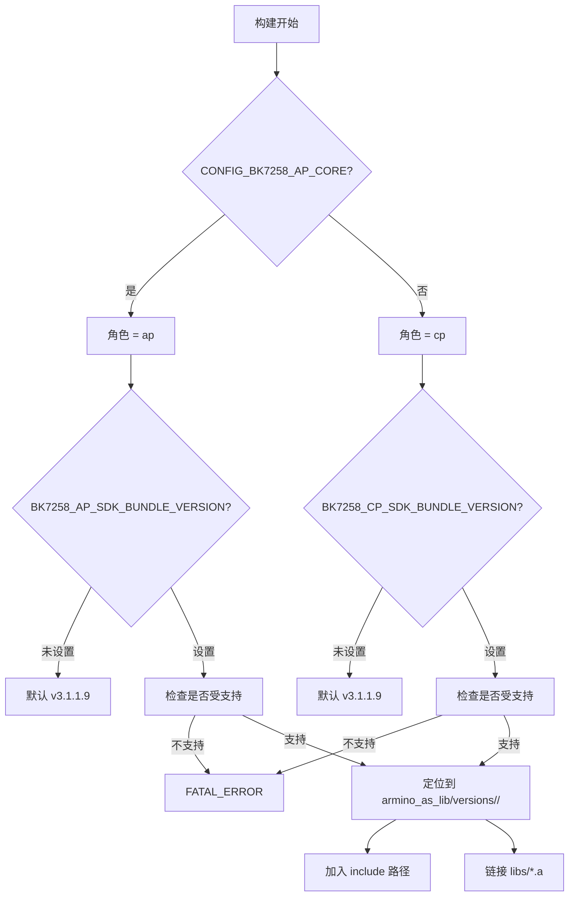

# 21. armino SDK 集成

> 目标：理解 Beken 官方 armino SDK 是怎么被"当成静态库"链接进本项目的。

---

## 21.1 理论：为什么不直接改 SDK 源码？

BK7258 的底层硬件细节（寄存器、时钟、中断、外设初始化）都在 Beken 官方 SDK 里。如果每个驱动都从零写，工作量巨大且容易出错。

但项目又要求：
- 官方 SDK 源码**不能改**（保持干净，方便升级）。
- 官方 NuttX 源码**不能改**。

解决方案：**把 armino SDK 当作预编译静态库链接进来**，NuttX 这边只写"包装层"（wrapper）调用 SDK 的 API。

这就是 `board/bk7258/bk_idk/` 目录存在的意义。

> 💡 **背景知识：什么是静态库？**
> 
> 静态库（.a 文件）是一堆 .o 文件的打包。链接时，链接器把静态库里用到的函数和目标文件拼在一起，生成最终可执行文件。对调用者来说，只需要头文件（.h）和库文件（.a），不需要源码。

---

## 21.2 图解：SDK 作为 lib 的目录布局

```
board/bk7258/bk_idk/
├── README.md                          # 集成说明(权威)
├── armino_as_lib/
│   └── versions/
│       ├── legacy/                    # 旧版,禁止构建
│       ├── v3.1.1.9/                  # 当前默认版本
│       │   ├── cp/
│       │   │   ├── include/           # CP 头文件
│       │   │   ├── config/            # CP sdkconfig
│       │   │   └── libs/              # CP 静态库(.a)
│       │   │       ├── libdriver.a
│       │   │       ├── libbk7258.a
│       │   │       ├── libbk_pm.a
│       │   │       └── ...
│       │   └── ap/
│       │       ├── include/           # AP 头文件
│       │       ├── config/            # AP sdkconfig
│       │       └── libs/              # AP 静态库(.a)
│       │           ├── libdriver.a
│       │           └── ...
│       └── v3.1.1.9-sdio4/            # AP 四线 SDIO 变体
│           └── ap/
├── sdk-profiles/
│   └── v3.1.1.9/
│       ├── ap-peripherals-r2.config
│       ├── ap-peripherals-r3.config
│       ├── ap-peripherals-r4.config
│       └── ap-sdio4.config
├── manifests/
│   └── v3.1.1.9/
│       ├── cp.sha256
│       ├── cp.provenance
│       ├── ap.sha256
│       └── ap.provenance
└── sdk-bundles.cmake / sdk-bundles.mk # 构建集成脚本
```

---

## 21.3 图解：版本选择流程



---

## 21.4 三个版本的区别

| 版本 | 支持角色 | 状态 |
|---|---|---|
| `legacy` | cp + ap | 迁移前保留，**禁止用于当前构建/验证** |
| `v3.1.1.9` | cp + ap | **当前默认唯一 active 版本** |
| `v3.1.1.9-sdio4` | 仅 AP | 四线 SDIO 变体，T5-Board 四线 TF profile 绑定 |

> ⚠️ 注意：`v3.1.1.9-sdio4` 只能给 AP 用；CP 仍然用 `v3.1.1.9`。

---

## 21.5 关键代码：sdk-bundles.cmake

`board/bk7258/bk_idk/sdk-bundles.cmake` 是 SDK 版本选择的核心。

关键逻辑：

```cmake
set(BK7258_SDK_SUPPORTED_BUNDLE_VERSIONS legacy v3.1.1.9 v3.1.1.9-sdio4)

# 默认 v3.1.1.9
# 可通过环境变量覆盖: BK7258_SDK_BUNDLE_VERSION / BK7258_AP_SDK_BUNDLE_VERSION / BK7258_CP_SDK_BUNDLE_VERSION

if(CONFIG_BK7258_AP_CORE)
  set(BK7258_SDK_ROLE ap)
else()
  set(BK7258_SDK_ROLE cp)
endif()

set(BK7258_SDK_ROLE_DIR ".../versions/${VER}/${ROLE}")
set(BK7258_SDK_LIBS_DIR "${ROLE_DIR}/libs")
set(BK7258_SDK_INCLUDE_DIR "${ROLE_DIR}/include")
```

如果版本不在 `SUPPORTED` 列表里，构建会 `FATAL_ERROR` 退出，不会静默链接到错误目录。

---

## 21.6 为什么 AP 和 CP 的库不一样？

SDK 官方把功能按核划分了：

- **AP bundle**：包含丰富的外设驱动实现，如 `bk_i2c_*`、`bk_pwm_*`、`bk_spi_*` 等，这些符号在 `libdriver.a` 里。
- **CP bundle**：主要是系统服务、Wi-Fi/蓝牙控制器、看门狗等；很多 AP 外设的 `bk_*` 函数只有头文件，没有实现。

因此：
- `chip/ap/bk7258_i2c.c` 里调用 `bk_i2c_*`，链接时找 AP 的 `libdriver.a`。
- `chip/cp/` 下没有 I2C/PWM 驱动，因为 CP bundle 里没有这些实现。

在 `chip/Kconfig` 里可以看到：

```kconfig
config BK7258_I2C
    bool "I2C driver"
    depends on BK7258_AP_CORE
    ...
```

这就是 `depends on BK7258_AP_CORE` 的原因。

---

## 21.7 实操：查看本地 SDK bundle

### 步骤 1：列出当前安装的版本

```bash
cd $CONTEST
ls -la board/bk7258/bk_idk/armino_as_lib/versions/
```

预期看到：`legacy`、`v3.1.1.9`、`v3.1.1.9-sdio4`。

### 步骤 2：查看 AP 静态库

```bash
ls -la board/bk7258/bk_idk/armino_as_lib/versions/v3.1.1.9/ap/libs/
```

你会看到 `libdriver.a`、`libbk7258.a` 等。

### 步骤 3：查看库里的符号

```bash
arm-none-eabi-nm board/bk7258/bk_idk/armino_as_lib/versions/v3.1.1.9/ap/libs/libdriver.a | grep bk_i2c
```

如果看到 `bk_i2c_init`、`bk_i2c_master_read` 等符号，说明 I2C HAL 确实在这个库里。

### 步骤 4：查看头文件路径

```bash
ls board/bk7258/bk_idk/armino_as_lib/versions/v3.1.1.9/ap/include/driver/ | head -n 20
```

你会看到 `i2c.h`、`spi.h`、`pwm.h`、`gpio.h` 等。

---

## 21.8 实操：校验 SDK bundle

```bash
cd $CONTEST

# 校验 CP 版本
./tools/bk7258/setup_bk7258_sdk.sh --check --version v3.1.1.9 --role cp

# 校验 AP 版本
./tools/bk7258/setup_bk7258_sdk.sh --check --version v3.1.1.9 --role ap

# 校验 AP 四线 SDIO 变体
./tools/bk7258/setup_bk7258_sdk.sh --check --version v3.1.1.9-sdio4 --role ap
```

校验是 fail-closed：manifest 必须逐字节匹配本地 bundle，否则报错。

---

## 21.9 实操：从头文件找到 SDK API

打开 I2C 头文件：

```bash
cat board/bk7258/bk_idk/armino_as_lib/versions/v3.1.1.9/ap/include/driver/i2c.h | head -n 80
```

观察里面的函数声明：

```c
bk_err_t bk_i2c_driver_init(void);
bk_err_t bk_i2c_init(i2c_id_t id, const i2c_config_t *cfg);
bk_err_t bk_i2c_master_read(i2c_id_t id, ...);
bk_err_t bk_i2c_master_write(i2c_id_t id, ...);
```

这些就是 NuttX 驱动 `bk7258_i2c.c` 里调用的函数。

---

## 21.10 SDK IPC runtime：为什么 AP 驱动要先初始化它？

在 `chip/ap/bk7258_peripherals.c` 里，AP 外设注册之前会先调用：

```c
bk7258_sdk_runtime_initialize();
```

原因：
- AP 上的很多 SDK 函数需要经过系统调用或 mailbox 与 CP 通信。
- `sdk_runtime` 初始化这些通道，建立系统寄存器和 mailbox 服务。
- 如果没有初始化，调用 `bk_i2c_*` 等函数可能卡住或返回错误。

对应 Kconfig：`CONFIG_BK7258_SDK_IPC_RUNTIME`，很多 AP 驱动都会 `select` 它。

---

## 21.11 本节小结

- armino SDK 以预编译静态库（`armino_as_lib/versions/<ver>/<role>/libs/*.a`）+ 头文件形式集成。
- 当前默认版本是 `v3.1.1.9`；AP 四线 SDIO 用 `v3.1.1.9-sdio4`；`legacy` 已废弃。
- `sdk-bundles.cmake` 根据 `CONFIG_BK7258_AP_CORE` 和版本变量选择对应的 bundle。
- AP bundle 含丰富外设驱动实现；CP bundle 偏系统服务。
- AP 驱动注册前要先初始化 `bk7258_sdk_runtime_initialize()`。

---

## 底部导航

←上一篇：[20 芯片适配层架构](./20-芯片适配层架构.md) · 下一篇→：[22 驱动适配范式](./22-驱动适配范式.md) · ↑返回导航：[00 开始这里](./00-开始这里-导航与学习路径.md)

---

## 🔗 对应代码讲解篇

> 想直接看这些概念的**真实源码**？跳到代码讲解篇（逐文件讲解 + 行号注释）：

- [10 AP 多媒体与无线](./code/10-ap-多媒体与无线.md) —— Wi-Fi / DVP / JPEG / LCD
- [12 构建与打包工具](./code/12-构建与打包工具.md) —— bkpack / framework / validation

---

📂 **本文涉及源码路径**

- `$CONTEST/board/bk7258/bk_idk/README.md`
- `$CONTEST/board/bk7258/bk_idk/armino_as_lib/versions/`
- `$CONTEST/board/bk7258/bk_idk/sdk-bundles.cmake`
- `$CONTEST/board/bk7258/bk_idk/sdk-profiles/`
- `$CONTEST/board/bk7258/bk_idk/manifests/`
- `$CONTEST/tools/bk7258/setup_bk7258_sdk.sh`
- `$CONTEST/board/bk7258/chip/ap/bk7258_peripherals.c`
