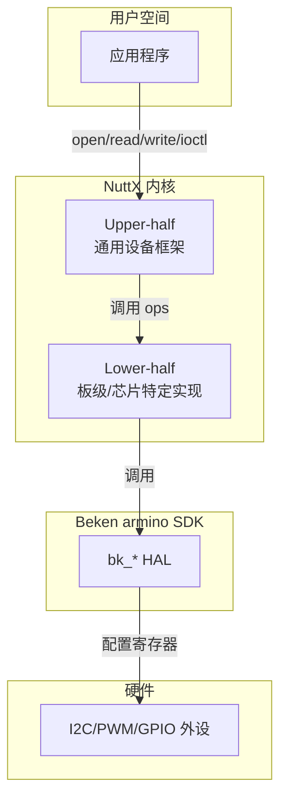

# 22. 驱动适配范式

> 目标：理解 BK7258 的外设驱动是怎么用"NuttX lower-half 封装 armino HAL"的思路写出来的。

---

## 22.1 理论：什么是驱动适配范式？

"范式"就是**做这件事的标准套路**。BK7258 的驱动适配范式可以总结成一句话：

> **零寄存器访问：NuttX lower-half 封装 armino SDK 的 `bk_*` HAL。**

翻译成人话：
- 我们不直接读写芯片寄存器（如 `*(volatile uint32_t *)0x4xxxxx`）。
- 我们调用 Beken SDK 已经写好的函数（如 `bk_i2c_init`、`bk_pwm_start`）。
- 我们把这些 SDK 函数包装成 NuttX 标准的设备接口（如 `/dev/i2cN`、`/dev/pwmN`）。

---

## 22.2 图解：NuttX 驱动分层



> 💡 **背景知识：什么是 upper-half / lower-half？**
> 
> NuttX 把驱动分成上下两半：
> - **Upper-half**：内核里的通用设备框架，所有板子共用。比如 `drivers/i2c/i2c_driver.c` 里的 `i2c_register()`。
> - **Lower-half**：板级/芯片相关的代码，由我们写。比如 `chip/ap/bk7258_i2c.c`。
>
> 好处：同一个 upper-half 框架可以接不同芯片的 lower-half，移植时只改 lower-half。

---

## 22.3 图解：一个驱动的标准生命周期


几乎所有 AP 驱动都遵循这个模式。

---

## 22.4 核心代码模式

### 模式 1：定义 ops 结构体

每个 NuttX 驱动都有一种"操作表"结构体。例如 I2C：

```c
// 来自 chip/ap/bk7258_i2c.c 核心思想
static const struct i2c_ops_s g_bk7258_i2c_ops =
{
  .transfer  = bk7258_i2c_transfer,
  .setup     = bk7258_i2c_setup,
  .shutdown  = bk7258_i2c_shutdown,
};
```

`i2c_ops_s` 是 NuttX 规定的 I2C lower-half 接口。我们只需要实现这三个函数。

### 模式 2：定义私有数据结构

```c
static struct bk7258_i2c_priv_s g_bk7258_i2c =
{
  .dev.ops  = &g_bk7258_i2c_ops,
  .id       = (i2c_id_t)BK7258_I2C_UNIT,
};
```

这个结构体把 NuttX 的 `i2c_master_s` 和设备私有数据（如 I2C 编号、初始化标志）绑在一起。

### 模式 3：注册设备

```c
ret = i2c_register(&g_bk7258_i2c.dev, CONFIG_BK7258_I2C_BUS);
```

注册后，用户空间就能看到 `/dev/i2cN` 设备文件。

---

## 22.5 关键接口对应表

| 外设 | NuttX lower-half 接口 | 注册函数 | 设备节点 |
|---|---|---|---|
| I2C | `struct i2c_ops_s` | `i2c_register()` | `/dev/i2cN` |
| SPI | `struct spi_ops_s` | `spi_register()` | `/dev/spiN` |
| PWM | `struct pwm_ops_s` | `pwm_register()` | `/dev/pwmN` |
| ADC | `struct adc_ops_s` | `adc_register()` | `/dev/adcN` |
| GPIOE | `struct ioexpander_ops_s` | 板级再发布 | `/dev/gpioN` |
| RTC | `struct rtc_ops_s` | `up_rtc_initialize()` | `/dev/rtc0` |
| Timer | `struct timer_ops_s` | `timer_register()` | `/dev/timerN` |
| I2S | `struct i2s_ops_s` | `i2schar_register()` | `/dev/i2sN` |
| WDT | `struct watchdog_ops_s` | `watchdog_register()` | `/dev/watchdog0` |

---

## 22.6 零寄存器访问的好处

为什么不直接写寄存器？

1. **移植快**：SDK 已经搞定了寄存器细节，我们不用重新读 1000 页 datasheet。
2. **易维护**：SDK 升级时，我们的 wrapper 不用大改。
3. **少踩坑**：SDK 函数经过官方验证，直接写寄存器容易触发隐藏 bug。
4. **跨版本一致**：同一个 wrapper 可以适配 SDK 不同版本（只要 API 兼容）。

代价：
- 灵活性略低，某些高级特性如果 SDK 没暴露就做不了。
- 需要确认 SDK 函数的语义（是否幂等、是否阻塞、是否消费队列等）。

---

## 22.7 实操：找一个驱动的 ops 结构体

以 I2C 为例：

```bash
cd /home/lijian/project/open-vela/contest2026_135_yongwangzhiqian
grep -n "i2c_ops_s" board/bk7258/chip/ap/bk7258_i2c.c
```

然后看 `transfer`、`setup`、`shutdown` 三个函数分别调用了哪些 `bk_i2c_*`。

同样找 PWM：

```bash
grep -n "pwm_ops_s" board/bk7258/chip/ap/bk7258_pwm.c
```

---

## 22.8 实操：查看 NuttX 标准接口定义

NuttX 的接口定义在 `nuttx/include/nuttx/` 下：

```bash
cd /home/lijian/project/open-vela/nuttx
find include/nuttx -name "i2c.h" -o -name "pwm.h" -o -name "spi.h" | head -n 10
```

打开看 `struct i2c_ops_s`：

```bash
grep -n -A 10 "struct i2c_ops_s" include/nuttx/i2c/i2c.h
```

你会看到 NuttX 要求 lower-half 实现哪些方法。

---

## 22.9 本节小结

- BK7258 驱动适配范式：**NuttX lower-half 封装 armino `bk_*` HAL，零寄存器访问**。
- 标准三步：定义 ops 结构体 → 定义私有数据结构 → 调用 NuttX 注册函数。
- 不同外设对应 NuttX 不同的 ops 接口（`i2c_ops_s`、`pwm_ops_s`、`adc_ops_s` 等）。
- 这种范式的优点是移植快、易维护；代价是依赖 SDK API 的语义和覆盖度。

---

## 底部导航

←上一篇：[21 armino-SDK 集成](./21-armino-SDK集成.md) · 下一篇→：[23 外设驱动详解（一）I2C-PWM-GPIOE](./23-外设驱动详解-一(I2C-PWM-GPIOE).md) · ↑返回导航：[00 开始这里](./00-开始这里-导航与学习路径.md)

---

📂 **本文涉及源码路径**

- `/home/lijian/project/open-vela/contest2026_135_yongwangzhiqian/board/bk7258/chip/ap/bk7258_i2c.c`
- `/home/lijian/project/open-vela/contest2026_135_yongwangzhiqian/board/bk7258/chip/ap/bk7258_pwm.c`
- `/home/lijian/project/open-vela/contest2026_135_yongwangzhiqian/board/bk7258/chip/cp/bk7258_wdt.c`
- `/home/lijian/project/open-vela/nuttx/include/nuttx/i2c/i2c.h`
- `/home/lijian/project/open-vela/nuttx/include/nuttx/pwm.h`
- `/home/lijian/project/open-vela/nuttx/include/nuttx/ioexpander.h`
