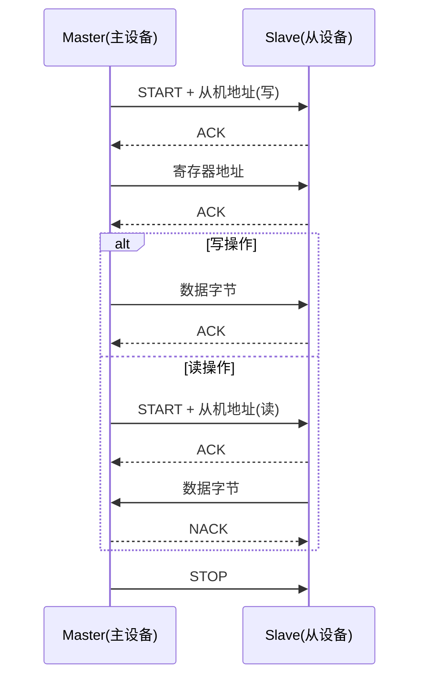

# 23. 外设驱动详解（一）：I2C / PWM / GPIOE

> 目标：通过三个典型 AP 驱动，学会"读驱动源码 → 理解初始化 → 看懂 HAL 调用 → 会简单修改"的完整方法。

---

## 23.1 驱动清单与位置

| 驱动 | 文件 | 设备节点 | 核心 HAL |
|---|---|---|---|
| I2C master | `chip/ap/bk7258_i2c.c` | `/dev/i2cN` | `bk_i2c_*` |
| PWM | `chip/ap/bk7258_pwm.c` | `/dev/pwmN` | `bk_pwm_*` |
| GPIOE (ioexpander) | `chip/ap/bk7258_gpioe.c` | 板级发布为 `/dev/gpioN` | `bk_gpio_*` |

---

## 23.2 I2C 驱动详解

### 23.2.1 理论：I2C 是什么？

I2C（Inter-Integrated Circuit）是一种两线串行总线：
- **SCL**：时钟线
- **SDA**：数据线

一个主设备可以挂多个从设备，每个从设备有一个 7 位地址。主设备通过地址选中从设备，然后读写数据。

> 💡 **背景知识：为什么 I2C 只要两根线？**
> 
> 因为 I2C 是"总线"结构：所有设备共享 SCL 和 SDA，通过地址区分。相比 SPI（需要片选线 + 时钟 + 两根数据线），I2C 省引脚但速度慢。

---

### 23.2.2 图解：I2C 传输流程



---

### 23.2.3 源码解析

文件：`board/bk7258/chip/ap/bk7258_i2c.c`

核心结构：

```c
static const struct i2c_ops_s g_bk7258_i2c_ops =
{
  .transfer  = bk7258_i2c_transfer,
  .setup     = bk7258_i2c_setup,
  .shutdown  = bk7258_i2c_shutdown,
};

static struct bk7258_i2c_priv_s g_bk7258_i2c =
{
  .dev.ops  = &g_bk7258_i2c_ops,
  .id       = (i2c_id_t)BK7258_I2C_UNIT,
};

int bk7258_i2c_initialize(void)
{
  return i2c_register(&g_bk7258_i2c.dev, CONFIG_BK7258_I2C_BUS);
}
```

`bk7258_i2c_initialize()` 只注册设备，**不初始化硬件**。硬件在 `setup()` 里初始化：

```c
static int bk7258_i2c_setup(struct i2c_master_s *dev)
{
  // 全局一次性初始化 driver
  bk_i2c_driver_init();
  // 初始化具体 I2C 单元
  bk_i2c_init(priv->id, &cfg);
  priv->initialized = true;
}
```

`transfer()` 是核心：

```c
static int bk7258_i2c_transfer(struct i2c_master_s *dev,
                                struct i2c_msg_s *msgs, int count)
{
  for (i = 0; i < count; i++) {
    if (msgs[i].flags & I2C_M_TEN) return -ENOTSUP;  // 不支持 10 位地址
    if (组合读写) {
      bk_i2c_memory_read/write(...);  // repeated-start
    } else {
      bk_i2c_master_read/write(...);  // 单段读写
    }
  }
}
```

> ⚠️ 注意：这个驱动不支持 10 位地址，也不支持单独的 NOSTOP/NOSTART 单段标志。遇到这些情况返回 `-ENOTSUP`（不支持），避免错误改变总线协议。

---

### 23.2.4 实操：在 NSH 里用 I2C

如果 I2C 驱动已注册：

```bash
# 进入 NSH
ls /dev/i2c*      # 查看 I2C 设备节点

# 用 i2c 工具扫描从设备(需 CONFIG_I2C_TOOLS 支持)
i2c dev /dev/i2c0
i2c probe
```

---

## 23.3 PWM 驱动详解

### 23.3.1 理论：PWM 是什么？

PWM（Pulse Width Modulation，脉冲宽度调制）就是快速开关一个引脚，通过调节"高电平时间占比"来控制平均电压。

- **频率**：每秒开关多少次（Hz）。
- **占空比**：高电平时间 / 周期，常用百分比或 0~1 表示。

用途：电机调速、LED 亮度调节、舵机控制、蜂鸣器等。

> 💡 **背景知识：为什么 PWM 能调 LED 亮度？**
> 
> 因为人眼有视觉暂留。LED 快速闪烁时，占空比越小，平均亮度越低；占空比越大，平均亮度越高。

---

### 23.3.2 图解：PWM 波形

```
高电平        ┌───┐     ┌───┐     ┌───┐
             │   │     │   │     │   │
低电平 ──────┘   └─────┘   └─────┘   └─────

周期 T = 1 / 频率
占空比 = 高电平时间 / T
```

---

### 23.3.3 源码解析

文件：`board/bk7258/chip/ap/bk7258_pwm.c`

ops 表：

```c
static const struct pwm_ops_s g_bk7258_pwm_ops =
{
  .setup    = bk7258_pwm_setup,
  .shutdown = bk7258_pwm_shutdown,
  .start    = bk7258_pwm_start,
  .stop     = bk7258_pwm_stop,
  .ioctl    = bk7258_pwm_ioctl,
};
```

注册：

```c
int bk7258_pwm_initialize(void)
{
  return pwm_register(BK7258_PWM_DEVPATH, &g_bk7258_pwm.dev);
}
```

`start()` 把 NuttX 的 `pwm_info_s`（频率 + 16.16 定点占空比）转成 SDK 参数：

```c
period     = BK7258_PWM_CLK_HZ / frequency;      // 周期节拍
on_ticks   = period * duty;                      // 高电平节拍
bk_pwm_init(chan, &cfg);                         // 首次初始化通道
bk_pwm_start(chan);                              // 开始输出
```

> ⚠️ SDK 内部对占空比取反，所以 wrapper 里传的是 `on_ticks`（高电平时间），不是直接传占空比。

---

### 23.3.4 实操：用 PWM 调 LED 亮度

```bash
# 进入 NSH
ls /dev/pwm*      # 查看 PWM 设备

# 用 pwm 工具设置频率和占空比(需 CONFIG_PWM 支持)
pwm -p /dev/pwm0 -f 1000 -d 50   # 1kHz, 50% 占空比
pwm -p /dev/pwm0 -f 1000 -d 10   # 1kHz, 10% 占空比(LED 变暗)
```

---

## 23.4 GPIOE 驱动详解

### 23.4.1 理论：GPIOE 是什么？

GPIOE 不是普通 GPIO，而是 **ioexpander（IO 扩展器）** 接口。

普通 GPIO 是芯片上一个一个物理引脚；ioexpander 是"软件层面的多引脚 GPIO 抽象"，让上层可以统一操作一组引脚的方向、电平、中断。

在 BK7258 里，`bk7258_gpioe.c` 把 SDK 的 `bk_gpio_*` 函数包装成 NuttX 的 `ioexpander_dev_s` 接口。

> 💡 **背景知识：ioexpander 和 gpio 有什么区别？**
> 
> - `gpio`：通常指单个物理引脚，/dev/gpioN。
> - `ioexpander`：可以管理多个引脚，支持批量操作和中断聚合。适合作为板级 LED/按键/外设复用的统一抽象。

---

### 23.4.2 图解：GPIOE 与板级 GPIO 的关系

```mermaid
flowchart LR
    A[bk7258_gpioe.c] -->|实现 ioexpander_ops_s| B[ioexpander_dev_s]
    B -->|板级 gpio_lower_half| C[/dev/gpioN]
    App[应用] -->|open/ioctl| C
```

`bk7258_gpioe.c` 只返回 `ioexpander_dev_s` 对象，不直接注册字符设备。板级代码（`bk7258_board_bringup.c`）再用 `gpio_lower_half()` 把它发布成 `/dev/gpioN`。

---

### 23.4.3 源码解析

文件：`board/bk7258/chip/ap/bk7258_gpioe.c`

ops 映射：

| ioexpander 方法 | SDK 函数 |
|---|---|
| `ioe_direction` | `bk_gpio_set_config` |
| `ioe_writepin` | `bk_gpio_set_output_value` |
| `ioe_readpin` | `bk_gpio_get_input` |
| `ioe_attach` | `bk_gpio_register_isr` + `bk_gpio_enable_interrupt` |

中断处理：每个引脚配一个 SDK ISR 槽，SDK 触发后再转发到 ioexpander 回调。

配置：

```kconfig
config BK7258_GPIOE_NPINS
    int "Number of GPIOE pins"
    default 16
    range 1 48
```

注意：`CONFIG_BK7258_GPIOE_NPINS` 不能超过 NuttX 的 `CONFIG_IOEXPANDER_NPINS`，否则位运算会越界。

---

### 23.4.4 实操：查看 GPIO 设备

```bash
# 进入 NSH
ls /dev/gpio*     # 查看 GPIO 设备节点

# 读取按键状态(假设 /dev/gpio0 是按键)
cat /dev/gpio0

# 控制 LED(假设 /dev/gpio1 是 LED)
echo 1 > /dev/gpio1   # 点亮
echo 0 > /dev/gpio1   # 熄灭
```

---

## 23.5 本节小结

- **I2C**：NuttX `i2c_ops_s` 封装 `bk_i2c_*`；注册只创建设备，setup 才初始化硬件；transfer 处理组合读写，不支持 10 位地址。
- **PWM**：NuttX `pwm_ops_s` 封装 `bk_pwm_*`；把频率/占空比换算为周期/高电平节拍；12 通道共享全局 driver。
- **GPIOE**：NuttX `ioexpander_ops_s` 封装 `bk_gpio_*`；先返回 ioexpander 对象，再由板级发布为 `/dev/gpioN`。

---

## 底部导航

←上一篇：[22 驱动适配范式](./22-驱动适配范式.md) · 下一篇→：[24 外设驱动详解（二）RTC-Timer-ADC](./24-外设驱动详解-二(RTC-Timer-ADC).md) · ↑返回导航：[00 开始这里](./00-开始这里-导航与学习路径.md)

---

📂 **本文涉及源码路径**

- `$CONTEST/board/bk7258/chip/ap/bk7258_i2c.c`
- `$CONTEST/board/bk7258/chip/ap/bk7258_pwm.c`
- `$CONTEST/board/bk7258/chip/ap/bk7258_gpioe.c`
- `$CONTEST/board/bk7258/boards/t5ai_core/src/bk7258_board_bringup.c`
- `$CONTEST/board/bk7258/chip/Kconfig`
