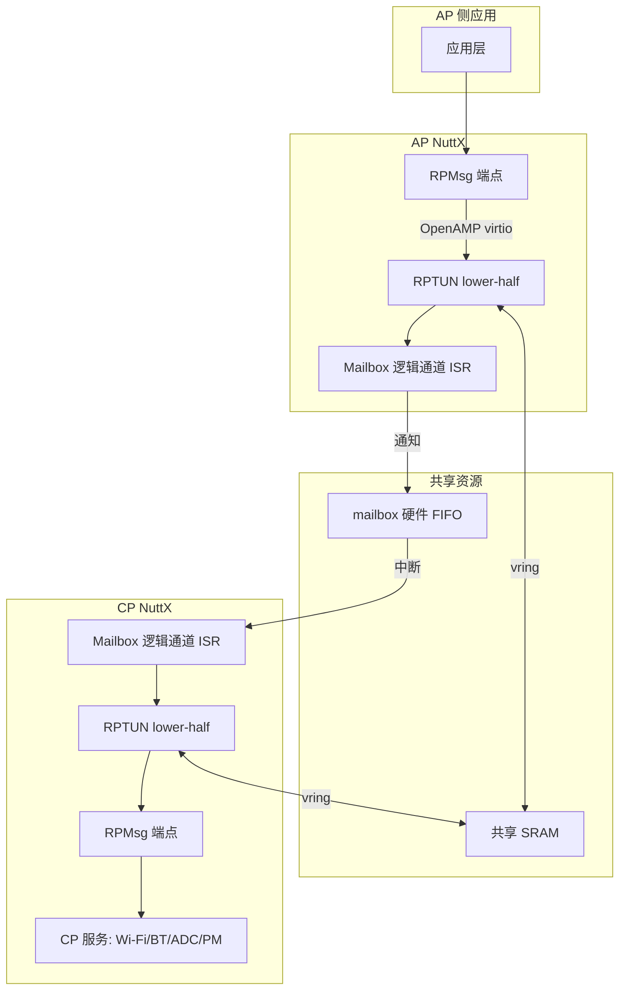
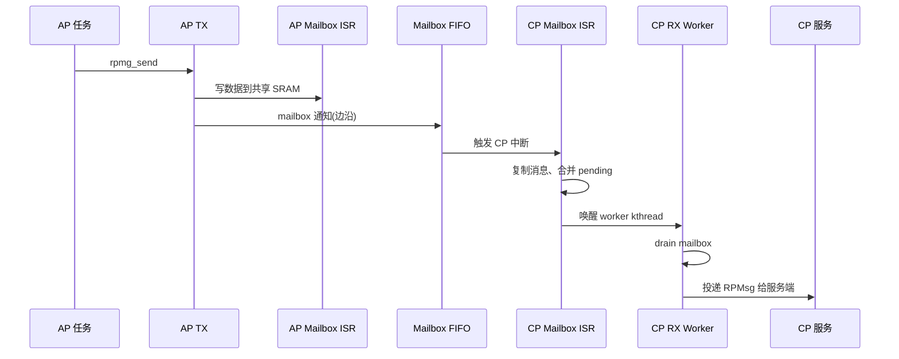

# 25. 跨核通信 RPTUN

> 目标：理解 CP 和 AP 是怎么说话聊天的——BK7258 的核间通信机制。

---

## 25.1 理论：为什么需要核间通信？

BK7258 是 3 核 AMP 架构：
- CP（CPU0）跑 NuttX UP，负责系统服务。
- AP（CPU1/2）跑 NuttX SMP，负责应用和外设。

它们不是同一颗 CPU 里的不同核，而是**两套相对独立的 NuttX 系统**。当 AP 想用 Wi-Fi、蓝牙、ADC（在 CP 侧的服务端）时，必须发消息给 CP。这就是**核间通信**。

---

## 25.2 图解：BK7258 核间通信栈



---

## 25.3 理论：RPTUN / RPMsg / OpenAMP 是什么？

| 技术 | 作用 | 类比 |
|---|---|---|
| **OpenAMP** | 开源框架，提供多核通信的底层机制 | 多核通信的"操作系统" |
| **virtio** | OpenAMP 里的共享内存队列机制 | 核与核之间的"邮箱" |
| **RPMsg** | 基于 virtio 的消息协议 | 应用层看到的"socket" |
| **RPTUN** | NuttX 对 OpenAMP/RPMsg 的适配层 | 网卡驱动 |

BK7258 项目：
- **team 层**实现 `bk7258_rptun.c` 和 `bk7258_rptun_mbox.c`（RPTUN lower-half + mailbox 通知）。
- **NuttX 上层**提供 stock RPTUN/OpenAMP/RPMsg core，没改 NuttX 源码。
- **SDK 层**提供 mailbox channel 和 AON RTC，没改 SDK 源码。

> 💡 **背景知识：为什么不用共享变量直接通信？**
> 
> 直接读写共享变量看似简单，但要处理缓存一致性、原子性、通知、同步、错误恢复，非常复杂。用成熟框架（OpenAMP/RPMsg）可以省掉这些坑。

---

## 25.4 角色：CP 是 master，AP 是 remote

在 `bk7258_rptun.c` 里：

```c
// 仅 CP 构造 resource table
// CP 名字 "cp"，AP 名字 "ap"
// is_master 冻结 CP master、AP remote
```

CP 负责：
- 构造 resource table（描述共享内存、vring 布局）。
- 作为资源/服务端 author。

AP 负责：
- 作为 remote，连接 CP 发布的资源。
- 所有业务发送经 AP logical CPU0 gateway（避免 AP CPU1 直接调 OpenAMP）。

---

## 25.5 图解：mailbox 通知机制



关键点：
- mailbox 硬件只传**通知**（边沿中断），真正的数据在**共享 SRAM**。
- `bk7258-rptun-rx` worker 固定运行在 AP logical CPU0，因为 OpenAMP 不是 SMP 安全的。
- worker 轮询共享 pending 电平状态，而不是依赖可能丢失的边沿。

---

## 25.6 关键文件

| 文件 | 作用 |
|---|---|
| `chip/common/bk7258_rptun.c` | RPTUN lower-half，构造 resource table，角色切换 |
| `chip/common/bk7258_rptun_mbox.c` | Mailbox 实现，ISR + worker kthread |
| `chip/include/bk7258_rptun.h` | RPTUN 头文件 |
| `chip/include/bk7258_amp.h` | AMP 共享内存 ABI |
| `docs/bk7258-t5ai/nuttx-port/n9-rptun-source-verification.md` | RPTUN 验证文档 |

---

## 25.7 关键配置

`chip/include/irq.h`：

```c
#define BK7258_IRQ_MAILBOX = BK7258_IRQ_FIRST + 63  // 逻辑 IRQ 79
```

mailbox 中断占 NVIC 向量槽 79。

---

## 25.8 实操：在 NSH 里测试 RPTUN

如果启用了 rpmsg test：

```bash
# 进入 NSH(CPshell)
bkrpmsgtest          # 运行 RPTUN 测试
apctl status         # 查看 AP 状态
```

冷启动判据：
- `PASS_NSH`：只证明 CP shell 起来了。
- `BRPT PASS`：才证明 RPTUN 连通，AP 和 CP 能通信。

---

## 25.9 实操：查看 RPTUN 相关日志

```bash
# 启动时看串口日志,搜索关键词
grep -i "rptun\|rpmsg\|mailbox" /path/to/uart_log.txt
```

正常应看到：
- `bk7258_rptun_mbox_initialize` 初始化成功
- `rptun_boot` 完成
- RPMsg endpoint 注册成功

---

## 25.10 本节小结

- CP/AP 通过 **SDK mailbox + 共享 SRAM + NuttX RPTUN/OpenAMP/RPMsg** 通信。
- CP 是 master，构造 resource table；AP 是 remote，业务发送经 CPU0 gateway。
- mailbox 只传通知，数据在共享 SRAM；worker 轮询 pending 状态保证不丢消息。
- RPTUN 连通是系统正常工作的关键标志（`BRPT PASS`）。

---

## 底部导航

←上一篇：[24 外设驱动详解（二）RTC-Timer-ADC](./24-外设驱动详解-二(RTC-Timer-ADC).md) · 下一篇→：[26 驱动注册与常见坑](./26-驱动注册与常见坑.md) · ↑返回导航：[00 开始这里](./00-开始这里-导航与学习路径.md)

---

📂 **本文涉及源码路径**

- `/home/lijian/project/open-vela/contest2026_135_yongwangzhiqian/board/bk7258/chip/common/bk7258_rptun.c`
- `/home/lijian/project/open-vela/contest2026_135_yongwangzhiqian/board/bk7258/chip/common/bk7258_rptun_mbox.c`
- `/home/lijian/project/open-vela/contest2026_135_yongwangzhiqian/board/bk7258/chip/include/bk7258_rptun.h`
- `/home/lijian/project/open-vela/contest2026_135_yongwangzhiqian/board/bk7258/chip/include/bk7258_amp.h`
- `/home/lijian/project/open-vela/contest2026_135_yongwangzhiqian/board/bk7258/chip/include/irq.h`
- `/home/lijian/project/open-vela/contest2026_135_yongwangzhiqian/docs/bk7258-t5ai/nuttx-port/n9-rptun-source-verification.md`
