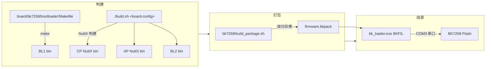

# 30. 构建-烧录-调试实战

> 目标：把前面学的理论落到真机——从一份源码出发，完整走一遍"构建 → 打包 → 烧录 → 调试"的实战链路。

---

## 30.1 理论：一条完整的交付链路

BK7258 的固件不是"一个文件烧进去"那么简单。它由四部分拼成，每一部分有自己的构建方式：

```
BL1（自研 bootloader） + BL2（MCUboot 外壳） + CP（NuttX 单核） + AP（NuttX SMP 双核）
```

这四部分最终被**打包**成一个 `firmware.bkpack`，再通过 Beken 的烧录工具写进 Flash。整个链路可以分成四步：

1. **构建**：分别产出 BL1/BL2/CP/AP 的二进制。
2. **打包**：按分区表把它们拼进一个 `.bkpack`。
3. **烧录**：用 Beken 工具经串口写进芯片。
4. **调试**：J-Link SWD 看 CPU、UART console 看日志。

> 💡 **背景知识：为什么要有"打包"这一步？**
>
> 芯片 Flash 里是分区的（见 [13-Flash分区布局](./13-Flash分区布局.md)）：BL1 在 0x000000、CP 在 0x011000、AP 在 0x165000……烧录工具如果知道每个固件该去哪个地址，就需要一个"包裹"文件把这些信息和二进制一起带上——这就是 `.bkpack` 的作用。

---

## 30.2 图解：构建流水线



---

## 30.3 实操：构建环境准备

**前置条件**（版本已验证）：

| 工具 | 版本 | 用途 |
|---|---|---|
| `arm-none-eabi-gcc` | 10.3（验证过） | 交叉编译 ARM Cortex-M33 |
| Python3 | — | 打包/解析脚本运行环境 |

**验证工具链**：
```bash
arm-none-eabi-gcc --version   # 应显示 10.3 或兼容版本
python3 --version
```

**关键说明**：本仓（contest 仓库）的代码通过 repo manifest 的 `<linkfile>` **软链**进外层 openvela 编译树（`nuttx/`、`apps/`），所以构建时**不需要手动 copy** 代码——软链已经就位，直接在工作区根构建即可。

---

## 30.4 实操：构建 NuttX（CP/AP）

NuttX 统一入口是工作区根的 `./build.sh`，参数是板级配置路径：

```bash
cd /home/lijian/project/open-vela
./build.sh <board-config-path>   # board-config-path 由项目布局决定
```

> ⚠️ **不要猜参数**：`<board-config-path>` 的确切取值（配置文件名/路径）以仓库权威 SOP 为准，见 30.8 的文档导航。

构建完成后，产物里应能看到 CP 与 AP 的镜像二进制。它们分别对应：

| 镜像 | 运行位置 | 加载地址 |
|---|---|---|
| CP | CPU0，单核 | XIP @ 0x02010000 |
| AP | CPU1/2，SMP 双核 | XIP @ 0x02150000 |

---

## 30.5 实操：构建 BL1

BL1 有自己的 Makefile，独立于 NuttX 构建：

```bash
cd /home/lijian/project/open-vela/contest2026_135_yongwangzhiqian/board/bk7258/bootloader
make
make verify          # 校验产物（CRC 头等）
```

产物是 BL1 的二进制（含 CRC 头），对应分区表里的 `primary_bootloader`（物理 0x000000）。

---

## 30.6 实操：打包成 firmware.bkpack

打包脚本把 BL1 + BL2 + CP + AP 按分区表拼装：

```bash
cd /home/lijian/project/open-vela/contest2026_135_yongwangzhiqian
tools/bk7258/build_package.sh
```

产物：`firmware.bkpack` —— 一个文件携带全部镜像与分区地址信息，直接交给烧录工具。

配套脚本（构建计划相关）：
- `tools/bk7258/bk7258_framework.py`：产品构建计划解析/校验。
- `tools/bk7258/materialize_product_profiles.py`：渲染临时 role view（构建角色视角）。

> 💡 **背景知识：为什么要"产品构建计划"？**
>
> 一个板子可能有多套"产品配置"（不同外设组合、不同 profile）。framework 脚本负责解析哪套计划被选中，materialize 负责把对应的配置视图渲染出来。零基础阶段可以把它理解成"多选套餐的配料表"。

---

## 30.7 实操：烧录

烧录工具是 Beken 官方 `bk_loader.exe`（Beken BKFIL），运行在 **Windows 侧**，经 WSL 调用。

| 项 | 值 |
|---|---|
| 工具 | `bk_loader.exe`（Beken BKFIL） |
| 端口 | **COM3**（下载口） |
| 输入 | `firmware.bkpack` |

烧录过程要点：
1. 板子进入下载模式（具体按键/时序以 SOP 文档为准）。
2. Windows 侧打开 `bk_loader.exe`，选 COM3、选 `.bkpack`。
3. 点烧录，观察进度条；完成后复位板子。

> ⚠️ 如果在 WSL 里脚本化调用，注意串口设备在 Windows 侧枚举，WSL 通过 `/dev/ttyS*` 映射——以权威 SOP 里的实测流程为准。

---

## 30.8 实操：调试

### 方式一：J-Link SWD（看 CPU）

| 项 | 值 |
|---|---|
| 调试器 | J-Link |
| 接口 | SWD（P20/P21 = SWCLK/SWDIO） |
| 工具链 | `arm-none-eabi-gdb` + J-Link GDB Server |

```bash
# 连接 J-Link GDB Server 后，在 gdb 里：
target remote localhost:2331
monitor reset
load   # 或 attach 后直接看运行状态
info registers
```

### 方式二：UART console（看日志）

| 项 | 值 |
|---|---|
| 串口 | console UART1 |
| 波特率 | 460800 |
| 配置 | 8N1（8 数据位、无校验、1 停止位） |

用任意串口终端（minicom/picocom/Windows 串口助手）连上，就能看到 NuttX 的启动日志和 NSH 命令行。

> 💡 **背景知识：为什么要有两个调试通道？**
>
> SWD 是"手术台"——可以断点、看寄存器、单步，适合查死机/汇编级问题；UART console 是"体检报告"——系统自己打印运行状态，适合看启动流程和驱动初始化结果。两者配合：先看 console 日志定位到大致模块，再用 SWD 深入现场。

---

## 30.9 实操：一键自动调试脚本

仓库提供了自动构建 + 稀疏烧录 + 判读的脚本：

```bash
cd /home/lijian/project/open-vela/contest2026_135_yongwangzhiqian
tools/bk7258/bk7258_auto_debug.sh
```

它会自动完成：构建 → 打包 → 稀疏烧录（只烧有变化的区，加速迭代）→ 判读结果。日常开发迭代时用它，省去手动一步步操作。

---

## 30.10 权威文档导航

本仓的 `docs/bk7258-t5ai/` 下已有成体系的文档，**实操命令以它们为准**：

```
docs/bk7258-t5ai/
├── beginner-porting-guide/        # 初学者移植指南
├── hardware/                      # 硬件资料
├── bootloader/                    # bootloader 相关
├── nuttx-port/
│   └── bk7258-build-flash-debug-sop.md   # ★ 权威 SOP：构建/烧录/调试
└── jlink-swd-debug-guide.md       # J-Link SWD 调试指南
```

**推荐阅读顺序**：先读 `bk7258-build-flash-debug-sop.md` 建立完整操作流程，再读 `jlink-swd-debug-guide.md` 深入调试。

---

## 30.11 本节小结

- 交付链路：构建（BL1/CP/AP/BL2）→ 打包（`.bkpack`）→ 烧录（`bk_loader.exe` + COM3）→ 调试（J-Link SWD + UART console）。
- 构建入口：NuttX 用 `./build.sh <board-config-path>`，BL1 用独立 Makefile。
- 打包脚本：`build_package.sh` → `firmware.bkpack`。
- 调试双通道：SWD 看 CPU、UART(460800 8N1) 看日志。
- 一切细节以 `docs/bk7258-t5ai/nuttx-port/bk7258-build-flash-debug-sop.md` 为准。

---

## 底部导航

←上一篇：[26 驱动注册与常见坑](./26-驱动注册与常见坑.md) · 下一篇→：[90 面试速记与 FAQ](./90-面试速记与FAQ.md) · ↑返回导航：[00 开始这里](./00-开始这里-导航与学习路径.md)

---

📂 **本文涉及源码路径**

- `/home/lijian/project/open-vela/contest2026_135_yongwangzhiqian/tools/bk7258/bk7258_framework.py`
- `/home/lijian/project/open-vela/contest2026_135_yongwangzhiqian/tools/bk7258/materialize_product_profiles.py`
- `/home/lijian/project/open-vela/contest2026_135_yongwangzhiqian/tools/bk7258/build_package.sh`
- `/home/lijian/project/open-vela/contest2026_135_yongwangzhiqian/tools/bk7258/bk7258_auto_debug.sh`
- `/home/lijian/project/open-vela/contest2026_135_yongwangzhiqian/board/bk7258/bootloader/Makefile`
- `/home/lijian/project/open-vela/contest2026_135_yongwangzhiqian/docs/bk7258-t5ai/nuttx-port/bk7258-build-flash-debug-sop.md`（权威 SOP）
- `/home/lijian/project/open-vela/contest2026_135_yongwangzhiqian/docs/bk7258-t5ai/jlink-swd-debug-guide.md`
