# 00 · 代码导读（从"看得懂概念"到"看得懂代码"）

> 前面 18 篇学习文档帮你建立了概念框架；**这里开始直接面对真实源码**。
> 本套件把 BK7258 移植的全部**自研/适配代码**（BL1、BL2、CP、AP、板级初始化、构建工具）分组逐文件讲解，每一段代码都配大白话解释，零基础也能跟着读。

---

## 这套代码讲解讲的是什么

我们**不碰**厂商 SDK（`bk_idk` 里的 armino 库），只讲**我们自己写/自己适配**的代码。它们都在 `$CONTEST/board/bk7258/` 与 `$CONTEST/tools/bk7258/` 下。

代码总量约 **100 个源文件**，按功能分成 **13 篇**，正好对上学习套件的五大篇章：

```mermaid
flowchart LR
    subgraph A[Bootloader 篇]
        C1[01 BL1 启动核心]
        C2[02 BL1 安全与策略]
        C3[03 BL2 MCUboot 外壳]
        C4[04 BL2 加密验签]
    end
    subgraph B[芯片适配篇 · CP]
        C5[05 CP 启动与时钟]
        C6[06 CP 系统服务]
    end
    subgraph C[芯片适配篇 · AP]
        C7[07 AP 启动与 SMP]
        C8[08 AP 外设驱动一]
        C9[09 AP 外设驱动二]
        C10[10 AP 多媒体与无线]
    end
    subgraph D[板级与构建]
        C11[11 板级初始化]
        C12[12 构建与打包工具]
        C13[13 分区与板级变体]
    end
    A --> B --> C --> D
```

---

## 篇目速查

| 编号 | 讲解内容 | 对应学习文档 | 一句话 |
|---|---|---|---|
| [01-bl1-启动核心](./01-bl1-启动核心.md) | start.S / boot_main / clock / flash / runtime / libc / ld | [../10-Bootloader总览与启动链.md](../10-Bootloader总览与启动链.md)、[../11-BL1深度解析.md](../11-BL1深度解析.md) | 上电第一段代码怎么把系统叫醒 |
| [02-bl1-安全与策略](./02-bl1-安全与策略.md) | Manifest / policy / handoff / SHA256 / WDT | [../14-安全启动与签名.md](../14-安全启动与签名.md) | BL1 的"信任闸门"：验内容、验身份、定策略 |
| [03-bl2-mcuboot外壳](./03-bl2-mcuboot外壳.md) | bl2_start / main / flash_map / boot_go / security_cnt / ld | [../12-BL2-MCUboot深度解析.md](../12-BL2-MCUboot深度解析.md) | 第二级引导：验签选槽跳转 |
| [04-bl2-加密验签](./04-bl2-加密验签.md) | ECDSA-P256 / ECC / ASN.1 / 公钥 | [../14-安全启动与签名.md](../14-安全启动与签名.md) | 椭圆曲线签名到底怎么"验" |
| [05-cp-启动与时钟](./05-cp-启动与时钟.md) | start / vectors / clock / DVFS / WDT / SWD | [../01-芯片与项目背景.md](../01-芯片与项目背景.md) | CP（CPU0）跑 NuttX 前的准备工作 |
| [06-cp-系统服务](./06-cp-系统服务.md) | AP 监管 / PM / SARADC server / 蓝牙 / GPIO | [../25-跨核通信-RPTUN.md](../25-跨核通信-RPTUN.md) | CP 这个"管家"都在忙什么 |
| [07-ap-启动与smp](./07-ap-启动与smp.md) | AP start / SMP / 向量表 / 健康检查 | [../01-芯片与项目背景.md](../01-芯片与项目背景.md) | CPU1/CPU2 双核怎么被拉起来 |
| [08-ap-外设驱动一](./08-ap-外设驱动一.md) | I2C / PWM / GPIOE / RTC / SPI / QSPI | [../22-驱动适配范式.md](../22-驱动适配范式.md)、[../23-外设驱动详解-一(I2C-PWM-GPIOE).md](../23-外设驱动详解-一(I2C-PWM-GPIOE).md) | lower-half 封装 `bk_*` 的标准范式 |
| [09-ap-外设驱动二](./09-ap-外设驱动二.md) | SARADC / SDMADC / CAN / I2S / DMA2D / USB CDC | [../24-外设驱动详解-二(RTC-Timer-ADC).md](../24-外设驱动详解-二(RTC-Timer-ADC).md) | 第二波外设驱动 |
| [10-ap-多媒体与无线](./10-ap-多媒体与无线.md) | Wi-Fi / DVP / JPEG / LCD / 缩放 | [../21-armino-SDK集成.md](../21-armino-SDK集成.md) | 网络、摄像头、图像、屏幕 |
| [11-板级初始化](./11-板级初始化.md) | platform / bringup / boot / Flash MTD / 分区 | [../20-芯片适配层架构.md](../20-芯片适配层架构.md) | 板级"接线员"：把一切注册进 NuttX |
| [12-构建与打包工具](./12-构建与打包工具.md) | build_package / bkpack / framework / validation | [../30-构建-烧录-调试实战.md](../30-构建-烧录-调试实战.md) | 从源码到 `firmware.bkpack` |
| [13-分区与板级变体](./13-分区与板级变体.md) | 分区脚本 / ld.script / 三块板 bringup | [../13-Flash分区布局.md](../13-Flash分区布局.md) | Flash 怎么切、三块板怎么配 |

---

## 怎么读（建议）

**第一遍（建立代码感）**：按 01 → 02 → 03 → 04 顺序读 Bootloader 四篇，跟着"上电 → BL1 → BL2 → 跳转"的链路走，先不看驱动。

**第二遍（按需深入）**：你在做哪一块就精读哪篇。写驱动 → 读 08/09；改系统 → 读 05/06/11；想搞懂构建 → 读 12/13。

**对照源码**：每篇都标注了 `$CONTEST/` 下的真实文件路径，读的时候**打开源码文件对照着看**效果最好（代码片段全部真实摘自源码并标了行号）。

---

## 路径约定（与主套件一致）

- `$CONTEST` = 比赛 overlay 仓库根（`$WORKSPACE/contest2026_135_yongwangzhiqian`），即"板级适配 + 自研驱动 + 自研 bootloader"本仓。
- `$WORKSPACE` = openvela 编译树根。
- 实操命令里的占位符请替换成你自己机器上的实际路径。

---

## 返回

- ↑ 返回主套件导航：[../00-开始这里-导航与学习路径.md](../00-开始这里-导航与学习路径.md)
- 下一篇（第一篇）：[01-bl1-启动核心](./01-bl1-启动核心.md)
