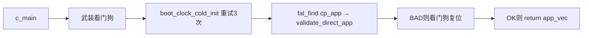
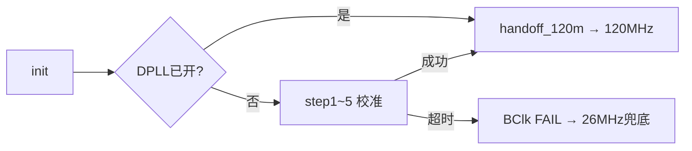
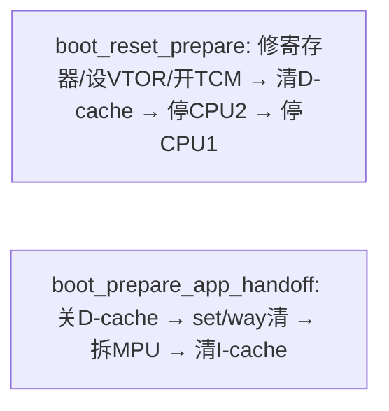
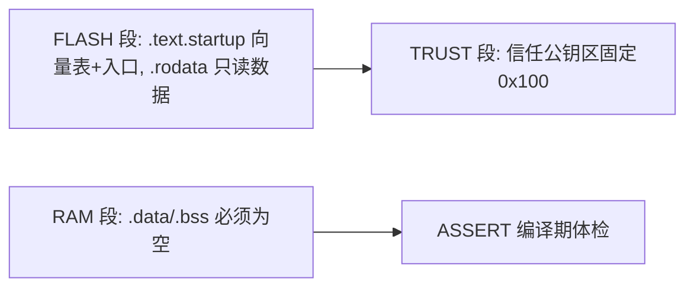

# bl1-启动核心

> 本页是"代码讲解"系列第 01 篇，配合《10-Bootloader总览与启动链》阅读更佳。面向零基础小白，术语首次出现都用大白话解释。

---

## 本组导读
BK7258 是三核芯片（CPU0/CPU1/CPU2）。芯片一上电，CPU0 先运行一段"开门程序"——**BL1（Tier-1 引导程序）**，做三件事：①**把硬件摆到能干活的状态**（关中断、修寄存器、喂看门狗、起 DPLL 时钟、配好 UART 串口）；②**找到并验证系统镜像**（用 Flash 分区表定位 App/BL2，检查头部"身份证"：向量表、魔数）；③**干净地交接**（关缓存、清 MPU、写栈指针和入口地址，然后"跳"进去）。
打个比方：BL1 像酒店的**门童**——确认大堂环境正常（硬件就绪）、核对客人身份（镜像校验）、再把他安全送进电梯（跳转），关门前还把杂物（缓存/MPU 残留）清干净。

```
FLASH @0x02000000（XIP：代码直接在 Flash 上执行）
  0x000000  +──────────────────────+      CPU0 复位
            │ BL1 槽 (64KB)        │         │
            │ start.S 向量表+入口   │ ◀───────┘
            │ boot_main.c 主流程    │ ──► boot_runtime.c（修寄存器/停次核）
            │ boot_clock.c 时钟     │      │
            │ boot_runtime.c 交接   │ ◀──── c_main 返回 App 地址
  0x010000  +──────────────────────+      │
            │ CP App / NuttX 镜像  │ ◀──── VTOR/MSP 切过去，bx 跳入
            +──────────────────────+
```

---

## 文件：start.S
**它干什么**：用汇编写的**芯片复位入口**——定义 64 项向量表、放好 "BK7236" 魔数，在 `Reset_Handler` 里完成"连 C 语言都没法跑时"的最底层初始化，最后做跳转前收尾。
### 💡 【背景知识】
C 语言开场需要"有人先铺路"：栈指针得设好、中断得先关，这些必须在 C 第一行代码之前做完，只能靠汇编——start.S 就是**后台工作人员**，先挂好背景板、开好灯，演员（main）才登台。另外 Cortex-M 复位后 CPU 会**自动**从内存最开头的"向量表"取两个数：第 0 项是初始栈指针（MSP，主栈指针），第 1 项是复位后第一条要执行的地址。所以向量表必须霸占 Flash 最开头。
### 【核心结构】

| 名字 | 一句话人话 |
|---|---|
| `Reset_Handler`（start.S:78） | 复位后第一个执行的代码，整个 BL1 的起点 |
| 向量表（start.S:47-70） | "出什么事找谁处理"的登记表：MSP / Reset / 其余默认死循环 |
| `BK7236` 魔数（start.S:60-62） | 写在 0x100 的"门牌号"，烧录工具靠它认出这是 BL1 |

### 【关键代码逐段讲解】
**1) 向量表——芯片的"电话本"（start.S:47-55）**

```asm
    .org 0x000
    .word 0x2809F700              /* [0] initial MSP (verified SRAM top)    */
    .word Reset_Handler + 1       /* [1] Reset (Thumb)                       */
    .rept 60                      /* [4..63] 其余中断 -> default 死循环     */
    .word default_handler + 1
    .endr
```

- `.org 0x000`：强制这段代码从 Flash 偏移 0 开始，向量表必须霸占最开头。
- 第 0 项是初始主栈指针；0x28xxxxxx 是 SRAM（内存）区，这里是验证过的 SRAM 顶。
- 每个地址 `+1`：Cortex-M 用 **Thumb 指令集**，地址最低位为 1 表示"这是 Thumb 代码"；其余 60 项先指向死循环兜底——BL1 短命，不处理中断。
**2) 魔数与开局（start.S:60-62, 78-103）**

```asm
    .org 0x100
    .ascii "BK7236"
    .byte 0x10, 0x00
Reset_Handler:
    cpsid i                     /* 关全局中断 */
    ldr  r0, =0x2802F800        /* 设栈下界 msplim，防栈爆 */
    msr  msplim, r0
    ldr  r0, =0xE000EF50        /* SCB_ICIALLU：清空指令缓存 */
    str  r1, [r0]
```

- `BK7236` 魔数写在 0x100 偏移处，烧录工具和校验代码据此辨认"这是合法的 BK 系启动镜像"。
- `cpsid i`：立刻关所有中断——环境没铺好前任何中断都会踩坏状态。
- `msplim`（栈下界寄存器，Armv8-M 防栈溢出机制）：栈指针低于它就触发异常；0x2802F800 是官方固定值。
- `ICIALLU`（清空指令缓存）：BK7258 的怪脾气——复位后 CPU0 私有**指令缓存可能残留上次的代码**，不清掉会一边读新 Flash 字节、一边执行旧缓存代码，像放错卡带的录音机。注释强调"必须在第一条复位缓存行里做"。
- `dsb/isb` 是内存屏障：强制流水线"等前面的写落地再继续"，防乱序执行。
**3) 交接终曲——跳进 App（start.S:336-364）**

```asm
    ldr  r1, [r0]            /* r1 = app MSP   (App 向量表第0项) */
    ldr  r2, [r0, #4]        /* r2 = app Reset (App 向量表第1项) */
    ldr  r3, =0xE000ED08     /* SCB->VTOR：向量表基地址寄存器 */
    str  r0, [r3]            /* 告诉 CPU 中断表搬到 App 那 */
    msr  msp, r1             /* 把栈切到 App 的栈 */
    movs r0, #0              /* 把 r0..r12 全部清零 (r2 保留) */
    bx   r2                  /* 跳进 App 的 Reset_Handler */
```

- 此时 `r0` 是 `c_main()` 返回的 App 向量地址，从这读 App 自己的向量表：`vec[0]` 是 App 栈顶，`vec[1]` 是 App 入口。
- **VTOR**（向量表偏移寄存器）：芯片靠它知道"中断来了去哪查表"，切到 App 后 App 的中断才有效。
- 跳转前清空 r0~r12：让 App 开箱时寄存器干净，不误读 BL1 残留。这是官方 bootloader 逆向（S2.7 节）的结论。
### 【流程/关系图】


---

## 文件：boot_main.c
**它干什么**：BL1 的 **C 语言主流程**——打印启动日志、武装看门狗、冷启动时钟、解析 FAL 分区表、找到并校验 App（或 BL2）镜像，最后把 App 入口地址交还给 start.S。
### 💡 【背景知识】
Flash 里住着多个**分区**（类似硬盘的 C/D 盘）：bootloader、cp_app、ap_app、bl2……分区的"目录"叫 **FAL 分区表**（Flash 抽象层的分区表）。boot_main.c 干的事：读目录 → 找到 "cp_app" 这一格 → 检查镜像是否可信 → 汇报给汇编。它刻意不用标准库和可变全局变量，因为 BL1 是"裸奔"环境，没有操作系统支持。
### 【核心结构】

| 名字 | 一句话人话 |
|---|---|
| `struct fal_partition`（boot_main.c:108-115） | 分区表里"一格"的样子：名字、偏移、长度、魔数 |
| `c_main()`（boot_main.c:422） | C 入口，被 start.S 直接调用，返回 App 向量地址 |
| `validate_direct_app()`（boot_main.c:284） | "身份证检查"：MSP 合法？入口在 Flash 内？魔数对吗？ |

### 【关键代码逐段讲解】
**1) 分区表——Flash 的"目录"（boot_main.c:118-130）**

```c
const struct fal_partition fal_partition_table[] = {
    { FAL_PART_MAGIC, "cp_app",     "beken_onchip_crc",
      BK7258_ROLE_SLOT_A_CP_LOGICAL_OFFSET,
      BK7258_ROLE_SLOT_A_CP_LOGICAL_SIZE, 0u },
    { FAL_PART_MAGIC, "bl2",        "beken_onchip_crc",
      BK7258_ROLE_BL2_LOGICAL_OFFSET, BK7258_ROLE_BL2_LOGICAL_SIZE, 0u },
};
```

- `FAL_PART_MAGIC`（0x45503130 = "EP10"）是"这格是不是有效分区项"的魔数。
- 偏移/大小都用 `BK7258_ROLE_*` 宏（由 `auto_partitions.csv` 生成），保证"目录"和真实 Flash 布局永远一致；`FLASH_BASE + offset` 就是 App 的逻辑地址——代码在 Flash 上**原地执行（XIP）**，不用拷进内存。
**2) 主流程 c_main 的骨架（boot_main.c:458-532）**

```c
    boot_wdt_init();              /* 上保险丝：8秒不喂就自动复位 */
    boot_wdt_feed();
    for (retry = 0; retry < 3; retry++) {   /* 时钟冷启动，重试3次 */
        boot_wdt_feed();
        boot_clock_cold_init();
        if (REG32(0x44010114u) & (1u << 5)) {  /* DPLL 起来了没？ */
            cold_ok = 1;
            break;
        }
    }
    app = fal_find("cp_app");     /* 查目录，找 cp_app */
    app_vec = FLASH_BASE + (uint32_t)app->offset;
    if (!validate_direct_app(app_vec, app->len))
        boot_wdt_fail_reset();
    __asm volatile ("cpsid i" ::: "memory");   /* 关中断，准备交接 */
    log_u32("jump to:", app_vec);
    uart_puts("JMP\r\n");
    return app_vec;               /* 把 App 地址交还给 start.S */
```

- **看门狗（WDT，Watchdog Timer）**：硬件倒计时器，不按时"喂"它（清零计时）就强制复位芯片。bootloader 先武装它，后面代码卡死时芯片能自我救赎。
- DPLL 冷启动失败重试 3 次还不行就**绝不跳 App**：App 启动要切高频时钟，DPLL 没起来 App 行为未定义，宁可按死重来。
- `validate_direct_app()`（boot_main.c:290-313）逐条检查"身份证"：`msp` 必须 4 字节对齐且在 SRAM 合理区间（否则栈乱飞）；`rst` 最低位必须是 1（Thumb 标志）；0x100 处魔数必须是 "BK72"。失败就打印 "BAD"+原因，走**看门狗复位失败路径**——保证"坏镜像绝不会被启动"。
- UART 打印（boot_main.c:147-152）也是自研的：轮询发送缓冲（FIFO）状态位就写入字符，循环上限 100000 是**有界等待**——宁可丢字也不能卡死启动。
### 【流程/关系图】



---

## 文件：boot_clock.c
**它干什么**：芯片**冷启动时把主时钟 DPLL 打开并校准**，然后按官方参数把 CPU 切到 120 MHz、Flash 时钟切到 DPLL 源。
### 💡 【背景知识】
芯片刚上电用慢速的 26 MHz 晶振（像汽车发动时的怠速）。正式跑 App 前要启动 **DPLL（数字锁相环）**——能"倍频"出 480 MHz 高速时钟的部件。开 DPLL 不是按个开关：要按顺序写一大堆"模拟寄存器"（ANA_REG0~25），每次还要等内部 SPI 总线空闲，最后要校准。顺序是反推官方 SDK 的 `sys_hal_early_init` 得来的，错了芯片直接不工作。
### 【核心结构】

| 名字 | 一句话人话 |
|---|---|
| `boot_clock_cold_init()`（boot_clock.c:325） | 对外接口：开 DPLL + 切 120 MHz |
| `boot_cali_dpll()`（boot_clock.c:197） | DPLL 校准：降触发→等→拉高→等→恢复检测 |
| `ana_write/ana_wait`（boot_clock.c:157-172） | 写模拟寄存器的"安全通道"，带 SPI 忙等待超时 |

### 【关键代码逐段讲解】
**1) 模拟寄存器安全写——带超时的"邮差"（boot_clock.c:157-172）**

```c
static int ana_wait(uint32_t addr)
{
    uint32_t idx = (addr - ANA_REG0) >> 2;   /* 寄存器编号 = 地址差/4 */
    uint32_t t = ANA_SPI_TIMEOUT;
    while (REG32(ANA_SPI_STATE) & (1u << idx))  /* 这个寄存器还在忙 */
        if (--t == 0)
            return -1;                          /* 超时，放弃 */
    return 0;
}
```

- 每次写 ANA_REG 都触发一次内部"模拟 SPI"传输，前一次没传完就写下一次数据会丢，所以每个写函数后面都跟 `ana_wait` 等 SPI 空闲位清零。**超时返回 -1** 是产品级安全要求：任何一步都不能卡死 bootloader。
**2) DPLL 校准与冷启动总控（boot_clock.c:201-215, 333-348）**

```c
    if (ana_and(ANA_REG0, ~(1u << 19)) < 0)   /* spitrig = 0: 先降触发 */
        return -1;
    clk_delay(120);
    if (ana_rmw(ANA_REG0, (1u << 4), (1u << 19)) < 0)  /* 拉高触发+关检测 */
        return -1;
    clk_delay(3400);
    if (ana_or(ANA_REG0, (1u << 4)) < 0)      /* spideten = 1: 恢复锁定检测 */
        return -1;
    clk_delay(3400);
```

- 校准像**手动调收音机**：先降触发电平 → 延时 → 拉高触发启动校准、临时关"锁相检测" → 延时等稳 → 再开检测确认锁住。延时用纯空循环 `clk_delay`，按最慢 26 MHz 估算圈数。
- 总控 `boot_clock_cold_init()` 有**幂等保护**（boot_clock.c:333）：DPLL 已开（软复位/loader 残留）就跳过整段模拟序列，只做 120 MHz 交接，避免重复写模拟寄存器惹祸；任一步失败只打印 "BClk FAIL" 就返回，App 的 26 MHz 兜底会处理——**安全降级**，绝不硬跳。
### 【流程/关系图】



---

## 文件：boot_flash.c
**它干什么**：提供**只读的原始 Flash 访问**接口 `bk7258_bl1_flash_read()`：按任意地址、任意长度从 Flash 读出数据到内存缓冲。
### 💡 【背景知识】
正常情况下 BL1 用 **XIP（原地执行）** 读 Flash——直接把 Flash 当内存访问，取指令不用搬运。但有些场合（读 boot-control 记录、读 Manifest 页）要绕过 XIP，走 Flash 控制器的"软件读"通道。打比方：平时站在书架前直接看书（XIP），特殊场合用照相机把某一页拍下来拿回桌上细看（软件读）。本文件就是那台"照相机"。
### 【核心结构】

| 名字 | 一句话人话 |
|---|---|
| `bk7258_bl1_flash_read()`（boot_flash.c:90） | 对外接口：地址/长度随意，内部自动对齐处理 |
| `flash_read_aligned()`（boot_flash.c:54） | 读一个 32 字节对齐块的核心动作 |
| `flash_wait_idle()`（boot_flash.c:32） | 等 Flash 控制器不忙，期间顺带喂看门狗 |

### 【关键代码逐段讲解】
**1) 32 字节块读与任意长度封装（boot_flash.c:67-125）**

```c
  command &= ~(FLASH_ADDRESS_MASK | FLASH_COMMAND_MASK); /* 清旧地址和命令 */
  command |= address | (FLASH_COMMAND_READ << FLASH_COMMAND_SHIFT);
  BL1_REG32(FLASH_OP_CMD) = command;          /* 告诉控制器：读这个地址 */
  BL1_REG32(FLASH_OP_CTRL) = BL1_REG32(FLASH_OP_CTRL) | FLASH_OP_SW; /* 发起软件读 */
  if (flash_wait_idle() < 0)
    return -1;
```

- Flash 控制器有固定"对话协议"：把地址和读命令拼进 `FLASH_OP_CMD`，再置 `FLASH_OP_SW`（软件操作位），然后等 `FLASH_BUSY_SW` 忙位清零。结果寄存器一次读出 32 位，按小端序拆成 4 字节；读满 8 个字 = 32 字节 = Flash 一次读的最小粒度。
- 上层 `bk7258_bl1_flash_read()` 对任意地址/长度做"化整为零"：**每次读 32 字节整块、只拷贝需要的片段**，然后指针前移循环继续（boot_flash.c:100-125）。用户想从第 3 字节读 100 字节也支持。
- 忙等待里有细节（boot_flash.c:34-48）：等待够长时每 65536 轮喂一次看门狗，防止"长时间等 Flash 但看门狗先爆炸复位"的乌龙；同时保持有界（`FLASH_WAIT_BUDGET`），杜绝死循环。
### 【流程/关系图】


---

## 文件：boot_runtime.c
**它干什么**：提供 `boot_reset_prepare()`（复位后把 Flash 控制器、缓存、次核状态归一化）和 `boot_prepare_app_handoff()`（跳 App 前清空 D-cache 和 MPU）。
### 💡 【背景知识】
这是"**洁净室逆向工程**"的产物：官方 BK7258 SDK v3.1.1.9 的 bootloader.bin 被反汇编后，把缓存、MPU、TCM 的序列逐条还原成 C 代码（注释里有 SHA-256 校验值）。**MPU（内存保护单元）**是 Cortex-M 的"小区门禁"，规定哪些内存区域谁能访问，跳进 App 前必须全拆了，否则 App 一进门就撞门禁。同理 **D-cache（数据缓存）** 里可能留着 BL1 时代的脏数据，不清干净 App 会读到"穿越时空"的旧值。
### 【核心结构】

| 名字 | 一句话人话 |
|---|---|
| `boot_reset_prepare()`（boot_runtime.c:424） | 复位总控：修 Flash 寄存器、设 VTOR、开 TCM、清缓存、停次核 |
| `boot_prepare_app_handoff()`（boot_runtime.c:454） | 交接总控：关 D-cache、按组清数据缓存、拆 MPU、再清 I-cache |
| `boot_flash_reset_prepare()`（boot_runtime.c:276） | 读 Flash 厂商 ID（RDID），据此选 Flash 时钟分频 |

### 【关键代码逐段讲解】
**1) Flash 复位准备——认芯片、选档位（boot_runtime.c:306-338）**

```c
    REG32(FLASH_OP_CMD) = (value & ~FLASH_OP_TYPE_MASK) | FLASH_OP_TYPE_RDID;
    REG32(FLASH_OP_CTRL) |= FLASH_OP_SW;   /* 发 RDID 命令 */
    ...
    flash_id = REG32(FLASH_ID) & 0x00ffffffu;
    if (flash_id == FLASH_ID_GD25WQ32E || ...) {
        value |= SYS_FLASH_DIV_FAST;    /* 认识的快片用快分频 */
    } else {
        value |= SYS_FLASH_DIV_SAFE;    /* 不认识的用保守档 */
    }
    REG32(SYS_FLASH_CLOCK) = value;
```

- **RDID（读厂商识别码）**：问 Flash"你是谁"，返回 3 字节 ID。GD 系列快片走 `DIV_FAST`，不认识的降档走 `DIV_SAFE`——**宁可慢一点，绝不因 Flash 跟不上时钟而出错**。整个函数不发擦除/编程命令，**不碰 Flash 内容**。
**2) 停次核与交接清场（boot_runtime.c:358-377, 454-470）**

```c
    value &= ~SYS_CPU_RESET;         /* reset=0: 按住复位不放 */
    REG32(control) = value;
    boot_dsb();
    value |= SYS_CPU_HALT;           /* 再关核心时钟 */
    REG32(control) = value;
    ...
    value |= SYS_CPU_POWER_DOWN;     /* 最后才请求下电 */
    REG32(control) = value;
```

- 注释点破硬件怪癖：**必须先按复位、再关时钟、最后才下电**，顺序写反 BK7258 会忽略下电请求（官方 reset→halt→power down 分开三步，不能合并）。
- 为什么必须停次核？CPU1/CPU2 私有的数据缓存可能残留上一次 AP 会话的脏行。确认两核都停止（轮询 run-status 位）后，才敢清共享 SRAM 里的 AP 会话状态（`AP_BOOT_STATE_MAGIC = 0`），保证"新会话从干净起点开始"。
- 交接总控 `boot_prepare_app_handoff()`（boot_runtime.c:454-470）是官方 `configure_dcache_mpu(0)` 的还原：`SCB_CCR` 关 D-cache → `DCCISW` 按"缓存组/路"逐行清扫（128 组 × 4 路，从 `CCSIDR` 推导）→ `boot_mpu_disable_and_clear()` 拆 16 个 MPU 区域 → I-cache 只"无效化"而**不关**。最后一条是刻意为之：官方 bootloader 就如此，但下载器复位可能残留旧行，所以跳转前必须再清一次——即注释说的 "reset-residue hardening"（复位残留加固）。
### 【流程/关系图】



---

## 文件：boot_libc.c
**它干什么**：BL1 自带的**最小 libc**——只实现 `memcpy`、`memset`、`memcmp`、`strcmp` 四个函数。
### 💡 【背景知识】
bootloader 是"自由站立（freestanding）"环境——没有操作系统、没有标准库。但代码里难免要用拷贝、清零、比较内存/字符串的操作。与其引入全套 glibc（体积大还有依赖），不如手写这四个最常用的。这是常见嵌入式做法：**自带厨房，不点外卖**。
### 【核心结构】

| 名字 | 一句话人话 |
|---|---|
| `memcpy`（boot_libc.c:9） | 把一块内存原样搬到另一块 |
| `memset`（boot_libc.c:22） | 把一块内存全部填成某个字节（最常用于清零） |
| `memcmp`（boot_libc.c:34） | 逐字节比较两块内存，返回相等/大小 |

### 【关键代码逐段讲解】
四个函数都是最朴素的逐字节实现，以 `memcmp` 为例（boot_libc.c:34-51）：

```c
int memcmp(const void *left, const void *right, size_t len)
{
  const unsigned char *a = left;
  const unsigned char *b = right;
  while (len-- != 0) {
      if (*a != *b) {
          return *a < *b ? -1 : 1;   /* 找到第一个不同字节，判大小 */
      }
      a++; b++;
  }
  return 0;   /* 全都一样 */
}
```

- 用 `unsigned char`（无符号字节）逐字节比较，符合 C 标准"按无符号值比较"的要求。
- 实现刻意保持**简单直白**：bootloader 场景更看重"一眼能看出正确性"，而不是优化速度。`memset`/`memcpy` 同理就是最朴素的逐字节循环。
### 【流程/关系图】


## 文件：bootloader.ld
**它干什么**：**链接脚本**——告诉链接器 BL1 的每一段代码、数据应放在内存/Flash 的哪个地址。
### 💡 【背景知识】
编译器把源文件变成一堆"零件"（目标文件），链接器负责按地址拼成一个整体。链接脚本就是**拼装图纸**：哪块放 Flash、哪块放 RAM、入口函数是谁。它还有个关键约束——BL1 不允许有需要初始化的 RAM 数据（.data）和未清零的 BSS，因为 start.S 里没有 C 运行环境（没有 `.bss` 清零的启动代码）。
### 【核心结构】

| 名字 | 一句话人话 |
|---|---|
| `ENTRY(Reset_Handler)`（bootloader.ld:16） | 声明程序入口是 Reset_Handler |
| `MEMORY` 三段（bootloader.ld:18-27） | FLASH（执行代码）、TRUST（固定信任区）、RAM（理论上保留） |
| 三个 `ASSERT`（bootloader.ld:70-73） | 编译期体检：.data=0、.bss=0、信任区正好 0x80 字节 |

### 【关键代码逐段讲解】
**1) 内存地图与信任区（bootloader.ld:18-42, 70-73）**

```
MEMORY
{
    FLASH (rx)  : ORIGIN = BK7258_ROLE_BOOT_XIP_START,
                  LENGTH = BK7258_ROLE_BOOT_LOGICAL_SIZE -
                           BK7258_BL1_MANIFEST_TAIL_SIZE - 0x100
    TRUST (rx)  : ORIGIN = BK7258_ROLE_BOOT_XIP_END -
                           BK7258_BL1_MANIFEST_TAIL_SIZE - 0x100,
                  LENGTH = 0x100
}
```

- `FLASH` 从 0x02000000 开始（XIP 基地址），长度 = 槽大小扣掉尾部信任区和 Manifest 预留区。
- `TRUST` 是 Flash 末尾固定 0x100 字节的"信任身份"区，放 P-256 公钥 + 两个 SHA-256 哈希（正好 0x80 字节）——**代码怎么增长它都不能漂移**，否则校验方找不到公钥。公钥区用 `KEEP()`（bootloader.ld:38-42）防止链接器"垃圾回收"把只被外部工具引用的段裁掉。
- 三个 `ASSERT`（bootloader.ld:70-73）是**架构级约束**：一旦有人往 BL1 里加可变全局变量（.data/.bss 非空），链接直接报错。BL1 只准用栈和只读数据（.rodata），从根上杜绝"没初始化 C 运行环境却用了全局变量"的隐患。

### 【流程/关系图】


---

## 文件：Makefile
**它干什么**：构建脚本——编译、链接成 `bl.elf` → objcopy 转成 `bl.bin` → 用自家 Python 工具打包成 Beken 格式 CRC 镜像 `bl_crc.bin`。
### 💡 【背景知识】
Arm 交叉编译链（`arm-none-eabi-gcc`）把 C/汇编编成 ARM 机器码。但 BK7258 的 Flash 有 **ECC 校验**（每 32 字节数据后跟 2 字节 CRC），所以普通 `bl.bin` 不能直接烧，要用 `bk7258_bl1_pack.py` 按"32 字节 + 2 字节 CRC"打包成物理镜像。Makefile 还处理大量配置项（UART 用哪个、是否走 BL2、是否开安全启动验证），用 `-D` 宏传给编译器。
### 【核心结构】

| 名字 | 一句话人话 |
|---|---|
| `CPUFLAGS/CFLAGS`（Makefile:20-23） | `-mcpu=cortex-m33 -ffreestanding -fno-builtin -Werror`：裸机编译且禁标准库 |
| `bl_crc.bin`（Makefile:351-355） | 最终产物：CRC 打包成烧录格式 |
| `verify`（Makefile:357-380） | 检查关键符号存在，且**不允许**出现退役的 OTA 符号 |

### 【关键代码逐段讲解】
**1) 裸机编译三件套（Makefile:20-23）**

```make
CFLAGS := -mcpu=cortex-m33 -mthumb -Os -g -ffreestanding -fno-builtin \
          -Werror -fdata-sections -ffunction-sections
```

- `-mcpu=cortex-m33 -mthumb`：目标是 Cortex-M33，生成 Thumb 指令。
- `-ffreestanding -fno-builtin`：告诉编译器"没有标准库、不要自作聪明替换成库函数"——保证自写 `memcpy` 真被调用。
- `-fdata-sections -ffunction-sections` + 链接 `--gc-sections`：每个函数/数据单独成段，未用的直接裁掉，体积压到最小。
**2) 配置开关"体检"与防"回归"（Makefile:79-81, 357-380）**

```make
ifneq ($(filter $(BL1_SWD_ENABLE),0 1),$(BL1_SWD_ENABLE))
$(error BL1_SWD_ENABLE must be exactly 0 or 1)
endif
```

- 每个编译期开关都做取值合法性检查（如 `BL1_CONSOLE_UART` 只允许 0/1/2/3），功能间还有依赖约束（如 `BL1_MANIFEST_ENFORCE=1` 强制 `BL1_USE_BL2=1`）。**宁可编译报错，也不要烧一个配置错的镜像进 Flash**。
- `make verify` 用 `nm` 检查镜像符号表：必须包含 `Reset_Handler`、`c_main`、`fal_partition_table` 等关键符号；反向检查——一旦发现 `boot_ota_`/`boot_n17_` 等已退役的 OTA 符号混进来直接判失败，防止历史遗留代码悄悄混进 BL1。
### 【流程/关系图】


---

## 相关学习文档
- [10-Bootloader总览与启动链](../10-Bootloader总览与启动链.md) ｜ [11-BL1深度解析](../11-BL1深度解析.md) ｜ [12-BL2-MCUboot深度解析](../12-BL2-MCUboot深度解析.md)
- [13-Flash分区布局](../13-Flash分区布局.md) ｜ [14-安全启动与签名](../14-安全启动与签名.md)
- [02-开发环境与工具链](../02-开发环境与工具链.md) ｜ [03-基础概念铺垫](../03-基础概念铺垫.md)
## 源码路径

```
$CONTEST/board/bk7258/bootloader/{start.S, boot_main.c, boot_clock.c, boot_flash.c}
$CONTEST/board/bk7258/bootloader/{boot_runtime.c, boot_libc.c, bootloader.ld, Makefile}
```

> 注：本组讲解只覆盖 8 个核心文件；BL1 中还有 Manifest 验证、SHA-256、ECC 校验等模块，见安全启动相关文档。
