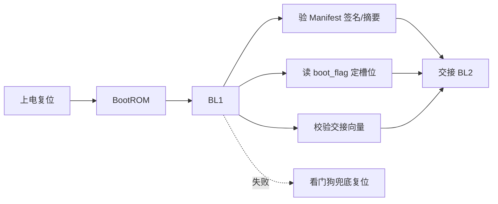
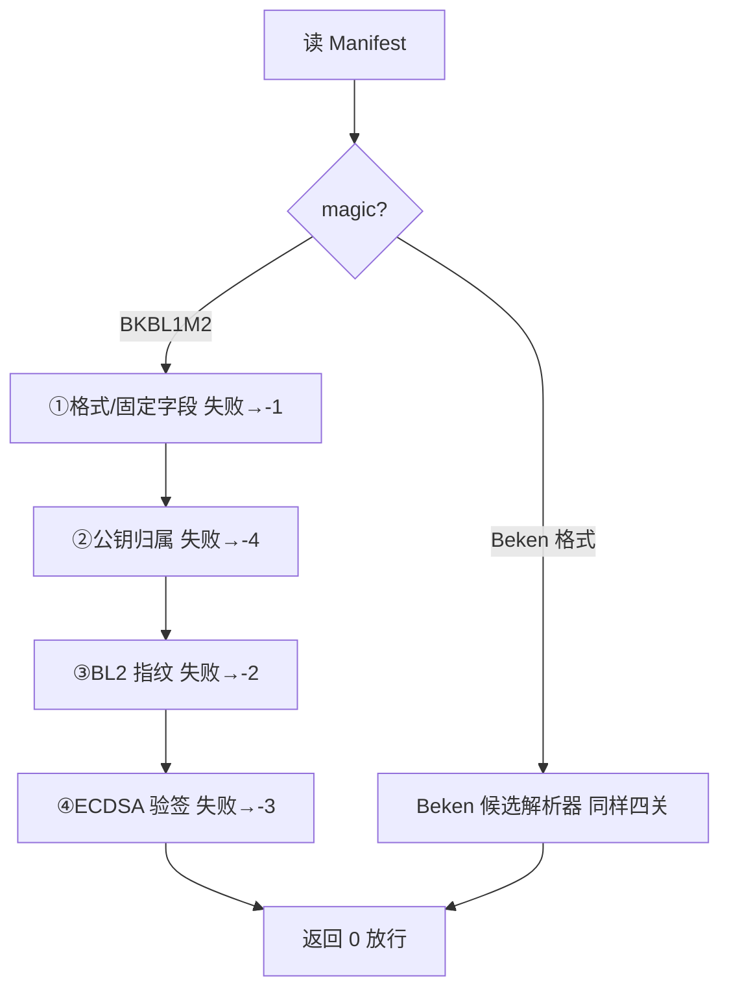
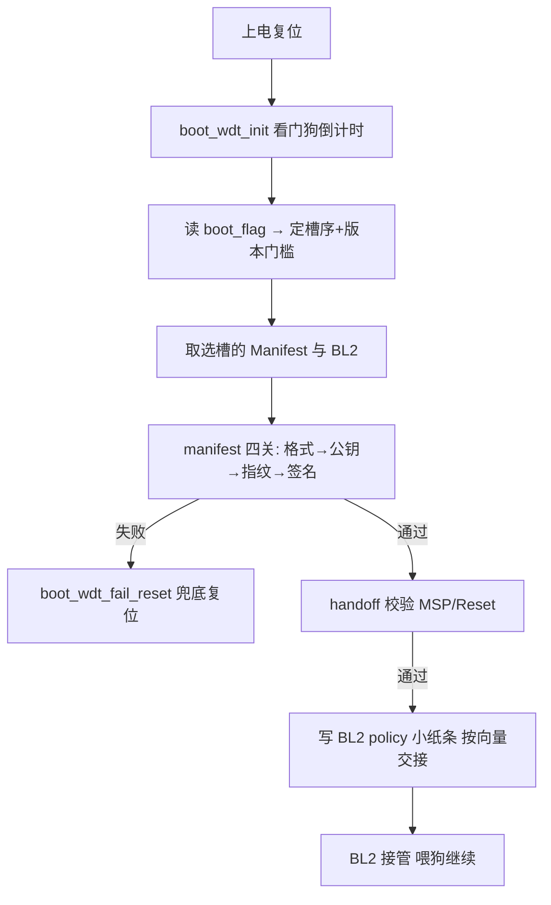

# bl1-安全与策略

## 本组导读

BK7258 上电后不是直接跑应用，而是走一条"安全接力棒"链路：**BootROM → BL1 → BL2 → AP/CP**。本组代码就是 **BL1 阶段的"保安"**，回答三个生死攸关的问题：

1. **"你是谁？"** —— 校验闪存里待启动的 BL2 镜像是否被官方私钥签名过（Manifest 校验）；
2. **"从哪启动？"** —— 决定用主槽还是备用槽的镜像（boot flag 与策略）；
3. **"交给谁？"** —— 检查交接契约（向量表 MSP/Reset 地址）后才把控制权递给 BL2（handoff）。

打个比方：BL1 像机场安检，BootROM 是登机口闸机，BL2 是持票乘客。本组代码就是安检员手里的"验票终端 + 黑名单 + 交接单"，外加一只防呆的"保命闹钟"（看门狗）。



涉及文件（仓库前缀统一用 `$CONTEST/`）：

- `boot_bl2_contract.h` —— BL1/BL2 尺寸契约　|　`boot_sha256.c/.h` —— 自写 SHA-256 摘要算法　|　`boot_bl1_manifest_key.c` —— 固件内固化的公钥材料
- `boot_bl1_manifest.c/.h` —— **核心校验器**（格式/公钥/指纹/签名四关）　|　`boot_bl1_boot_flag_core.c/.h` —— boot flag 记录解码
- `boot_bl1_policy.c/.h` —— 槽序与版本策略　|　`boot_bl1_handoff_core.c/.h` —— 交接向量校验　|　`boot_wdt.h` —— 看门狗兜底复位

---

## 文件：boot_bl2_contract.h

**它干什么**：BL1 与 BL2 的"合同"——把分区容量、槽位地址、镜像大小、Manifest 位置用宏固定，并用编译期断言强制双方不许擅自改。

> 💡 【背景知识】BL1 要从 Flash 搬镜像到内存执行，就必须知道它多大、放哪、往哪搬。如果这些数字各写各的、版本一换就漂移，双方就"对不上暗号"。`contract`（契约）意思是：**这些数字是双方共同承诺的**。

【核心结构】
- `struct bk7258_bl2_boot_policy_s` —— 写在固定 SRAM 地址的"交接小纸条"：`magic`（防认错）、`preferred_slot`（首选槽）、`fallback_slot`（备选槽）、`check`（校验和）。
- `LOGICAL_CAPACITY`（128 KiB）与 `PHYSICAL_CAPACITY`（136 KiB）—— 逻辑容量 vs 物理容量，后者多出的 8 KiB 是 CRC 尾巴。
- `BK7258_BL2_PRIMARY_XIP` / `SECONDARY_XIP` —— 主/备用槽在 Flash 里可被 CPU **XIP**（原地执行，直接从 Flash 取指，不用先拷进内存）的地址。
- `#error` 编译期断言 —— 分区表一改导致容量不对，**编译直接报错**，而不是运行到一半才崩。

【关键代码逐段讲解】

```c
static inline uint32_t bk7258_bl2_boot_policy_check(...)
{
  return BK7258_BL2_BOOT_POLICY_CHECK_SEED ^ policy->magic ^
         policy->version ^ ... ^ policy->generation_high;
}
```
（来自 boot_bl2_contract.h，约 48-55 行）把"小纸条"除校验位外的所有字段**异或（^）成一个校验值**。BL2 收到后重新异或一遍，结果不等于 `check` 就说明纸条被破坏或篡改。异或很廉价，只防意外损坏，真正的安全由签名负责。

```c
#if BK7258_BL2_LOGICAL_CAPACITY != 0x00020000u
#  error "BK7258 BL2 partition must reserve 128 KiB logical capacity"
#endif
```
（来自 boot_bl2_contract.h，约 90-92 行）**编译期哨兵**：谁改了分区表让 BL2 容量不再是 128 KiB，编译器直接拒绝出固件——契约被破坏在开发期就暴露。

---

## 文件：boot_sha256.h / boot_sha256.c

**它干什么**：用纯 C 实现 SHA-256 哈希算法，提供 `init / update / final` 三段式接口，供 BL1 计算 BL2 镜像、公钥、Manifest 的"指纹"。

> 💡 【背景知识】SHA-256 是"单向指纹机"：给一段数据吐出一个固定 32 字节指纹，数据改动任一 bit 指纹就面目全非，且由指纹反推不出原数据。BL1 用它验"内容没被改过"。为什么自己写不用 SDK 库？因为 BL1 处于最早期，运行环境极简陋（freestanding：无 libc、无 .bss/.data），SDK 加密库可能还没就绪或太大。

【核心结构】
- `struct boot_sha256_context_s` —— 计算状态：`state[8]`（中间结果）、`total`（累计字节数）、`block[64]`（缓冲）、`used`（缓冲已塞多少）。
- `boot_sha256_init / update / final` —— 初始化 → 分段喂数据 → 出结果（标准的 init/update/final 三段式）。

【关键代码逐段讲解】

```c
void boot_sha256_init(void *opaque)
{ context->state[0] = 0x6a09e667u; context->state[1] = 0xbb67ae85u; ... context->total = 0; context->used = 0; }

void boot_sha256_final(void *opaque, uint8_t digest[32])
{
  context->block[context->used++] = 0x80u;          /* 补结束标志 */
  if (context->used > 56u) { ...补0到满块; 搅拌一轮; }
  while (context->used < 56u) { context->block[context->used++] = 0; }
  for (index = 0; index < 8; index++) { context->block[63u - index] = (uint8_t)(bits >> (index * 8u)); }
  sha256_transform(context, context->block);         /* 最后一轮 */
  ...
}
```
（来自 boot_sha256.c，约 114-128、157-193 行）

大白话：init 先装入**一组全世界固定的魔数**（由前 8 个质数平方根小数部分算出），任何人算同一段数据都必须从它出发，结果才一致。final 则是"封口"：末尾补 `0x80` 字节，再补 0 直到离满块还差 8 字节，最后把**总长度（bit 数）**写进去——塞长度可防止"数据 A+填充"与"数据 B"算出同一指纹，理解成快递装箱贴"总重量"标签，收货少一块都对不上。`sha256_transform`（约 45-112 行）是 64 轮核心运算：展开调度表后用循环右移、异或、与/或反复搅拌 8 个状态字——标准算法细节，零基础知道它是"搅拌机"即可。

---

## 文件：boot_bl1_manifest_key.c

**它干什么**：把 BL1 验签用的**公钥**（及公钥的 SHA-256 哈希）以常量数组烧进固件。文件里只有公开材料，**私钥永远不会进固件**。

> 💡 【背景知识】Manifest 用"私钥"签名、用"公钥"验签。把公钥烧进 BL1 就像给安检员发**防伪验钞灯**——伪造签名必须有私钥，而私钥只存在于签名方手里，绝不下发到设备。

【核心结构】
- `bk7258_bl1_manifest_root_public_key[64]` —— P-256 椭圆曲线公钥（X、Y 坐标各 32 字节）。
- `bk7258_bl1_manifest_root_public_key_hash[32]` —— 该公钥的 SHA-256 指纹，信任锚点。
- `bk7258_beken_manifest_root_public_key_hash[32]` —— Beken 官方工具格式所用另一把公钥的指纹。

【关键代码逐段讲解】

```c
/* This file contains public material only; the private key is never
 * linked into the firmware or copied into the image package. */
const uint8_t bk7258_bl1_manifest_root_public_key[64] = { 0x4d, 0xdb, ... };
```
（来自 boot_bl1_manifest_key.c，约 1-16 行）

大白话：就是一张写死的 64 字节查表。关键在文件头注释承诺的**安全边界：私钥不在固件里、不在镜像包里**。`boot_bl1_manifest.c` 通过 `extern` 引用这里的哈希（约 24-25 行），把"清单里的公钥指纹"与"固件固化的指纹"比对，完成信任锚定。

---

## 文件：boot_bl1_manifest.h

**它干什么**：定义 Manifest（清单）的"账本格式"——每一字节什么含义、算法用什么编号、各字段偏移量，并声明对外接口。

> 💡 【背景知识】**Manifest（清单）**是贴在 BL2 镜像旁的"说明书+防伪签"：记录 BL2 多大、加载到哪、指纹多少、用哪把公钥、签名在哪。BL1 照单逐项核对，全对才放行。本头文件定义两种格式：自研 `BKBL1M2` 与兼容 Beken 官方工具的 `Beken Manifest`。

【核心结构】
- 主记录 `BKBL1M2` 布局：magic `"BKBL1M2\0"`（0x00）、格式/签名算法/摘要算法/密钥 ID/版本/flags（0x08–0x1c）、BL2 XIP 地址/大小/加载地址（0x20–0x2c）、SHA-256(BL2)（0x30）、SHA-256(公钥)（0x50）、公钥 X||Y（0x70）、ECDSA-P256 签名（0xb0），末尾 0xf0–0xff 应为擦除态 0xFF。
- 关键宏：`SIGNED_SIZE=0xb0`（被签名保护的长度）、各 `*_OFFSET`、`PRIMARY_XIP_ADDRESS`（boot 分区末尾往前 256 字节）。
- **OTP 宏**：`BK7258_DUBHE_OTP_SHADOW_BASE` 等，含 LCS 与安全计数器偏移。BL1 **只读** OTP，绝不写。

> 💡 【背景知识】**OTP（One-Time Programmable）**是芯片上一块只能写一次、永不丢失的存储，类似"出厂刻字"。安全启动把权威公钥指纹、版本计数器烧在 OTP 里，BL1 启动时读它对照——就算 Flash 被整个替换也绕不过 OTP 的"权威底稿"。**LCS（Life Cycle State）**是芯片"档位"（如 CM=配置/开发态、量产态）。

【关键代码逐段讲解】

```c
#define BK7258_BL1_MANIFEST_SIZE             256u
#define BK7258_BL1_MANIFEST_SIGNATURE_ALG    1u /* ECDSA-P256 */
#define BK7258_BL1_MANIFEST_DIGEST_ALG       1u /* SHA-256 */
#define BK7258_BL1_MANIFEST_PRIMARY_XIP_ADDRESS \
  (BK7258_ROLE_BOOT_XIP_END - BK7258_BL1_MANIFEST_SIZE)

#define BK7258_DUBHE_OTP_SHADOW_BASE                 0x4b111000u
#define BK7258_DUBHE_OTP_SECURE_BOOT_PK_HASH_OFFSET  0x28u
#define BK7258_DUBHE_OTP_LCS_OFFSET                  0x68u
#define BK7258_DUBHE_OTP_BL1_SECURITY_COUNTER_OFFSET 0x88u
```
（来自 boot_bl1_manifest.h，约 13-27、69-74 行）

大白话：清单固定 256 字节，紧贴 boot 分区**末尾**，每个槽的镜像都在尾部自带"防伪签"且不改分区几何。算法编号 1 代表 ECDSA-P256 / SHA-256——这是"暗号表"，升级换算法只需换编号。OTP 宏则是"权威底稿"的位置：OTP 里存着安全启动公钥哈希（0x28）、生命周期状态（0x68）、版本计数器（0x88）。头注释强调：**只读，绝不触发 OTP 写入**——写 OTP 不可逆，写错芯片就废了。

---

## 文件：boot_bl1_manifest.c（本组核心，重点读）

**它干什么**：BL1 的"验票终端"——拿到 256 字节 Manifest 后，按"格式 → 公钥归属 → BL2 指纹 → ECDSA 验签"四关逐层校验，返回 0（通过）或负数（哪一步失败），并内置兼容 Beken 官方工具格式的候选解析器。

> 💡 【背景知识】为什么逐层校验不一步到位？每层防不同攻击：**格式检查**防瞎改；**公钥哈希比对**防"狸猫换太子"（黑客换成自己私钥签的假货并塞进自己的公钥——只验签名不验公钥归属就拦不住）；**BL2 指纹比对**防内容被偷换；**ECDSA 验签**防伪造签名。

【核心结构】
- `get_le32()`（30-34 行）小端序读 4 字节；`bytes_equal()`（36-47 行）**常数时间**比较防计时侧信道；`bytes_are_ff()`（49-62 行）检查是否全 0xFF（擦除态）。
- `bk7258_bl1_manifest_version_floor_readonly()`（68-79 行）读 OTP 版本下限（只读）；`bk7258_bl1_root_hash_matches()`（87-128 行）决定用软件公钥还是 OTP 公钥作信任根。
- `bk7258_bl1_manifest_verify_at()`（130-203 行）—— **验签主入口**；`bk7258_beken_manifest_verify_*()`（224-323 行）—— Beken 官方格式候选解析器。

【关键代码逐段讲解】

```c
static int bytes_equal(const uint8_t *left, const uint8_t *right, size_t size)
{
  uint8_t different = 0;
  for (index = 0; index < size; index++)
    { different |= left[index] ^ right[index]; }   /* 全程不提前退出 */
  return different == 0;
}
```
（来自 boot_bl1_manifest.c，约 36-47 行）

大白话：比较两个缓冲区但**全程不提前退出**——即使第 1 字节就不同也比完整个数组。这叫"常数时间比较"：若提前 return，攻击者可借**计时**猜出"前几个字节是对的"，从而逐字节爆破出哈希。把耗时做恒定就堵死了这条路。

```c
int bk7258_bl1_manifest_verify_at(uint32_t manifest_xip, uint32_t bl2_xip,
                                  size_t bl2_size, uint32_t bl2_load)
{
  if (get_le32(manifest) == BK7258_BEKEN_MANIFEST_MAGIC)
    { return bk7258_beken_manifest_verify_at(...); }

  if (!bytes_equal(manifest, magic, sizeof(magic)) ||
      get_le32(manifest + 8u) != BK7258_BL1_MANIFEST_FORMAT || ... ||
      !bk7258_bl1_manifest_version_allowed(get_le32(manifest + 24u),
              bk7258_bl1_manifest_version_floor_readonly()) ||
      get_le32(manifest + 32u) != bl2_xip ||
      get_le32(manifest + 36u) != bl2_size ||
      get_le32(manifest + 40u) != bl2_load || ...
      !bytes_are_ff(manifest + BK7258_BL1_MANIFEST_RESERVED_OFFSET, ...))
    { return -1; }
}
```
（来自 boot_bl1_manifest.c，约 130-170 行）

大白话：**第一关——格式与固定字段核对**。先看开头 8 字节是不是 `"BKBL1M2\0"` 魔数（不是则尝试 Beken 格式）；再逐一核对格式号、算法号、密钥 ID；检查版本是否达到 OTP 计数器下限；**清单登记的 BL2 地址/大小/加载地址必须与实际启动参数完全一致**（防"清单说东、实际跑西"）；最后确认保留区还是全 0xFF。任一项不对返回 -1。

```c
  boot_sha256_update(&sha256, public_key, 64u);
  boot_sha256_final(&sha256, public_key_digest);
  if (!bytes_equal(public_key_digest,
                   manifest + BK7258_BL1_MANIFEST_KEY_HASH_OFFSET, ...) ||
      !bytes_equal(public_key_digest,
                   bk7258_bl1_manifest_root_public_key_hash, ...))
    { return -4; /* Manifest key is not anchored to the software root. */ }
```
（来自 boot_bl1_manifest.c，约 172-183 行）

大白话：**第二关——公钥归属校验**。把清单里携带的公钥算一次 SHA-256，再比两处：(a) 算出的指纹 == 清单里写的"公钥哈希"（证明清单自洽）；(b) 算出的指纹 == 固件里编译死的 `root_public_key_hash`（证明这把公钥就是官方那把）。两步都过才敢用它验签。这就是**信任锚定**：只信写死在代码/OTP 里的根，不信任何从 Flash 读来的东西。

```c
  boot_sha256_update(&sha256, (const uint8_t *)(uintptr_t)bl2_xip, bl2_size);
  boot_sha256_final(&sha256, bl2_digest);
  if (!bytes_equal(bl2_digest, manifest + BK7258_BL1_MANIFEST_DIGEST_OFFSET, ...))
    { return -2; /* The authorized BL2 digest did not match XIP. */ }
```
（来自 boot_bl1_manifest.c，约 185-193 行）

大白话：**第三关——BL2 镜像指纹比对**。把 Flash 里实际待启动的 BL2 整个算一遍 SHA-256，与清单登记的指纹比对。镜像被改任一字节（篡改或 Flash 位翻转）指纹就对不上，返回 -2。注意先比指纹后验签——**先确认内容没被换，再确认签名是真签**。

```c
  boot_sha256_update(&sha256, manifest, BK7258_BL1_MANIFEST_SIGNED_SIZE);
  boot_sha256_final(&sha256, manifest_digest);
  return uECC_verify(public_key, manifest_digest, sizeof(manifest_digest),
                     manifest + BK7258_BL1_MANIFEST_SIGNATURE_OFFSET, uECC_secp256r1()) == 1 ? 0 : -3;
}
```
（来自 boot_bl1_manifest.c，约 195-202 行）

大白话：**最后一关——ECDSA-P256 验签**。把清单被签名保护的部分（0x00–0xaf）算 SHA-256，再用验证过归属的公钥验清单末尾 64 字节签名。`uECC_verify` 返回 1 说明签名合法，0 说明伪造，返回 -3。**四关全过才返回 0**，BL1 才敢交接。**ECDSA（椭圆曲线数字签名算法）**是数字签名技术，P-256 指 secp256r1 曲线，签名 r||s 共 64 字节。

Beken 官方格式候选解析器（224-323 行）结构完全平行，只是字段布局不同（magic 为 `0xa1bc2fd8u`、单镜像描述），同样走"格式 → 公钥哈希 → 镜像指纹 → 验签"四关。头注释明确这是**兼容性实验**：只证明 BL1 能消费这种候选格式，不承诺 BK7258 BootROM 也接受。



---

## 文件：boot_bl1_boot_flag_core.h / .c

**它干什么**：一个"纯解码器"——只把一段 0x28 字节的 boot_flag 记录拆成结构体并逐字段验证，**不碰 Flash、不碰 OTP**（地址由调用方给定）。

> 💡 【背景知识】**boot_flag（启动标志）**是 BL1 留给 BL2 的"路牌"：这次该从主槽还是备用槽启动？字段还记录安全启动开关、是否禁用 JTAG 等。它是 Beken 公开协议，本文件按官方格式逐字节对齐，甚至用 `_Static_assert` 保证结构体大小恰好 0x28 字节。

【核心结构】
- `struct bk7258_bl1_boot_flag_s` —— 解码结果：`magic`、`boot_flag`（主/备）、两槽 Manifest 地址、`pll_ena`、`security_boot_supported/ena`、`security_boot_print_dis`、`jtag_dis`、`sw_fih_delay_ena`。
- `struct bk7258_bl1_boot_flag_layout_s` —— 调用方提供的"已验证过的合法地址"。
- `bk7258_bl1_boot_flag_parse()` —— 一站式"解析+校验"，失败即清零输出（fail-closed：失败即锁死，绝不把半解析结果往外传）。

【关键代码逐段讲解】

```c
int bk7258_bl1_boot_flag_validate(...)
{
  if (... || control->magic != BK7258_BL1_BOOT_FLAG_MAGIC ||
      (control->boot_flag != PRIMARY && control->boot_flag != SECONDARY) ||
      ... || (control->security_boot_ena != 0u &&
              control->security_boot_supported == 0u))
    { return 0; }
  return 1;
}

enum ... bk7258_bl1_boot_flag_parse(const uint8_t *record, size_t size, ...)
{
  control_clear(control);
  if (record == NULL || size == 0u) return PARSE_ABSENT;
  if (size != RECORD_SIZE) return PARSE_INVALID;
  if (bytes_are_ff(record, RECORD_SIZE)) return PARSE_ERASED;
  if (decode(...) < 0 || !validate(&decoded, layout)) return PARSE_INVALID;
  *control = decoded;
  return PARSE_VALID;
}
```
（来自 boot_bl1_boot_flag_core.c，约 67-134 行）

大白话：上面是"校验"，下面是"解析+校验"。校验最妙的一条是：**"使能位=1 但支持位=0"非法**——像"我不支持安全启动，但请开启它"的矛盾订单，直接判假。所有布尔字段必须是 0 或 1，地址必须非零、4 字节对齐，magic 必须对上，任一字段不规矩整条作废。解析则把四种情况分开报：ABSENT（读不到）/ ERASED（全 0xFF，分区没烧写）/ INVALID（结构坏）/ VALID（有效）。为什么要区分？"分区没烧写"和"记录被写坏"应对策略完全不同：前者走默认主槽即可，后者必须视为可疑。开头先清零输出，除非走到 VALID 才填数据——**失败即锁死**，防策略层误用垃圾字段。

---

## 文件：boot_bl1_policy.h / .c

**它干什么**：BL1 的"决策层"——根据 boot_flag 决定启动槽位顺序（主槽优先还是备用槽优先），并统一管理"镜像版本下限"策略。

> 💡 【背景知识】设备有 A/B 双系统（两槽各一份，升级失败换槽回滚）。策略层回答：**这次从哪开始试？**（看 boot_flag）和**最低接受哪个版本？**（防"降级攻击"——黑客拿旧版有漏洞的固件冒充新版）。

【核心结构】
- `enum bk7258_bl1_slot_e` —— 主槽=0、备用槽=1；`enum bk7258_bl1_boot_flag_status_e` —— ABSENT / ERASED / INVALID / VALID_PRIMARY / VALID_SECONDARY。
- `bk7258_bl1_boot_flag_slot_order()` —— 输出 `order[2]`（先试谁、后试谁）；`bk7258_bl1_security_counter_decode()` —— 把 OTP 位图计数器解码成版本号；`bk7258_bl1_manifest_version_allowed()` —— 判断清单版本是否达标。

【关键代码逐段讲解】

```c
enum ... bk7258_bl1_boot_flag_slot_order(const uint8_t *record, size_t size, ...,
                                         uint8_t order[2])
{
  order[0] = PRIMARY; order[1] = SECONDARY;   /* 默认主槽优先 */
  parse_status = bk7258_bl1_boot_flag_parse(record, size, layout, &control);
  if (parse_status == ABSENT) return BOOT_FLAG_ABSENT;
  if (parse_status == ERASED) return BOOT_FLAG_ERASED;
  ...
  if (control.boot_flag == SECONDARY)
    { order[0] = SECONDARY; order[1] = PRIMARY; return VALID_SECONDARY; }
  return VALID_PRIMARY;
}

__attribute__((weak))
uint32_t bk7258_bl1_manifest_version_floor_readonly(void) { return 0u; }

uint32_t bk7258_bl1_security_counter_decode(uint32_t bitmap)
{
  uint32_t version = 0u;
  while ((bitmap & 1u) != 0u) { version++; bitmap >>= 1; }
  return version;
}
```
（来自 boot_bl1_policy.c，约 5-63 行）

大白话：`slot_order` 默认"主槽优先、备用槽兜底"，若 boot_flag 明确写上次走备用槽（通常是升级后要切新版本），就把备用槽提到第一位；返回值告诉调用方要不要走恢复流程。`weak` 是**弱符号 + 覆盖**的经典配合：这里先给默认实现（无 OTP 时版本下限 0），板级后端用强符号覆盖成"读 OTP 影子寄存器"的真实版本，策略层因此可移植。`security_counter_decode` 把 OTP 的"一元计数器"译成版本号：从 bit0 数有多少个连续 1 就有多少版本。OTP 只能从 0 变 1 且不可逆，该计数器天然"只增不减"——**这就是防降级的基础**。

最后一个函数 `bk7258_bl1_manifest_version_allowed(manifest_version, readonly_floor)`（约 71-76 行）算最终门槛：版本下限取"OTP 计数器"和"编译期最低版本 `MIN_IMAGE_VERSION`"的较大值——OTP 是权威，但即使 OTP 没烧过（读 0）也不能让版本 0 启动，至少 ≥1。清单版本低于门槛就是"过期镜像"，拒绝启动，防止降级回有漏洞的旧版。

---

## 文件：boot_bl1_handoff_core.h / .c

**它干什么**：校验 BL1 交接给 BL2 时用的"向量表"——初始栈指针（MSP）和复位入口地址（Reset）是否落在允许范围内。

> 💡 【背景知识】**向量表（vector table）**是 Cortex-M CPU 启动必读的第一张表：地址 0 处是初始栈指针 **MSP（Main Stack Pointer，主栈指针）**，地址 4 处是复位入口，CPU 复位后据此跳转。若攻击者篡改这两个地址（把 Reset 指向恶意代码）就能劫持启动。另注意 ARM"斧头约定"：Reset 地址最低 bit 必须是 1（表示 Thumb 指令集）。

【核心结构】
- `struct bk7258_bl1_vector_s` —— `msp`、`reset` 两个字段；`struct bk7258_bl1_handoff_window_s` —— `stack_start/end`（栈指针允许区间）、`execute_start/end`（Reset 目标允许区间）。
- `bk7258_bl1_handoff_vector_valid()` —— 唯一对外函数，纯计算、无 MMIO、无跳转。

【关键代码逐段讲解】

```c
int bk7258_bl1_handoff_vector_valid(...)
{
  if (... || authorized->msp != loaded->msp ||
      authorized->reset != loaded->reset ||
      (loaded->msp & 3u) != 0u || loaded->msp < window->stack_start ||
      loaded->msp > window->stack_end || (loaded->reset & 1u) == 0u)
    { return 0; }
  reset_address = loaded->reset & ~1u;
  return reset_address >= window->execute_start &&
         reset_address < window->execute_end;
}
```
（来自 boot_bl1_handoff_core.c，约 5-29 行）

大白话：一条接一条的"体检清单"：待装向量必须和授权值一致（防偷换）；MSP 必须 4 字节对齐（ARM 栈规范）且落在栈窗口内（防栈指到不允许的内存）；Reset 最低位必须是 1（Thumb 标志）；去掉 Thumb 位后的真正跳转地址必须落在可执行窗口内（防跳到攻击者可控区域）。全过才返回 1。这个"窗口"就是已证明的 BK7258 SRAM 执行区域——**最后一道地理围栏**。

---

## 文件：boot_wdt.h

**它干什么**：BL1 的"保命闹钟"——上电启动两个看门狗（APB_WDT 和 AON_WDT），流程按节拍"喂狗"，一旦卡死超过约 8 秒就强制复位芯片。

> 💡 【背景知识】**看门狗（WDT，Watchdog Timer）**像会倒计时的闹钟：启动后倒数，程序必须定期"喂狗"（重新上发条）；程序跑飞或死循环没喂狗，倒数归零，硬件强制重启。为什么必须？BL1 是最底层代码，一旦挂死**没有更高级的软件能救它**，只能靠硬件兜底。本文件是 freestanding（无 libc、无全局变量）头文件，函数全是 `static inline`，直接操作寄存器。

【核心结构】
- 寄存器宏：`WDT_APB_CTRL`、`WDT_AON_CTRL`、`SYS_CTRL_REG`（时钟/复位配置）；钥匙协议 `WDT_KEY1=0x5A`、`WDT_KEY2=0xA5` —— 连续两次写 ctrl（先解锁再生效），防误触发。
- 超时周期：`WDT_PERIOD=8000`（约 8 秒，覆盖冷启动）、`BL2_WDT_PERIOD=60000`、`FAIL_RESET_WDT_PERIOD=6`（失败兜底用极短周期）。
- `boot_wdt_init()`（初始化并武装）、`boot_wdt_feed_period()/feed()`（喂狗）、`boot_wdt_fail_reset()`（短周期自爆式复位）。

【关键代码逐段讲解】

```c
static inline void boot_wdt_init(void)
{
  v = REG32(SYS_CTRL_REG);
  v = (v & ~WDT_SYSCTRL_MASK) | WDT_SYSCTRL_VAL;   /* 配时钟源+复位使能 */
  REG32(SYS_CTRL_REG) = v;
  ctrl1 = (uint32_t)(WDT_KEY1 << 16) | (WDT_PERIOD & 0xFFFFu);
  ctrl2 = (uint32_t)(WDT_KEY2 << 16) | (WDT_PERIOD & 0xFFFFu);
  REG32(WDT_APB_CTRL) = ctrl1;   /* 1st write: unlock */
  REG32(WDT_APB_CTRL) = ctrl2;   /* 2nd write: apply/arm */
  REG32(WDT_AON_CTRL) = ctrl1;   REG32(WDT_AON_CTRL) = ctrl2;
}
```
（来自 boot_wdt.h，约 81-103 行）

大白话：先配 SYS_CTRL 选好时钟源和复位使能（对照官方 BootROM 逆向出的 `bic #0x3F, orr #0x26` 序列），再对两个看门狗各写两次：第一次写 `0x5A<<16|period` 是"输入解锁码"，第二次写 `0xA5<<16|period` 是"确认并武装"。**为什么两步？** 防止程序跑飞时误写一个寄存器就把看门狗关掉。初始化后闹钟开始倒数，主流程必须 8 秒内开始反复喂狗。

```c
static inline __attribute__((noreturn)) void boot_wdt_fail_reset(void)
{
  __asm volatile ("cpsid i" ::: "memory");   /* 关中断，谁也拦不住复位 */
  REG32(SYS_WDT_RESET_STATUS) &= ~0x3u;
  ctrl1 = (uint32_t)(WDT_KEY1 << 16) | FAIL_RESET_WDT_PERIOD;
  ctrl2 = (uint32_t)(WDT_KEY2 << 16) | FAIL_RESET_WDT_PERIOD;
  REG32(WDT_APB_CTRL) = ctrl1;  REG32(WDT_APB_CTRL) = ctrl2;
  REG32(WDT_AON_CTRL) = ctrl1;  REG32(WDT_AON_CTRL) = ctrl2;
  for (;;) { __asm volatile ("nop"); }   /* 不喂狗，等硬件复位 */
}
```
（来自 boot_wdt.h，约 148-169 行）

大白话：失败时的"自杀式复位"：先关中断（`cpsid i`）——此后任何中断都拦不住这次复位；清旧复位状态；把两个看门狗武装成 **6 tick 超短周期**；进入无限空循环**不再喂狗**，6 tick 眨眼归零，硬件强制复位。注释强调：装了短周期后**绝不能喂狗**，否则会永远卡在引导错误循环里出不来。这是"fail closed"的硬件化：宁可重启，不可带病运行。

---

## 关键流程串联：一次完整的 BL1 安全启动



一句话总结：**本组代码是 BL1 的安全大脑**——SHA-256 验内容、ECDSA-P256 验身份、boot_flag 与 OTP 计数器定策略防降级、handoff 保交接、看门狗兜底防卡死，五道防线全过，才敢把芯片控制权递给 BL2。

---

## 相关学习文档

- [./10-Bootloader总览与启动链.md](../10-Bootloader总览与启动链.md) —— BL1/BL2/AP/CP 完整接力链路
- [./12-BL2-交接契约与槽位布局.md](../12-BL2-MCUboot深度解析.md) —— `boot_bl2_contract.h` 的配套讲解
- [./22-驱动适配范式.md](../22-驱动适配范式.md) —— MMIO 直操作寄存器、freestanding 头文件写法
- [./30-安全启动与证书体系.md](../14-安全启动与签名.md) —— OTP、LCS、根密钥与信任链更深背景

## 源码路径

- `$CONTEST/board/bk7258/bootloader/boot_bl1_manifest.c` / `.h`
- `$CONTEST/board/bk7258/bootloader/boot_bl1_manifest_key.c`
- `$CONTEST/board/bk7258/bootloader/boot_bl1_policy.c` / `.h`
- `$CONTEST/board/bk7258/bootloader/boot_bl1_boot_flag_core.c` / `.h`
- `$CONTEST/board/bk7258/bootloader/boot_bl1_handoff_core.c` / `.h`
- `$CONTEST/board/bk7258/bootloader/boot_bl2_contract.h`
- `$CONTEST/board/bk7258/bootloader/boot_sha256.c` / `.h`
- `$CONTEST/board/bk7258/bootloader/boot_wdt.h`
