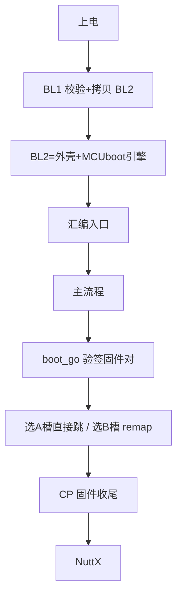
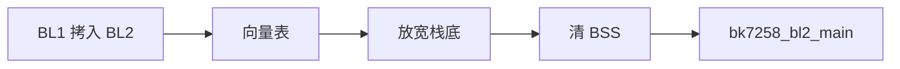
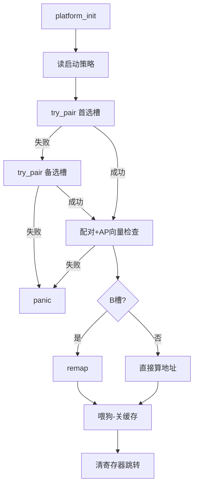
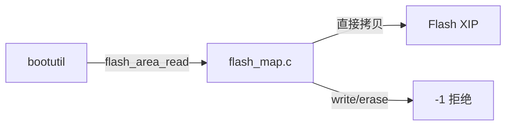
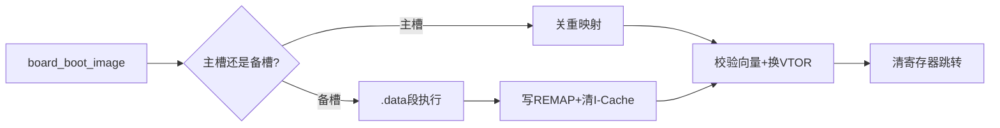
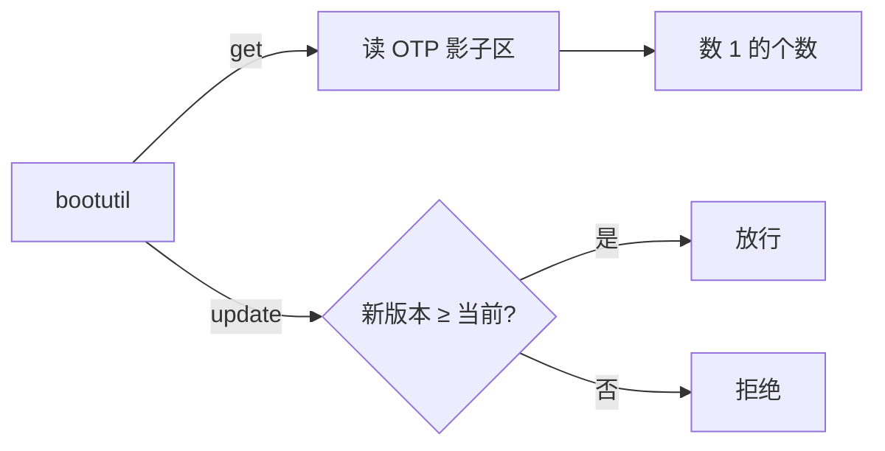
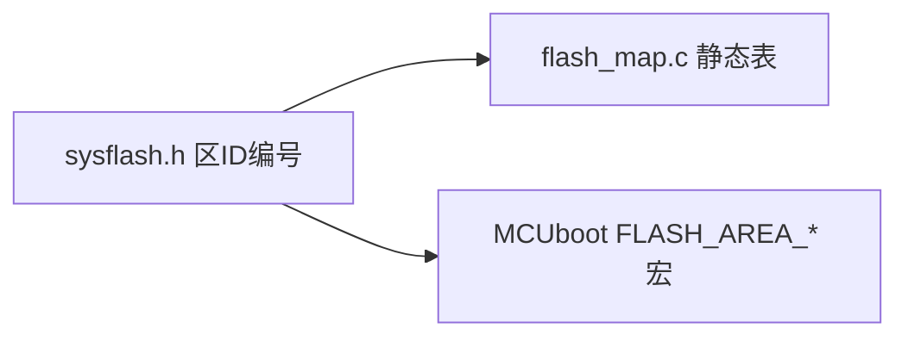
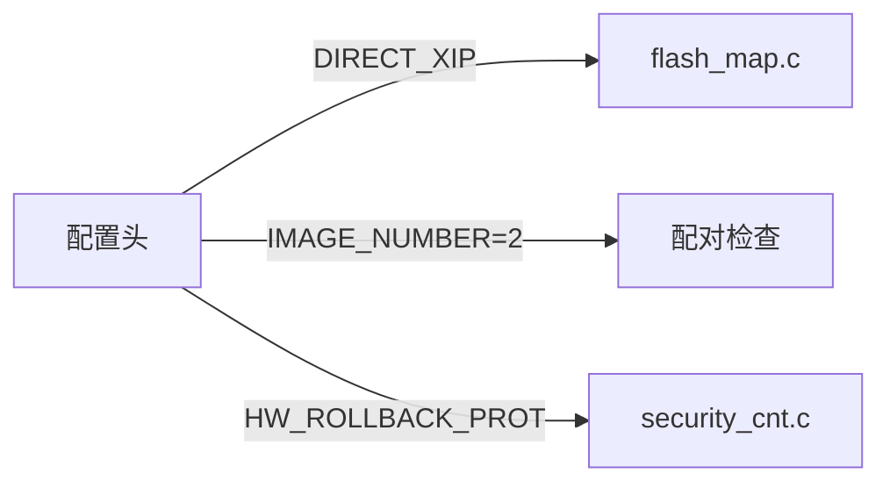

# bl2-mcuboot外壳

## 本组导读

**这一组代码是整个系统"第二个把关者"（BL2）的全部家当。** 回顾启动链：芯片上电 → 芯片自带 ROM 里的 **BL1** 先跑起来（校验 BL2、把 BL2 从 Flash 拷贝到 SRAM）→ 跳进 **BL2** → BL2 用开源 MCUboot 的代码验签真正的固件 → 最后把控制权交给系统（CP/AP 双核固件对）。

用生活打比方：BL1 是小区门口的**保安**（只查"你是不是熟人"），BL2 是**安检机**（验签名、查版本、防回滚），过了安检才能上电梯（进 NuttX）。本组代码就是安检机的**板级外壳**：**验签/防回滚算法来自上游 MCUboot 的 bootutil 库，本组代码负责让它在 BK7258 上跑起来**——包括汇编入口、Flash 布局映射、看门狗喂食、双核固件"配对"检查、以及最后干净地把 CPU 交接给目标固件。



> 术语预习：**向量表**——芯片复位后读的第一块数据，第 0 项是栈顶指针 MSP，第 1 项是复位入口地址；**MSP**——主栈指针，程序用哪个栈靠它决定；**XIP**——直接在 Flash 上执行代码，不用拷进内存；**看门狗**——必须定期"喂"的倒计时器，忘了喂就强制复位芯片；**CP/AP**——BK7258 双核架构的两个核，CP 负责引导/安全，AP 跑 NuttX，两者固件必须成对烧录。

---

## 文件：bl2_start.S

**它干什么：** BL2 被 BL1 拷进 SRAM 后的第一句代码。负责把 CPU 栈底放宽、把未初始化内存清零，然后跳进 C 语言主函数。

> 💡 【背景知识】BL1 跳过来时 CPU 处于"受惊"状态：栈底被压得很紧（公共交接限制 0x2802f800，只给 BL2 留 2 KiB 栈）。MCUboot 验签要算哈希、验椭圆曲线，需要不小的栈。所以第一件事就是**把栈底放宽到自己专属的 SRAM 区间**——像安检机开机后先把传送带加长，不然大行李箱送不进去。

【核心结构】

| 符号 | 人话 |
|---|---|
| `_vectors` | BL2 向量表：栈顶 0x28040000，复位入口，其余 62 项全是 `panic` |
| `bk7258_bl2_reset` | 复位入口，等价于 C 程序 `main` 之前的"开机初始化" |
| `msr msplim, r0` | 把栈底（MSPLIM，ARMv8-M 的栈限制寄存器）设成 0x28020000 |

**向量表（第 7-15 行）。** BL2 只有 64 个向量，栈顶取 128 KiB 窗口顶部（`.word 0x28040000`），复位入口是 `bk7258_bl2_reset + 1`（+1 表示 Thumb 压缩指令集），其余 62 项全是 `bk7258_bl2_panic + 1`——BL2 是"短命程序"，不接受任何打扰，出岔子就喂狗复位。

**复位入口（第 20-45 行）。** 每个裸机程序的"例行公事"：**关中断 → 摆好栈 → 清全局变量 → 进 C**。`dsb`/`isb` 是内存屏障，确保刚写的寄存器立即生效：

```asm
bk7258_bl2_reset:
    cpsid i                      ; 关全局中断，初始化期间不许打断
    ldr r0, =0x28020000
    msr msplim, r0               ; 放宽栈底（BL1 给的太窄，验签不够用）
    dsb sy / isb sy              ; 同步屏障
    ldr r0, =__bss_start__
    ldr r1, =__bss_end__
    movs r2, #0
1:  cmp r0, r1                   ; 循环把 BSS 区（未初始化全局变量）全部写 0
    bcs 2f
    str r2, [r0], #4
    b 1b
2:  bl bk7258_bl2_main           ; 进入 C 世界
3:  b 3b                         ; main 若返回则死循环
```

【流程/关系图】



---

## 文件：bk7258_bl2_main.c

**它干什么：** BL2 的总指挥。读启动策略 → 叫 MCUboot 的 `boot_go()` 验签 → 检查 CP/AP 是否配对合法 → 必要时开 Flash 重映射 → 清场后跳进目标固件。

> 💡 【背景知识】MCUboot 是通用的开源引导器，只管"验一张镜像合不合法"，但 BK7258 的固件是 **CP+AP 一对镜像**，必须同版本、同安全计数才能启动，上游 MCUboot 不知道这回事。所以本文件像"翻译官"：把 `boot_go()` 调两次——一次只给看 A 槽、一次只给看 B 槽——再自己补一个"配对检查"，把双镜像变成一颗"原子弹"（要么整对通过，要么整对不要）。

【核心结构】

| 函数 | 人话 |
|---|---|
| `bk7258_bl2_platform_init()` | 开机例行清理：接管看门狗、设向量表、关 SysTick、清空所有中断 |
| `bk7258_bl2_try_pair(slot, rsp)` | 对某个槽位调一次 `boot_go()`，再做配对与向量合法性检查 |
| `bk7258_bl2_pair_generation_valid()` | 校验 CP/AP 是同一"代"：版本号一致 + 安全计数一致 |
| `bk7258_bl2_ap_vector()` | 校验 AP 镜像的向量表：栈指针、复位地址都必须在合法区间 |
| `bk7258_bl2_remap_secondary()` | 打开 Flash 重映射，让 B 槽固件在 A 槽地址上可见 |
| `bk7258_bl2_jump()` / `bk7258_bl2_enter()` | 最终交接：校验、清寄存器、换栈、跳进目标固件 |

【关键代码逐段讲解】

**1. 配对检查——把 CP/AP 当成"一个镜像"（第 269-284 行）。** 这是 BL2 最核心的板级逻辑：AP 头部必须合法、版本号与 CP 一致、安全计数一致。为什么这么做？**MCUboot 按"单镜像"验，固件却是双核成对烧录的**，只验 CP 不看 AP 会出现"新 CP 配旧 AP"的混乱，所以板级规则是：一对镜像是一代人，必须一起换、一起拒。

```c
static bool bk7258_bl2_pair_generation_valid(uint32_t cp_offset,
                                             const struct image_header *cp_hdr)
{
  const struct image_header *ap_hdr;
  int slot;

  ap_hdr = bk7258_bl2_ap_header(cp_offset);   // 由 CP 地址算出配对 AP 地址
  if (!bk7258_bl2_header_valid(ap_hdr, BK7258_ROLE_SLOT_A_AP_LOGICAL_SIZE) ||
      !bk7258_bl2_version_equal(&cp_hdr->ih_ver, &ap_hdr->ih_ver))
    {
      return false;
    }

  slot = cp_offset == BK7258_ROLE_SLOT_A_CP_XIP_START ? 0 : 1;
  return bk7258_bl2_security_counter_equal(slot, cp_hdr, ap_hdr);
}
```

**2. 主流程（第 513-603 行）。** 用短标记（`B2INIT`、`B2GO`、`B2GOOK`）代替 printf 打点——裸机 BL2 不引入 libc，直接用 UART 吐字符。整条主线是"失败就 panic，panic 就喂狗复位"：

```c
void bk7258_bl2_main(void)
{
  struct boot_rsp rsp;
  ...
  bk7258_bl2_platform_init();                            // ① 清理现场
  bk7258_bl2_load_boot_policy(&preferred_slot, &fallback_slot); // ② 读BL1策略
  pair_ok = bk7258_bl2_try_pair(preferred_slot, &rsp);   // ③ 首选槽验签
  if (!pair_ok && fallback_slot != BK7258_BL2_SLOTS_BOTH)
    pair_ok = bk7258_bl2_try_pair(fallback_slot, &rsp);  // ④ 备选槽验签
  if (!pair_ok) bk7258_bl2_panic();                      //   都不行就复位
  ...
  if (rsp.br_image_off != BK7258_ROLE_SLOT_A_CP_XIP_START)
    { if (!bk7258_bl2_remap_secondary()) bk7258_bl2_panic();  // ⑤ B槽开重映射
      image = BK7258_ROLE_SLOT_A_CP_XIP_START + rsp.br_hdr->ih_hdr_size; }
  boot_wdt_feed_period(APP_HANDOFF_WDT_PERIOD);          // ⑥ 喂狗留交接窗口
  boot_console_prepare_app_handoff();                    // ⑦ 关控制台
  boot_prepare_app_handoff();                            // ⑧ 关缓存/MPU
  bk7258_bl2_jump(image);                                // ⑨ 跳！
}
```

**3. 最终跳转（第 481-511 行）。** 交接前先做**安全校验**（栈指针要对齐、复位地址要在合法区间），再清中断、换向量表、恢复 CP 的栈底值，最后把寄存器全部清零后跳走。为什么清寄存器？目标固件按"**冷启动**"写——它认为自己是刚上电，寄存器该是干净的，BL2 残留的任何值都可能被当成数据或地址，导致玄学 bug：

```c
static void __attribute__((naked, noinline, noreturn))
bk7258_bl2_enter(uint32_t msp, uint32_t reset)
{
  __asm volatile
  (
    "mov r9, r1\n"      // 复位地址藏到 r9（编译器不可见，防被覆盖）
    "msr msp, r0\n"     // 换成目标固件的栈
    "dsb sy\n" "isb sy\n"
    "movs r0, #0\n"     // 所有通用寄存器清零
    "mov r1, r0\n" ... "mov r12, r0\n"
    "dsb sy\n" "isb sy\n"
    "bx r9\n"           // 无条件跳进目标固件复位入口
  );
}
```

【流程/关系图】



---

## 文件：bk7258_bl2_flash_map.c

**它干什么：** 给 MCUboot 提供"极简 Flash 地图服务"——回答"镜像 0/镜像 1 的主/备槽各在哪个地址、多大"。MCUboot 读镜像全靠这一组 `flash_area_*` 回调。

> 💡 【背景知识】MCUboot 以为自己在跟一块"标准 Flash 卡"打交道，会调用 `flash_area_read/write/erase`。但 BK7258 是**只读 XIP 引导**——镜像就在 Flash 里摆着，直接按地址读，不用搬、不用擦、不用写。所以本文件把"读"实现成**直接内存拷贝**，"写/擦"直接返回 `-1`（禁止），并留了一个"只看一个槽"的开关配合配对检查。

【核心结构】

| 符号 | 人话 |
|---|---|
| `g_cp_primary / g_cp_secondary`、`g_ap_primary / g_ap_secondary` | CP/AP 镜像的主/备槽：记录 ID、起始 XIP 地址、逻辑大小 |
| `flash_area_open/close/read` | MCUboot 的"打开/关闭/读 Flash"回调 |
| `flash_area_write/erase` | 写/擦回调，一律返回 `-1`（XIP 只读，禁止修改） |
| `bk7258_bl2_set_slot_limit()` | "只能看某个槽"的开关，成对校验的关键机关 |
| `flash_area_id_from_multi_image_slot()` | 把"第几张镜像+第几个槽"翻译成 Flash 区 ID |

【关键代码逐段讲解】

**只读式读取 + 隐藏槽返回"擦除态"（第 100-138 行）。** 最巧妙的一段：当主流程只想试 A 槽时，B 槽的读取不能报错，而要返回全 `0xff`——因为 MCUboot 把"槽 0 读失败"当致命错误，而"读到全 0xff"是正常的"这里没有镜像"：

```c
int flash_area_read(const struct flash_area *fa, uint32_t off,
                    void *dst, uint32_t len)
{
  ...
  if ((g_bk7258_bl2_slot_limit == BK7258_BL2_SLOT_PRIMARY &&
       (fa->fa_id == FLASH_CP_SECONDARY || fa->fa_id == FLASH_AP_SECONDARY)) ||
      ...)
    { for (i = 0; i < len; i++) out[i] = 0xffu; return 0; } // 隐藏槽"空空如也"

  boot_wdt_feed_period(BL2_WDT_PERIOD);   // 读图/哈希可能超时，主动喂狗
  src = (volatile const uint8_t *)(uintptr_t)(fa->fa_off + off);
  for (i = 0; i < len; i++) out[i] = src[i];  // "读 Flash"= 直接从地址拷
  return 0;
}
```

四个 Flash 区是编译期定死的静态表（第 41-63 行），`flash_area_open` 按 ID 返回对应表项即可——"板级外壳"的轻量风格。XIP 模式下 `write/erase` 返回 `-1`，`align` 恒为 4，`erased_val` 恒为 0xff。

【流程/关系图】



---

## 文件：bk7258_bl2_mcuboot_boot.c

**它干什么：** CP 侧固件（NuttX 内）的"最后交接函数"`board_boot_image()`。BL2 裸机阶段验签完毕后，CP 的 NuttX 调用它把控制权真正交给 AP/系统镜像——必要时打开 Flash 重映射，然后同样干净地跳转。

> 💡 【背景知识】这像"接力赛最后一棒"。它面对一个特殊问题——**当选 B 槽时，开启 Flash 重映射会让 B 槽内容在 A 槽地址上现身**，而这段函数本身正执行在 A 槽的 Flash 里！开启映射的瞬间自己的下一条指令可能就没了。解决办法：**把这段代码放进 SRAM（`.data` 段）再执行**，闪避自伤。

【核心结构】

| 函数 | 人话 |
|---|---|
| `board_boot_image(path, hdr_size)` | NuttX 侧标准接口：按路径区分主/备槽并启动 |
| `bk7258_mcuboot_boot_secondary()` | 备槽启动：开重映射+跳转一体，放 `.data` 段防自伤 |
| `bk7258_mcuboot_jump()` | 与裸机版相同的"清寄存器、bx r9"交接汇编 |

【关键代码逐段讲解】

**1. 放 RAM 里执行的理由（第 91-103 行注释）——全文件最值得读的注释：**

```c
/* The secondary-slot remap covers the complete A-slot CP/AP XIP window,
 * including the BL2 text currently executing this code.  Consequently, no
 * instruction may be fetched from flash after FLASH_REMAP_ENABLE is set.
 *
 * NuttX copies .data to CP SRAM before mcuboot_loader_main() runs.  Keep the
 * final remap/vector/handoff sequence in that RAM-resident section ... */
static void __attribute__((noinline, noreturn, section(".data")))
bk7258_mcuboot_boot_secondary(uint32_t hdr_size)
```

> 大白话：重映射一开，脚下这块 Flash 就"变身"了，所以我必须提前搬进内存，并且**永远不返回**原调用者。

**2. 重映射 + 跳转（第 112-151 行）。** 顺序严格固定：关中断 → 写 REMAP 三寄存器（起/止/偏移）→ 开使能 → 清指令缓存（I-Cache）→ 从新地址读向量 → 校验 → 设 VTOR → 跳转。任何一步顺序错了都可能当场死机：

```c
  __asm volatile ("cpsid i" ::: "memory");     // 关中断，中间不容半点异常
  BK7258_REG32(BK7258_FLASH_REMAP_BEGIN) = BK7258_REMAP_BEGIN;
  BK7258_REG32(BK7258_FLASH_REMAP_END) = BK7258_REMAP_END;
  BK7258_REG32(BK7258_FLASH_REMAP_OFFSET) = BK7258_REMAP_OFFSET;  // 起/止/平移量
  ...                                          // dsb/isb 后开使能，Flash 内容整体平移
  BK7258_REG32(BK7258_SCB_ICIALLU) = 0;        // 清指令缓存，防止读到旧指令
  ...
  BK7258_REG32(BK7258_SCB_VTOR) = image;       // 换向量表
  bk7258_mcuboot_jump(msp, reset);             // 清寄存器跳转
```

【流程/关系图】



---

## 文件：bk7258_bl2_security_cnt.c

**它干什么：** 给 MCUboot 提供"安全计数（防回滚）"的只读后端——从芯片的一次性可编程存储器（OTP）里数出当前固件版本号。

> 💡 【背景知识】**防回滚**就是"固件只能升不能降"：黑客把旧版固件（可能有漏洞）刷回去，系统要拒绝启动。BK7258 的做法是：OTP 里有一块 64 字节区域，**烧一次 = 把某个 bit 从 1 变 0**，固件版本号就是"这片区域里烧了多少个 bit"（数 1 的个数）。这组代码只负责**数**，绝不去烧（写 OTP 是出厂/升级工具的事）。

【核心结构】

| 函数 | 人话 |
|---|---|
| `bk7258_bl2_security_counter_readonly()` | 把 64 字节 OTP 影子区逐位数一遍，返回版本号 |
| `boot_nv_security_counter_get()` | MCUboot 回调：查询当前安全计数 |
| `boot_nv_security_counter_update()` | MCUboot 回调：新镜像版本 ≥ 当前才放行，绝不写 OTP |

【关键代码逐段讲解】

**数 bit 得到版本号（第 31-53 行）。** OTP 影子窗口只读，地址硬编码（0x4b111000 + 0x100），是从官方 otp1.csv 核对出来的：外层循环读 16 个 32 位 OTP 字，内层循环逐位累加 `(word >> bit) & 1u`——**数出这片区域里烧了多少个 1，就是当前固件版本**：

```c
static uint32_t bk7258_bl2_security_counter_readonly(void)
{
  uint32_t count = 0u;
  for (index = 0u; index < BK7258_DUBHE_OTP_BL2_SECURITY_COUNTER_SIZE / sizeof(uint32_t);
       index++)
    { word = BK7258_BL2_OTP_REG32(...);   // 读一个 32 位 OTP 字
      for (bit = 0u; bit < 32u; bit++)
        count += (word >> bit) & 1u; }    // 逐位加，等价于数 1
  return count;
}
```

更新钩子（第 82-90 行）**故意只读**：`img_security_cnt >= floor ? 0 : -1`——版本够就放行、不够就拒绝，但绝不动 OTP。这不算真·单调递增，属于开发/验证阶段的可逆下限。

【流程/关系图】



---

## 文件：bl2.ld

**它干什么：** 链接脚本，决定 BL2 的每个段（向量表、代码、只读数据、BSS）放在 SRAM 的什么位置。

> 💡 【背景知识】BL2 是**从 Flash 拷到 SRAM 执行的**（BL1 拷贝），所以链接脚本直接把代码段（`.text`）定位到 SRAM 地址 0x28020000，而不是 Flash 地址。另外专门划了一块 **trust 区（可信区）**放验签公钥，并用 `ASSERT` 卡死大小——公钥不对、大小不对，编译直接失败。

【核心结构】

| 段 | 人话 |
|---|---|
| `.vectors` | 向量表，必须放最开头（地址 0x28020000），KEEP 防止被裁剪 |
| `.text` | 代码段，`text.start` 里的复位入口要最先放 |
| `.trust_identity` | 可信身份区：ECDSA 公钥 + 公钥长度。内容段实际 0x60 字节（P-256 公钥 64 字节 + 长度字段），所在 TRUST 区域预留 0x100 字节 |
| `.bss` | 未初始化数据，标出 `__bss_start__/__bss_end__` 供汇编清零 |

【关键代码逐段讲解】

内存布局（第 3-7 行）把 SRAM 分成两块：主体代码区 `BL2_TEXT`（ORIGIN = 0x28020000，LENGTH = 0x2f00）放向量表和代码，独立可信区 `BL2_TRUST`（0x28022f00，256 字节）放验签公钥；`.bss` 段标出 `__bss_start__/__bss_end__` 供汇编清零。链接期断言（第 27-28 行）把信任链钉死：`ASSERT(SIZEOF(.trust_identity) == 0x60, "...")`——公钥段必须是 0x60 字节（P-256 公钥 64 字节 + 长度字段），任何意外变化都立刻编译报错。

【流程/关系图】


---

## 文件：Makefile

**它干什么：** BL2 的构建脚本：把**板级 4 个 .c/.S** 和**上游 MCUboot 十几个 .c** 一起编成裸机 ELF，再转 bin，最后用 CRC 打包脚本生成 `bl2_crc.bin`（BL1 能校验的最终格式）。

> 💡 【背景知识】MCUboot 官方工程依赖一堆配置和平台，直接搬过来太重。这个 Makefile **轻量裸编**：不用 MCUboot 自带构建系统，把需要的源码列进 `SRCS` 用 `arm-none-eabi-gcc` 直接编；再用 `-D` 把几十个板级开关灌进编译（控制台 UART、SWD 调试口、安全计数下限等）。

【核心结构】

| 目标 | 人话 |
|---|---|
| `all` | 完整产物：`bl2.bin` + `bl2_crc.bin`（CRC 扩展版，BL1 要的） |
| `compile-only` | 只出 ELF/BIN，**不**做 CRC 扩展/签名/打包（编译验证用边界） |
| `bl2_crc.bin` | 调 `bk7258_crc_expand.py` 把逻辑尺寸扩成 CRC 物理尺寸 |

【关键代码逐段讲解】

构建流程：`partition-check` 先用分区生成脚本校验容量/地址与分区契约一致；`bl2.bin` 生成后立即量体积，超过 128 KiB（`BL2_LOGICAL_CAPACITY_BYTES`）就报错退出；最后 `bl2_crc.bin` 调 CRC 打包脚本产出 BL1 要的最终格式。

**上游源码清单（第 127-134 行）——"外壳 + 引擎"的分界线：** `SRCS` 里先是板级 4 个文件（`bl2_start.S`、`bk7258_bl2_main.c`、`bk7258_bl2_flash_map.c`、`bk7258_bl2_security_cnt.c`），后面紧跟上游 bootutil 的 `loader.c`、`image_validate.c`、`tlv.c`、`image_ecdsa.c` 等，以及 tinycrypt 的 `sha256.c`/`ecc.c` 和 mbedtls-asn1 的 `asn1parse.c`。

【流程/关系图】


---

## 文件：include/sysflash/sysflash.h

**它干什么：** 定义 4 个 Flash 区 ID 的**编号约定**，并给 MCUboot 提供"第几张镜像的主/备槽是哪个 ID"的宏。

> 💡 【背景知识】MCUboot 源码里到处是 `FLASH_AREA_IMAGE_PRIMARY(0)`、`FLASH_AREA_IMAGE_SCRATCH` 这类宏，它靠它们知道自己该看哪块 Flash。这个头就是给这些"暗号"定死数值：CP 主=0、CP 备=1、AP 主=2、AP 备=3、SCRATCH=4（scratch 即"临时擦写缓冲"，XIP 模式下不用，仅占编号）。

【核心结构】

```c
#define CP_PRIMARY_ID 0
#define CP_SECONDARY_ID 1
#define AP_PRIMARY_ID 2
#define AP_SECONDARY_ID 3
#define SCRATCH_ID 4
#define FLASH_AREA_IMAGE_PRIMARY(x) ((x) == 0 ? CP_PRIMARY_ID : AP_PRIMARY_ID)
#define FLASH_AREA_IMAGE_SECONDARY(x) ((x) == 0 ? CP_SECONDARY_ID : AP_SECONDARY_ID)
```

> 大白话：第 0 张镜像（CP）的主槽是区 0、备槽是区 1；第 1 张镜像（AP）的主槽是区 2、备槽是区 3。**和 flash_map.c 里的静态表一一对应**，两处不一致编译出来就乱套。

【流程/关系图】



---

## 文件：include/mcuboot_config/mcuboot_config.h

**它干什么：** MCUboot 的**功能开关总闸**——用宏声明"我要用 EC256 签名、用 tinycrypt、走直接 XIP、要双镜像、要防回滚"。

> 💡 【背景知识】MCUboot 靠一堆 `MCUBOOT_*` 宏裁剪功能，这个头就是它的"配置菜单"。最关键的是 `MCUBOOT_DIRECT_XIP`——**告诉 MCUboot 不要搬移/交换镜像，直接在 Flash 里执行**，这是本板 XIP 方案的灵魂开关。

【核心结构】

```c
#define MCUBOOT_SIGN_EC256            // 用 ECDSA P-256 验签
#define MCUBOOT_USE_TINYCRYPT         // 用 tinycrypt 轻量密码库算哈希/ECC
#define MCUBOOT_DIRECT_XIP            // 直接在 Flash 上执行，不交换槽位
#define MCUBOOT_VALIDATE_PRIMARY_SLOT // 主槽也验签（不只验备槽）
#define MCUBOOT_IMAGE_NUMBER 2        // 双镜像：CP 和 AP
#define MCUBOOT_HW_ROLLBACK_PROT      // 启用硬件防回滚（配合 security_cnt.c）
#define MCUBOOT_WATCHDOG_FEED() do { } while (0) // 看门狗喂食改为板级接管
```

> 大白话：`MCUBOOT_WATCHDOG_FEED` 定义成空操作，是因为本板在 `flash_area_read()`（算哈希时）喂狗更精准——哈希可能算很久，MCUboot 自带的"固定点喂"赶不上节奏。

【流程/关系图】



---

## 相关学习文档

- [10-Bootloader总览与启动链.md](../10-Bootloader总览与启动链.md) —— 本组代码在启动链中的位置
- [13-Flash分区布局.md](../13-Flash分区布局.md) —— Slot A/B、CP/AP 分区的物理含义
- [14-安全启动与签名.md](../14-安全启动与签名.md) —— ECDSA 验签、TLV、安全计数防回滚
- [22-驱动适配范式.md](../22-驱动适配范式.md) —— 看门狗 `boot_wdt_*`、UART 打点等裸机适配范式
- [30-构建-烧录-调试实战.md](../30-构建-烧录-调试实战.md) —— 编译 BL2、`B2INIT/B2GO/B2GOOK` 标记怎么看

## 源码路径（$CONTEST 前缀）

- `$CONTEST/board/bk7258/bootloader/bl2/bl2_start.S`
- `$CONTEST/board/bk7258/bootloader/bl2/bk7258_bl2_main.c`
- `$CONTEST/board/bk7258/bootloader/bl2/bk7258_bl2_flash_map.c`
- `$CONTEST/board/bk7258/bootloader/bl2/bk7258_bl2_security_cnt.c`
- `$CONTEST/board/bk7258/bootloader/bl2/bl2.ld`
- `$CONTEST/board/bk7258/bootloader/bl2/Makefile`
- `$CONTEST/board/bk7258/bootloader/bl2/include/sysflash/sysflash.h`
- `$CONTEST/board/bk7258/bootloader/bl2/include/mcuboot_config/mcuboot_config.h`
- `$CONTEST/board/bk7258/chip/cp/bk7258_mcuboot_boot.c`（NuttX 侧交接函数，`board_boot_image`）
