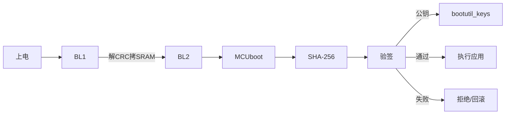
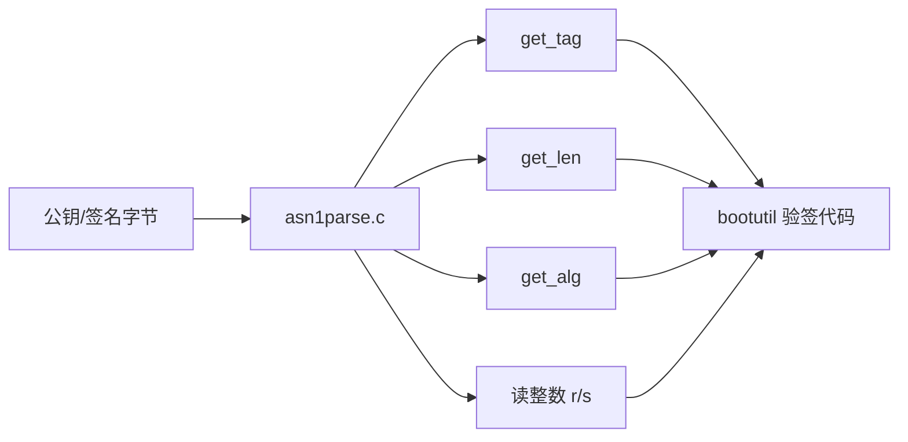
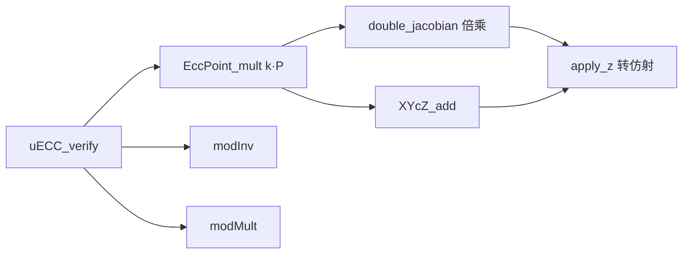
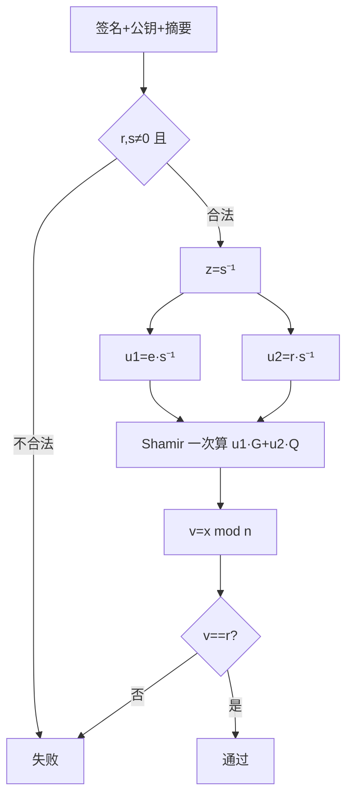
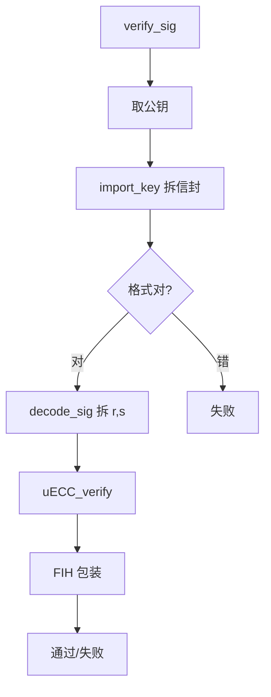
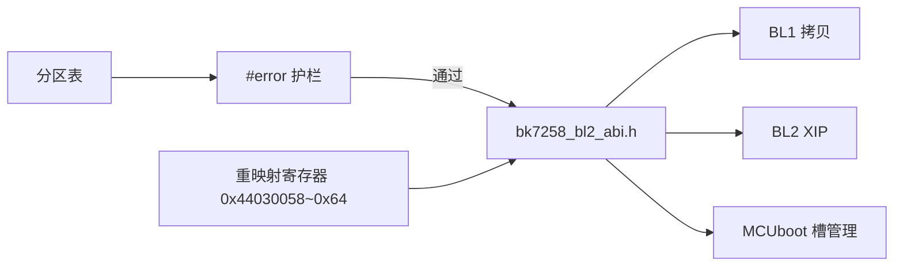

# bl2-加密验签

## 本组导读

BL2 是 BK7258 的二级引导加载器（bootloader，开机后先运行、把真正的系统拉起来的程序）。它把应用固件从 Flash 搬进内存之前，**必须先验一道"签名"**：只有带合法签名的固件才允许运行。这一组代码就是 BL2 的"验签车间"。

打个比方：BL2 是小区门卫，放人进门前要查"工牌 + 防伪签名"：
- **公钥**（`bk7258_bl2_keys.c`）是门卫手里的"验章手册"——只认这一种章；
- **ASN.1 解析**（`bk7258_bl2_mcuboot_asn1.c`）是"拆信封"——把字节流按国际标准拆成"什么算法、哪条曲线、公钥点在哪"；
- **ECC 运算**（`bk7258_bl2_mcuboot_ecc.c`）是"256 位大数计算器"；
- **ECDSA 验签**（`bk7258_bl2_mcuboot_ecc_dsa.c` + `bk7258_bl2_mcuboot_ecdsa.c`）是"对章"动作——用公钥算出结果与签名里的 r 比对。



---

## 文件：bk7258_bl2_keys.c

**它干什么**：定义 BL2 验签用的 **ECDSA P-256 公钥**（编译进固件的 91 字节常量数组），以及 MCUboot 需要的 `bootutil_keys[]` 全局表。
> 💡 【背景知识】验签前提是固件里先藏一把公钥：私钥在产线签固件，公钥在设备上验固件。公钥不怕公开，安全底线是私钥不泄露。本文件是**开发公钥**（注释明说 `Development public key`），配套私钥在上游开源仓库里公开，所以**只能联调、不能量产**。量产时只替换这一个文件即可完成密钥交接。

**【核心结构】**

| 符号 | 人话解释 |
|---|---|
| `ecdsa_pub_key[]` | 91 字节 DER 编码公钥（就是下面拆的"信封"） |
| `ecdsa_pub_key_len` | 公钥长度，用 `sizeof` 自动算，防止手写数错 |
| `bootutil_keys[]` | MCUboot 约定的密钥表：`{ 指针, 长度 }` |
| `bootutil_key_cnt` | 密钥条数 = 1 |

**【关键代码逐段讲解】** 公钥数组（`bk7258_bl2_keys.c:4`）是 **ASN.1 DER 编码**（"类型+长度+内容"串成的二进制格式），逐字节拆开：

```
0x30 0x59                     ← SEQUENCE，总长 0x59=89 字节（整个"信封"）
├─ 0x30 0x13                  ← 内层 SEQUENCE，长 19（算法信息）
│  ├─ 0x06 0x07 2a 86 48 ce 3d 02 01   ← OID 1.2.840.10045.2.1 = id-ecPublicKey
│  │                                    （"我是椭圆曲线公钥"）
│  └─ 0x06 0x08 2a 86 48 ce 3d 03 01 07 ← OID 1.2.840.10045.3.1.7 = secp256r1
│                                         （"曲线是 P-256"）
└─ 0x03 0x42 0x00             ← BIT STRING，长 0x42=66，0 个未用位
   └─ 0x04                    ← 未压缩点标记（0x04 = 完整 X+Y）
      ├─ X 坐标 32 字节：01 c4 99 9d ... 96 28
      └─ Y 坐标 32 字节：86 3f fe ... 9f df
```

密钥表（`bk7258_bl2_keys.c:20`）才是框架真正引用的：

```c
const struct bootutil_key bootutil_keys[] =
{
  { .key = ecdsa_pub_key, .len = &ecdsa_pub_key_len },
};
const int bootutil_key_cnt = 1;
```

人话：把"公钥指针 + 长度"打包成表交给框架，验签时按 `bootutil_keys[key_id]` 取用。这就是**板级定制的最小侵入点**——换量产密钥只改一个数组。

**【流程/关系图】**

```mermaid
flowchart LR
    A[公钥常量] --> M[bootutil_keys[]] --> V[verify_sig 验签]; C[产线私钥签名固件] --> V
```

---

## 文件：bk7258_bl2_mcuboot_keys.c

**它干什么**：NuttX（应用系统）侧的**同一把公钥**，用 `CONFIG_MCUBOOT_BOOTLOADER` 开关包着，编译进 NuttX 内核。
> 💡 【背景知识】BK7258 有 CP（协处理器）和 AP（应用处理器）两套镜像。BL2 验 CP 镜像，NuttX 自己也带 MCUboot 引导逻辑，两边都要知道"认哪把公钥"。注释说这是 MCUboot 上游 P-256 开发密钥的公钥半，仅作端到端硬件证明。

**【核心结构】** 与上一文件相同：`ecdsa_pub_key[]` + `ecdsa_pub_key_len` + `bootutil_keys[]` + `bootutil_key_cnt`，只是公钥字节值不同（上游 MCUboot 的另一把开发密钥）。

**【关键代码逐段讲解】** 条件编译（`bk7258_bl2_mcuboot_keys.c:18`）：

```c
#ifdef CONFIG_MCUBOOT_BOOTLOADER
#include <bootutil/sign_key.h>
...
#endif /* CONFIG_MCUBOOT_BOOTLOADER */
```

人话：只有 NuttX 打开了 MCUboot 引导模式，这份公钥才参与编译。框架不关心公钥哪来的——只要全局符号 `bootutil_keys` 存在且正确即可。

**【流程/关系图】**

```mermaid
flowchart LR
    B[NuttX 工程 bk7258_bl2_mcuboot_keys.c] -->|"CONFIG_MCUBOOT_BOOTLOADER 开关"| K[bootutil_keys[]] --> V[NuttX 侧 MCUboot 验签]
```

---

## 文件：bk7258_bl2_mcuboot_asn1.c

**它干什么**：一个"板级桥"（build bridge）文件——把 mbedTLS 的极简 ASN.1 解析器源码直接 `#include` 进本工程编译。
> 💡 【背景知识】验签第一步要解析公钥/签名的二进制格式，这个格式是 ASN.1/DER。完整 mbedTLS 太大，MCUboot 自带裁剪版（`ext/mbedtls-asn1`）。**把上游 .c 文件 include 进自己的编译单元**是嵌入式常用手法：不用改上游 Makefile，一个文件完成导入。

**【核心结构】**

| 符号 | 人话解释 |
|---|---|
| `mbedtls_asn1_get_tag` | 读"类型字节 + 长度"并校验类型对不对 |
| `mbedtls_asn1_get_len` | 读长度（短形式 1 字节 / 长形式 2~5 字节） |
| `mbedtls_asn1_get_alg` | 读"算法 OID"小节（公钥内层 SEQUENCE） |
| `mbedtls_asn1_get_bitstring_null` | 读 BIT STRING（公钥点）并跳过"未用位数"字节 |
| `asn1_get_tagged_int` | 读整数：跳前导 0、拒负数（签名 r/s 是整数） |

**【关键代码逐段讲解】** 文件本体就两行（`bk7258_bl2_mcuboot_asn1.c:6`）：

```c
#include "../../../../../apps/boot/mcuboot/mcuboot/ext/mbedtls-asn1/src/asn1parse.c"
#include "../../../../../apps/boot/mcuboot/mcuboot/ext/mbedtls-asn1/src/platform_util.c"
```

真正逻辑在 `asn1parse.c`，挑两个核心函数：

**读长度**（`asn1parse.c:45`）：长度 <128 时一字节直接写数值（最高位 0 = 短形式）；否则最高位置 1，低 7 位表示"后面几个字节拼长度"，按 1~4 字节拼成 `size_t`，并检查不越界：

```c
if ( ( **p & 0x80 ) == 0 )          /* 最高位 0：短形式 */
    *len = *(*p)++;
else switch( **p & 0x7F ) {         /* 长形式：按字节数拼 */
    case 2: *len = ( (size_t)(*p)[1] << 8 ) | (*p)[2]; (*p) += 3; break;
    ...
}
if( *len > (size_t) ( end - *p ) )  /* 防越界 */
    return( MBEDTLS_ERR_ASN1_OUT_OF_DATA );
```

**读整数**（`asn1parse.c:137`）：签名 r/s 是 ASN.1 INTEGER。先拒负数（最高位为 1 说明负数，密码学不该出现），跳前导 0，再逐字节左移拼成 int：

```c
if( ( **p & 0x80 ) != 0 )
    return( MBEDTLS_ERR_ASN1_INVALID_LENGTH );   /* 拒绝负数 */
while( len > 0 && **p == 0 ) { ++( *p ); --len; }  /* 跳前导零 */
while( len-- > 0 ) { *val = ( *val << 8 ) | **p; (*p)++; }  /* 大端拼接 */
```

**【流程/关系图】**



---

## 文件：bk7258_bl2_mcuboot_ecc.c

**它干什么**：桥接文件，把 TinyCrypt 的 **P-256 椭圆曲线大数运算单元**（`ecc.c`）拉进工程。
> 💡 【背景知识】椭圆曲线密码（ECC）的运算是"在曲线上做点的加法和倍乘"，全程在 256 位大整数（远超 64 位寄存器）上进行。TinyCrypt 提供软件"大数计算器"：大数乘除、模逆（求倒数）、点的加/倍乘、雅可比坐标系（一种免除法、提速的坐标表示）。BL2 这里**只用验签**，不需要签名（签名要私钥和随机数，BL2 不干）。

**【核心结构】**

| 符号 | 人话解释 |
|---|---|
| `uECC_vli_modMult` | 两个大数相乘再取模（ecc.c:364） |
| `uECC_vli_modInv` | 大数模逆：求 x⁻¹ mod n（ecc.c:408） |
| `double_jacobian_default` | 雅可比坐标下点倍乘（ecc.c:455） |
| `EccPoint_mult` | 标量乘点 k·P，验签算 u1·G 就靠它（ecc.c:729） |
| `uECC_vli_bytesToNative` / `_nativeToBytes` | 字节数组 ⇄ 内部大数互转 |

**【关键代码逐段讲解】** 桥文件一行（`bk7258_bl2_mcuboot_ecc.c:5`）：

```c
#include "../../../../../apps/boot/mcuboot/mcuboot/ext/tinycrypt/lib/source/ecc.c"
```

真正的点在 `ecc.c`。最有代表性的是**模逆** `uECC_vli_modInv`（`ecc.c:408`）——用扩展欧几里得算法求 x⁻¹ mod n，是 ECDSA 算 s⁻¹ 的地基：

```c
void uECC_vli_modInv(uECC_word_t *result, const uECC_word_t *input,
                     const uECC_word_t *mod, wordcount_t num_words)
{
    uECC_vli_set(x, mod, num_words);      /* 欧几里得迭代 */
    uECC_vli_set(y, input, num_words);    /* x = mod, y = input */
    while (uECC_vli_numBits(x, num_words) > 1 && ...) {
        /* 谁大除谁，商记进 A/B 差值 */
    }
    /* 最后 result = (A - B·mod) mod mod，即逆元 */
}
```

**标量乘点** `EccPoint_mult`（`ecc.c:729`）算 `k·P`（k 个 P 相加），用"double-and-add"（每次翻倍，比特为 1 再加一个 P），复杂度从 O(k) 降到 O(比特数)。验签里 `u1·G + u2·Q` 就反复调用它。

**【流程/关系图】**



---

## 文件：bk7258_bl2_mcuboot_ecc_dsa.c

**它干什么**：桥接 TinyCrypt 的 **ECDSA 验签主函数 `uECC_verify`**（`ecc_dsa.c`）。

> 💡 【背景知识】ECDSA 验签数学本质：签名是 `(r, s)` 两个数，验签人用公钥点 Q、摘要 e（固件哈希）算出另一个数 v，若 `v == r` 即通过。为什么有效？只有持私钥者才能构造出满足等式的 (r, s)。全程 256 位大数运算，慢但安全（纯软件、无硬件加速）。

**【核心结构】**

| 符号 | 人话解释 |
|---|---|
| `bits2int` | 把 32 字节摘要 e 截断/对齐成曲线阶 n 内整数（ecc_dsa.c:66） |
| `uECC_verify` | ECDSA 验签主函数（ecc_dsa.c:192） |
| `uECC_secp256r1()` | 取出 P-256 曲线参数（基点 G、素数 p、阶 n） |

**【关键代码逐段讲解】** 桥文件（`bk7258_bl2_mcuboot_ecc_dsa.c:5`）：

```c
#include "../../../../../apps/boot/mcuboot/mcuboot/ext/tinycrypt/lib/source/ecc_dsa.c"
```

`uECC_verify` 在 `ecc_dsa.c:192`，分四段讲：

**① 载入 + 前置校验**（`ecc_dsa.c:219`）：

```c
uECC_vli_bytesToNative(_public, public_key, curve->num_bytes);      /* 公钥 X */
uECC_vli_bytesToNative(_public + num_words, public_key + ..., ...); /* 公钥 Y */
uECC_vli_bytesToNative(r, signature, curve->num_bytes);             /* 签名 r */
uECC_vli_bytesToNative(s, signature + curve->num_bytes, ...);       /* 签名 s */
if (uECC_vli_isZero(r, num_words) || uECC_vli_isZero(s, num_words)) return 0;
if (uECC_vli_cmp_unsafe(curve->n, r, ...) != 1 ||
    uECC_vli_cmp_unsafe(curve->n, s, ...) != 1) return 0;
```

人话：字节转内部大数后做两道门卫检查——r/s 为 0 直接拒、≥n 直接拒，防"伪造签名塞 0"之类低级攻击。

**② 算 u1、u2**（`ecc_dsa.c:236`）：

```c
uECC_vli_modInv(z, s, curve->n, num_n_words); /* z = 1/s  */
bits2int(u1, message_hash, hash_size, curve);   /* e = 摘要 */
uECC_vli_modMult(u1, u1, z, curve->n, ...);     /* u1 = e/s  */
uECC_vli_modMult(u2, r, z, curve->n, ...);      /* u2 = r/s  */
```

人话：一次模逆求 s⁻¹，两次模乘得 `u1 = e·s⁻¹ mod n`、`u2 = r·s⁻¹ mod n`。

**③ Shamir 技巧一次算 `u1·G + u2·Q`**（`ecc_dsa.c:253`）：两个标量乘用一个循环扫描，每比特同时决定加 G 还是加 Q：

```c
points[0..3] = { 0, G, Q, G+Q };   /* 00不加 01加G 10加Q 11加G+Q（预计算） */
for (i = num_bits - 2; i >= 0; --i) {
    curve->double_jacobian(rx, ry, z, curve);              /* 点翻倍 */
    index = (!!uECC_vli_testBit(u1, i)) | ((!!uECC_vli_testBit(u2, i)) << 1);
    point = points[index];                                 /* 按比特位查表选点 */
    if (point) { ... }                                     /* 加进结果 */
}
```

人话：`points[0..3]` 是一张表：u1 第 i 位 + u2 第 i 位拼出下标 0~3 选点。比分别算两个标量乘再相加快约一倍。

**④ 收尾比对**（`ecc_dsa.c:287`）：

```c
/* v = x1 (mod n) */
if (uECC_vli_cmp_unsafe(curve->n, rx, num_n_words) != 1)
    uECC_vli_sub(rx, rx, curve->n, num_n_words);
/* Accept only if v == r. */
return (int)(uECC_vli_equal(rx, r, num_words) == 0);
```

人话：结果点横坐标 mod n 得 v，与 r 做**常量时间比较**（按位异或再判，不因内容不同而早退，防时序攻击）。注意此 fork 的 `uECC_vli_equal` 相等返回 0，故 `(0==0)` = 1 即通过，对应 `TC_CRYPTO_SUCCESS`。

**【流程/关系图】**



---

## 文件：bk7258_bl2_mcuboot_ecdsa.c

**它干什么**：桥接 MCUboot 框架层的 **`bootutil_verify_sig`**——验签"总开关"（`image_ecdsa.c`）。

> 💡 【背景知识】框架层把验签抽象成一个函数：给摘要、签名、密钥下标，返回通过/失败。它把 ASN.1 解析、TinyCrypt 验签串起来，再套一层 **FIH**（故障注入加固）——防攻击者用激光/电磁干扰把"失败"改成"成功"，属硬件攻击防御。

**【核心结构】**

| 符号 | 人话解释 |
|---|---|
| `bootutil_verify_sig` | 验签总入口（image_ecdsa.c:38） |
| `bootutil_import_key` | ASN.1 校验公钥信封：OID、曲线、点长度（ecdsa.h:87） |
| `bootutil_decode_sig` | ASN.1 解签名 SEQUENCE{INTEGER r, INTEGER s}（ecdsa.h:156） |
| `fih_ret_encode_zero_equality` | 把返回值包装成"篡改即失败"的 FIH 结果 |

**【关键代码逐段讲解】** 桥文件（`bk7258_bl2_mcuboot_ecdsa.c:5`）：

```c
#include "../../../../../apps/boot/mcuboot/mcuboot/boot/bootutil/src/image_ecdsa.c"
```

`bootutil_verify_sig` 全函数在 `image_ecdsa.c:38`：

```c
pubkey = (uint8_t *)bootutil_keys[key_id].key;   /* 取公钥指针 */
end = pubkey + *bootutil_keys[key_id].len;       /* 取公钥结尾 */
bootutil_ecdsa_init(&ctx);
rc = bootutil_ecdsa_parse_public_key(&ctx, &pubkey, end);  /* ① 拆公钥信封 */
if (rc) goto out;
rc = bootutil_ecdsa_verify(&ctx, pubkey, end-pubkey, hash, hlen, sig, slen);
fih_rc = fih_ret_encode_zero_equality(rc);       /* ② FIH 包装 */
out:
bootutil_ecdsa_drop(&ctx);
FIH_RET(fih_rc);
```

人话：按 `key_id` 取公钥 → 拆信封（失败即退出）→ 验签 → FIH 包装。`fih_ret_encode_zero_equality` 把"rc==0 表示成功"编码成 FIH 结果，即使被故障注入打乱也只朝"失败"方向偏。

背后的两个关键函数（`bootutil/crypto/ecdsa.h`，TinyCrypt 后端）：

**拆公钥信封** `bootutil_import_key`（`ecdsa.h:87`）：逐层 ASN.1 校验，任何一步不对返回负数：

```c
if (mbedtls_asn1_get_tag(cp, end, &len, MBEDTLS_ASN1_CONSTRUCTED | MBEDTLS_ASN1_SEQUENCE))
    return -1;                          /* 外层必须是 SEQUENCE */
...
if (memcmp(alg.p, ec_pubkey_oid, ...)) return -3;       /* 算法必须是 ECDSA */
if (memcmp(param.p, ec_secp256r1_oid, ...)) return -4;  /* 曲线必须是 P-256 */
...
if (len != 2 * NUM_ECC_BYTES + 1) return -8;  /* 点必须 65 字节（0x04+X+Y） */
```

**拆签名** `bootutil_decode_sig`（`ecdsa.h:156`）：签名格式是 `SEQUENCE { INTEGER r, INTEGER s }`，两个整数右对齐到 32 字节（ASN.1 整数因符号位可能长度不齐）：

```c
rc = bootutil_read_bigint(signature, &cp, end);                 /* 读 r */
rc = bootutil_read_bigint(signature + NUM_ECC_BYTES, &cp, end); /* 读 s */
```

**调 TinyCrypt**（`ecdsa.h:210`）：要求公钥首字节是 `0x04`（未压缩点），跳过它再交 `uECC_verify`（已在上一节详讲），通过标准是返回 `TC_CRYPTO_SUCCESS`。

**【流程/关系图】**



---

## 文件：bk7258_bl2_abi.h

**它干什么**：BL1 → BL2 → MCUboot 的**接口契约头文件**——统一规定"Flash 物理布局 ↔ 逻辑 XIP 视图"换算公式、双槽（A/B）地址、Flash 重映射寄存器地址，以及一串**编译期断言**。
> 💡 【背景知识】BK7258 Flash 上数据是"每 32 字节数据后跟 2 字节 CRC"的流格式（`v3.1.1.9`），而 MCUboot 和 CPU 的 XIP（在 Flash 上直接执行，代码不搬进内存）看到的是剥掉 CRC 的"逻辑视图"。BL2 把物理流搬进 SRAM、剥 CRC，再以逻辑视图交 MCUboot。本头文件防止"物理↔逻辑"公式在 BL1/BL2 两边不一致。

**【核心结构】**

| 符号 | 人话解释 |
|---|---|
| `BK7258_BL2_CRC_PHYSICAL_SIZE` | 逻辑大小 → 物理大小（含 CRC）宏 |
| `BK7258_BL2_CRC_LOGICAL_OFFSET` | 物理偏移 → 逻辑偏移宏 |
| `BK7258_BL2_CP/AP_RAW_SIZE` | CP / AP 槽物理原始大小 |
| `BK7258_BL2_B_CP/AP_RAW_OFFSET` | B 槽（备份槽）CP/AP 物理偏移 |
| `BK7258_BL2_B_CP/AP_XIP_START` | B 槽的 XIP 起始地址 |
| `BK7258_BL2_FLASH_REMAP_*` | Flash 重映射寄存器（基址 0x44030000） |
| `enum bk7258_bl2_slot_limit` | 限制 MCUboot 只扫一组物理 CP/AP 对 |
| 一堆 `#if...#error` | 编译期断言：分区表变了但契约没同步就编译失败 |

**【关键代码逐段讲解】** 换算公式（`bk7258_bl2_abi.h:16`）：

```c
#define BK7258_BL2_CRC_PHYSICAL_SIZE(logical_size) \
  ((logical_size) / BK7258_FLASH_CRC_DATA_SIZE * BK7258_FLASH_CRC_TOTAL_SIZE)
#define BK7258_BL2_CRC_LOGICAL_OFFSET(physical_offset) \
  ((physical_offset) / BK7258_FLASH_CRC_TOTAL_SIZE * BK7258_FLASH_CRC_DATA_SIZE)
```

人话：数据按"32 字节数据 + 2 字节 CRC = 34 字节"为一个物理块（CRC_DATA_SIZE / CRC_TOTAL_SIZE）。逻辑转物理：数出数据块数再乘 34；反向同理。CRC 让硬件流式搬运每块都能随时纠错。

Flash 重映射（`bk7258_bl2_abi.h:44`）：B 槽固件靠重映射控制器"借壳"A 槽 XIP 窗口执行：

```c
#define BK7258_BL2_FLASH_CONTROLLER_BASE 0x44030000u
#define BK7258_BL2_FLASH_REMAP_BEGIN   (BK7258_BL2_FLASH_CONTROLLER_BASE + 0x58u)
#define BK7258_BL2_FLASH_REMAP_END     (... + 0x5cu)
#define BK7258_BL2_FLASH_REMAP_OFFSET  (... + 0x60u)
#define BK7258_BL2_FLASH_REMAP_ENABLE  (... + 0x64u)
```

人话：4 个寄存器（起始、结束、偏移、使能）是硬件"Flash 地址平移器"。把 B 槽物理区间设成 A 槽窗口的"别名"，CPU 读 A 槽地址时硬件自动映射到 B 槽——A/B 槽固件能在**同一链接地址**下分别运行，这是 OTA 回滚的地基。

编译期断言（`bk7258_bl2_abi.h:77`）是最有价值的"护栏"：

```c
#if BK7258_BL2_SRAM_CAPACITY != BK7258_BL2_LOGICAL_CAPACITY
# error "BK7258 BL2 SRAM window disagrees with the 128 KiB partition contract"
#endif
#if BK7258_ROLE_SLOT_A_CP_OFFSET + BK7258_BL2_CP_RAW_SIZE != BK7258_ROLE_SLOT_A_AP_OFFSET
# error "BK7258 CP raw span does not meet AP raw span"
#endif
```

人话：BL1 拷贝、BL2 执行、MCUboot 管槽，三方对"地址在哪、多大"必须理解一致。数字来自自动生成的分区表——只要改了表没同步契约，`#error` 让**编译直接失败**，而不是运行时才炸。注释直白："这些检查是板级 ABI，不是运行时校验"。

**【流程/关系图】**



---

## 相关学习文档

- [10-Bootloader总览与启动链.md](../10-Bootloader总览与启动链.md) — BL1/BL2/AP 三级启动整体位置
- [12-BL2-MCUboot深度解析.md](../12-BL2-MCUboot深度解析.md) — 框架如何调用验签函数、镜像校验流程
- [13-Flash分区布局.md](../13-Flash分区布局.md) — A/B 双槽与 CRC 流格式的物理布局
- [14-安全启动与签名.md](../14-安全启动与签名.md) — 签名/验签与安全启动链设计
- [03-基础概念铺垫.md](../03-基础概念铺垫.md) — XIP、SRAM、链接地址等基础概念

## 源码路径

统一以 `$CONTEST/` 指代仓库根目录（实际为 contest2026_135_yongwangzhiqian 子仓库）。

```
$CONTEST/board/bk7258/bootloader/bl2/bk7258_bl2_keys.c            # BL2 板级公钥
$CONTEST/board/bk7258/bootloader/bl2/bk7258_bl2_mcuboot_keys.c    # NuttX 侧公钥
$CONTEST/board/bk7258/bootloader/bl2/bk7258_bl2_mcuboot_asn1.c    # ASN.1 解析桥
$CONTEST/board/bk7258/bootloader/bl2/bk7258_bl2_mcuboot_ecc.c     # ECC 运算桥
$CONTEST/board/bk7258/bootloader/bl2/bk7258_bl2_mcuboot_ecc_dsa.c # ECDSA 验签桥
$CONTEST/board/bk7258/bootloader/bl2/bk7258_bl2_mcuboot_ecdsa.c   # 框架验签入口桥
$CONTEST/board/bk7258/bootloader/bl2/include/bk7258_bl2_abi.h     # BL1↔BL2↔MCUboot 契约

# 上游真实实现（被上述桥文件 #include）
$CONTEST/apps/boot/mcuboot/mcuboot/ext/mbedtls-asn1/src/asn1parse.c
$CONTEST/apps/boot/mcuboot/mcuboot/ext/tinycrypt/lib/source/ecc.c
$CONTEST/apps/boot/mcuboot/mcuboot/ext/tinycrypt/lib/source/ecc_dsa.c
$CONTEST/apps/boot/mcuboot/mcuboot/boot/bootutil/src/image_ecdsa.c
$CONTEST/apps/boot/mcuboot/mcuboot/boot/bootutil/include/bootutil/crypto/ecdsa.h
```
