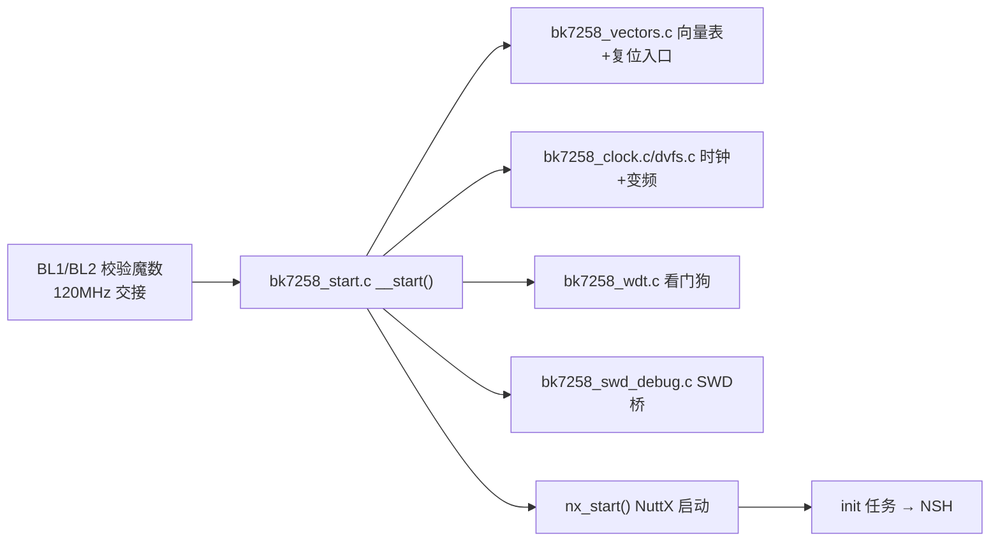
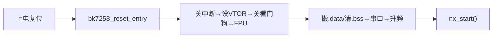
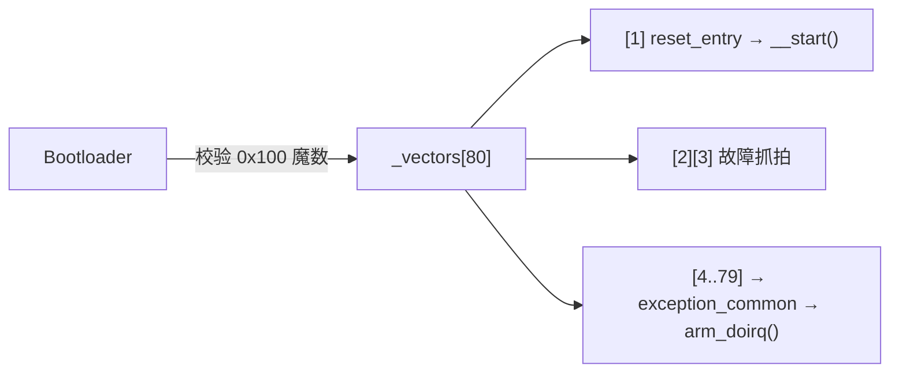
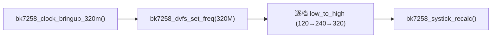
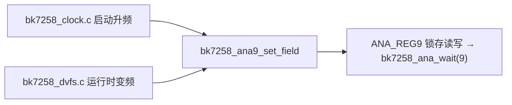
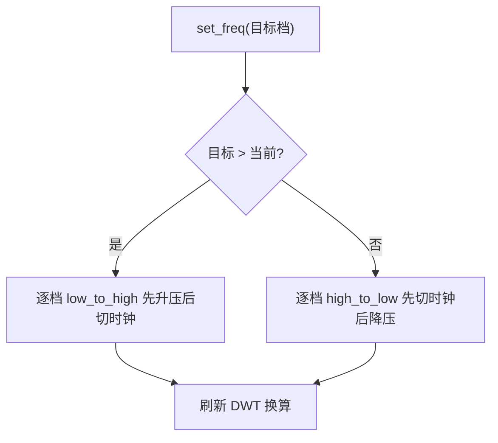
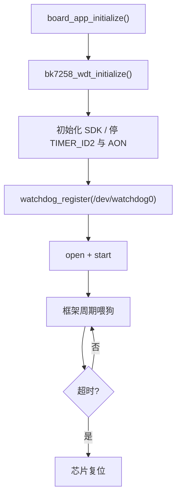
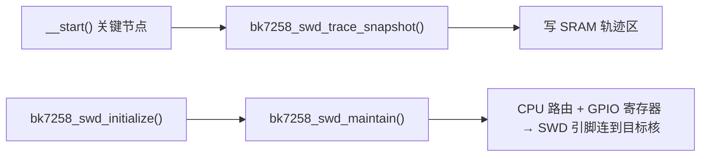

# cp-启动与时钟

> 本文档属于「代码讲解」系列，配合主套件阅读：先读 `../00-开始这里-导航与学习路径.md`、`../03-基础概念铺垫.md` 效果更佳。所有术语第一次出现都有人话解释。

## 本组导读

BK7258 是**三核**芯片：CPU0（叫 CP）跑 NuttX 操作系统，CPU1/CPU2（合称 AP）跑协议栈等任务。本组代码就是 **CP 从"通电"到"操作系统跑起来"的全过程**，以及配套的时钟、看门狗、调试辅助。

打个比方：这是 CP 的"**起床流程**"——闹钟一响（上电复位），先确认"自己在哪、手里有什么"（向量表），关掉会误伤自己的"定时炸弹"（Bootloader 看门狗），把"行李"（.data）从闪存放回内存、把内存"清干净"（.bss 清零），把频率调到最高档（时钟/DVFS），最后正式开工（`nx_start()` 启动 NuttX）。

一句话总结：**它是 CP 侧 NuttX 的"开场白"，负责把硬件摆好、交给操作系统。**
---
## 文件：bk7258_start.c（CP 启动入口）

### 它干什么

CP 复位后执行的**第一个 C 函数 `__start()`**：关中断 → 设向量表 → 关 Bootloader 看门狗 → 配 FPU → 搬 .data → 清 .bss → 初始化串口 → 升频 → 启动 NuttX。

> 💡 【背景知识】
> Cortex-M 上电后 CPU 自动从**向量表**第 0、1 格取两个值：初始栈指针（SP）和复位后要跳转的地址。本文件就是跳转目标里跑的代码。它像你新入职第一天：领门禁卡（向量表）、收拾工位（内存初始化）、开电脑（外设）正式上班（NuttX）。

### 核心结构

| 名字 | 位置 | 人话解释 |
|---|---|---|
| `__start()` | `bk7258_start.c:120` | 复位后的 C 入口，本文件主角 |
| `g_idle_topstack` | `bk7258_start.c:103` | 空闲线程栈顶地址，也是堆起点标记 |
| `BK7258_SCB_VTOR` | `bk7258_start.c:61` | 向量表偏移寄存器（告诉 CPU 向量表在哪） |
| `_eronly/_sdata/_edata` | 链接器符号 | .data 段的"源头(flash)"与"目标(RAM)"地址 |

### 关键代码逐段讲解

**① 一进来立刻关中断 + 设向量表（换灯泡前先拉总闸）**
```c
/* bk7258_start.c:127-144 */
__asm volatile ("cpsid i");                    /* 1. 立刻屏蔽所有中断 */
BK7258_SCB_VTOR = (uintptr_t)_vectors;         /* 2. 告诉 CPU 向量表的新地址 */
__asm volatile ("dsb; isb");                   /*    内存屏障，确保生效 */
```
上电时向量表地址还是 Bootloader 设的默认值。第一件事就是把**自己的向量表**地址写进 VTOR 寄存器；动手改任何东西前先 `cpsid i` 关中断，防止"改一半时来个中断"导致世界混乱。

**② 关掉 Bootloader 的看门狗（拆"定时炸弹"）**
```c
/* bk7258_start.c:152-158 */
BK7258_AON_WDT_CTRL = BK7258_AON_WDT_KEY1;   /* 密钥1：0x5A */
BK7258_AON_WDT_CTRL = BK7258_AON_WDT_KEY2;   /* 密钥2：0xA5 */
BK7258_APB_WDT_GLOBAL |= 1u << 1;            /* APB 看门狗时钟绕过位 */
BK7258_APB_WDT_CTRL = BK7258_APB_WDT_KEY1;
BK7258_APB_WDT_CTRL = BK7258_APB_WDT_KEY2;
```
**看门狗（watchdog）** 是颗"定时炸弹"：必须在规定时间内"喂"它，否则重启整颗芯片。Bootloader 上电时把两颗都点燃了（约 8 秒后炸），而 CP 启动 AP 核的耗时可能超过 8 秒，所以必须先按 "0x5A→0xA5" 的**双密钥序列**熄灭它们（防呆设计）。关掉后程序死机只会停在原地便于调试，而不是无限重启。

**③ FPU 初始化（顺序错了会"卡死"的坑）**
```c
/* bk7258_start.c:171-179 */
BK7258_SCB_CPACR &= ~((3u << 20) | (3u << 22));  /* 先禁止 CP10/CP11 */
__asm volatile ("dsb; isb");
*(volatile uint32_t *)0xE000EF34u &= ~((1u << 31) | (1u << 30) | (1u << 29));
BK7258_SCB_CPACR |= ((3u << 20) | (3u << 22));   /* 再开放 CP10/CP11 */
```
BootROM 把 FPU 的"懒人自动存栈"（ASPEN/LSPEN/LSPENS）开着，配合 CPACR 放开时，第一次异常（SysTick）会陷进该协议直接挂死且不报错。所以严格按 ARM 顺序：**先关权限 → 清懒人开关 → 再开权限**，像"先拔电源再拆电线"。

**④ 搬 .data、清 .bss（C 程序能跑的内存准备）**
```c
/* bk7258_start.c:191-204 */
for (src = (const uint32_t *)_eronly, dest = (uint32_t *)_sdata;
     dest < (uint32_t *)_edata; )
  *dest++ = *src++;        /* 把 .data 从 flash 拷到 RAM */
for (dest = (uint32_t *)_sbss; dest < (uint32_t *)_ebss; )
  *dest++ = 0;             /* 把 .bss 段清零 */
```
已初始化的全局变量（.data）存在 flash（**XIP**：直接执行式存储，地址可当内存读），运行时在 RAM 读写，所以要拷一份；未初始化的（.bss）约定初值为 0，所以清零。不搬不清，程序一跑数据就乱。

**⑤ 启动 NuttX（全剧终）**
```c
/* bk7258_start.c:252-280 */
#ifdef USE_EARLYSERIALINIT
  arm_earlyserialinit();       /* 提前拉起串口，便于看日志 */
#endif
bk7258_clock_bringup_320m();   /* 可选：升频到 320MHz */
nx_start();                    /* 进入操作系统，永不返回 */
```
`nx_start()` 是 NuttX 的"总开关"：初始化调度器、定时器、创建 init 任务（注册驱动、拉起 NSH）。它**永不返回**，所以后面有 `for(;;){}` 死循环兜底。

### 流程/关系图

---
## 文件：bk7258_vectors.c（向量表 + 故障记录）

### 它干什么

定义 CP 的 80 格**向量表** `_vectors[]`，并附一个能"抓拍现场、打印死因"的 HardFault 处理函数。

> 💡 【背景知识】
> **向量表（vector table）** 是一张"地址表"：第 N 格存放第 N 号异常/中断发生时跳去执行的函数地址。普通芯片用 NuttX 通用向量表，但 BK7258 特殊：Bootloader 校验 flash 偏移 **0x100** 处的 64 位魔数 "BK7236"，该位置正好落在向量表第 64/65 格。所以本文件自定义整张表，把魔数"塞"进这两格。

### 核心结构

| 名字 | 位置 | 人话解释 |
|---|---|---|
| `_vectors[80]` | `bk7258_vectors.c:526` | 80 格向量表，放 .vectors 段（flash 0x02010000） |
| `bk7258_reset_entry()` | `bk7258_vectors.c:236` | 第 1 格复位包装：分配栈后跳 `__start()` |
| `BK7258_APP_MAGIC_WORD0/1` | `bk7258_vectors.c:92` | "BK7236" 魔数，Bootloader 校验用 |
| `bk7258_hardfault_handler()` | `bk7258_vectors.c:494` | NMI/HardFault 诊断入口，抓死机现场 |
| `exception_common` | 通用 armv8-m 源码 | 标准异常分发入口（存现场→调 ISR→切上下文） |

### 关键代码逐段讲解

**① 魔数就是普通的两格表项**
```c
/* bk7258_vectors.c:555-566 */
[64] = (void *)BK7258_APP_MAGIC_WORD0,   /* "BK72"，字节偏移 0x100 */
[65] = (void *)BK7258_APP_MAGIC_WORD1,   /* "36\0\0"，字节偏移 0x104 */
[66 ... 79] = &exception_common,         /* 上半段外部中断 */
```
Bootloader 跳到应用前会读 flash 偏移 `0x100` 的 8 字节，必须是 "BK7236" 才放行。向量表第 64 格正好在 `64×4=0x100`，于是把魔数当"假函数指针"放进去。系统启动、向量表切到 RAM 后，`arm_ramvec_attach` 会把这两格"修复"成真正的异常入口——**魔数完成历史使命就退位**。

**② 复位包装：交接班**
```c
/* bk7258_vectors.c:236-248 */
static void bk7258_reset_entry(void)
{
  arm_initialize_stack();          /* 把空闲栈保留为 PSP，MSP 留给中断 */
  __asm volatile ("mov lr, %0\n\t" "bx %1\n\t"
                  : : "r"(0), "r"(__start));
}
```
Cortex-M 有两个栈指针：**MSP**（主栈，中断用）和 **PSP**（进程栈，线程用）。复位时用 MSP。这里把空闲线程栈设为 PSP，MSP 专供中断，然后跳进 `__start()`——分工明确。

**③ 死机"行车记录仪"**
```c
/* bk7258_vectors.c:493-505 (核心摘录) */
void __attribute__((naked, noreturn, used))
bk7258_hardfault_handler(void)
{
  __asm volatile (
      "tst lr, #4\n" "ite eq\n" "mrseq r0, msp\n" "mrsne r0, psp\n"
      "mov r1, lr\n" "mrs r2, ipsr\n" "b bk7258_fault_handler\n");
}
```
后面的 `bk7258_fault_handler()`（`bk7258_vectors.c:401`）把栈上寄存器、故障状态寄存器（HFSR/CFSR/MMFAR/BFAR）、PC/LR 全部抓拍保存到固定 SRAM 地址，再往串口打一行紧凑的 `HF E=.. P=.. L=..` 证据，然后停在原地（WFE）方便调试器查看。死机不再是"黑屏重启"，而是**留证**。

### 流程/关系图

---
## 文件：bk7258_clock.c + bk7258_clock.h（时钟 bring-up 入口）

### 它干什么

提供可选函数 `bk7258_clock_bringup_320m()`：把 CPU 主频从 Bootloader 交接的 120 MHz 抬升到 320 MHz 档位。头文件（`bk7258_clock.h:55-57`）只做一件事——在 `CONFIG_BK7258_CLOCK_320M` 开启时声明这个函数。

> 💡 【背景知识】
> 主频不能"一上来就最高"：上电先用低频率（安全省电），软件跑稳后再升频。本文件就是"踩油门"的开关，而"怎么安全换挡"（先升电压、再切时钟源）是 `bk7258_dvfs.c` 的活。**高层只发指令，底层干脏活**，这就是分层思想。

### 核心结构与关键代码
```c
/* bk7258_clock.c:96-110 */
void bk7258_clock_bringup_320m(void)
{
  int tier;
  bk7258_dvfs_set_freq(BK7258_FREQ_320M);   /* 一档一档升到 320M 档 */
  tier = bk7258_dvfs_get_freq();            /* 读回当前档位确认 */
  ...
}
```
核心就两句话：**喊换挡、确认换挡成功**。文件里其余大段 `bk7258_clk_puts/puthex8` 都是调试打印（`CONFIG_BK7258_CLOCK_320M_PROBE` 开关控制），生产版不需要。头文件注释还提醒：正式产品**不应**开这个升频，官方策略是保持 120 MHz 让各模块"按需投票"升频。

### 流程/关系图

---
## 文件：bk7258_clk_ll.h（时钟底层寄存器助手）

### 它干什么

提供读写 SYS 寄存器、模拟 SPI 等待、电压改写的**最底层工具函数**，启动期的 clock.c 和运行期的 dvfs.c 共用同一套"写/等"协议。

> 💡 【背景知识】
> 调电压（VDDD/VDDIG）不是直接写数字：芯片模拟部分通过一根**模拟 SPI** 通信，写完要等它忙完，并用 `spi_latch1v` 锁存位"夹住"写操作。像银行柜台递单：**先按铃（latch 开）→ 递单（写寄存器）→ 确认办完（等不忙）→ 关铃（latch 关）**。

### 核心结构

| 名字 | 位置 | 人话解释 |
|---|---|---|
| `BK7258_SYS_BASE` | `bk7258_clk_ll.h:38` | SYS 寄存器块基址 0x44010000 |
| `BK7258_REG(a)` | `bk7258_clk_ll.h:80` | 把地址当可读写寄存器用（MMIO） |
| `bk7258_ana_wait(idx)` | `bk7258_clk_ll.h:90` | 死等模拟 SPI 忙位清零 |
| `bk7258_ana9_set_field()` | `bk7258_clk_ll.h:114` | 按 latch 协议改 ANA_REG9 某段位 |

### 关键代码逐段讲解
```c
/* bk7258_clk_ll.h:114-125 */
static inline void bk7258_ana9_set_field(uint32_t clear, uint32_t set)
{
  BK7258_REG(BK7258_ANA_REG9) |= BK7258_ANA9_SPI_LATCH1V;  /* 开锁存 */
  bk7258_ana_wait(9);
  BK7258_REG(BK7258_ANA_REG9) =
      (BK7258_REG(BK7258_ANA_REG9) & ~clear) | set;        /* 改电压位 */
  bk7258_ana_wait(9);
  BK7258_REG(BK7258_ANA_REG9) &= ~BK7258_ANA9_SPI_LATCH1V; /* 关锁存 */
  bk7258_ana_wait(9);
}
```
三步走——**开锁 → 改值 → 关锁**，每步之间等模拟 SPI 不忙。`clear`/`set` 是按位对齐的掩码，只改要改的 bit。用 `static inline` 写在头文件里，是为了两个 .c 都能用且不产生重复定义。

### 流程/关系图

---
## 文件：bk7258_dvfs.c（运行时变频 DVFS）

### 它干什么

实现 **DVFS**（Dynamic Voltage and Frequency Scaling，动态电压频率调节）的"换挡杆"：`bk7258_dvfs_set_freq(tier)` 一档一档改变 CPU 电压和频率，全程关中断保证原子性。

> 💡 【背景知识】
> CPU 提速不能"一脚油门到底"：120M 直接跳 320M 时电压还没跟上，芯片会直接死。正确做法是**升频先升压，降频先降速**。这张"档位表"是芯片厂商给的标准操作点。

### 核心结构

| 名字 | 位置 | 人话解释 |
|---|---|---|
| `struct bk7258_dvfs_step_s` | `bk7258_dvfs.c:60` | 一个档位：时钟源/分频/两个电压值 |
| `g_bk7258_dvfs_steps[]` | `bk7258_dvfs.c:90` | 7 个档位表（26M~480M），必须升序 |
| `bk7258_dvfs_set_freq()` | `bk7258_dvfs.c:247` | 对外接口：安全换到目标档 |
| `bk7258_dvfs_step_low_to_high()` | `bk7258_dvfs.c:191` | 升频一档：先升压再切时钟 |

### 关键代码逐段讲解

**① 档位表（官方操作点）**
```c
/* bk7258_dvfs.c:90-106 */
static const struct bk7258_dvfs_step_s g_bk7258_dvfs_steps[] =
{
  [BK7258_FREQ_26M]  = { 0x0, 0x0, 0x1, 0x6, 0xB },  /* 26MHz */
  [BK7258_FREQ_120M] = { 0x3, 0x3, 0x1, 0x6, 0xC },  /* 120MHz */
  [BK7258_FREQ_320M] = { 0x2, 0x0, 0x0, 0x7, 0xE },  /* 320MHz(CPU0=160M) */
  [BK7258_FREQ_480M] = { 0x3, 0x0, 0x0, 0x7, 0xE },  /* 480MHz(CPU0=240M) */
};
```
每行五数分别是 `cksel_core`（时钟源选择）、`clkdiv_core`（分频）、`cpu0_speed`、`vddd`、`vddig`。注意：**320M 档下物理 CPU0 只跑 160M**（CPU1/CPU2 跑满 320M），这是芯片对 CP 核的"限速"设计。

**② 换挡主函数（关中断保原子）**
```c
/* bk7258_dvfs.c:247-289 */
int bk7258_dvfs_set_freq(int tier)
{
  flags = enter_critical_section();      /* 关中断，防中途被打断 */
  prev = g_bk7258_dvfs_cur;
  if (prev != tier)
    {
      if (tier > prev)
        for (i = prev + 1; i <= tier; i++)
          bk7258_dvfs_step_low_to_high(&g_bk7258_dvfs_steps[i]);
      else
        for (i = prev - 1; i >= tier; i--)
          bk7258_dvfs_step_high_to_low(&g_bk7258_dvfs_steps[i]);
      g_bk7258_dvfs_cur = tier;
      bk7258_systick_recalc();           /* 刷新 DWT 换算系数 */
    }
  leave_critical_section(flags);
  return 0;
}
```
假设当前 120M，要升 320M，就从 121 **一档一档走到 320**（120→240→320），每档用 `low_to_high` 顺序。**全程关中断**：模拟 SPI 写电压中途来中断会写丢数据，模拟电路就乱了。`enter_critical_section()` 是 NuttX 的"请勿打扰"牌子。

**③ 升频单档步骤（先升压，再切时钟）**
```c
/* bk7258_dvfs.c:191-218 (核心摘录) */
static void bk7258_dvfs_step_low_to_high(const struct bk7258_dvfs_step_s *s)
{
  bk7258_ctrl_vddd_h_vol(s->vddd);       /* 1. 先抬 VDDD 电压 */
  bk7258_ctrl_vdddig_h_vol(s->vddig);    /* 2. 再抬 VDDIG 电压 */
  if (s->clkdiv_core == 0)
    bk7258_write_cpu_speed(BK7258_CPU0_HALT_CLK_OP, s->cpu0_speed);
  bk7258_write_clkdiv_core(s->clkdiv_core);   /* 3. 改分频 */
  ...
  bk7258_write_cksel_core(s->cksel_core);     /* 4. 最后切时钟源 */
  __asm__ volatile ("dsb 0xf" ::: "memory");
  __asm__ volatile ("isb 0xf" ::: "memory");
}
```
升频严格**电压→分频→时钟源**：先把电"喂饱"，再改分频（避免总线超 240M），最后切时钟源，末尾加内存屏障（dsb/isb）。降频完全反过来（`high_to_low`，`bk7258_dvfs.c:222`）：先切时钟后降电压——否则电压太低带不动高频。

### 流程/关系图

---
## 文件：bk7258_wdt.c + bk7258_wdt.h（看门狗驱动）

### 它干什么

BK7258 看门狗在 NuttX 里的 **lower-half（下半层）驱动**：把 SDK 的 `bk_wdt_*` API 包装成 NuttX 看门狗框架要求的操作，注册为 `/dev/watchdog0`，由框架 automonitor 周期喂狗。头文件（`bk7258_wdt.h:48-55`）只声明 `bk7258_wdt_initialize()` 和 PM 用的 `bk7258_wdt_pm_prepare/restore()`。

> 💡 【背景知识】
> NuttX 看门狗分两半：**upper-half**（上层，框架自带的通用逻辑，如设备节点、喂狗调度）和 **lower-half**（下层，厂商实现硬件操作）。本文件就是"下层"，只负责 start/stop/feed/settimeout，喂狗节奏由框架管。

### 核心结构

| 名字 | 位置 | 人话解释 |
|---|---|---|
| `struct bk7258_wdt_lowerhalf_s` | `bk7258_wdt.c:56` | 私有数据：句柄 + 超时 + 启动标志 |
| `g_bk7258_wdt_ops` | `bk7258_wdt.c:110` | 操作表：5 个函数指针，框架照着调 |
| `bk7258_wdt_initialize()` | `bk7258_wdt.c:321` | 初始化并注册 `/dev/watchdog0` |
| `bk7258_wdt_pm_prepare/restore()` | `bk7258_wdt.c:389/407` | 低功耗切换前后喂/恢复看门狗 |

### 关键代码逐段讲解

**① 操作表（框架与硬件的"接口合同"）**
```c
/* bk7258_wdt.c:110-117 */
static const struct watchdog_ops_s g_bk7258_wdt_ops =
{
  .start      = bk7258_wdt_start,
  .stop       = bk7258_wdt_stop,
  .keepalive  = bk7258_wdt_keepalive,   /* = bk_wdt_feed() 喂狗 */
  .getstatus  = bk7258_wdt_getstatus,
  .settimeout = bk7258_wdt_settimeout,
};
```
这是"技能表"，告诉框架："启动、停止、喂狗、查状态、改超时找我这几个函数。" 框架不知道也不关心底层寄存器，只管调表。

**② 初始化注册（换主人）**
```c
/* bk7258_wdt.c:321-387 (核心摘录) */
int bk7258_wdt_initialize(void)
{
  ...
  err = bk_timer_driver_init();              /* 初始化 SDK 定时器 */
  err = bk_wdt_driver_init();                /* 初始化 SDK 看门狗驱动 */
  err = bk7258_wdt_sdk_timer_stop(TIMER_ID2);/* 停掉 SDK 自带喂狗定时器 */
  err = bk7258_wdt_sdk_aon_stop();           /* 停掉 AON 看门狗 */
  priv->wdt_lh.ops = &g_bk7258_wdt_ops;      /* 挂上操作表 */
  priv->timeout    = BK7258_WDT_DEFAULT_TIMEOUT_MS;  /* 默认 8 秒 */
  handle = watchdog_register("/dev/watchdog0",
                             (struct watchdog_lowerhalf_s *)priv);
}
```
Bootloader 点着的两颗狗早在 `__start()` 里被手动了。这里做的是**换主人**：初始化 SDK 驱动，停掉 SDK 自己那个 1 秒喂一次的定时器（避免和 NuttX 抢喂），再注册成 `/dev/watchdog0`。之后框架打开设备就定时喂狗，超时不喂就重启——这才是"操作系统看门狗"的正确姿势。

### 流程/关系图

---
## 文件：bk7258_swd_debug.c（SWD 调试桥）

### 它干什么

把 **SWD**（Serial Wire Debug，串行线调试，连接调试器的两根线）**路由到指定内核**，并在启动关键节点往固定内存写"启动轨迹快照"，方便调试器事后分析。

> 💡 【背景知识】
> BK7258 有三个核但只有一组 SWD 引脚（P0/P1 或 P20/P21）。"**SWD 路由**"就是一组开关，决定引脚连到哪个核。本文件保证调试握手期间不被 SDK 的"全引脚默认映射"误改——否则正在连接的调试器会突然掉线。它还做"黑匣子"：每到一个启动节点就把寄存器值记进固定 SRAM，死机后调试器一读就知道"走到哪一步了"。

### 核心结构

| 名字 | 位置 | 人话解释 |
|---|---|---|
| `bk7258_swd_maintain()` | `bk7258_swd_debug.c:141` | 幂等地把 SWD 路由/引脚配成目标状态 |
| `bk7258_swd_initialize()` | `bk7258_swd_debug.c:195` | 初始化入口，只调 maintain |
| `bk7258_swd_trace_snapshot(stage)` | `bk7258_swd_debug.c:97` | 拍一张"当前状态"存进轨迹区 |
| `__wrap_gpio_hal_default_map_init()` | `bk7258_swd_debug.c:54` | 拦截 SDK 全引脚映射，防误改路由 |

### 关键代码逐段讲解

**① 抓拍启动轨迹（黑匣子）**
```c
/* bk7258_swd_debug.c:97-139 */
void bk7258_swd_trace_snapshot(uint32_t stage)
{
  ...
  sample->stage = stage;                       /* 这是哪个节点 */
  sample->dhcsr = bk7258_swd_getreg(BK7258_DHCSR_REG);   /* 调试控制/状态 */
  sample->vtor  = bk7258_swd_getreg(BK7258_VTOR_REG);    /* 向量表地址 */
  sample->caller = (uint32_t)(uintptr_t)__builtin_return_address(0);
  ...
  trace->count = index + 1u;                   /* 记录数量 +1 */
}
```
`__start()` 里每完成一个关键步骤就调一次 `bk7258_swd_trace_snapshot(阶段号)`，把当时的关键寄存器存进 SRAM。启动卡死了，调试器读这个区域就能看出"最后停在哪个节点"，不用瞎猜。

**② 保持 SWD 路由（防掉线的关键）**
```c
/* bk7258_swd_debug.c:141-193 */
void bk7258_swd_maintain(void)
{
  ...
  regval = bk7258_swd_getreg(BK7258_SYS_CPU_ROUTE_REG);
  regval &= ~BK7258_SYS_JTAG_CORE_MASK;        /* 清掉旧路由 */
  regval |= BK7258_SWD_TARGET_CORE << BK7258_SYS_JTAG_CORE_SHIFT; /* 设目标核 */
  if (regval != bk7258_swd_getreg(BK7258_SYS_CPU_ROUTE_REG))
    bk7258_swd_putreg(regval, BK7258_SYS_CPU_ROUTE_REG);
  /* 接着配置 GPIO 功能寄存器、方向控制寄存器 ... */
}
```
注意每个写寄存器前都先"读回比对"，**值一样就不写**——避免 idle 循环里反复写同一寄存器。注释还记录一个踩过的坑：GPIO 控制寄存器高 18 位在硅片上实时反映 AON 状态，整字比较会导致 `up_idle()` 里不停写 P0/P1，把调试器写掉线，所以只比较关心的位段。

### 流程/关系图

---
## 相关学习文档

- `../10-Bootloader总览与启动链.md` —— 本组代码在启动链中的位置
- `../11-BL1深度解析.md` —— 上电第一级启动，它点亮看门狗、校验魔数
- `../12-BL2-MCUboot深度解析.md` —— 跳转到应用的上一站
- `../03-基础概念铺垫.md` —— 向量表、XIP、看门狗、SMP 等概念入门
- `../20-芯片适配层架构.md` —— 板级适配整体结构（chip/ 目录怎么组织）
- `../21-armino-SDK集成.md` —— SDK 函数（`bk_wdt_*`、`sys_hal_*`）怎么集成
- `../22-驱动适配范式.md` —— lower-half/upper-half 驱动写作套路
- `../30-构建-烧录-调试实战.md` —— 构建、烧录、SWD 调试实战

## 源码路径（仓库内统一用 `$CONTEST/` 前缀）

- `$CONTEST/board/bk7258/chip/cp/bk7258_start.c`
- `$CONTEST/board/bk7258/chip/cp/bk7258_vectors.c`
- `$CONTEST/board/bk7258/chip/cp/bk7258_clock.c`
- `$CONTEST/board/bk7258/chip/cp/bk7258_clock.h`
- `$CONTEST/board/bk7258/chip/cp/bk7258_clk_ll.h`
- `$CONTEST/board/bk7258/chip/cp/bk7258_dvfs.c`
- `$CONTEST/board/bk7258/chip/cp/bk7258_wdt.c`
- `$CONTEST/board/bk7258/chip/cp/bk7258_wdt.h`
- `$CONTEST/board/bk7258/chip/cp/bk7258_swd_debug.c`
