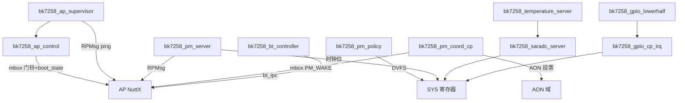
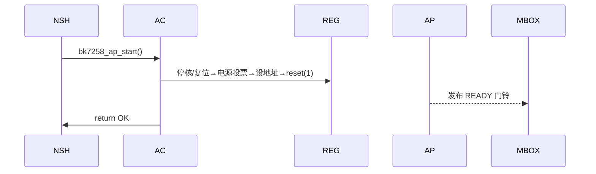
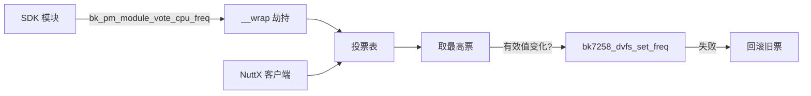
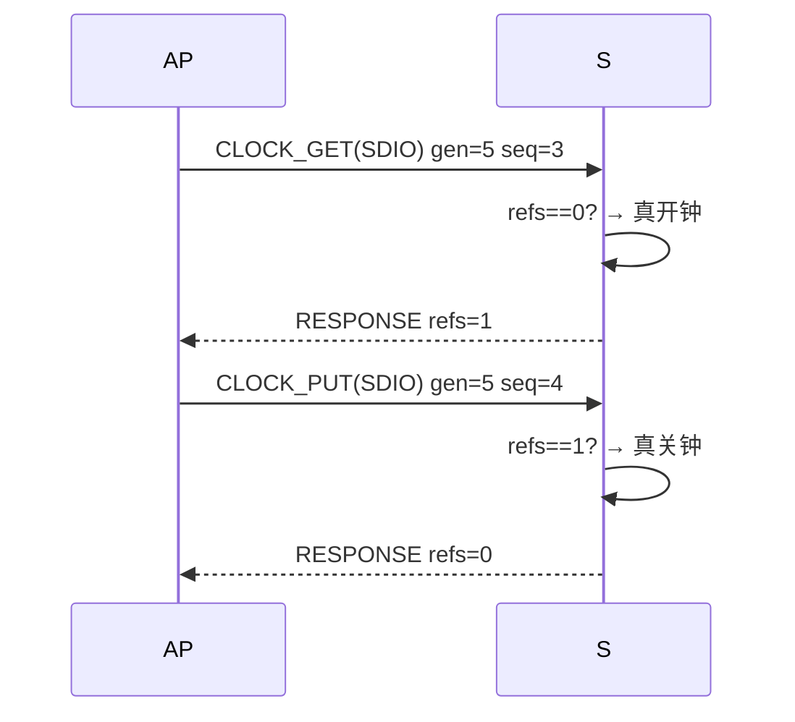
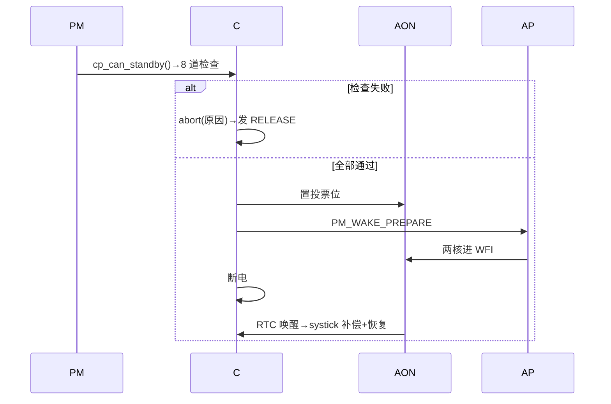
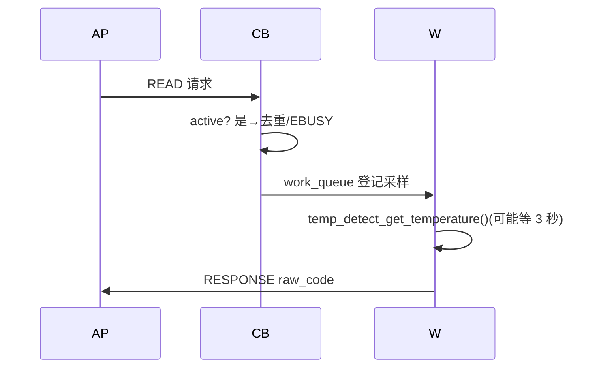
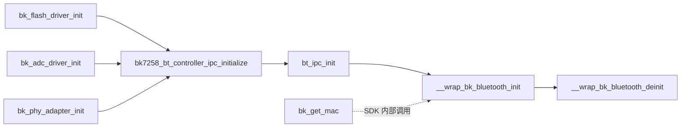
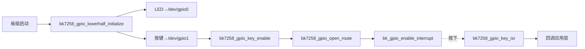
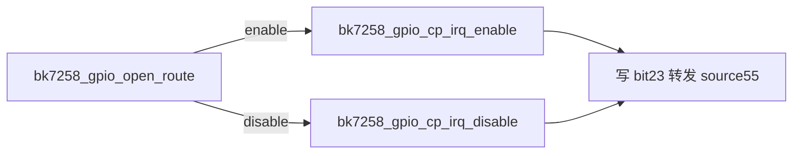

# cp-系统服务
## 本组导读
BK7258 是**双核异构芯片**：CP（CPU0，跑 NuttX，本项目主核）和 AP（CPU1/CPU2，跑另一个 NuttX 镜像，由 CP 拉起并监管）。本组 10 个文件全部运行在 **CP 侧**，是整个系统的"管家团"：
- **管 AP 死活**：`ap_control` 拉起/停止/重启 AP；`ap_supervisor` 盯心跳，发现 AP 死了就 fail-closed 并自动恢复。
- **管省电**：`pm_policy`（CP 用多高的 CPU 频率）、`pm_server`（AP 用外设时钟要向 CP 申请）、`pm_coord`（双方一起进低电压待机）。
- **对外服务**：`saradc_server`（ADC 采样）、`temperature_server`（片上温度计）、`bt_controller`（蓝牙控制器）。
- **GPIO 适配**：`gpio_lowerhalf` + `gpio_cp_irq` 把 GPIO 变成标准设备 `/dev/gpio0`（LED）、`/dev/gpio1`（按键）。
一句话：**CP 是房东，AP 是租客**——房东开门关门（ap_control）、查房（ap_supervisor）、管水电气（PM 服务），并提供公共设施（ADC/温度/蓝牙/GPIO）。

## 文件：bk7258_ap_control.c
**它干什么**：CP 侧控制 AP（CPU1/CPU2）的电源与复位时序，提供 `bk7258_ap_start/stop/restart`，并负责 mbox 门铃收发与共享 `boot_state` 初始化。
> 💡 【背景知识】CP 握着 AP 的"总电闸和复位按钮"（SYS 寄存器）。启动 AP 像给老电脑开机：断电清场 → 设启动地址 → 送电 → 等它"嘀"一声（发布 READY）。最难的是**寄存器操作顺序必须和官方 SDK 一致**，否则芯片起不来。
【核心结构】
- `g_bk7258_ap_lock`（mutex）串行化命令；`g_bk7258_ap_faulted`：RPTUN 拆除失败后的"瘫痪锁死"标记（fail-closed）。
- `bk7258_ap_mbox_send/receive`：mbox0/mbox1 互发"门铃"（doorbell = 32 位事件号）；`bk7258_ap_state_prepare()` 清零共享 `boot_state` 开启新一轮。
【关键代码逐段讲解】
**启动流程**（bk7258_ap_start_locked，557-564 行）：
```c
  /* Reset CPU2 first: scheduler-online CPU2 without primary is unsupported */
  bk7258_cpu2_sdk_stop();
  bk7258_cpu1_sdk_stop();
  up_mdelay(BK7258_AP_RESTART_DELAY_MS);
```
> 先停 AP 两个核，且**必须先停 CPU2（副核）再停 CPU1（主核）**：先复位主核会让副核"无主运行"，NuttX SMP 不认。`up_mdelay` 等复位脉冲稳定。
**释放 CPU1**（605-625 行）：
```c
  ret = bk_pm_module_vote_power_ctrl(BK7258_SDK_PM_POWER_MODULE_CPU1,
                                     BK7258_SDK_PM_POWER_ON);
  sys_drv_set_cpu1_boot_address_offset(g_bk7258_ap_image.vector_addr >> 8);
  __asm volatile ("dsb sy; isb sy" ::: "memory");
  sys_drv_set_cpu1_reset(1);   /* 松开复位 = 开始跑 */
```
> 先做**官方电源投票**再写 SDK 寄存器——投票还会清 halt 位、恢复时钟并等时钟稳定。`boot_address_offset` 填 AP 的**向量表地址**（向量表 = 异常跳转表，复位后芯片先读它拿入口）。AP 镜像是 MCUboot 签过名的，CP 直接喂地址即可。最后 `reset(1)` 松开扳机。
**等待就绪**（bk7258_ap_wait，418-464 行）：
```c
  for (;;)
    {
      event = bk7258_ap_mbox_receive();
      if (state->state == wanted)  return OK;
      if (state->state == BK7258_AP_STATE_FAILED)  return -EIO;
      if ((clock_t)(clock_systime_ticks() - start) >= timeout_ticks) break;
      nxsig_usleep(1000);   /* 让出 CPU，喂看门狗 */
    }
  return -ETIMEDOUT;
```
> 不用纯忙等，而是 `usleep(1000)` 让出 CPU。注释点出实战坑：若忙等，NSH 任务占死 CPU，**看门狗（定期"喂食"否则复位的定时器）没被喂**，CP 会先于 AP 被复位。超时以绝对 tick 比较为唯一权威。
【流程/关系图】

## 文件：bk7258_ap_supervisor.c
**它干什么**：常驻监控线程（`bk7258-ap-health`），用三条"生命信号"判断 AP 死活：① AP 主管理循环心跳、② AP 逻辑 CPU1 上任务的心跳、③ RPMsg 通道双向收发活动。确认故障就把共享 RPTUN 状态打成 `FAULTED`，再走 ap_control 重启恢复。
> 💡 【背景知识】像装三个独立报警器：门卫签到（主心跳）、机房登记（副心跳）、定期互打电话（RPMsg ping）。三个都响才说明有人；任一超时不响就"确认死亡"而非猜测。关键设计：**判断故障绝不在中断里做**——中断里不能等锁、不能干重活。
【核心结构】
- `struct bk7258_ap_supervisor_s`：监控状态（`armed`、`state`：OFFLINE/ARMING/SUSPECT/FAULTED/RECOVERING/LOCKOUT/HEALTHY、三个 tick 时间戳）。
- `monitor()` 每轮主检查；`evaluate_locked()` 按三个年龄（age_ms）与阈值驱动状态机；`fault_locked()`+`mark_rptun_fault()` 用 `__atomic_compare_exchange_n` 把共享 `control->state` 换成 FAULTED。
【关键代码逐段讲解】
**监控主循环**（bk7258_ap_supervisor_worker，913-936 行）：
```c
  for (;;)
    {
      bk7258_ap_supervisor_monitor();
      if (nxmutex_lock(&priv->lock) >= 0)
        { recover = priv->auto_recover_pending && !priv->recovering;
          priv->auto_recover_pending = false; nxmutex_unlock(&priv->lock); }
      if (recover)
        (void)bk7258_ap_supervisor_recover_internal(
          BK7258_AP_DEFAULT_TIMEOUT_MS, false);
      nxsig_usleep((unsigned int)CONFIG_BK7258_AP_SUPERVISOR_POLL_MS * 1000u);
    }
```
> 每轮 `monitor()` 检查，再处理"待执行自动恢复"，最后睡一个轮询周期。恢复动作放在**线程上下文**而非 monitor 内部——保证监控函数绝不在中断里执行重活。
**故障判定**（evaluate_locked，374-388 行）：
```c
  if (priv->status.primary_age_ms >= timeout)
    bk7258_ap_supervisor_fault_locked(
      priv, BK7258_AP_SUPERVISOR_REASON_PRIMARY_TIMEOUT, -ETIMEDOUT, fault, cpu2);
```
> 三级判定：超 `SUSPECT_MS` 只是"怀疑"（SUSPECT 状态），超 `TIMEOUT_MS` 才"实锤"（进 fault_locked）。两档阈值避免 AP 偶发卡顿被误杀；连续失败超上限进 LOCKOUT（不再自动恢复）。
**RPTUN 活动检测**（transport_activity_locked，227-263 行）：
```c
  uint32_t cp_rx = __atomic_load_n((uint32_t *)&rptun->cp_rx_sequence, __ATOMIC_ACQUIRE);
  uint32_t ap_rx = __atomic_load_n((uint32_t *)&rptun->ap_rx_sequence, __ATOMIC_ACQUIRE);
  ...
  if (priv->transport_activity != BK7258_AP_TRANSPORT_BIDIR || ...)  return false;
  priv->transport_tick = now;
  priv->status.flags |= BK7258_AP_SUPERVISOR_FLAG_RPMSG_READY | BK7258_AP_SUPERVISOR_FLAG_RPMSG_OK;
```
> 共享内存里两个 RPTUN 递增计数器：`cp_rx_sequence`（CP 收到的条数）、`ap_rx_sequence`（AP 收到的条数）。两个都在涨 = 通道**双向流动**，比单发 ping 更能证明活着，于是刷新活动时间、推迟主动探测。跨核读全用原子指令 + `dmb`（dmb = 内存屏障，保证多核读写顺序一致），防止读到撕裂值。
【流程/关系图】
```mermaid
stateDiagram-v2
    [*] --> OFFLINE --> ARMING --> HEALTHY
    HEALTHY --> SUSPECT: 单信号超时
    SUSPECT --> HEALTHY: 信号恢复
    SUSPECT --> FAULTED: 超时实锤
    FAULTED --> RECOVERING --> ARMING: 重启成功
    RECOVERING --> FAULTED: 重启失败
    FAULTED --> LOCKOUT: 连续失败超上限
```
## 文件：bk7258_pm_policy.c
**它干什么**：CP 的电源管理策略层——既是 NuttX PM 回调参与者，又是**多客户端 DVFS 频率投票器**（DVFS = 动态调频调压，按需升降 CPU 主频省电）。
> 💡 【背景知识】像宿舍抢宽带：Wi-Fi、蓝牙、USB 各自报"我要多少"（投一票），策略器取**最高需求**为最终档位。谁叫得最响满足谁；闲着就一起降频。只有有效投票值变化时才真调频率。
【核心结构】
- `struct bk7258_pm_policy_s`：锁 + `pm_callback_s` + `votes[]` 每客户端一票 + `current/peak` + `transitions`。
- `bk7258_pm_effective_locked()` 取最高票（120M 兜底）；`bk7258_pm_frequency_vote()` 投票入口；`__wrap_bk_pm_module_vote_cpu_freq()` 把 SDK 模块 ID 映射到客户端 ID。
【关键代码逐段讲解】
**投票落地**（bk7258_pm_frequency_vote，127-159 行）：
```c
  previous = policy->votes[client];
  policy->votes[client] = frequency;
  effective = bk7258_pm_effective_locked(policy);
  if (effective != policy->current)
    {
      ret = bk7258_dvfs_set_freq(effective);
      if (ret < 0)  { policy->votes[client] = previous; goto out; }  /* 失败回滚 */
      policy->current = effective;
      policy->transitions++;
    }
```
> ① 先记旧票（用于回滚）；② 写新票并算有效频率（`effective_locked` 遍历取最高票，跳过没投票的 `CPU_FREQ_DEFAULT`）；③ 只有有效频率**真的变了**才调 DVFS，失败就把票**还原成旧值**——一次失败的调频不能把状态表搞脏。
**SDK 模块 ID 映射**（240-250 行）：
```c
int __wrap_bk_pm_module_vote_cpu_freq(unsigned int module, int frequency)
{
  int client = bk7258_pm_sdk_client(module);
  return client < 0 ? client : bk7258_pm_frequency_vote(client, frequency);
}
```
> `__wrap_` 是链接器技巧：SDK 库里已有同名函数，提供 `__wrap_xxx` 就能"偷梁换柱"把 SDK 调用劫持到自己的实现（真函数通常叫 `__real_xxx`）。SDK 里所有写死的调用都会走我们的投票器，不用改 SDK 一行代码。
【流程/关系图】

## 文件：bk7258_pm_server.c
**它干什么**：RPMsg **服务端**，响应 AP 的外设时钟开关（`CLOCK_GET/PUT`）和频率投票（`CPU_FREQ_VOTE/QUERY`）。CP 是 `sys_ctrl` 时钟电源位的唯一主人，AP 请求被**白名单过滤 + 按 RPTUN 代数引用计数**。
> 💡 【背景知识】水电总闸只有房东 CP 能碰。租客 AP 要开水（SDIO、USB...）只能发申请单；房东开一次记一笔账（引用计数），关时减一，减到零才真关闸。两个租客都用 USB 时，第一个退租不会害第二个没电。
【核心结构】
- `struct bk7258_pm_server_s`：RPMsg 端点 + `refs[]` 引用计数表 + 频率投票状态 + **重放缓存**（last_request/last_reply）。
- `bk7258_pm_server_cb()` 处理所有请求；`bk7258_pm_set_clock()` 把逻辑时钟 ID 翻译成 SDK 寄存器操作；`bk7258_pm_release_generation()` 换代时归还全部资源。
【关键代码逐段讲解】
**引用计数核心**（server_cb，603-654 行）：
```c
  if (request->command == BK7258_PM_COMMAND_CLOCK_GET)
    {
      if (priv->refs[clock] == 0)   /* 第一个用户→真开硬件 */
        status = bk7258_pm_set_clock(clock, true);
      if (status >= 0)  priv->refs[clock]++;
    }
  else if (request->command == BK7258_PM_COMMAND_CLOCK_PUT)
    {
      if (priv->refs[clock] == 1)   /* 最后一个用户→真关硬件 */
        status = bk7258_pm_set_clock(clock, false);
      else  priv->refs[clock]--;
    }
```
> 经典引用计数：`GET` 只有 `refs==0`（第一个用户）才真操作硬件，其余只加计数；`PUT` 只有 `refs==1`（最后一个）才真关硬件，其余只减计数。视频时钟还有联动：第一个视频钟开前先开共享 VIDP 电源域，最后一个关后再关（`bk7258_pm_set_video_power`）。
**重放防抖**（575-599 行）：
```c
  if (priv->replay_valid && request->sequence == priv->last_sequence)
    {
      if (!bk7258_pm_same_request(request, &priv->last_request))
        return bk7258_pm_send_rejection(priv, request, -EPROTO);
      return rpmsg_trysend(&priv->ept, &priv->last_reply, sizeof(priv->last_reply));
    }
```
> 网络会丢包：请求已执行成功但回复丢了，AP 会重发一模一样的 `(generation, sequence)`。服务端用缓存直接返回上次回复，**绝不重复执行副作用**（不重复开钟/投票）。同序号内容不同 = 协议错乱（-EPROTO）；序号更旧 = 过期（-ESTALE）。
**全代资源释放**（release_generation，429-457 行）：
```c
  for (i = 0; i < BK7258_PM_CLOCK_COUNT; i++)
    if (priv->refs[i] != 0)
      { (void)bk7258_pm_set_clock((enum bk7258_pm_clock_e)i, false); priv->refs[i] = 0; }
  priv->generation = 0;
  priv->replay_valid = false;
```
> generation（代数，每次 AP 启动加 1）变了就先把上一代租借的资源全关掉再服务新代，防止"旧租客的东西没还、新租客来闸是开的"状态泄漏。
【流程/关系图】

## 文件：bk7258_pm_coord_cp.c
**它干什么**：CP 半边"协调低电压待机"协议。双方商量好一起进 `PM_STANDBY` 时，CP 做一连串安全检查，再调 SDK 低压进入函数，等 RTC 闹钟唤醒。
> 💡 【背景知识】"全楼断电省电"：熄灯前必须确认——没人在用电（投票全空）、电话线不忙（mbox 空闲）、门铃没响（无挂起中断）、AP 已躺平（AON 的 WFI 位置位）。任一不满足就 abort，因为"半断电"比"不断电"危险。
【核心结构】
- `bk7258_pm_cp_can_standby()`：NuttX PM prepare 回调调的"准入检查"；`bk7258_pm_cp_standby()`：真正执行待机（8 道关卡）。
- `bk7258_pm_abort(reason)`：任何关卡失败时的统一回退；`__wrap_bk_pm_module_vote_sleep_ctrl()` 劫持 SDK 睡眠投票；`bk7258_pm_enter_low_voltage()` 翻译中断掩码。
【关键代码逐段讲解】
**待机前的连续关卡**（bk7258_pm_cp_standby，431-497 行）：
```c
  if (!g_bk7258_pm_wake_armed || !bk7258_pm_ap_ready())
    { bk7258_pm_abort(BK7258_PM_COORD_REASON_NOT_READY); return false; }
  if (!bk7258_pm_votes_idle())
    { bk7258_pm_abort(BK7258_PM_COORD_REASON_ACTIVE_VOTE); return false; }
  ...
  bk7258_pm_set_cp_vote(true);   /* 自己的 AON 投票位置 1 */
  if (bk7258_rptun_mbox_pm_wake(BK7258_RPTUN_PM_WAKE_PREPARE) < 0)
    { bk7258_pm_abort(BK7258_PM_COORD_REASON_MBOX_BUSY); return false; }
  do { aon = getreg32(BK7258_AON_PMU_R3_ADDR);
       if ((aon & BK7258_AON_AP_WFI_BITS) == BK7258_AON_AP_WFI_BITS) break; }
  while (bk_aon_rtc_get_us() - start_us < BK7258_PM_AP_WAIT_US);
```
> 每道检查失败都 abort 并写诊断。重点是**握手协议**：CP 先把自己在 AON PMU 寄存器的"睡眠投票位"置 1，再经 mbox 发 `PM_WAKE_PREPARE` 通知 AP；然后轮询 AON 寄存器等 AP 两核都置起 WFI 位（WFI = Wait For Interrupt，ARM 的"躺平"指令）。**双方都举手同意才敢断电**。
**中断掩码翻译**（bk7258_pm_enter_low_voltage，96-121 行）：
```c
  uint8_t basepri = getbasepri();  uint8_t primask = getprimask();
  setprimask(1);  setbasepri(0);   /* 保临界区，但让 AON 能唤醒 WFI */
  __asm volatile ("dsb sy; isb sy" ::: "memory");
  sys_hal_enter_low_voltage();
  setprimask(1);  setbasepri(basepri);  setprimask(primask);  /* 恢复原掩码 */
```
> 隐蔽兼容问题：SDK 的 `sys_hal_enter_low_voltage()` 在 FreeRTOS 临界区里调用（PRIMASK=1、BASEPRI=0），而 NuttX `pm_idle()` 进来时 BASEPRI 被抬高。**BASEPRI 抬高时 WFI 无法被中断唤醒**，RTC 闹钟到了也醒不来，芯片睡死。解决办法：进门清 BASEPRI、置 PRIMASK（保临界语义但允许 AON 唤醒 WFI），出门恢复原始掩码。BASEPRI = 按优先级屏蔽中断的寄存器，PRIMASK = 全屏蔽开关。
【流程/关系图】

## 文件：bk7258_saradc_server.c
**它干什么**：启动官方 SDK 的 SARADC（逐次逼近型模数转换器）驱动，让它自带的 mailbox 服务线程跑起来，供 AP 侧 `bk_adc_*` 客户端调用。
> 💡 【背景知识】SARADC 像芯片自带的"电压表插槽"。SDK 已把硬件初始化和"服务台"（后台任务收单）包好，本项目只需到点叫醒它。整个文件一个函数，是标准"启动钩子"。
【核心结构】`bk7258_saradc_server_initialize()`：先 GPIO 后 ADC 两步初始化。
【关键代码逐段讲解】全文件核心（24-38 行）：
```c
int bk7258_saradc_server_initialize(void)
{
  /* Channel-map RPCs use the SDK GPIO HAL, but bk_adc_driver_init() does not
   * initialize it.  Establish the GPIO foundation before starting SARADC */
  if (bk_gpio_driver_init() != BK_OK)  return -EIO;
  return bk_adc_driver_init() == BK_OK ? 0 : -EIO;
}
```
> 两步走：先初始化 GPIO HAL（ADC 通道映射 RPC 依赖 GPIO 寄存器，而 ADC 驱动自己不初始化 GPIO——隐式依赖），再初始化 ADC 驱动。`bk_adc_driver_init()` 幂等，内部创建硬件中断、IPC 通道和 server 任务。本项目不注册板级 GPIO 设备（那是 lowerhalf 的事），也不调 SDK 不完整的 deinit。
【流程/关系图】

## 文件：bk7258_temperature_server.c
**它干什么**：CP 侧片上温度传感器服务端。AP 经 RPMsg 请求读温度，服务端把采样丢到 LPWORK 工作队列异步执行（SDK 一次性采样可能重试 3 秒），完成后回发结果。
> 💡 【背景知识】温度测量很慢（可能等 3 秒还带重试）。若直接在 RPMsg 回调里做，等于堵死"收发快递的柜台"3 秒，所有跨核消息卡住。所以设计成：**柜台只接单登记，把活扔给后台工人（LPWORK）慢慢干**，干完再回电话——典型的生产者-消费者模式。
【核心结构】
- `struct bk7258_temperature_server_s`：RPMsg 端点 + `work_s` 工作项 + 两把互斥锁 + 自旋锁 + 活动请求/重放缓存。
- `bk7258_temperature_server_cb()` 只接单调度；`bk7258_temperature_sample_worker()` 后台采样；`bk7258_temperature_send()` 带锁发送。
【关键代码逐段讲解】
**回调只接单不干活**（server_cb，249-283 行）：
```c
  else if (priv->active)
    return duplicate ? OK : bk7258_temperature_send_status(priv, request, -EBUSY);
  else
    { memcpy(&priv->active_request, request, sizeof(priv->active_request));
      priv->active = true; }
  spin_unlock_irqrestore(&priv->lock, irqstate);
  ret = work_queue(LPWORK, &priv->sample_work, bk7258_temperature_sample_worker, priv, 0);
```
> `active` 布尔量保证"同一时间只有一个采样任务"：已有采样则重复请求返回 OK（同一请求）或 -EBUSY（不同请求）。首次请求登记 `active_request` 并把采样任务挂进 LPWORK。关键：**自旋锁保护共享状态，锁内绝不调可能阻塞的函数**。
**后台采样**（sample_worker，165-178 行）：
```c
  spin_lock_irqsave(&priv->lock); memcpy(&request, &priv->active_request, sizeof(request));
  spin_unlock_irqrestore(&priv->lock, irqstate);
  status = bk7258_temperature_map_error(temp_detect_get_temperature(&raw_code));
  if (status >= 0 && (raw_code < BK7258_TEMPERATURE_RAW_MIN ||
      raw_code > BK7258_TEMPERATURE_RAW_MAX))  status = -ERANGE;  /* 超范围拒绝 */
```
> 先拷出请求（锁外调 SDK 慢函数），再调 `temp_detect_get_temperature()` 真正采样——可在后台慢慢跑。结果要校验范围，超出视为 -ERANGE。最后构造回复，检查 generation 一致就回发并缓存供重放。
【流程/关系图】

## 文件：bk7258_bt_controller.c
**它干什么**：CP 侧蓝牙控制器**启动引导**。初始化 SDK 蓝牙 mailbox IPC（`bt_ipc_init`）、PHY/RF 适配器与校准，用 `__wrap_` 包装 `bk_bluetooth_init/deinit`，并提供 MAC 地址持久化读写服务。
> 💡 【背景知识】蓝牙芯片是"无线小电台"。SDK 已写好电台全部代码，但它假设环境里有 FreeRTOS 和系统服务。NuttX 没有，所以本项目做两件事：**① 把 SDK 启动所需前置（flash、ADC、PHY 适配表）先喂饱；② 用包装函数补上 SDK 要调的系统服务（如读 MAC）**。
【核心结构】
- `__wrap_bk_bluetooth_init/deinit`：劫持 SDK 蓝牙生命周期，记录诊断，维护 `g_bk7258_bt_controller_ready`。
- `bk7258_bt_mac_initialize_locked()`：MAC 三级恢复（sys_net 权威区 → 备份区 → 随机生成）；`bk_get_mac()` 补实现（`libbk_system.a` 带 FreeRTOS 运行时不能链进 NuttX）。
【关键代码逐段讲解】
**生命周期包装**（__wrap_bk_bluetooth_init，199-234 行）：
```c
int __wrap_bk_bluetooth_init(void)
{
  ret = __real_bk_bluetooth_init();
  if (ret == 0)
    { __atomic_store_n(&g_bk7258_bt_controller_ready, true, __ATOMIC_RELEASE);
      __atomic_fetch_or(&bk7258_rptun_control()->flags,
                        BK7258_RPTUN_FLAG_CP_BT_ACTIVE, __ATOMIC_RELEASE); }
  bk7258_debug_transport_recover();   /* 抢回 SWD/UART 控制台 */
  return ret;
}
```
> `__wrap_` 调真正的 `__real_bk_bluetooth_init`，前后记录调用次数/结果/状态。成功后把 RPTUN 控制块的 `CP_BT_ACTIVE` 标志置位（告诉 AP"蓝牙已在跑"）。**`bk7258_debug_transport_recover()` 很实用**：SDK 初始化可能动引脚复用（pinmux），把 SWD 调试口和 UART 控制台抢回来，否则调完蓝牙就再也连不上调试器了。
**MAC 地址持久化**（bk7258_bt_mac_initialize_locked，512-550 行）：
```c
  net_valid    = partition_read(NETWORK) && bk7258_bt_mac_is_official_valid(net_mac);
  backup_valid = bk7258_bt_mac_read_backup(backup_mac) && bk7258_bt_mac_is_official_valid(backup_mac);
  if (net_valid)      { 用 net_mac；顺带补写备份； }
  else if (backup_valid) { 用 backup_mac；反写 sys_net； }
  else if (bk_trng_driver_init() == BK_OK) { 官方 OUI + 3 个 TRNG 随机字节；写两处； }
```
> MAC 地址像身份证号，得有且不能丢。恢复策略三级递进：**① sys_net 区有效就用它**（顺带补备份）；**② 备份区有效**就反写回 sys_net；**③ 都没有**就从真随机数发生器（TRNG）取 3 字节配厂商 OUI 生成新地址并写两处。备份区每条记录带 CRC8 校验（防损坏），且**追加写**（不覆盖旧记录，崩溃还能找回历史）。
【流程/关系图】

## 文件：bk7258_gpio_lowerhalf.c
**它干什么**：把板载 LED 和按键注册成 NuttX 标准 GPIO 设备 `/dev/gpio0`、`/dev/gpio1`（GPIO lower-half = 把芯片引脚能力封装成统一 GPIO API 的设备驱动下半层）。
> 💡 【背景知识】NuttX GPIO 设备分两层：**upper-half**（统一接口，`gpio_pin_register` 生成设备节点）和 **lower-half**（对接芯片的操作函数表 `gpio_operations_s`）。像酒店：前台统一接客，楼层服务员负责具体房间水电。LED 是"输出"型（点灯），按键是"中断输入"型（按下触发回调）。
【核心结构】
- `struct bk7258_gpio_output_s` / `bk7258_gpio_interrupt_s`：两个设备实例（`gpio_dev_s` + 引脚号 + 锁）；两套操作函数表。
- `bk7258_gpio_key_enable()`：按键中断使能全流程；`bk7258_gpio_open_route()`：开 GPIO 到 CPU0 的中断转发路由；`bk7258_gpio_lowerhalf_initialize()` 整体入口，失败时恢复引脚原值。
【关键代码逐段讲解】
**按键中断使能**（bk7258_gpio_key_enable，610-692 行）：
```c
  bk_gpio_set_config(key->pin, &g_bk7258_gpio_key_config);      /* 配引脚 */
  bk_gpio_set_interrupt_type(key->pin, type);                    /* 设触发沿 */
  bk_gpio_clear_interrupt(key->pin);                             /* 清残留挂起 */
  bk_gpio_register_isr(key->pin, bk7258_gpio_key_isr);           /* 注册回调 */
  result = bk7258_gpio_open_route(key);                          /* 开中断路由 */
  result = bk_gpio_enable_interrupt(key->pin);                   /* 最后才使能 */
  if (result < 0)  cleanup_result = bk7258_gpio_close_route(key);  /* 失败回滚 */
```
> 使能按键中断是严格"装配线"，任何一步失败都回滚（如关掉已开路由），绝不留半配置。注释还提醒：AP 侧 SDK 可能把按键引脚重置为禁用态，所以每次使能都要**重配引脚**。
**打开中断路由**（bk7258_gpio_open_route，313-342 行）：
```c
  /* The CP SDK only enables GPIO interrupt forwarding in low-power entry,
   * never in normal GPIO init.  Without it, pending bits never reach NVIC. */
  bk7258_gpio_cp_irq_enable();
  value = bk7258_gpio_enable_route(&key->saved_route);   /* 保存原值，失败精确还原 */
```
> 本移植的"隐藏需求"：CP SDK 默认**只在低功耗路径**开 GPIO 中断转发，正常初始化不开——引脚中断永远到不了 CPU（NVIC = Cortex-M 中断控制器）。必须自己调 `bk7258_gpio_cp_irq_enable()` 打开 source55 转发。
【流程/关系图】

## 文件：bk7258_gpio_cp_irq.c
**它干什么**：只有两个函数的小文件，专门开关"GPIO 中断转发到 CPU0"的系统级开关，供 lowerhalf 调用。
> 💡 【背景知识】GPIO 中断源（source55，寄存器 bit23）要被 CPU0 看见，必须写 `CPU0_INT_32_63_EN` 寄存器。CP SDK 有底层函数但**没暴露头文件**，所以本项目用 `extern` 直接声明并单独隔离，避免"裸声明"到处撒。
【核心结构】`BK7258_GPIO_CP_SOURCE_MASK (1u<<23)`：source55 在 `CPU0_INT_32_63_EN`（0x44010084）里的位；`bk7258_gpio_cp_irq_enable/disable()` 调 SDK 的 `sys_drv_int_group2_enable/disable`。
【关键代码逐段讲解】全文件核心（77-101 行）：
```c
void bk7258_gpio_cp_irq_enable(void)
{ sys_drv_int_group2_enable(BK7258_GPIO_CP_SOURCE_MASK); }

void bk7258_gpio_cp_irq_disable(void)
{ sys_drv_int_group2_disable(BK7258_GPIO_CP_SOURCE_MASK); }
```
> 只是把掩码透传给 SDK 驱动。文件头注释是关键设计：CP 配置 `CONFIG_TZ=1`、`CONFIG_SPE=1`（TrustZone/安全扩展开启），GPIO 驱动只注册**安全源 source55**；`GPIO_NS` 被 `MAC_HSU` 占用在 source37，**绝不能碰**。这就是掩码固定 bit23 而非覆盖全部 GPIO 的原因。
【流程/关系图】

## 相关学习文档
- [./25-跨核通信-RPTUN.md](../25-跨核通信-RPTUN.md) —— mbox/RPMsg 底层机制，本组所有服务端都建立在它之上
- [./22-驱动适配范式.md](../22-驱动适配范式.md) —— `__wrap_`/`__real_` 劫持、SDK 移植范式详解
- [./10-Bootloader总览与启动链.md](../10-Bootloader总览与启动链.md) —— AP 镜像由 BL2 校验、CP 按向量表地址释放 CPU1 的背景
- [./23-外设驱动详解-一(I2C-PWM-GPIOE).md](../23-外设驱动详解-一(I2C-PWM-GPIOE).md) —— GPIO lower-half 更多细节
- [./24-外设驱动详解-二(RTC-Timer-ADC).md](../24-外设驱动详解-二(RTC-Timer-ADC).md) —— SARADC、AON RTC 唤醒、温度传感器硬件背景
- [./03-基础概念铺垫.md](../03-基础概念铺垫.md) —— 向量表、看门狗、MSP、内存屏障等术语速查
## 源码路径
统一以 `$CONTEST/` 为仓库前缀：
```
$CONTEST/board/bk7258/chip/cp/bk7258_ap_supervisor.c
$CONTEST/board/bk7258/chip/cp/bk7258_ap_control.c
$CONTEST/board/bk7258/chip/cp/bk7258_pm_policy.c
$CONTEST/board/bk7258/chip/cp/bk7258_pm_server.c
$CONTEST/board/bk7258/chip/cp/bk7258_pm_coord_cp.c
$CONTEST/board/bk7258/chip/cp/bk7258_saradc_server.c
$CONTEST/board/bk7258/chip/cp/bk7258_temperature_server.c
$CONTEST/board/bk7258/chip/cp/bk7258_bt_controller.c
$CONTEST/board/bk7258/chip/bk7258_gpio_lowerhalf.c
$CONTEST/board/bk7258/chip/bk7258_gpio_cp_irq.c
```
