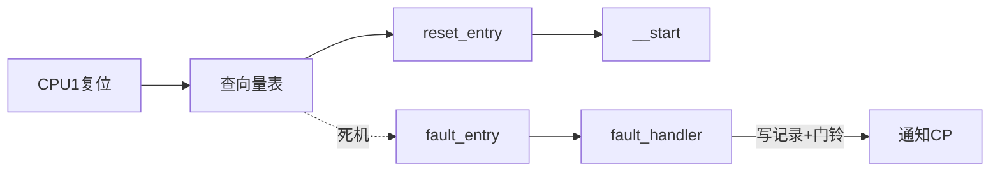
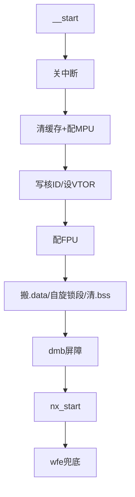
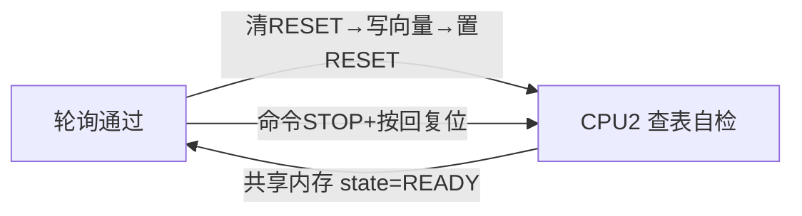
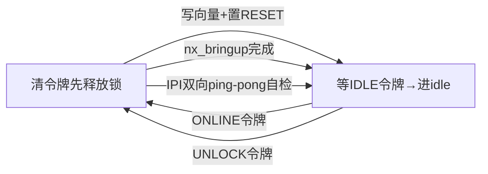
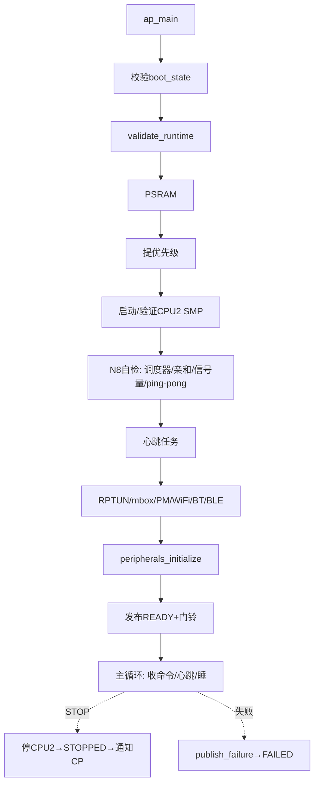
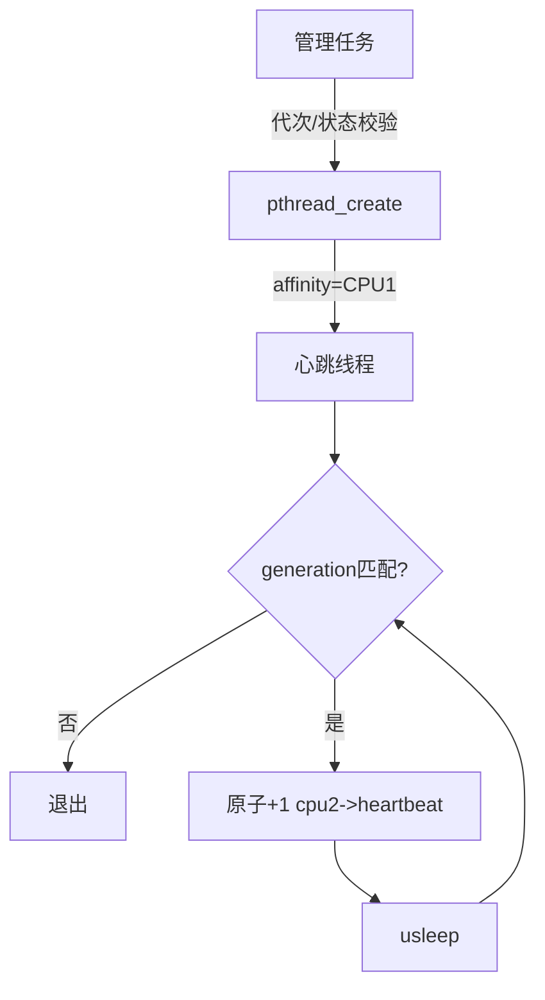

# ap-启动与smp

> 属于 **BK7258-Learning 代码讲解系列**，面向零基础读者。阅读前建议先看 `../10-Bootloader总览与启动链.md` 与 `../03-基础概念铺垫.md`。
---

## 本组导读

BK7258 是 **CP+AP** 双核架构芯片：CP 主控核负责无线/系统级事务，AP 应用核跑 NuttX 提供应用环境。AP 这一侧其实有**两个物理核**（物理 CPU1、物理 CPU2），NuttX 把它们当作 SMP 下的**逻辑 CPU0、逻辑 CPU1**。

本组代码就是 AP 侧的"叫醒与上岗"流程：

1. 物理 CPU1 先醒来（CP 松开它的复位），执行 `__start()` 启动 NuttX；
2. 内核起来后，CPU1 上的管理任务**探测并拉起物理 CPU2**；
3. CPU2 进入 SMP 调度器，两核一起调度；
4. AP 注册全部外设，并持续向 CP 汇报"我还活着"（心跳）。

```
CP(主控核,跑SDK,握AP核复位开关)
 │ ① 松CPU1复位
 ▼
物理CPU1(逻辑CPU0): __start→nx_start→ap_main管理任务
  │ 验证运行态→探测/拉起CPU2→SMP自检→注册外设→READY→心跳循环
  │ ② 松CPU2复位(SYS_CPU2_CONTROL)
  ▼
物理CPU2(逻辑CPU1): 自检→进SMP调度器→跑亲和任务+独立心跳
```

各文件对应环节：

| 文件 | 环节 |
|------|------|
| `bk7258_ap_vectors.c` | CPU1 向量表 + 异常现场上报 |
| `bk7258_ap_start.c` | CPU1 复位初始化（MPU/缓存/FPU/搬数据） |
| `bk7258_cpu2_probe.c` | 先"体检"CPU2（不开 SMP） |
| `bk7258_ap_smp.c` | CPU2 正式进入 SMP 调度器 + 自检 |
| `bk7258_ap_main.c` | AP 侧总管理任务（导演） |
| `bk7258_ap_health.c/.h` | 逻辑 CPU1 上的独立心跳 |
| `bk7258_peripherals.c` | 外设统一注册 |

---

## 文件：bk7258_ap_vectors.c
**它干什么**：为物理 CPU1 准备 ARM 向量表，并实现 AP 核死机时把现场抄进共享内存、敲 MBOX1 门铃通知 CP。

> 💡 【背景知识】**向量表**是 CPU 复位后查的"索引表"：第0项是初始栈指针，第1项是复位后第一条要执行的地址，后面每项对应一种异常/中断的跳转目标。没有它 CPU 不知从哪开始。AP 复位入口是 **XIP（直接在 Flash 上执行）**，所以入口代码必须不依赖 RAM 数据搬移。
### 核心结构
- `__vector_core0_table[80]`：80 项向量表（`.vectors_core0` 段），`_vectors` 是它的别名，NuttX 公共代码按 `_vectors` 查表。
- `bk7258_ap_reset_entry()`：复位入口，写核 ID → 初始化栈 → 跳 `__start`。
- `bk7258_ap_fault_handler()`：把 8 个压栈寄存器 + 故障状态寄存器抄进共享内存。
- `bk7258_ap_fault_doorbell()`：用 MBOX1 硬件邮箱向 CP 发"我挂了"信号。
- `__wrap_arm_doirq()`/`__wrap_nxsched_resume_scheduler()`：双核并发中断的补丁，防 `arm_doirq()` 返回空指针。

### 关键代码逐段讲解

**向量表定义**（bk7258_ap_vectors.c:360-374）：
```c
const void *const __vector_core0_table[80] =
{
  [0]       = (void *)BK7258_AP_IDLE_STACK,   /* 初始栈顶 */
  [1]       = (void *)bk7258_ap_reset_entry,  /* 复位入口 */
  [2 ... 3] = &bk7258_ap_fault_entry,         /* NMI、HardFault */
  [4 ... 79] = &exception_common               /* 其余中断共用入口 */
};
```
- 第0项栈顶设在 `_ebss + CONFIG_IDLETHREAD_STACKSIZE`，让 **idle 线程**用复位栈；NMI/HardFault 单独给自定义入口，其余 76 项全指向 NuttX 公共的 `exception_common`。

**复位入口**（bk7258_ap_vectors.c:59-80）：先把本地核 ID 写成 0（后面 `arm_initialize_stack()` 会调 `up_cpu_index()` 选中断栈，必须看到"我是 CPU0"），然后 `arm_initialize_stack()` 把复位栈保留为 PSP 给 idle 线程、MSP 切到专用中断栈，最后 `mov lr,0` 断链并跳 `__start`。

**死机上报**（bk7258_ap_vectors.c:104-121, 192-194）：
```c
  fault->exception     = exception;
  fault->error         = error;
  fault->stack_pointer = (uint32_t)(uintptr_t)stack;
  ...
  fault->magic = BK7258_AP_FAULT_STATE_MAGIC;   /* 最后写魔数 */
  bk7258_ap_fault_doorbell(BK7258_AP_EVENT_FAILED, error);
```
- 异常时硬件已把 R0-R3/R12/LR/PC/xPSR 8 个字自动压栈，这里读出并连同故障状态寄存器写入共享结构。**先填数据、最后写 `magic` 魔数**，调试器看到魔数才认为记录完整。最后敲门铃通知 CP——这是 CP 侧看门狗判定的依据。

### 流程/关系图


---

## 文件：bk7258_ap_start.c
**它干什么**：物理 CPU1 复位后的"奠基"——重配 MPU/清缓存、开 FPU、搬 `.data`、清 `.bss`，最后调 `nx_start()` 进 NuttX。

> 💡 【背景知识】**MPU** 是内存保护单元，像"门卫"规定哪段内存可读写、能否缓存。CPU 刚复位时 MPU 默认关闭、缓存状态不确定，而这段代码的**复位栈就住在 SRAM 里**，SRAM 属性马上要被改，所以全程**纯内联汇编、不用栈**。
### 核心结构
- `bk7258_ap_smp_memory_initialize()`：naked 汇编函数，按厂商 SDK 的 MPU 约定配好 SRAM（及可选 PSRAM），统一标"不可缓存"。
- `__start()`：初始化主流程，末尾 `nx_start()`。
- 段符号：`_eronly/_sdata/_edata`（数据搬移）、`_sbss/_ebss`（清零）、`_lspinlock_data...`（SMP 自旋锁专用段）。

### 关键代码逐段讲解

**MPU/缓存配置**（bk7258_ap_start.c:101-108）：
```c
  __asm volatile
    (
      "cpsid i\n"          /* 关中断 */
      "dsb sy\n"           /* 数据同步屏障：前面写必须完成 */
      "ldr r0, =%c[ccr]\n" /* CCR：关闭 D-cache 分配 */
      "ldr r1, [r0]\n"
      "bic r1, r1, %c[dc]\n"
      "str r1, [r0]\n"
      "dsb sy\nisb sy\n"
```
- 关 D-cache 分配：只做 CPU 复位时**旧的私有缓存行可能残留**，若允许写分配缓存会污染新属性。随后全量清扫 L1 D/I-cache（按 set/way 无效化），防止同会话重刷 AP 后执行旧代码。

**核 ID 与 FPU**（bk7258_ap_start.c:214-234）：把本地核 ID 写成 0，并把初始 MSP 和向量表地址记入共享的 `bk7258_ap_boot_state_s`，再写 `VTOR` 切到本核向量表。FPU 采用"先关后开"：
```c
  BK7258_SCB_CPACR &= ~((3u << 20) | (3u << 22));  /* 先禁CP10/11 */
  BK7258_FPU_FPCCR &= ~((1u << 31) | (1u << 30) | (1u << 29)); /* 关懒压栈 */
  BK7258_SCB_CPACR |= ((3u << 20) | (3u << 22));   /* 再打开 */
```
- 保证异常时浮点寄存器行为可控。

**搬数据、清 BSS**（bk7258_ap_start.c:236-269）：用 `_eronly/_sdata/_edata` 把只读区（Flash）里的初始值搬进 RAM 的 `.data` 段，C 全局变量才有初值；自旋锁段特殊处理（厂商锁初值非 0，NuttX 锁应为 0，分别拷贝/清零）。最后 `dmb` 屏障后调 `nx_start()`，`wfe`（等事件，省电等待）兜底。

### 流程/关系图


---

## 文件：bk7258_cpu2_probe.c
**它干什么**：N8-A 阶段"CPU2 探测"——**不启用 SMP** 就先松开 CPU2 复位，跑一段独立小程序验证它能启动、能自检、能按命令停下。相当于正式上岗前的"体检"。

> 💡 【背景知识】多核启动像叫醒睡懒觉的人：先喊一声确认他清醒（能应答），再让他正式上岗，出错才容易定位。核间"递小纸条"靠 **mbox（硬件邮箱）**；这里则用**共享内存 + 轮询**：CPU2 往共享结构里写状态，CPU1 每 1ms 查一次。
### 核心结构
- `__vector_core1_table[80]`：CPU2 专用向量表（探测版），全异常指向自己的故障入口。
- `bk7258_cpu2_probe_start()`：CPU1 侧"松复位+等待就绪"入口。
- `bk7258_cpu2_probe_main()`：CPU2 复位后的探测主函数。
- `bk7258_cpu2_probe_stop()`：命令 CPU2 停下、按回复位。

### 关键代码逐段讲解

**CPU2 向量表**（bk7258_cpu2_probe.c:391-397）：
```c
__attribute__((section(".vectors_core1"), used, aligned(512)))
const void *const __vector_core1_table[BK7258_CPU2_VECTOR_COUNT] =
{
  [0] = (void *)BK7258_CPU2_PROBE_STACK_TOP,
  [1] = (void *)bk7258_cpu2_probe_reset,
  [2 ... 79] = &bk7258_cpu2_probe_fault_entry
};
```
- 512 字节对齐（ARM 对向量表的边界要求），且该地址要写进 CPU2 的启动控制寄存器。与 CPU1 表不同，全部异常都指向探测故障入口，不经过 NuttX。

**复位入口**（bk7258_cpu2_probe.c:190-210）：`naked` 函数，此刻栈/中断状态不可靠，必须裸奔手工控制。核心几步：
```c
      "cpsid i\n"                    /* 关中断 */
      "msr control, r0\n"            /* CONTROL归零：特权+用MSP */
      "msr basepri, r0\n"            /* 清优先级屏蔽 */
      "msr faultmask, r0\n"          /* 清故障屏蔽 */
      ...
      "str r1, [r0]\n"               /* 本地核ID=1 */
      "ldr r0, =__vector_core1_table\n"
      "ldr r1, =0xe000ed08\n"
      "str r0, [r1]\n"               /* 写VTOR */
      "dsb sy\nisb sy\n"
      "b bk7258_cpu2_probe_main\n"
```
- 前几条 `msr` 把内核特殊寄存器复位到已知状态，写本地核 ID=1 后跳主函数。

**探测主循环**（bk7258_cpu2_probe.c:158-180）：写 `error=NONE` 后把 `state` 置 `READY` 宣布体检通过，然后死循环轮询 `command`：收到 `STOP` 就依次走 STOPPING→STOPPED 再停进 parked；否则 `heartbeat++` 后用 `wfe` 省电等待。CPU1 侧的 `bk7258_cpu2_wait()` 每 1ms 轮询 `state` 字段到目标值即返回；出错走 `bk7258_cpu2_probe_fail()` 置 FAILED。

**CPU1 侧拉起流程**（bk7258_cpu2_probe.c:289-327）：
```c
  bk7258_cpu2_hold_reset(state);                 /* 先按住CPU2 */
  ...
  value = *control;
  value &= ~(BK7258_SYS_CPU2_RESET | BK7258_SYS_CPU2_POWER_DOWN |
             BK7258_SYS_CPU2_HALT | BK7258_SYS_CPU2_RXEVT_SEL |
             BK7258_SYS_CPU2_BOOT_MASK);
  value |= state->vector & BK7258_SYS_CPU2_BOOT_MASK;  /* 填启动向量 */
  *control = value;
  ...
  value |= BK7258_SYS_CPU2_RESET;                /* 松复位！ */
  *control = value;
```
- `BK7258_SYS_CPU2_CONTROL` 是 CPU2 系统控制寄存器：先清复位/掉电/停机位，把启动向量地址写进 `BOOT_MASK` 字段，**最后**才置 `RESET` 放行——顺序错了 CPU2 一起跑就找不到启动信息。

### 流程/关系图


---

## 文件：bk7258_ap_smp.c
**它干什么**：N8-B1~N8-C4 的 **CPU2 正式二次核引导**——让 CPU2 从探测模式升级为 NuttX SMP 调度器上的逻辑 CPU1，并做跨核自检（调度器上线、CPU1 亲和任务、信号量唤醒、双向 ping-pong）。

> 💡 【背景知识】**SMP（对称多处理）**：多核共享一套操作系统，谁有空谁执行线程。**IPI（处理器间中断）** 是一个核打断另一个核让它去调度的手段。本文件最大难点是**两核同时初始化调度器时的握手顺序**：谁先谁后、谁等谁必须严格约定，否则互相等待就死锁；而 CPU 复位后私有缓存可能让对方看不到自己的写，所以握手信号要用**未缓存的系统控制寄存器**传。
### 核心结构
- `up_cpu_start()`/`up_cpu_idlestack()`/`up_get_intstackbase()`：NuttX 架构层要求的 SMP 钩子。
- `bk7258_ap_secondary_reset()`：CPU2 的 SMP 复位入口（naked）。
- `bk7258_ap_secondary_bootstrap()`→`bk7258_ap_secondary_scheduler_entry()`：CPU2 从裸机进入调度器。
- `__wrap_nx_bringup()`：包装 `nx_bringup()`，返回后与 CPU2 完成 idle 放行握手。
- `up_send_smp_sched()`/`up_send_smp_call()`：IPI 发送接口；`bk7258_ap_smp_*_selftest()`：N8 系列自检。

### 关键代码逐段讲解

**CPU1 侧拉起**（bk7258_ap_smp.c:1387-1421, 1458-1461）：`memset` 清空共享探测结构后填入 `generation`（会话号）、CPU2 向量表地址、初始 MSP 和 `secondary_entry`，CPU2 idle 线程栈（`up_cpu_idlestack()` 预建）地址也提前写入；最后 `value |= BK7258_SYS_CPU2_RESET; *control = value;` 松开复位。
- `generation`（代次）每次启动 AP 递增，用来识别共享数据是否属于本轮，防止读到上次遗留数据。

**握手令牌：BOOT_MASK 位异或**（bk7258_ap_smp.c:167-183）：
```c
static void bk7258_cpu2_signal_boot_ready(void)
{
  value &= ~BK7258_SYS_CPU2_BOOT_MASK;
  value |=
    ((uint32_t)(uintptr_t)__vector_core1_table &
     BK7258_SYS_CPU2_BOOT_MASK) ^ BK7258_CPU2_ONLINE_VECTOR_XOR;
  *control = value;
  __asm volatile ("dsb sy; sev" ::: "memory");
}
```
- 精妙设计：`BOOT_MASK` 字段本只存"下次复位时的启动向量"，代码把它**异或一个标记位**当作临时信号灯——向量地址不变（写回时再异或回去），多出的一比特就是事件。既不动 ABI，又用未缓存寄存器跨核传事件，绕开私有缓存导致的不可见问题。

**CPU2 进入调度器**（bk7258_ap_smp.c:1011-1084）：
```c
  state->online_mask = BK7258_AP_ONLINE_MASK;
  state->secondary_ready = 1;
  ...
  state->state = BK7258_CPU2_PROBE_STATE_SCHEDULER_ONLINE;
  bk7258_cpu2_signal_boot_ready();   /* 告诉CPU0：我准备好进调度器了 */
  bk7258_cpu2_wait_idle_release();   /* 等CPU0的nx_bringup返回 */
  g_nx_initstate = OSINIT_IDLELOOP;
  ...
  bk7258_cpu2_signal_scheduler_unlocked();
  ...
  __asm volatile ("cpsie i; dsb sy; isb sy" ::: "memory");
  sched_unlock();
  for (; ; ) { up_idle(); }
```
- 顺序绝不能乱：先声明"调度器在线"让 CPU0 停止等待；等 CPU0 完成 `nx_bringup()`（设备初始化）再进 idle；然后双方用 UNLOCK 令牌**错开释放调度器锁**，否则两核同时解锁可能互相看不到（私有缓存问题）；最后开中断、进 idle。

**调度器自检**（bk7258_ap_smp.c:1576-1587）：`nxsched_smp_call_init` + `nxsched_smp_call_single_async` 发起核间调用：CPU2 收到后在那边执行回调（验证确实跑在 CPU1 上），再反向调用回 CPU0，两边计数器都 +1 才算通过——证明 IPI 通路双向可用。

### 流程/关系图


---

## 文件：bk7258_ap_main.c
**它干什么**：AP 侧总导演。作为 NuttX 任务验证运行态、启动 CPU2、跑 SMP 自检、初始化 RPTUN/Wi-Fi/BT/外设，最后发布 READY 进入"收命令+心跳"主循环。

> 💡 【背景知识】**RPTUN** 是 NuttX 跨核通信框架，AP 与 CP 之间靠它传数据；mbox 是底层敲门工具。AP 侧一切成败都要汇报给 CP（共享内存状态+门铃），因为做看门狗决策的是 CP。
### 核心结构
- `bk7258_ap_main()`：管理任务主体（大函数按步骤推进）。
- `bk7258_ap_validate_runtime()`：验证向量表范围、MPU 属性、SysTick、堆。
- `bk7258_ap_publish_failure()`：写错误号并通知 CP。
- `bk7258_ap_mbox_send()/receive()`：MBOX1 事件收发。
- 状态机：`BK7258_AP_STATE_*`（启动→READY→STOPPING→STOPPED/FAILED）。

### 关键代码逐段讲解

**运行时验证**（bk7258_ap_main.c:236-256）：
```c
  state->runtime_vtor    = BK7258_SCB_VTOR;
  state->clock_hz        = bk7258_clockdiag_current_cpu_hz();
  state->systick_ctrl    = BK7258_SYSTICK_CTRL;
  state->heap_start      = (uint32_t)g_idle_topstack;
  ...
  if (state->flash_start >= state->flash_end ||
      (uintptr_t)_vectors < state->flash_start ||
      (uintptr_t)_vectors >= state->flash_end)
    { return BK7258_AP_ERROR_BAD_VTOR; }
```
- CP 会在放开 AP 前把允许的 Flash 分区范围写进共享结构，这里验证链接器实际生成的向量表落在范围内——这是产品分区策略的最后一层校验。同时查 MPU 属性、SysTick 已使能且重载值非 0、`kmm_malloc` 真能分到内存。任何一项不对立刻 FAILED 并通知 CP。

**验收 CPU2 引导结果**（bk7258_ap_main.c:341-359）：一长串 `if` 逐项核对 CPU2 的共享探测结构——魔数/版本/代次对得上、状态符合预期、核 ID 正确、向量表没跑偏、栈指针落在合理区间。任何一项不符即判失败（`BK7258_AP_ERROR_CPU2_SMP_BOOTSTRAP`）。

**发布 READY + 主循环**（bk7258_ap_main.c:754-763, 784-863）：
```c
  state->error      = BK7258_AP_ERROR_NONE;
  state->last_event = BK7258_AP_EVENT_READY;
  state->state      = BK7258_AP_STATE_READY;
  ...
  __asm volatile ("dmb sy" ::: "memory");
  bk7258_ap_mbox_send(BK7258_AP_EVENT_READY);  /* 先写状态→屏障→门铃 */

  for (; ; )
    {
      event = bk7258_ap_mbox_receive();
      if (event == BK7258_AP_EVENT_STOP || ...)
        {
          state->state = BK7258_AP_STATE_STOPPING;
          ret = bk7258_cpu2_probe_stop(BK7258_CPU2_PROBE_STOP_TIMEOUT_MS);
          ...
          state->state = BK7258_AP_STATE_STOPPED;
          bk7258_ap_mbox_send(BK7258_AP_EVENT_STOPPED);
          break;
        }
      state->heartbeat++;
      nxsig_usleep(BK7258_AP_HEARTBEAT_US);
    }
```
- 发布 READY 顺序是"先写状态、再内存屏障、最后发门铃"，CP 收到门铃读到的就是完整现场。主循环每周期：查邮箱事件、响应 STOP（先安全停掉 CPU2）、心跳 +1、睡一个周期。AP 侧"长命百岁"靠**两个独立心跳**：本任务的 `heartbeat`（CPU0）和下一节的专用任务（CPU1）。

### 流程/关系图


---

## 文件：bk7258_ap_health.c 与 bk7258_ap_health.h
**它干什么**：在逻辑 CPU1 上常驻独立心跳任务（N10），周期递增 CPU2 探测结构里的 `heartbeat`，让 CP 区分"AP 主核活着"和"AP 次核活着"。头文件极简，只有 `bk7258_ap_health_initialize()` 一个声明。

> 💡 【背景知识】**心跳（heartbeat）** 是"我还活着"的计数器。光有 CPU0 心跳不够：CPU1 调度器卡死了 CP 也看不出。两核各报一次，CP 才知道谁死了。
### 核心结构
- `bk7258_ap_health_initialize()`：创建心跳线程（钉死逻辑 CPU1、SCHED_FIFO 高优先级）。
- `bk7258_ap_health_worker()`：线程体，循环原子递增 `cpu2->heartbeat`。

### 关键代码逐段讲解

**创建任务**（bk7258_ap_health.c:107-116, 129-155）：先校验 CPU2 已进入调度器在线状态（否则返回 `-ESTALE`，别急着建任务），再用 `pthread_attr_setaffinity_np` 把线程**钉死在逻辑 CPU1** 上，配 SCHED_FIFO 高优先级后 `pthread_create`。

**心跳循环**（bk7258_ap_health.c:54-82）：
```c
  for (;;)
    {
      __asm volatile ("dmb sy" ::: "memory");
      if (boot->generation != generation) { break; }   /* 换代退出 */

      if (up_cpu_index() == BK7258_AP_HEALTH_CPU &&
          cpu2->generation == generation &&
          cpu2->state == BK7258_CPU2_PROBE_STATE_SCHEDULER_ONLINE)
        {
          __atomic_fetch_add((uint32_t *)(uintptr_t)&cpu2->heartbeat, 1u,
                             __ATOMIC_RELEASE);
        }
      nxsig_usleep((unsigned int)CONFIG_BK7258_AP_HEARTBEAT_PERIOD_MS * 1000u);
    }
```
- 用 `__atomic_fetch_add`（原子加）+ `__ATOMIC_RELEASE` 写共享心跳，保证前面写完成后再发信号。每次验证代次/状态：CP 重启 AP（代次变化）时老任务自动退出。

### 流程/关系图


---

## 文件：bk7258_peripherals.c
**它干什么**：AP 侧外设总开关——按配置逐个初始化驱动 lower-half，把 I2S/SDIO/SPI/CAN 绑定到 NuttX 的 upper-half，最后交给板级钩子注册显示/触摸/摄像头设备。

> 💡 【背景知识】**lower-half（下半层）/ upper-half（上半层）** 是 NuttX 驱动分层：下半层管硬件细节，上半层提供 `/dev/xxx` 字符设备接口。注意注册是**懒惰的**：I2C 等驱动第一次 open 才碰硬件，所以"注册成功"不代表设备一定在。
### 核心结构
- `bk7258_peripherals_initialize()`：主入口。
- `bk7258_can_bind()`/`bk7258_i2s_bind()`/`bk7258_sdio_bind()`/`bk7258_spi_bind()`/`bk7258_usbhost_bind()`：对象型驱动的绑定辅助函数。
- `bk7258_board_get_binding()`：取板级钩子（`early_initialize`/`devices_initialize`）。

### 关键代码逐段讲解

**总入口分阶段策略**（bk7258_peripherals.c:262-296）：
```c
  board = bk7258_board_get_binding();
  if (board == NULL || board->version != BK7258_BINDING_VERSION ||
      board->size < sizeof(*board) || board->early_initialize == NULL ||
      board->devices_initialize == NULL)
    { return -ENODEV; }

#ifdef CONFIG_BK7258_SDK_IPC_RUNTIME
  ret = bk7258_sdk_runtime_initialize();   /* 驱动调SDK的前提 */
#endif
```
- 先校验板级钩子（后面要调它），再**先初始化 SDK 运行时**，再逐个初始化自注册驱动（JPEG/AUD/I2C/MIC/PWM...）。这些失败是"致命"的，直接返回错误。

**自注册 vs 绑定驱动**（bk7258_peripherals.c:319-333, 383-397）：
```c
#ifdef CONFIG_BK7258_PWM
  ret = bk7258_pwm_initialize();
  if (ret < 0) { return ret; }
#endif
  /* Object-returning lower halves.  These are best-effort: ... */
#ifdef CONFIG_BK7258_I2S
  bk7258_i2s_bind();
#endif
```
- 注释写得很明白：AUD/I2C/MIC/PWM/RTC/SARADC/SDMADC/TIMER 是**自注册**（失败致命）；I2S/SDIO/SPI/CAN 是**对象型**（先返回对象再绑上半层），"尽力而为"——子板可能没插 SD 卡，**外设缺失不能把 AP 整死**。GPIOE 只留对象型，由板级消费者按需认领引脚后才发布字符设备。

**绑定示例**（bk7258_peripherals.c:168-186）：`bk7258_sdio_initialize` 得下半层对象，`mmcsd_slotinitialize` 挂到 MMC/SD 上半层。启动时没插卡是正常的：它只探测卡，插拔事件之后由 HPWORK 线程投递。

### 流程/关系图
```mermaid
graph TD
    A[peripherals_initialize] --> B[校验板级钩子] --> C[SDK运行时]
    C --> D[自注册: JPEG/AUD/I2C/MIC/PWM] --> E[board->early_initialize]
    E --> F[RTC/SARADC/SDMADC/TIMER] --> G[绑定(尽力而为): CAN/I2S/SDIO/SPI]
    G --> H[board->devices_initialize: 显示/触摸/摄像头] --> I[USB Host 绑定]
```

---

## 相关学习文档

- [./10-Bootloader总览与启动链.md](../10-Bootloader总览与启动链.md) — 整个启动链路，本组是 AP 侧这一段
- [./13-Flash分区布局.md](../13-Flash分区布局.md) — `flash_start/flash_end` 分区校验的背景
- [./20-芯片适配层架构.md](../20-芯片适配层架构.md) — AP/CP 双镜像与适配层整体结构
- [./21-armino-SDK集成.md](../21-armino-SDK集成.md) — MPU 契约、mbox、系统控制寄存器来自 SDK
- [./22-驱动适配范式.md](../22-驱动适配范式.md) — lower-half/upper-half 分层与注册范式
- [./23-外设驱动详解-一(I2C-PWM-GPIOE).md](../23-外设驱动详解-一(I2C-PWM-GPIOE).md) — 外设注册的下游细节
- [./25-跨核通信-RPTUN.md](../25-跨核通信-RPTUN.md) — AP 与 CP 的通信框架
- [./26-驱动注册与常见坑.md](../26-驱动注册与常见坑.md) — 自注册 vs 绑定的坑

## 源码路径

源码统一位于 `$CONTEST/board/bk7258/chip/ap/` 下：

- `$CONTEST/board/bk7258/chip/ap/bk7258_ap_start.c`
- `$CONTEST/board/bk7258/chip/ap/bk7258_ap_main.c`
- `$CONTEST/board/bk7258/chip/ap/bk7258_ap_smp.c`
- `$CONTEST/board/bk7258/chip/ap/bk7258_ap_vectors.c`
- `$CONTEST/board/bk7258/chip/ap/bk7258_cpu2_probe.c`
- `$CONTEST/board/bk7258/chip/ap/bk7258_ap_health.c`
- `$CONTEST/board/bk7258/chip/ap/bk7258_ap_health.h`
- `$CONTEST/board/bk7258/chip/ap/bk7258_peripherals.c`
