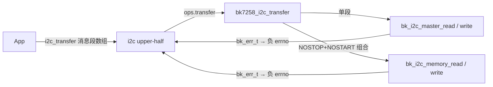
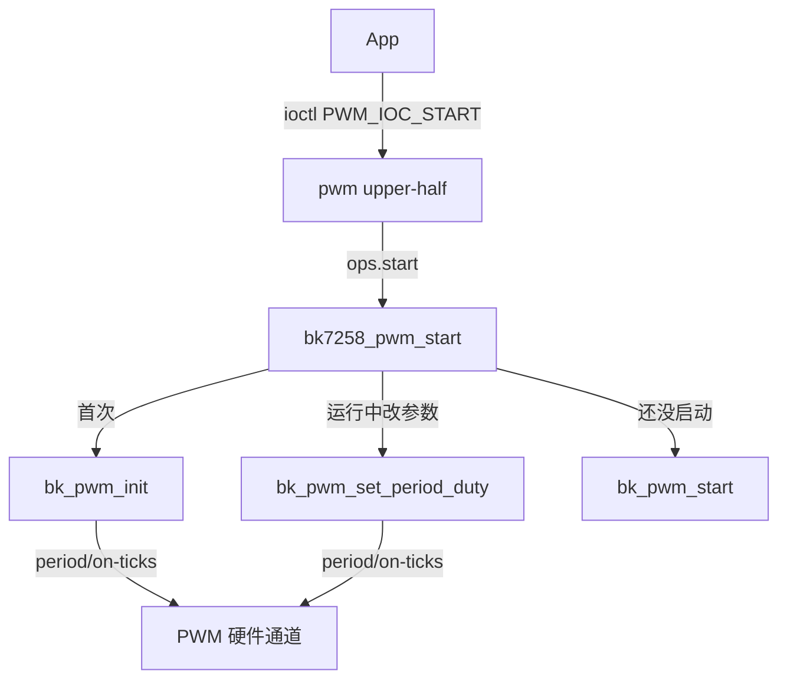
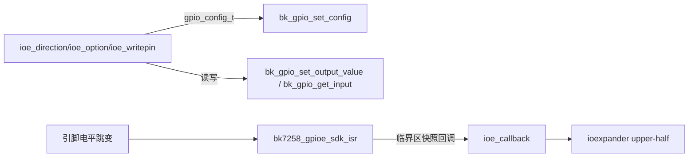
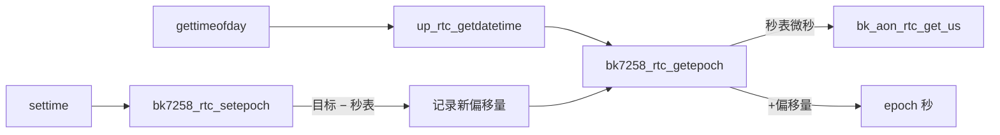
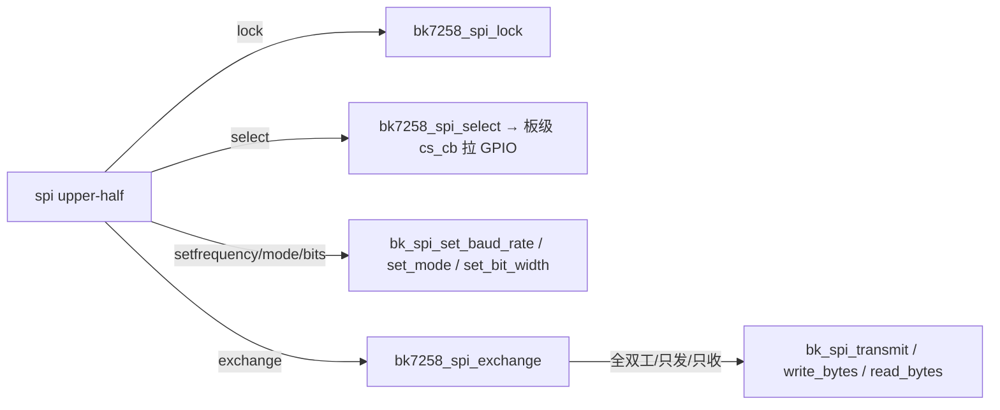
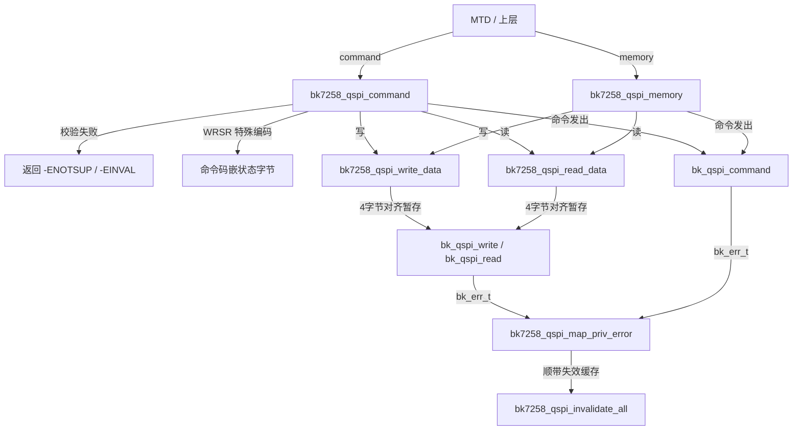

# ap-外设驱动一

> 本讲是 BK7258 AP 外设驱动第一批（I2C、PWM、GPIOE、RTC、SPI、QSPI）的源码精读。
> 目标读者：能写 C、但没写过芯片驱动的小白。

---

## 本组导读

这组代码是整个系统里"芯片外设能力"的接入层。芯片上有 I2C、PWM、GPIO 等硬件单元，NuttX 内核想用它们，得先有人把它们包装成 NuttX 认识的接口。这六个文件全是 **lower-half**（下半层）驱动：只把 NuttX 的标准接口翻译成 Beken armino SDK 的 `bk_*` 函数调用，**一行寄存器都不碰**。

> 💡 【背景知识】什么是 lower-half / upper-half？NuttX 把驱动劈成两半：**upper-half** 是内核里通用的设备框架（如 `/dev/i2c0` 的注册和管理），所有芯片通用；**lower-half** 是芯片相关的实现，每个芯片自己写。App 只跟 upper-half 打交道，upper-half 调 lower-half，lower-half 调 SDK，SDK 再去配寄存器。移植新芯片时只需重写 lower-half，框架完全复用。

它们在系统里的位置（顺着箭头走一遍就是一次完整的读写）：

```
App ──open/read/write──► NuttX upper-half 框架 (/dev/i2c0 /dev/pwm0 /dev/rtc0 ...)
                              │ 调用 ops 函数表
                              ▼
        本组 6 个文件：NuttX lower-half（chip/ap/bk7258_*.c）
        i2c→bk_i2c_*  pwm→bk_pwm_*  gpioe→bk_gpio_*  rtc→bk_aon_rtc_*
        spi→bk_spi_*  qspi→bk_qspi_*
                              │ 调用
                              ▼
                        Beken armino SDK bk_* HAL
                              │ 写寄存器
                              ▼
                           BK7258 硬件
```

> 关键词：**零寄存器访问**。这六个文件里找不到一个 `*(volatile uint32_t *)`——Beken 官方 SDK 已把寄存器操作包好，我们只做"翻译"。

---

## 文件：bk7258_i2c.c

### 它干什么

把 NuttX 的 `i2c_master_s` 接口翻译成 SDK 的 `bk_i2c_*`，让 NuttX 程序能通过标准 I2C 接口读写挂在 I2C 总线上的从设备（传感器、显示屏等）。

> 💡 【背景知识】I2C 像一条**半双工双线电话线**：一根时钟线 SCL、一根数据线 SDA，从设备（各有独立地址）都挂在这条线上。每次通信发 START（起始）、地址+读写位、数据、STOP（停止）。NuttX 把一次通信拆成一个或多个 `i2c_msg_s`（消息段）。

### 核心结构

- `struct bk7258_i2c_priv_s`：本驱动"私有档案袋"——NuttX 接口锚点 `dev`、互斥锁 `lock`、I2C 单元号 `id`、当前波特率 `baud`、初始化状态。
- `g_bk7258_i2c_ops`：**vtable 函数表**，NuttX 框架靠它回调我们的 `transfer/setup/shutdown`。
- `bk7258_i2c_map_err()`：SDK 错误码 → NuttX `-errno`。
- `bk7258_i2c_transfer()`：**核心**，处理一串消息段。
- `bk7258_i2c_initialize()`：注册成 `/dev/i2cN`。

### 关键代码逐段讲解

**① 错误码翻译**（`bk7258_i2c.c:149-164`）：SDK 和 NuttX 各说各话，必须有"同声传译"。`BK_ERR_I2C_ACK_TIMEOUT`（从设备没回 ACK）→ `-ENXIO`（没这个设备）；`BK_ERR_I2C_SCL_TIMEOUT` → `-ETIMEDOUT`；`BK_ERR_I2C_NOT_INIT` → `-EAGAIN`；`BK_ERR_I2C_SM_BUS_BUSY` → `-EBUSY`。不翻译，上层就收到莫名其妙的数字。

**② 组合事务识别**（`bk7258_i2c_transfer`，`bk7258_i2c.c:269-312`）：这是全文件最聪明的部分。

背景：I2C 读寄存器常用"**repeated start**"：先发"寄存器地址"（写），不释放总线，紧接着"读数据"（读）。NuttX 把这两步表示成两个消息段：第一段写地址带 `I2C_M_NOSTOP`（别停！），第二段读数据带 `I2C_M_NOSTART`（别重新开始！）。但 SDK 的 `bk_i2c_master_read/write` 每次都自己发 START+STOP，好在 `bk_i2c_memory_read/write` 在**内部**做这种组合事务。

```c
if (!is_read && (i + 1) < count &&
    ((msg->flags & I2C_M_NOSTOP) != 0 ||
     (msgs[i + 1].flags & I2C_M_NOSTART) != 0) &&
    (msg->length == 1 || msg->length == 2))
  {
    i2c_mem_param_t mem;
    mem.dev_addr      = msg->addr;
    mem.mem_addr      = (msg->length == 2)
                        ? ((uint32_t)msg->buffer[0] << 8) | (uint32_t)msg->buffer[1]
                        : (uint32_t)msg->buffer[0];
    ret = next_read
          ? bk7258_i2c_map_err(bk_i2c_memory_read(priv->id, &mem))
          : bk7258_i2c_map_err(bk_i2c_memory_write(priv->id, &mem));
    i++;   /* consume the paired read */
  }
```

大白话：看到"写段带 NOSTOP、后面紧跟读段"的组合，就合并成一次 `bk_i2c_memory_read()`（寄存器地址取第一段的 1~2 字节数据），然后 `i++` 跳过已消化掉的第二段。遇到 NOSTOP/NOSTART 但组合不出来（如地址不是 1/2 字节），直接返回 `-ENOTSUP` **拒绝**——绝不偷偷拆成两次独立 START/STOP，那会改变线上时序，从设备会懵。

### 流程/关系图



---

## 文件：bk7258_pwm.c

### 它干什么

把 NuttX 的 `pwm_lowerhalf_s` 接口翻译成 `bk_pwm_*`，让上层控制某个 PWM 通道的输出频率和占空比。

> 💡 【背景知识】PWM 像一个**快速开关的电灯旋钮**：频率（period）是每秒开关多少次，占空比（duty）是一个周期里"亮"的时间占比。LED 调亮度、电机调速全靠它。NuttX 用 `pwm_info_s` 告诉驱动：`frequency`（Hz）+ `duty`（16.16 定点小数，65536 = 100%）。

### 核心结构

- `struct bk7258_pwm_priv_s`：档案袋——通道号 `chan`、三个状态标志（SDK 驱动/通道/运行中）、互斥锁。
- `g_bk7258_pwm_ops`：vtable：`setup/shutdown/start/stop/ioctl`。
- `bk7258_pwm_start()`：**核心**，把频率+占空比换算成 SDK 的周期+on-ticks。
- `bk7258_pwm_initialize()`：`pwm_register()` 注册成 `/dev/pwmN`。

### 关键代码逐段讲解

**① 频率→周期的换算**（`bk7258_pwm_start`，`bk7258_pwm.c:318-330`）：SDK 的时钟是 26 MHz 晶振，一个滴答 = 1/26MHz 秒。

```c
/* period_cycle = CLK_HZ / frequency. */
period = BK7258_PWM_CLK_HZ / info->frequency;

on_ticks = (uint64_t)period * info->duty;
on_ticks = (on_ticks + (BK7258_PWM_DUTY_SCALE / 2u)) /
           BK7258_PWM_DUTY_SCALE;
```

大白话：先算"一个完整波形占多少个时钟滴答"（1kHz 就是 `26M / 1000 = 26000` 个）。再把 NuttX 的 16.16 定点占空比（0~65535）换算成"高电平占几个滴答"，`+ 32768` 是四舍五入，避免 50% 算成 0.9999 或 1.0001。

**② 首次启动 vs 运行时更新**（`bk7258_pwm.c:332-378`）：第一次用 `bk_pwm_init` 初始化通道并带初值；之后改参数用 `bk_pwm_set_period_duty`（SDK 走"加载新配置"硬件路径，运行中的波形不闪断）；最后只在没启动过时调 `bk_pwm_start`。这就是 NuttX upper-half 要求的"运行时更新不能有可感知停顿"。每次操作都先用互斥锁 `nxmutex_lock` 串行化，防止多线程同时改参数。

> 小坑（文件头注释）：SDK 内部会把 `duty_cycle` **取反**存储（硬件 CCR 要的是低电平时间），所以代码故意把"高电平滴答数"当 `duty_cycle` 传，让 SDK 反过来得到正确的高电平时间。

### 流程/关系图



---

## 文件：bk7258_gpioe.c

### 它干什么

把 BK7258 的普通 GPIO（GPIO0~GPIO46）包装成 NuttX 的 **ioexpander**（IO 扩展器）接口，让上层统一配置引脚方向、上下拉、读写电平、注册中断回调。

> 💡 【背景知识】"ioexpander"本来指挂在 I2C 上的 IO 扩展芯片。NuttX 干脆用同一套 `ioexpander` 接口抽象**芯片自己的 GPIO**——所以叫"GPIOE"，上层不用管 GPIO 是片内还是外挂。引脚像**一排接线柱**：能设成输入（听电压）或输出（灌电压），能开内部上拉/下拉，甚至配成"电平变化就打断 CPU"（中断）。

### 核心结构

- `struct bk7258_gpioe_priv_s`：档案袋——引脚数 `npins`、每脚反转标志 `invert[]`、每脚中断配置、ISR 槽位数组。
- `g_bk7258_gpioe_ops`：vtable：`direction/option/writepin/readpin/readbuf/attach/detach`。
- `bk7258_gpioe_ensure_driver()`：懒加载，第一次用才调 `bk_gpio_driver_init()`（SDK 幂等可重复调）。
- `bk7258_gpioe_direction()`：**核心**，方向枚举 → SDK 的 `gpio_config_t`。
- `bk7258_gpioe_attach/detach()`：中断回调注册/注销。

### 关键代码逐段讲解

**① 方向翻译 + 失败关闭**（`bk7258_gpioe_direction`，`bk7258_gpioe.c:262-295`）：

```c
case IOEXPANDER_DIRECTION_IN_PULLUP:   /* 输入 + 上拉 */
  cfg.io_mode = GPIO_INPUT_ENABLE;
  cfg.pull_mode = GPIO_PULL_UP_EN;
  break;
...
case IOEXPANDER_DIRECTION_OUT_OPENDRAIN:
case IOEXPANDER_DIRECTION_OUT_LED:
  /* Silently selecting push-pull can damage a shared bus,
   * so unsupported electrical modes must fail closed. */
  rc = -ENOTSUP;
  goto out;
```

大白话：把 NuttX 的"方向名词"翻译成 SDK 的 `io_mode` + `pull_mode` 组合。特别的是**开漏输出**：SDK 接口表达不了这种电气模式，如果悄悄改成推挽输出，可能把共享总线上的其他设备短路烧掉——所以直接返回"不支持"（fail closed，宁可拒绝也不冒险）。这是典型的嵌入式安全设计。

**② 中断回调转发**（`bk7258_gpioe_sdk_isr`，`bk7258_gpioe.c:620-628`）：

```c
flags = enter_critical_section();
callback = slot->active ? slot->callback : NULL;
arg      = slot->arg;
leave_critical_section(flags);

if (callback != NULL)
  {
    callback(&priv->dev, ((ioe_pinset_t)1 << gpio_id), arg);
  }
```

大白话：SDK 的 `bk_gpio_register_isr()` 按引脚精确分发——哪个脚触发就调哪个函数。中断里先关中断（临界区）**快照**出回调指针，再到临界区**外**调用，防止"读到一半回调被 detach 改掉"。第二个参数 `1 << gpio_id` 是位图，告诉上层"第几脚响了"。

### 流程/关系图



---

## 文件：bk7258_rtc.c

### 它干什么

把 Beken 的 AON RTC（常开域实时计数器）包装成 NuttX 的 RTC 接口，提供 `/dev/rtc0`、`gettimeofday` 等读/设时间能力。

> 💡 【背景知识】RTC 像一个**永不掉电的秒表**：数的是芯片上电以来的微秒数（`bk_aon_rtc_get_us()`）。但 NuttX 想要的是"1970-01-01 至今的秒数"（epoch 时间戳）。差多少？差一个**偏移量**。本驱动的大聪明：把偏移量记在内存里，读时间 = 秒表 + 偏移量。

### 核心结构

- `struct bk7258_rtc_priv_s`：档案袋——自旋锁 `lock`、epoch 偏移量 `epoch_offset_us`、`settime_called` 标志。
- `g_bk7258_rtc_ops`：vtable：`rdtime/settime/havesettime`。
- `bk7258_rtc_getepoch()` / `bk7258_rtc_setepoch()`：**核心**，秒表 ↔ epoch 双向换算。
- `up_rtc_*`：NuttX 系统时钟钩子。

### 关键代码逐段讲解

**① 读时间**（`bk7258_rtc_getepoch`，`bk7258_rtc.c:103-114`）：

```c
flags = spin_lock_irqsave(&priv->lock);
offset = priv->epoch_offset_us;
spin_unlock_irqrestore(&priv->lock, flags);

epoch_us = (int64_t)bk_aon_rtc_get_us() + offset;
if (epoch_us < 0)
  {
    return -ERANGE;
  }

*seconds = (time_t)(epoch_us / 1000000ll);
```

大白话：先在自旋锁保护下取偏移量（自旋锁=忙等锁，防止 64 位偏移量被读成一半），再问 SDK 秒表走了多少微秒，加起来除一百万变成秒。结果小于 0 说明还没设过时间（秒表从复位开始计、偏移量为 0），返回范围错误。

**② 设时间**（`bk7258_rtc_setepoch`，`bk7258_rtc.c:128-132`）：反过来算偏移量——偏移量 = 想要的时间 − 现在秒表读数，之后每次读自动加上：

```c
priv->epoch_offset_us = desired_us - (int64_t)bk_aon_rtc_get_us();
priv->settime_called = true;
```

注意偏移量只存在 AP 的 RAM 里，重启就没了——因为 SDK 的"持久化时间"走 EasyFlash，而 Flash 归 CP 核管，AP 不能碰（所有权边界），所以故意不持久化。文件头注释：将来做持久时间必须走 RPMsg 跨核通道找 CP 帮忙。

### 流程/关系图



---

## 文件：bk7258_spi.c

### 它干什么

把 NuttX 的 `spi_dev_s` 接口翻译成 `bk_spi_*`，让 NuttX 程序能标准地跟 SPI 设备（Flash、传感器、显示屏）通信。

> 💡 【背景知识】SPI 像一条**四线高速铁路**：SCK（时钟）、MOSI（主机→从机）、MISO（从机→主机）、CS（片选，选中哪节车厢）。NuttX 有固定访问套路：`lock`（锁总线）→ `select`（拉低 CS）→ `setfrequency/setmode/setbits`（设速度/极性/位宽）→ `exchange`（收发）→ `select(false)` → `unlock`。这就是 `spi_ops_s` 里的函数。

### 核心结构

- `struct bk7258_spi_priv_s`：档案袋——SPI 单元 `id`、缓存的频率/模式/位宽、两个 init 标志、**CS 回调** `cs_cb`。
- `g_bk7258_spi_ops`：vtable：`lock/select/setfrequency/setmode/setbits/status/exchange`。
- `bk7258_spi_exchange()`：**核心**，按 tx/rx 有无挑对应 SDK 调用。
- `bk7258_spi_initialize()`：建配置、init SDK、返回 `spi_dev_s*`；`bk7258_spi_set_csinfo()` 注入 CS 回调。

### 关键代码逐段讲解

**① 数据交换三分支**（`bk7258_spi_exchange`，`bk7258_spi.c:326-340`）：

```c
if (txbuffer != NULL && rxbuffer != NULL)
  {
    err = bk_spi_transmit(priv->id, txbuffer, (uint32_t)nbytes,
                         rxbuffer, (uint32_t)nbytes);       /* 全双工 */
  }
else if (txbuffer != NULL)
  {
    err = bk_spi_write_bytes(priv->id, txbuffer, (uint32_t)nbytes);
  }
else
  {
    err = bk_spi_read_bytes(priv->id, rxbuffer, (uint32_t)nbytes);
  }
```

大白话：SPI 全双工，但调用方有时只想发（写 Flash 命令）、只想收（读数据）。按"有无发缓冲/收缓冲"三种组合挑最省事的 SDK 函数。前面还有溢出检查 `nwords > UINT32_MAX / (bits/8)`，防止字节数算溢出——很典型的嵌入式防御。

**② 片选是个回调**（`bk7258_spi_select`，`bk7258_spi.c:216-219`）：Beken 的 SPI 驱动**没有片选概念**——CS 引脚是普通 GPIO，由板级代码自己拉。所以文件留一个"插座"（`cs_cb` 回调），板级代码通过 `bk7258_spi_set_csinfo()` 把"拉哪根 GPIO"的函数塞进来；没塞就根本不动 CS。这就是"驱动与板子解耦"的典型手法。

### 流程/关系图



---

## 文件：bk7258_qspi.c

### 它干什么

把 NuttX 的 `qspi_dev_s` 接口翻译成 `bk_qspi_*`，让上层能通过 QSPI 访问板载 NOR Flash（MTD 驱动就走这条路读写）。它是最谨慎的一个文件——对 SDK 做不到的事一律 `-ENOTSUP` 拒绝。

> 💡 【背景知识】QSPI 是 SPI 的"四线版"：数据线从 1 根变 4 根，快 4 倍，专门接 NOR Flash。Flash 命令一般是：**命令码 + 地址 + 假时钟(dummy) + 数据**。NuttX 用 `qspi_cmdinfo_s`（命令级）和 `qspi_meminfo_s`（内存窗口级）描述。Beken 这个 SDK 有几个**固化怪癖**（源码注释逐条核实）：
> - FIFO 单次最多传 256 字节；
> - 除少数命令（读状态 0x05、读 ID 0x9F、写使能 0x06 等）外，其余命令**强制发 3 字节地址**；
> - 写状态寄存器（WRSR）的字节要塞进命令码的 [15:8] 位，不走数据 FIFO；
> - 没有运行时改频率/模式的接口，只有 mode 0、8 bit 能用。

### 核心结构

- `struct bk7258_qspi_priv_s`：档案袋——QSPI 单元 `id`、`mode_valid/bits_valid`（只有 mode0/8bit 算有效）、`initialized`；`g_bk7258_qspi[2]` 是两个单元的数组。
- `g_bk7258_qspi_lock`：全局互斥锁（SDK 的 QSPI 状态是全局的，两单元共用一把锁）。
- `bk7258_qspi_command()` / `bk7258_qspi_memory()`：**核心**——命令级操作、内存窗口级读写（大读取按 256 字节分块）。
- `bk7258_qspi_write_data/read_data()`：数据进/出 FIFO 前的对齐处理。

### 关键代码逐段讲解

**① 无地址命令白名单**（`bk7258_qspi_no_address_command`，`bk7258_qspi.c:550-562`）：

```c
if (read)
  {
    return opcode == BK7258_QSPI_CMD_READ_STATUS_0 ||
           opcode == BK7258_QSPI_CMD_READ_STATUS_1 ||
           opcode == BK7258_QSPI_CMD_READ_ID;
  }
return opcode == BK7258_QSPI_CMD_WRITE_STATUS_0 ||
       opcode == BK7258_QSPI_CMD_WRITE_STATUS_1 ||
       opcode == BK7258_QSPI_CMD_WRITE_ENABLE;
```

大白话：SDK 底层只有这几条命令的编码支持"不带地址"，其他命令一律强行发 3 字节地址。所以 `command()` 有关键校验——NuttX 说"不带地址"但命令码不在名单上，就返回 `-ENOTSUP`，**绝不让 SDK 把凭空多出的地址放到总线上**（那会让 Flash 执行错命令）。

**② WRSR 状态写编码**（`bk7258_qspi_command`，`bk7258_qspi.c:718-734`）：

```c
if (QSPICMD_ISWRITE(cmdinfo->flags) &&
    bk7258_qspi_is_status_write(cmdinfo->cmd))
  {
    if (cmdinfo->buflen > 1)
      {
        return -ENOTSUP;
      }
    command.cmd |= (uint32_t)cmdinfo->buffer[0] << 8;  /* 状态字节塞进命令码高8位 */
    command.data_len = 0;                               /* 不走数据 FIFO */
    encoded_status_write = true;
  }
```

大白话：NuttX 眼里"写状态寄存器"是普通"命令码+数据"；但 SDK 的编码是"状态字节塞进命令码高 8 位、没有 FIFO 数据"。代码把 NuttX 标准形式翻译成 SDK 怪癖形式：数据字节左移 8 位并进 `command.cmd`，数据长度清零。超过 1 字节就拒绝（SDK 表达不了"高字节为 0 的双字节状态"）。

**③ 大读分块**（`bk7258_qspi_memory`，`bk7258_qspi.c:916-959`）：

```c
while (remaining > 0)
  {
    chunk = remaining > BK7258_QSPI_FIFO_BYTES ?
            BK7258_QSPI_FIFO_BYTES : remaining;
    memset(&command, 0, sizeof(command));
    command.device = QSPI_FLASH;
    command.work_mode = INDIRECT_MODE;
    command.op = QSPIMEM_ISREAD(meminfo->flags) ? QSPI_READ : QSPI_WRITE;
    command.cmd = meminfo->cmd;
    command.addr = meminfo->addr + offset;          /* 每块重新寻址 */
    command.dummy_cycle = meminfo->dummies;
    command.data_len = chunk;
    command.wire_mode = wire_mode;                  /* 1 线或 4 线 */
    ...
    offset += chunk;
    remaining -= chunk;
  }
```

大白话：写操作在 `validate_memory` 里被限死成单次 ≤256 字节（不能拆——拆了就要自己实现 Flash 页编程协议，通用 lower-half 不该乱猜）；读可以拆——每次 256 字节一块、带 `addr + offset` 重新寻址循环读完。`dummy_cycle` 把 Flash 要的假时钟周期传给硬件，`wire_mode` 按普通读还是 QUADIO（四线读）选 1 线或 4 线。

**④ 对齐暂存**（`bk7258_qspi_write_data`，`bk7258_qspi.c:451-474`）：SDK 的 FIFO 按 32 位字访问，要求缓冲区 4 字节对齐、长度是 4 的倍数。不满足就 `kmm_malloc` 开一块补齐的临时副本，`memset` 清零再 `memcpy` 拷入，用完 `kmm_free`。这就是"**暂存区（staged buffer）**"模式——硬件苛刻时软件替调用方兜底。

### 流程/关系图



---

## 总结：六个文件放一起看

| 文件 | NuttX 接口 | SDK 来源 | 最值得记住的一招 |
|---|---|---|---|
| bk7258_i2c.c | `i2c_master_s` | `bk_i2c_*` | NOSTOP+NOSTART 组合事务合流成 `memory_read/write` |
| bk7258_pwm.c | `pwm_lowerhalf_s` | `bk_pwm_*` | Hz+定点占空比 → 周期滴答数+on-ticks |
| bk7258_gpioe.c | `ioexpander_dev_s` | `bk_gpio_*` | 开漏等不支持的电气模式 **fail closed** |
| bk7258_rtc.c | `rtc_lowerhalf_s` | `bk_aon_rtc_*` | 秒表 + 内存偏移量 = epoch，不碰 CP 的 Flash |
| bk7258_spi.c | `spi_dev_s` | `bk_spi_*` | CS 是板级回调，驱动不管 GPIO |
| bk7258_qspi.c | `qspi_dev_s` | `bk_qspi_*` | SDK 怪癖全部显式拒绝/改编，绝不悄悄改协议 |

共同套路（也就是 22-驱动适配范式那套）：
1. 一个 `struct bkxxxx_priv_s` 档案袋，第一个成员是 NuttX 接口结构（vtable 锚点）；
2. 一张静态 ops 函数表，NuttX 框架靠它回调；
3. 每个 SDK 错误都过 `map_err` 翻译成 errno；
4. 全局资源（`bk_*_driver_init`）只 init 一次，失败回滚标志位；
5. SDK 做不到的事，宁可 `-ENOTSUP` 拒绝，也不偷偷改变协议——**六个文件无一例外**。

---

## 相关学习文档

- [./22-驱动适配范式.md](../22-驱动适配范式.md) —— 理论基础：lower-half 封装 SDK 的套路
- [./23-外设驱动详解-一(I2C-PWM-GPIOE).md](../23-外设驱动详解-一%28I2C-PWM-GPIOE%29.md) —— 配套概念讲解
- [./26-驱动注册与常见坑.md](../26-驱动注册与常见坑.md) —— `bk7258_*_initialize()` 在哪被调用、有哪些坑
- [./21-armino-SDK集成.md](../21-armino-SDK集成.md) —— SDK 头文件与 libdriver.a 的来源
- [./13-Flash分区布局.md](../13-Flash分区布局.md) —— QSPI 接的 Flash 长什么样

## 源码路径

```
$CONTEST/board/bk7258/chip/ap/bk7258_i2c.c
$CONTEST/board/bk7258/chip/ap/bk7258_pwm.c
$CONTEST/board/bk7258/chip/ap/bk7258_gpioe.c
$CONTEST/board/bk7258/chip/ap/bk7258_rtc.c
$CONTEST/board/bk7258/chip/ap/bk7258_spi.c
$CONTEST/board/bk7258/chip/ap/bk7258_qspi.c
```

配套头文件在 `$CONTEST/board/bk7258/include/arch/chip/`（`bk7258_i2c.h`、`bk7258_pwm.h`、`bk7258_gpioe.h`、`bk7258_rtc.h`、`bk7258_spi.h`、`bk7258_qspi.h`），里面是各驱动的默认配置宏（单元号、默认频率等）。
