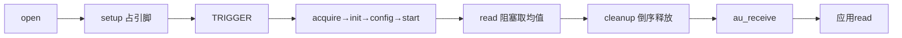
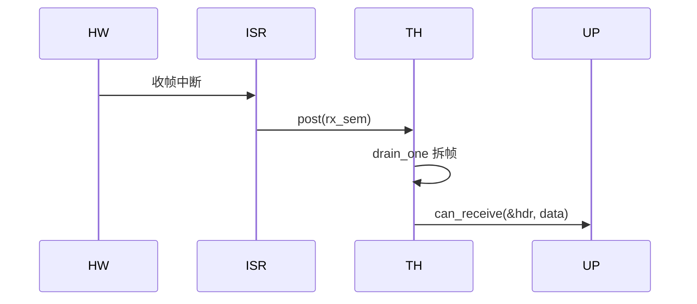
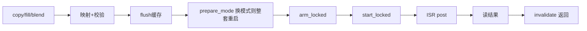
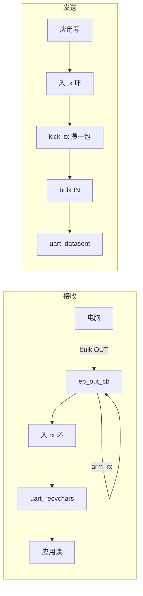

# ap-外设驱动二
## 本组导读
BK7258 是双核异构芯片：**AP 核跑 NuttX 系统**，**CP 核跑贝肯 armino 裸机固件**。AP 侧驱动不直接摸寄存器，而是把官方 SDK（v3.1.1.9 静态库）里的 `bk_xxx_*` 函数包一层 NuttX **lower-half（下半部）**驱动壳，让 NuttX 上半部的 ADC / CAN / 音频 / 串口框架能用。这批共 6 个驱动：

```
上半部框架:  adc     adc      can     audio     (无框架)    serial
lower-half:  saradc  sdmadc   can      i2s      dma2d      usbcdc
底层方式:    CP邮箱IPC 阻塞SDK  ISR+线程 私有worker  板级API   CherryUSB
```
- **SARADC**：逐次逼近型 ADC，每次转换经**邮箱（mbox，跨核消息信箱）IPC** 到 CP 核远程执行，需 acquire/init/config/start/read/stop/deinit/release 全套流程。
- **SDMADC**：16 位高精度 ADC，SDK 一个函数全包，驱动最薄。
- **CAN**：SDK 中断回调只能发信号量，另起**内核线程**取帧喂协议栈。
- **I2S**：SDK 只有轮询 FIFO，NuttX 却要求 send/receive 立即返回，靠**专属 worker 线程**排队搬运。
- **DMA2D**：2D 图形加速器，NuttX 无框架，直接暴露 `copy/fill/blend` 板级 API。
- **USB CDC**：USB 模拟串口 `/dev/ttyGS0`，底层交 CherryUSB，本文件管描述符、环形缓冲、串口对接。

> 💡 术语："**upper-half / lower-half**"是 NuttX 驱动分工：上半部是通用框架（open/read/write、协议栈），下半部是芯片实现（硬件/SDK）。驱动作者写 lower-half，向框架注册一张函数表（ops），框架到点调用。

---

## 文件：bk7258_saradc.c
### 它干什么
把"经 CP 邮箱 IPC 远程操作 SARADC"的 SDK 调用包成 NuttX ADC 字符设备 lower-half，每次 `ANIOC_TRIGGER` 触发一次单次转换并把原始采样推给上半部。
### 💡 【背景知识】这个文件解决什么问题
SARADC 这台机器在"物业中心"（CP 核），AP 只能**打电话让物业代劳**，每个电话就是一次邮箱 IPC。所以每次转换必须按顺序：**借钥匙(acquire)→开电源(init)→设参数(config)→按开关(start)→看表盘(read)→关电源(stop)→断电(deinit)→还钥匙(release)**，中途出错还要倒序收拾现场，否则下一位"住户"（如温度采样）会出问题。
### 【核心结构】
| 名字 | 类型 | 人话解释 |
|---|---|---|
| `struct bk7258_saradc_priv_s` | 结构体 | 通道号、回调、互斥锁、错误标记 |
| `bk7258_saradc_ioctl()` | 函数 | 核心：执行完整单次转换流程 |
| `bk7258_saradc_cleanup_conversion()` | 函数 | 倒序释放资源，不重试"结果不明"的 release |
| `_Static_assert` | 编译期断言 | 校验 SDK 结构体布局，防 ABI 变化 |
### 【关键代码逐段讲解】
**① 编译期锁定 SDK 结构布局（bk7258_saradc.c:81-92）**
```c
_Static_assert(sizeof(adc_config_t) == 36, "unexpected ... size");
_Static_assert(offsetof(adc_config_t, adc_mode) == 16, ...);
```
`adc_config_t` 要跨 AP/CP 两个编译单元传给 CP。哪天编译的枚举布局变了，两端"长得不一样"就会传错数据。这里在**编译期**量好尺寸和字段偏移，对不上直接编译失败。
**② 单次转换主流程（bk7258_saradc.c:552-645）**
```c
sdk_error = bk_adc_acquire();          // 借钥匙：申请 CP 侧独占权
g_bk7258_saradc_diag.resources |= BK7258_SARADC_RESOURCE_INITED;
sdk_error = bk_adc_init((adc_chan_t)priv->chan);   // 开电源+复位寄存器
memset(&config, 0, sizeof(config));                // 每次全量重下配置
config.adc_mode = ADC_CONTINUOUS_MODE;
sdk_error = bk_adc_set_config(&config);
sdk_error = bk_adc_start();                        // 按开关
sdk_error = bk_adc_read(&raw, CONFIG_..._READ_TIMEOUT_MS);  // 看表盘
```
三个"为什么"：
- **resources 位图在 init/start 前提前置位**（571 行）：CP 可能已执行但回执丢失，AP 只收到含糊的 `BK_FAIL`。提前记账，cleanup 宁可多做反向调用也不漏做。
- **每次重新 memset 全量下发**（590 行）：`bk_adc_init()` 会复位控制寄存器，且两次转换间别的客户端可能改过配置，从零设一遍最稳。
- **调用 `bk_adc_enable_bypass_clalibration()`**（616 行，SDK 拼写如此）：绕过硬件偏移校准，NuttX 要求发布原始值。
**③ 状态机式收尾（bk7258_saradc.c:290-377）**
```c
if ((...resources & STARTED) != 0)  { ... bk_adc_stop() ... }
if (... & INITED) != 0)            { ... bk_adc_deinit() ... }
if (... & ACQUIRED) != 0 && !priv->release_uncertain)
  { ... bk_adc_release() ... }
```
按"从内到外"释放：stop → deinit → release。第三段多了 `!priv->release_uncertain`：**release 一旦返回过含糊失败就永不重试**——`BK_FAIL` 既可能"没成功"也可能"成功但回执丢了"，重试会误释放**下一任拥有者**的锁，宁可让实例"带病"（faulted）要求重启。
**④ 投递采样（bk7258_saradc.c:698-703）**
```c
flags = spin_lock_irqsave(&dev->ad_spinlock);
callback_error = priv->cb->au_receive(dev, (uint8_t)priv->chan, (int32_t)raw);
spin_unlock_irqrestore(&dev->ad_spinlock, flags);
```
特意用 `ad_spinlock`（自旋锁）而非私有互斥锁：上半部 FIFO 生产者不自带锁，用公开锁串起来；且投递在**解锁私有锁之后**，避免 ioctl 重入死锁。
### 【流程/关系图】


---

## 文件：bk7258_sdmadc.c
### 它干什么
把 SDK 的 SDMADC 高精度 ADC 包成第二个 ADC 设备：`setup` 初始化，每次 `ANIOC_TRIGGER` 阻塞读一次并回调上报。
### 💡 【背景知识】这个文件解决什么问题
SDMADC 是"慢工出细活"的 ADC：高频反复采样再取平均，换来 16 位精度。SDK 把过程封成 `bk_sdmadc_single_read()`，内部自配参数、启动、等信号量、算均值——**脏活 SDK 全干，这里只负责把函数调对**。唯一隐藏坑：必须先调 `bk_sdmadc_driver_init()` 再调 `bk_sdmadc_init()`，否则后者检查内部标志直接失败（源码注释明示）。
### 【核心结构】
| 名字 | 类型 | 人话解释 |
|---|---|---|
| `struct bk7258_sdmadc_priv_s` | 结构体 | 通道、回调、`inited` 标志 |
| `bk7258_sdmadc_setup()` | 函数 | 两步初始化：driver_init → init |
| `bk7258_sdmadc_ioctl()` | 函数 | TRIGGER 里调 `single_read` |
### 【关键代码逐段讲解】
**① 两步初始化（bk7258_sdmadc.c:154-180）**
```c
ret = bk_sdmadc_driver_init();
if (ret != BK_OK) { return -EIO; }
ret = bk_sdmadc_init();
if (ret != BK_OK)
  {
    bk_sdmadc_driver_deinit();   // 失败回滚第一步，不留半初始化状态
    return -EIO;
  }
priv->inited = true;
```
"先装驱动框架，再启动控制器"的固定顺序。第二步失败必须撤销第一步，否则重试时会撞上残留状态。
**② 单次读取（bk7258_sdmadc.c:244-260）**
```c
ret = bk_sdmadc_single_read(&raw, (uint16_t)priv->chan);
if (ret != BK_OK) { rc = -EIO; } else { deliver = true; }
nxmutex_unlock(&priv->lock);
if (deliver)
  { priv->cb->au_receive(dev, (uint8_t)priv->chan, (int32_t)raw); }
```
整个 TRIGGER 就这么短：**锁上 → 读一次 → 解锁 → 回调**，与 SARADC 的八步走对比鲜明。SDMADC 是纯 AP 本地操作，无跨核邮箱、无资源抢占。`deliver` 保证只在成功时推数据。
### 【流程/关系图】


---

## 文件：bk7258_can.c
### 它干什么
把经典 11 位 CAN 控制器包成 NuttX CAN 设备：SDK 管控制器和中断，ISR 只发信号量，私有内核线程取帧喂协议栈。
### 💡 【背景知识】这个文件解决什么问题
CAN 帧随时可能到，但 SDK 的**中断回调（ISR）运行在极短的硬件中断上下文**——在里面调用可能阻塞的 `bk_can_receive()`（它可能等 RTOS 信号量）是灾难。经典解耦：**ISR 只 post 信号量，一个普通优先级内核线程被唤醒后才取帧**。打比方：快递到了，门卫（ISR）只在门口喊一声"有快递！"，由值班员（线程）去搬货——门卫绝不能亲自搬，会堵住整个大门。
### 【核心结构】
| 名字 | 类型 | 人话解释 |
|---|---|---|
| `struct bk7258_can_s` | 结构体 | 信号量、线程 pid、收发缓冲、bool 标记 |
| `bk7258_can_rx_isr()` | ISR | 收到数据只 post 信号量 |
| `bk7258_can_rx_thread()` | 线程 | 等信号量 → 批量取帧 → `can_receive` |
| `bk7258_can_drain_one()` | 函数 | 从 SDK FIFO 拆一整帧（DLC+ID+数据） |
| `bk7258_can_send()` | 函数 | 检查空闲后 `bk_can_send_ptb` 非阻塞发送 |
| `bk7258_can_ioctl()` | 函数 | 波特率、环回、总线恢复 |
### 【关键代码逐段讲解】
**① ISR 只发信号量（bk7258_can.c:339-346）**
```c
static void bk7258_can_rx_isr(FAR void *arg)
{
  /* 不要在 ISR 里检查或取 SDK FIFO：bk_can_receive() 可能等信号量 */
  (void)nxsem_post(&priv->rx_sem);
}
```
注释把"为什么"写在脸上。**中断上下文安全**黄金法则：中断里只做原子轻操作（post 信号量、置标志），其余交给线程。
**② 接收线程主循环（bk7258_can.c:268-315）**
```c
ret = nxsem_wait(&priv->rx_sem);
if (priv->rx_thread_stop) { ...; break; }        // 退出信号
if (!bk7258_can_active(priv) || !priv->rx_enabled) { ...; continue; }
do {
  for (count = 0; count < BK7258_CAN_RX_BUDGET; count++) {
    ret = bk7258_can_drain_one(priv);            // 每轮最多拆8帧
    if (ret < 0) { if (ret != -EAGAIN && ret != -ETIMEDOUT) {...} break; }
  }
} while (count == BK7258_CAN_RX_BUDGET);         // 拆满说明还有，再来一轮
```
唤醒后先拿自旋锁检查状态。`-EAGAIN`（帧没凑齐）和 `-ETIMEDOUT` 不算错误，只有真正奇怪的错误才记入 `last_error`。预算 8 帧 + 兜底循环，一次唤醒尽量清空 FIFO。
**③ 拆一帧（bk7258_can.c:166-237）**
```c
sdkret = bk_can_receive(priv->rx_header + priv->rx_header_len, ...);
priv->rx_dlc = priv->rx_header[0];          // 头5字节: DLC + 4字节ID
id = (uint32_t)priv->rx_header[1] | ... << 24;
hdr.ch_id = id; hdr.ch_dlc = priv->rx_dlc;
ret = can_receive(&priv->dev, &hdr, priv->rx_data);   // 上交一整帧
```
分两段读：先读 5 字节头部，再按 DLC 读数据。SDK FIFO 记录**没有 IDE/RTR/FDF 位**，所以只交付"标准数据帧"，不臆造远端帧/CAN-FD 元数据——**硬件不给的信息不编**。
**④ 发送路径（bk7258_can.c:649-675）**
```c
if (priv->tx_busy || priv->tx_submitting) { ...; return -EBUSY; }  // 同时只飞一帧
priv->tx_busy = true; priv->tx_submitting = true;
sdkret = bk_can_send_ptb(&frame);    // PTB = SDK 非阻塞单帧路径
priv->tx_submitting = false;
if (ret < 0) { priv->tx_busy = false; }   // 失败立刻释放 busy
```
`tx_busy`（一帧在飞）与 `tx_submitting`（正在提交的瞬间）分工。提交失败必须清两个，否则设备"假死"拒绝一切发送。完成由 `bk7258_can_tx_isr` 回调 `can_txdone()`。
### 【流程/关系图】


---

## 文件：bk7258_i2s.c
### 它干什么
把 SDK 的轮询式 I2S FIFO 包成 NuttX I2S 接口：`send/receive` 立即入队返回，专属 worker 线程串行搬运，完成回调通知。
### 💡 【背景知识】这个文件解决什么问题
NuttX 音频框架要求：**`send()`/`receive()` 立刻返回**（"把货单交给仓库，不等货送完"），完成由回调通知。但 SDK 只有同步轮询接口。两种心智对不上，驱动造了一个"**转运仓库 + 专属搬运工**"：`send/receive` 当收货员，把请求（`bk7258_i2s_xfer_s`）打包入队立刻下班；搬运工线程 `bk7258_i2s_worker` 等队列信号量，被唤醒后取请求，**逐个样本轮询 FIFO**，搬完回调。轮询很耗 CPU，线程被 `pthread_attr_setaffinity_np` **钉在 CPU0**，避免双核颠簸。
### 【核心结构】
| 名字 | 类型 | 人话解释 |
|---|---|---|
| `struct bk7258_i2s_xfer_s` | 结构体 | 一次搬运请求：缓冲、回调、超时、方向 |
| `bk7258_i2s_worker()` | 线程 | 等队列 → 取请求 → 搬运 → 回调 |
| `bk7258_i2s_process()` | 函数 | 核心：逐样本等 FIFO 就绪、读写、单声道镜像 |
| `bk7258_i2s_enqueue()` | 函数 | send/receive 公共入口：打包入队 |
| `bk7258_i2s_unpack/pack()` | 函数 | 按位宽拆/装采样值 |
### 【关键代码逐段讲解】
**① 排队入口（bk7258_i2s.c:504-539）**
```c
if (priv->queued >= CONFIG_BK7258_I2S_QUEUE_DEPTH) { ret = -EAGAIN; goto out; }
apb_reference(apb);                 // 增加缓冲引用计数，防止上层提前释放
sq_addlast(&xfer->entry, &priv->queue);   // 挂入链表队列
nxsem_post(&priv->queuesem);              // 叫醒搬运工
return 0;                                 // 立即返回！
```
异步化骨架：把工作封装成请求对象，入队、发信号、**立刻返回**。`apb_reference` 是 NuttX 音频缓冲（`ap_buffer_s`）的引用计数——仓库收了货得先"保住"货。
**② 搬运工线程（bk7258_i2s.c:444-485）**
```c
priv->active = true;                    // 置"转运中"灯，配置类调用拒绝
ret = bk7258_i2s_process(priv, xfer);
priv->active = false;
if (xfer->callback != NULL)
  { xfer->callback(&priv->dev, xfer->apb, xfer->arg, ret); }
apb_free(xfer->apb);                    // 归还引用
kmm_free(xfer);                         // 释放请求对象
```
`active` 是"转运中"指示灯：`samplerate/datawidth/channels` 配置函数看到它就返回 `-EBUSY`，防止搬运途中改参数。
**③ 核心搬运（bk7258_i2s.c:348-417）**
```c
for (offset = 0; offset < length; offset += sample_bytes)
  {
    ret = bk7258_i2s_wait_ready(xfer->direction == BK7258_I2S_TX, start, xfer->timeout);
    sample = bk7258_i2s_unpack(&data[offset], priv->datawidth);
    bk_i2s_write_data(0, &sample, 1);
    if (channels == 1)   // 单声道: 再写一次, 镜像到右声道槽位
      { ... bk_i2s_write_data(0, &sample, 1) ... }
  }
```
`wait_ready` 盯 FIFO：轮询 `bk_i2s_get_write_ready/read_ready`，没就绪就 `nxsig_usleep(50us)` 再查，直到超时。**单声道镜像**：硬件 `I2S_LRCOM_STORE_LRLR` 每 FIFO 字对应左右槽位，NuttX mono 缓冲每帧只有一样本，所以要写两次，防止另一槽空洞、节奏错乱。
**④ 位宽拆装（bk7258_i2s.c:254-266）**
```c
uint8_t bytes = (width + 7) / 8;      // 16位→2字节, 24位→3字节
for (i = 0; i < bytes; i++)
  { sample |= (uint32_t)data[i] << (i * 8); }   // 小端拼装
```
`(width+7)/8` 向上取整算字节数，逐字节移位拼成采样整数。
### 【流程/关系图】


---

## 文件：bk7258_dma2d.c
### 它干什么
把 SDK 的 DMA2D 图形加速器封装成 `bk7258_dma2d_copy`（拷贝/格式转换）、`fill`（填充）、`blend`（混合）三个板级 API，供 framebuffer 使用。NuttX 无 DMA2D 框架，所以是**纯函数库**而非设备节点。
### 💡 【背景知识】这个文件解决什么问题
DMA2D 是"图形快递专线"：CPU 逐像素搬图像像蚂蚁搬家，专用硬件一次搬整块，还支持**像素格式转换（PFC）**和**透明混合**——GUI 上屏的关键操作。但这位快递专线有几个怪脾气：
1. **中断默认路由错核**：SDK 默认路由到物理 CPU2，而 NuttX AP 跑在物理 CPU1，必须搬过来。
2. **模式切换留后遗症**：先填充（R2M）再拷贝（M2M），硬件带旧状态干活，源数据根本没被读。模式一变就得整套 deinit/init 重启引擎。
3. **和 CPU 缓存不一致**：DMA 读前要 flush（把 CPU 脏数据赶出去），写后要 invalidate（作废缓存旧数据）。
### 【核心结构】
| 名字 | 类型 | 人话解释 |
|---|---|---|
| `struct bk7258_dma2d_s` | 结构体 | 互斥锁、完成信号量、`faulted` 中毒标志 |
| `bk7258_dma2d_route_irq_to_ap_primary()` | 函数 | 把中断从 CPU2 搬到 AP 核 |
| `bk7258_dma2d_prepare_mode_locked()` | 函数 | 换模式时重启引擎并重建回调 |
| `bk7258_dma2d_start_locked()` | 函数 | 启动 → 等信号量 → 超时中毒处理 |
| `bk7258_dma2d_validate_extent()` | 函数 | 64 位运算校验矩形不越界不溢出 |
| `bk7258_dma2d_copy/fill/blend` | 函数 | 三个对外业务函数 |
### 【关键代码逐段讲解】
**① 等完成的核心 start_locked（bk7258_dma2d.c:447-510）**
```c
priv->irq_result = BK7258_DMA2D_IRQ_PENDING;
priv->operation_active = true;
__asm volatile ("dmb sy" ::: "memory");     // 内存屏障: CPU写先于DMA可见
sdkret = bk_dma2d_start_transfer();
ret = nxsem_tickwait_uninterruptible(&priv->completion, ticks);  // 阻塞等ISR
if (ret == -ETIMEDOUT)
  {
    (void)bk_dma2d_stop_transfer();         // SDK 无有界取消 API
    priv->faulted = true;                   // 中毒: 实例作废直到 deinit
  }
ret = priv->irq_result;                     // 拿 ISR 记的结果
```
- **`dmb sy`**：启动前保证 CPU 写入对加速器可见，结束后保证 DMA 写回对 CPU 可见——**内存屏障**让读写顺序不乱套。
- **超时即中毒**：SDK 没有有界取消 API，超时后引擎可能还在跑，`stop_transfer` 只能阻止新启动，`faulted=true` 让一切数据操作直接失败——**绝不复用可能还在写的 DMA**。
- **`irq_result` 是 ISR 与线程的"传话纸条"**：完成回调写 0，错误回调写 `-EIO` 且粘性。
**② 换模式重启引擎（bk7258_dma2d.c:546-609）**
```c
if (priv->mode_valid && priv->last_mode != mode)
  {
    (void)bk_dma2d_int_enable(BK7258_DMA2D_IRQ_MASK, false);   // 先关中断
    bk7258_dma2d_unroute_ap_primary_irq();
    ... bk_dma2d_driver_deinit(); ... bk_dma2d_driver_init(); // 断电重启
    ... bk7258_dma2d_route_irq_to_ap_primary();               // 重新搬中断
    ... 重新注册三个 ISR 回调 ...
    ... bk_dma2d_int_enable(..., true);                       // 重新开中断
  }
```
注释很硬核："模块软复位对 BK7258 不够用，R2M 状态会残留到后面的 PFC/M2M 操作里"。所以**换模式 = 断电重启 + 全部重配**：关中断→撤路由→deinit→init→恢复路由→重挂回调→开中断，用整套重来换绝对干净。失败路径还要把回调清成 NULL，不留残余。
**③ 越界校验（bk7258_dma2d.c:347-367）**
```c
base = (uintptr_t)buffer;
if (base > UINT32_MAX) return -EOVERFLOW;      // SDK 把地址截成32位
last_row = (uint64_t)y + height - 1;
last_offset = (last_row * frame_width + x) * pixel_bytes + (uint64_t)width * pixel_bytes - 1;
if (last_offset > UINT32_MAX || base + last_offset > UINT32_MAX)
  return -EOVERFLOW;
```
SDK 内部用 32 位指针算术算地址。这里用 **64 位**先算"最后触碰字节"的位置，确认能塞进 32 位才放行——**宁可拒绝，不让截断悄悄发生**，这是防御不可变 SDK ABI 的典型姿势。
**④ copy 业务骨架（bk7258_dma2d.c:896-965）**
```c
pfc = src_bytes != FOUR_BYTES || ...;          // 决定普通M2M还是带格式转换
up_clean_dcache(src_start, src_end);      // DMA读前: 把CPU脏数据写出去
up_flush_dcache(dst_start, dst_end);
ret = bk7258_dma2d_prepare_mode_locked(priv, sdk.mode);
bk_dma2d_memcpy_or_pixel_convert(&sdk);   // 下发配置(void返回, 出错靠ISR报)
ret = bk7258_dma2d_arm_locked();          // 开时钟+使能中断
ret = bk7258_dma2d_start_locked(priv, copy->timeout_ms);   // 启动+等待
up_invalidate_dcache(dst_start, dst_end); // DMA写后: 作废缓存旧数据
```
黄金公式：**flush 源 → flush 目标 → 配模式 → 下发 → 启动等待 → invalidate 目标**。`bk_dma2d_memcpy_or_pixel_convert` 是 void 返回，配置失败只能靠 ISR 报——所以**不假设成功**。
### 【流程/关系图】


---

## 文件：bk7258_usbcdc.c
### 它干什么
把 USB 设备口做成 CDC-ACM 虚拟串口 `/dev/ttyGS0`：底层交 CherryUSB 组件，本文件负责描述符、端点和 NuttX 串口框架对接。
### 💡 【背景知识】这个文件解决什么问题
USB 是**由主机（电脑）主导**的总线，设备端只能"听候差遣"。贝肯 SDK 集成的 CherryUSB 把 MUSB 控制器脏活全干。本驱动做三件事：① **写清"我是谁"**——设备/配置描述符，告诉电脑"我是 CDC 串口"（ACM 控制 + 数据两个接口、三个端点）；② **当接线员**——收数据入**环形缓冲（ring buffer，固定大小循环队列，`head` 写、`tail` 读，写满一圈回开头）**，发数据从环取；③ **当翻译**——把串口框架的 `send/receive/rxavailable/...` 翻译成环和端点操作。
### 【核心结构】
| 名字 | 类型 | 人话解释 |
|---|---|---|
| `g_bk7258_usbcdc_config_desc` | 描述符数组 | 手工字节序列：接口+端点 |
| `struct bk7258_usbcdc_ring_s` | 结构体 | 环形缓冲：数据区 + head/tail |
| `bk7258_usbcdc_ep_out_cb()` | 回调 | 主机发来数据：入环 + 叫醒串口框架 |
| `bk7258_usbcdc_kick_tx()` | 函数 | 从 TX 环取一包发到 USB |
| `bk7258_usbcdc_initialize()` | 函数 | 注册描述符、端点、串口设备 |
### 【关键代码逐段讲解】
**① 环形缓冲（bk7258_usbcdc.c:198-222）**
```c
if (bk7258_usbcdc_ring_free(ring) == 0) { return false; }
ring->data[ring->head & (sizeof(ring->data) - 1)] = byte;  // &掩码当取模
ring->head++;
```
`head & (size-1)` 是经典技巧：大小 256（2 的幂），`& 255` 等价 `% 256` 且更快。`used = head - tail` 用 **uint16_t 无符号减法**，head 溢出回绕也天然正确。
**② 接收端点回调（bk7258_usbcdc.c:243-264）**
```c
flags = enter_critical_section();                 // 关中断临界区
for (i = 0; i < nbytes; i++)
  { (void)bk7258_usbcdc_ring_push(&priv->rx, priv->rxbuf[i]); }
if (priv->rx_enabled) { uart_recvchars(&priv->uartdev); }
leave_critical_section(flags);
bk7258_usbcdc_arm_rx();                           // 重新武装端点继续收
```
数据进 `rxbuf` 后逐字节入环，再调 `uart_recvchars` 让串口框架取走。**最后必须 `arm_rx` 重新启动读**——USB 端点收完一包就"空了"，不重新武装就再没数据。临界区保护环与框架的共享状态。
**③ 发送 kick_tx 的"一包一收"节奏（bk7258_usbcdc.c:291-325）**
```c
if (priv->tx_pending || !priv->configured) { ...; return; }  // 上一包没发完别挤
for (i = 0; i < used; i++)
  { (void)bk7258_usbcdc_ring_pop(&priv->tx, &priv->txbuf[i]); }
priv->tx_pending = true;
ret = usbd_ep_start_write(BK7258_USBCDC_EP_BULK_IN, priv->txbuf, used);
if (ret < 0) { priv->tx_pending = false; ... }    // 失败复位标志
```
`tx_pending` 是"正在发送"闸门：**同一时刻只允许一包在飞**。USB bulk 端点一次只接受一个请求，连续 `start_write` 会报错/乱序。攒一包发一包，发完由 `ep_in_cb` 清 `tx_pending` 并 `uart_datasent` 通知可继续。
**④ 初始化组装（bk7258_usbcdc.c:463-500）**
```c
g_bk7258_usbcdc_ep_out.ep_cb   = bk7258_usbcdc_ep_out_cb;   // 端点挂回调
usbd_desc_register(g_bk7258_usbcdc_config_desc);            // 上报描述符
usbd_cdc_acm_init_intf(0, &g_bk7258_usbcdc_intf);
usbd_add_interface(&g_bk7258_usbcdc_intf);
usbd_add_endpoint(&g_bk7258_usbcdc_ep_out);
priv->uartdev.recv.buffer = priv->rx.data;                  // 串口框架直接读环
priv->uartdev.ops = &g_bk7258_usbcdc_uart_ops;
ret = uart_register(BK7258_USBCDC_DEVNAME, &priv->uartdev); // 注册 /dev/ttyGS0
ret = usbd_initialize();                                    // 启动 USB 控制器
```
先把 CherryUSB 要的（描述符、接口、端点）注册好，再填 NuttX 串口框架要的（recv/xmit 缓冲、ops 表），最后分别向两边注册。`recv.buffer` 直接指向环形缓冲数据区——**串口缓冲和 USB 收包缓冲共用内存，省一次拷贝**。
### 【流程/关系图】


---

## 相关学习文档
- [驱动适配范式](../22-驱动适配范式.md) — lower-half/upper-half 分工、ops 函数表套路
- [armino-SDK集成](../21-armino-SDK集成.md) — SDK 静态库与 NuttX 共存、immutable bundle 含义
- [跨核通信-RPTUN](../25-跨核通信-RPTUN.md) — SARADC 背后的 AP/CP 邮箱 IPC
- [外设驱动详解-二](../24-外设驱动详解-二(RTC-Timer-ADC).md) — ADC 上半部与 read/ioctl 语义
- [外设驱动详解-一](../23-外设驱动详解-一(I2C-PWM-GPIOE).md) — 同批 lower-half 写法兄弟驱动
- [芯片适配层架构](../20-芯片适配层架构.md) — AP/CP 双核架构与驱动分层
## 源码路径
统一以仓库根 `$CONTEST/` 为前缀：
```
$CONTEST/board/bk7258/chip/ap/bk7258_saradc.c
$CONTEST/board/bk7258/chip/ap/bk7258_sdmadc.c
$CONTEST/board/bk7258/chip/ap/bk7258_can.c
$CONTEST/board/bk7258/chip/ap/bk7258_i2s.c
$CONTEST/board/bk7258/chip/ap/bk7258_dma2d.c
$CONTEST/board/bk7258/chip/ap/bk7258_usbcdc.c
```
