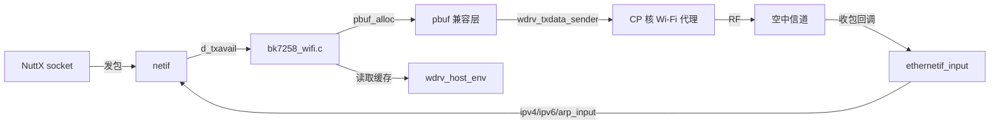
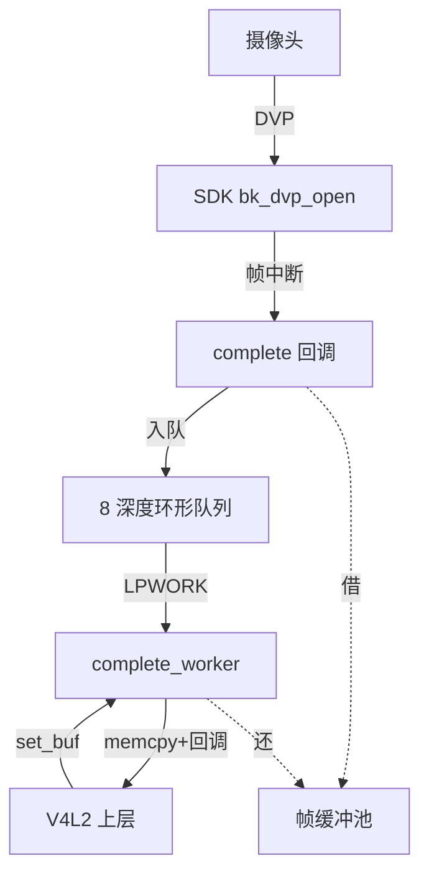
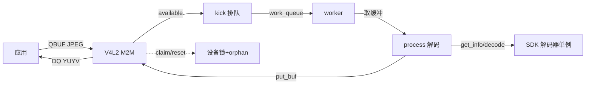
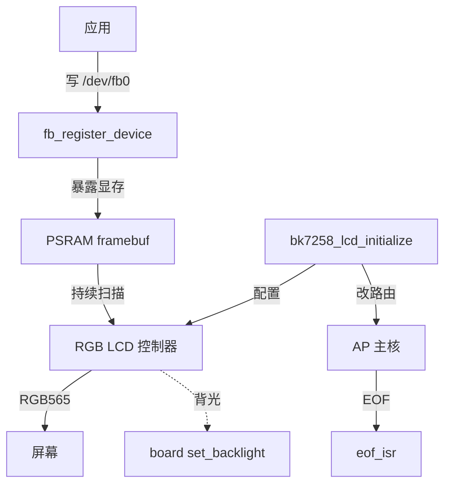
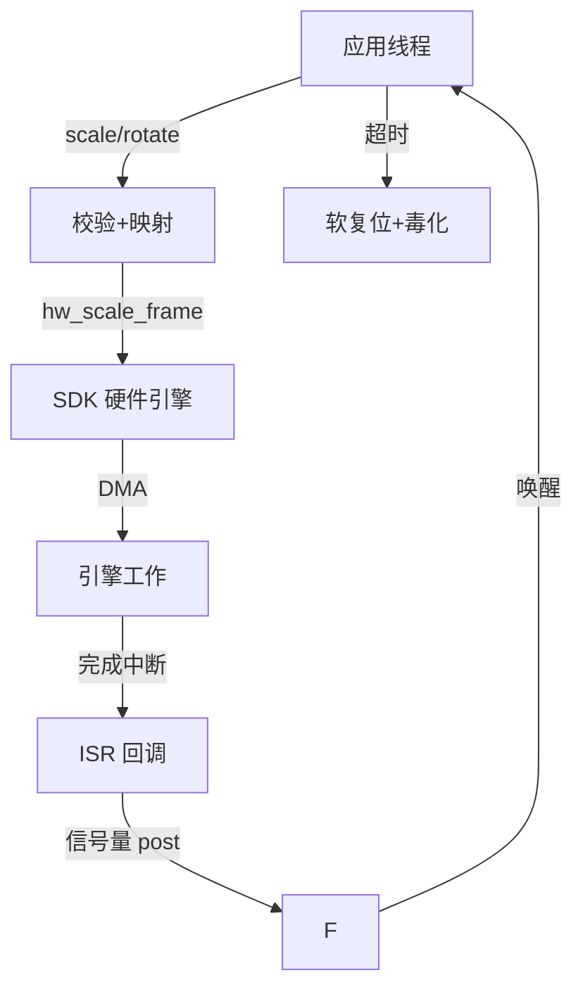

# ap-多媒体与无线

## 本组导读

这组代码位于 BK7258 的 **AP 侧**（应用处理器侧，负责跑 NuttX 系统、接各种外设的"大脑"），干的是"**让 NuttX 用上芯片里现成的多媒体/无线硬件**"这件事。整个芯片是异构多核：**CP 核**（协处理器）里跑官方 Beken SDK（固化闭源，只有静态库），**AP 核**跑 NuttX。外设的**物理硬件驱动其实都在 SDK 里**，我们拿不到源码。所以这组文件全部是"**翻译官/适配层**"：把 SDK 的私有接口翻译成 NuttX 认识的通用框架（网络栈、V4L2、framebuffer），让上层应用完全不知道底层是 Beken 的私有世界。

```
 NuttX 上层应用: socket / V4L2 /dev/video0 / /dev/fb0 绘图
        │
┌───────▼───────────────────────────────────────────┐
│  NuttX 通用框架: netif 网络栈 │ imgdata/V4L2 │ fb  │
└───────┬───────────────────┬──────────────┬────────┘
┌───────▼────┐  ┌───────────▼─────┐  ┌─────▼──────────┐
│ bk7258_    │  │ bk7258_dvp.c    │  │ bk7258_lcd_rgb │
│ wifi.c     │  │ 摄像头 lower-   │  │ .c framebuffer │
│ pbuf/网卡  │  │ half            │  │ 适配           │
│ 适配       │  │ ├ jpeg_m2m.c    │  │ ├ scale_rotate │
│            │  │ │ 硬件解码      │  │ │ .c 缩放旋转  │
└───────┬────┘  └───────────┬─────┘  └─────┬──────────┘
        └───────────────────▼──────────────┘
        CP 核官方 SDK(闭源黑盒): wdrv_txdata_sender /
        bk_dvp_open / hw_scale_frame / lcd_driver_init
```

一句话记住分工：**Wi-Fi 管"看不见的网络"，DVP 管"眼睛"，JPEG M2M 管"解码"，LCD 管"屏幕"，缩放旋转管"画面加工"。**

---

## 文件：bk7258_wifi.c —— Wi-Fi 网卡适配

**它干什么**：把官方 SDK 的 Wi-Fi vnet 代理（跑在 CP 核的无线网络虚拟接口）适配成一张 NuttX 标准网卡 `wlan0`，让上层 socket 能直接收发无线数据。

> 💡 【背景知识】想象你把一台路由器藏在墙里，它有自己的"内部语言"（lwIP 协议栈 + 私有数据格式）。你想让电脑（NuttX 网络栈）直接用网线上网，就必须在墙外装一个"接口转换器"。难点在于：SDK 静态库**会反过来调用**一堆 lwIP 函数（如 `pbuf_alloc`），而 NuttX 又不想把整个 lwIP 链接进来——于是这里**自己实现了一套精简版 pbuf 函数**喂给 SDK。

【核心结构】
- `struct pbuf` —— 复刻的 lwIP 数据包结构（16 字节，用 `_Static_assert` 钉死 ABI）；
- `struct bk7258_wifi_wdrv_host_prefix_s` —— SDK 全局 `wdrv_host_env` 的前缀结构，缓存了 MAC、链路状态、DHCP 结果；
- `struct bk7258_wifi_driver_s` —— 本驱动私有状态：是否注册、网卡是否 up、轮询工作队列、`net_driver_s` 设备体；
- `bk7258_wifi_initialize()` —— 初始化入口；`ethernetif_input()` —— 收包入口；`bk7258_wifi_transmit()` —— 发包路径；`pbuf_alloc/free/header/ref` —— 喂给 SDK 的兼容函数。

【关键代码逐段讲解】

**① ABI 钉死：结构体一个字节都不能差**

```c
/* bk7258_wifi.c:145-158 */
_Static_assert(sizeof(struct pbuf) == 16, "pbuf ABI 16 bytes");
_Static_assert(offsetof(struct bk7258_wifi_wdrv_host_prefix_s, mac) == 16,
               "cached MAC ABI at offset 16");
_Static_assert(offsetof(struct bk7258_wifi_wdrv_connect_ind_s, ipaddr) == 36,
               "IPv4 address ABI at offset 36");
```

SDK 静态库访问 `wdrv_host_env` 时按固定偏移找字段，我们重新声明的结构体必须与它布局完全一致。`_Static_assert` 是**编译期断言**：结构体一改乱、偏移对不上，编译直接报错，而不是运行到一半才崩。`offsetof` 就是"字段在结构体里第几个字节"。这是和闭源库打交道时的保命手段。

**② 发包：把 NuttX 帧装进 SDK 的 pbuf**

```c
/* bk7258_wifi.c:288-315 bk7258_wifi_transmit() */
p = pbuf_alloc(BK7258_WIFI_PBUF_RAW_TX, dev->d_len, BK7258_WIFI_PBUF_RAM);
cpdu = (FAR struct bk7258_wifi_cpdu_s *)(p + 1);  /* pbuf 后面紧跟控制块 */
memset(cpdu, 0, sizeof(*cpdu));
memcpy(p->payload, dev->d_buf, dev->d_len);       /* NuttX 帧拷进 pbuf */
ret = wdrv_txdata_sender(p, BK7258_WIFI_VIF_STA); /* SDK 无线发送 */
pbuf_free(p);                                     /* 释放引用 */
NETDEV_TXPACKETS(dev);  NETDEV_TXDONE(dev);  return OK;
```

NuttX 网络栈把待发数据放 `dev->d_buf`，我们申请一块 SDK 认识的 `pbuf`，拷入数据，调 `wdrv_txdata_sender()` 真正发到空中。注意 `pbuf_alloc` 的第一个参数预留了 108+600 字节头部——这是 SDK 固件 ABI 要求的 MSDU 头和控制描述符空间，少留一点 SDK 就会越界写坏内存。

**③ 收包：从 SDK 手里接帧，喂给 NuttX 协议栈**

```c
/* bk7258_wifi.c:626-667 ethernetif_input() 核心段 */
memcpy(priv->dev.d_buf, p->payload, p->len);   /* 拷进 NuttX 网卡缓冲 */
priv->dev.d_len = p->len;
eth = (FAR struct eth_hdr_s *)priv->dev.d_buf;
if (eth->type == HTONS(ETHTYPE_IP))       ipv4_input(&priv->dev);
else if (eth->type == HTONS(ETHTYPE_IP6)) ipv6_input(&priv->dev);
else if (eth->type == HTONS(ETHTYPE_ARP)) arp_input(&priv->dev);
else { priv->dev.d_len = 0; NETDEV_RXDROPPED(&priv->dev); }
if (priv->dev.d_len > 0)  (void)bk7258_wifi_transmit(&priv->dev);
```

`ethernetif_input()` 由 SDK 的 RX 线程回调。我们按以太网帧头的 `type` 字段分流：IP 包给 `ipv4_input`，IPv6 给 `ipv6_input`，ARP 给 `arp_input`。整个收包过程用 `net_lock()` 保护，避免与 NuttX 网络栈并发访问打架。

**④ 初始化：先等 MAC 就绪再注册**

```c
/* bk7258_wifi.c:689-714 bk7258_wifi_initialize() */
ret = bk_event_init();      /* 先初始化 SDK 事件服务（幂等） */
ret = bk_wifi_init();       /* 启动 SDK WiFi，走官方 GET_MAC 握手 */
ret = bk7258_wifi_wait_cached_mac(mac);   /* 最多等 5 秒 */
memcpy(g_bk7258_wifi.dev.d_mac.ether.ether_addr_octet, mac, sizeof(mac));
```

首次上电时 CP 核要做射频校准，官方 GET_MAC 应答可能迟到超过 SDK 固定等待的 2 秒。这里不重复发命令（会堵满邮箱 FIFO），而是**轮询 SDK 缓存的 MAC 值**最多 5 秒——用真实的迟到结果做就绪门闩，而不是盲等。

【流程/关系图】



---

## 文件：bk7258_dvp.c —— DVP 摄像头适配

**它干什么**：把 SDK 的摄像头数据流（DVP 数字并行接口）适配成 NuttX 的 `imgdata_s` 图像数据 lower-half，让 V4L2 上层应用能打开 `/dev/video0` 取帧。

> 💡 【背景知识】**lower-half** 是 NuttX 驱动分层叫法：下层管"硬件长什么样"（本文件），上层管"给应用什么接口"（V4L2 字符设备）。把摄像头想成一台不停吐照片的打印机：SDK 负责让打印机工作，本文件负责在出口接一个传送带——帧一来就登记、转发给上层，同时保证传送带不堵（有界队列）。DVP 是摄像头传数据的**并行总线**，一次传多根线。

【核心结构】
- `struct bk7258_dvp_s` —— 全部状态：SDK 配置、帧缓冲池、事件环、PM 时钟标志、工作线程状态；
- `g_bk7258_dvp_callback` —— 给 SDK 的回调表（`malloc`/`complete` 两个钩子）；
- `bk7258_dvp_frame_complete()` —— SDK 帧完成回调（中断上下文，只入队）；
- `bk7258_dvp_complete_worker()` —— 真正调用上层回调的工作线程；
- `bk7258_dvp_frame_malloc()` —— 从预分配帧池借出缓冲；
- `imgdata_ops_s g_bk7258_dvp_data_ops` —— init/uninit/set_buf/start_capture/stop_capture 操作表；
- 若干 `__wrap_*` 函数 —— H264 兼容模式下包装 SDK 符号做延迟操作。

【关键代码逐段讲解】

**① 帧完成回调：ISR 里绝不能干重活**

摄像头硬件每出一帧，SDK 就在**中断上下文**调用 `complete` 回调。中断里不能等锁、不能调上层，只能快速入队：

```c
/* bk7258_dvp.c:824-859 bk7258_dvp_frame_complete() 核心段 */
flags = spin_lock_irqsave(&priv->lock);       /* 自旋锁：短临界区专用 */
if (priv->event_count >= BK7258_DVP_EVENT_DEPTH)
  {
    /* 队列满了：直接丢弃这一帧并归还缓冲（ISR 不能等消费） */
    priv->frame_busy[index] = false;
    spin_unlock_irqrestore(&priv->lock, flags);
    return;
  }
priv->events[(priv->event_head + priv->event_count) %
             BK7258_DVP_EVENT_DEPTH].frame = frame;
priv->event_count++;
if (!priv->work_queued) { priv->work_queued = true; queue_work = true; }
spin_unlock_irqrestore(&priv->lock, flags);
if (queue_work && work_queue(LPWORK, &priv->complete_work, ...) < 0)
  bk7258_dvp_schedule_failed(priv);
```

关键设计：帧完成后先塞进**深度 8 的有界环形队列**；队列满说明上层消费太慢，直接丢帧（宁丢帧不崩系统）；队列由空变非空时，把工作线程挂上 LPWORK 工作队列。**中断只花几微秒，重活全丢给线程。**

**② 工作线程：唯一合法的"通知上层"通道**

```c
/* bk7258_dvp.c:625-664 bk7258_dvp_complete_worker() 核心段 */
event = priv->events[priv->event_head];       /* 从环形队列取事件 */
target = priv->next_buffer;                   /* 上层给的目标缓冲 */
if (capture_cb == NULL || target == NULL || result != 0)
  length = 0;
else if (length > event.frame->size || length > target_size || ...)
  result = BK7258_DVP_RESULT_ERROR;           /* 尺寸不符判错 */
else
  memcpy(target, event.frame->frame, length); /* 拷贝帧数据 */
(void)capture_cb(result, length, &tv, capture_arg);   /* 调上层回调 */
bk7258_dvp_release_frame_locked(priv, event.frame);   /* 归还帧缓冲 */
```

线程上下文里可以安全地 `memcpy` 和大块计算。时间戳用 NuttX 系统时钟而不是 SDK 的 32 位计数器——SDK 那个计数器约 71 分钟就回绕一次，不适合当 V4L2 时间戳。

**③ 帧缓冲池：借出与归还**

```c
/* bk7258_dvp.c:784-810 bk7258_dvp_frame_malloc() */
for (i = 0; i < priv->config.frame_count; i++)
  {
    if (!priv->frame_busy[i] && memory->addr != NULL && memory->size >= size)
      {
        frame->frame = memory->addr;   /* 指向预分配的帧内存 */
        frame->size  = memory->size;
        frame->type  = DVP_CAMERA;
        priv->frame_busy[i] = true;    /* 标记占用 */
        return frame;
      }
  }
return NULL;                            /* 没有空闲缓冲，SDK 将停等 */
```

帧内存不是现场 malloc 的（帧频下 malloc/free 会产生碎片和延迟），而是**开局预分配一个池**，用 `frame_busy[]` 做借还登记。`malloc` 回调返回 NULL 时 SDK 自动停流等缓冲，天然实现背压。

**④ H264 兼容包装**：SDK 开 H264 时会在传感器初始化完成前就启动 YUV/H264 数据通路，可能对半初始化状态报中断。本文件用 `__wrap_*` 符号把 SDK 的 `bk_h264_encode_enable`、`bk_yuv_buf_start`、I2C 写等调用**截住延迟**，等 `bk_dvp_open()` 初始化完传感器再通过 `__real_*` 重放。链接器级别的"包装/被包装"（wrap/real）是给闭源库打补丁的标准手法。

【流程/关系图】



---

## 文件：bk7258_jpeg_m2m.c —— JPEG 硬件解码（M2M）

**它干什么**：把 BK7258 的 JPEG 硬件解码器暴露成一个标准 V4L2 **memory-to-memory（M2M）** 设备：应用往"输入队列"塞 JPEG 数据，从"输出队列"取回 YUYV 原始图像。

> 💡 【背景知识】**M2M** 意为"内存到内存"：数据不经过屏幕或网络，直接从内存读、解码完写回内存——就像复印机：放一张照片（JPEG），吐一张原图（YUYV 像素）。芯片里有专门的 JPEG 解码硬件，比 CPU 软件解码快得多。难点：解码器硬件是**单例**（全芯片只有一份），所以文件里到处是"占用/释放"锁和"孤儿句柄"（orphan）回收逻辑。

【核心结构】
- `struct bk7258_jpeg_m2m_file_s` —— 每次 open 的实例：生命周期锁 + 状态锁、工作队列、输出/捕获格式、epoch 世代号；
- `g_bk7258_jpeg_m2m_codec` + `codec_ops_s` —— V4L2 M2M 框架要求的操作表；
- `bk7258_jpeg_m2m_process()` —— 单帧解码核心；`bk7258_jpeg_m2m_worker()` —— 循环解码线程；
- `bk7258_jpeg_m2m_claim/release/reset_backend` —— 解码器单例的后端生命周期管理；
- `bk7258_jpeg_m2m_register()` —— 注册入口。

【关键代码逐段讲解】

**① 单帧解码：校验 → 取信息 → 解码 → 验结果**

```c
/* bk7258_jpeg_m2m.c:569-645 bk7258_jpeg_m2m_process() 核心段 */
if (src->memory != V4L2_MEMORY_USERPTR ||        /* 只支持用户指针 */
    src->bytesused == 0 || src->bytesused > src->length)
  return -EINVAL;
input  = (struct bk7258_jpeg_decoder_frame_s){ .data = src->m.vaddr, ... };
output = (struct bk7258_jpeg_decoder_frame_s){ .data = dst->m.vaddr, ... };
ret = bk7258_jpeg_m2m_ensure_backend(priv);      /* 确保解码器就绪 */
ret = bk7258_jpeg_decoder_get_info(priv->decoder, &input, &info); /* 读 JPEG 头 */
if (info.width != capture_fmt->fmt.pix.width ||  /* 解码尺寸必须匹配 S_FMT */
    info.height != capture_fmt->fmt.pix.height)
  return -EINVAL;
ret = bk7258_jpeg_decoder_decode(priv->decoder, &input, &output); /* 真正解码 */
if (output.length != payload)                    /* 硬件结果可信校验 */
  return -EIO;
*bytesused = output.length;
return 0;
```

**解码前充分校验**（内存模式、长度、尺寸、缓冲按缓存行对齐），**解码后再验证硬件输出**是否与 JPEG 头信息一致，任何一步失败都返回错误而不是把坏数据交上去。缓存行对齐是因为 DMA 直写内存时，缓存一致性要求缓冲按缓存行（cache_line）对齐。

**② 后端单例：孤儿回收**

解码器硬件只初始化一次。如果某次 `uninitialize` 失败，句柄不能丢，否则整个芯片的解码器就再也用不了：

```c
/* bk7258_jpeg_m2m.c:305-321 bk7258_jpeg_m2m_retry_orphan_locked() */
if (g_bk7258_jpeg_m2m_orphan == NULL) return 0;
ret = bk7258_jpeg_decoder_uninitialize(g_bk7258_jpeg_m2m_orphan);
if (ret >= 0) g_bk7258_jpeg_m2m_orphan = NULL;
return ret;
```

"孤儿"（orphan）比喻：上一次没销毁干净的解码器句柄。下次 open 先尝试把孤儿处理掉再初始化新的，保证任何时刻硬件只有一个主人。

**③ 工作线程主循环**：拿 `state_lock` → 检查未关闭/已流 on → 从输入队列取缓冲（`codec_output_get_buf`）、输出队列取缓冲（`codec_capture_get_buf`）→ 快照 `epoch` 和格式 → 解锁 → 执行 `process()` → 重新加锁 → 比对 `epoch` 检查是否过期（stale）→ 打上成功/错误标志 → 归还两个缓冲 → 还有任务则再排队。**`epoch`（世代号）** 是关键技巧：每次 stop/close 就 +1，工作线程回来发现号变了就知道自己是"过期货"，丢弃结果，避免晚到的完成事件污染新会话。

【流程/关系图】



---

## 文件：bk7258_lcd_rgb.c —— RGB LCD 帧缓冲适配

**它干什么**：把 BK7258 的 RGB LCD 控制器包装成 NuttX 标准 `/dev/fb0` 帧缓冲设备，应用往显存里写像素就能上屏。

> 💡 【背景知识】RGB 接口的 LCD 需要控制器**一刻不停地扫描内存**，把像素信号按行同步（HSYNC）、场同步（VSYNC）节奏送给屏幕——就像放映机不停把胶片投到幕布上。应用画图 = 往"胶片"（显存）上写字。本文件只负责：分配显存（放 PSRAM）、配置控制器时序、把显存地址暴露为 `/dev/fb0`。

【核心结构】
- `struct bk7258_lcd_priv_s` —— 私有状态：`fb_vtable_s` 操作表、板级配置、显存指针、电源状态；
- `bk7258_lcd_initialize()` —— 初始化主流程；
- `bk7258_lcd_getvideoinfo/getplaneinfo` —— 返回分辨率/格式/显存信息；`bk7258_lcd_setpower()` —— 开关显示和背光；
- `bk7258_lcd_route_irq_to_ap_primary()` —— 把控制器中断从 SDK 默认核改路由到 NuttX 主核；
- `bk7258_lcd_restore_sync_widths()` —— 修补 SDK 的时序 bug；`bk7258_lcd_eof_isr()` —— 帧结束（EOF）中断回调。

【关键代码逐段讲解】

**① 显存：从 PSRAM 分配并对齐**

```c
/* bk7258_lcd_rgb.c:403-413 */
priv->framebuf_bytes = (size_t)panel->width * panel->height * 2u;
priv->framebuf_alloc = bk7258_psram_zalloc(priv->framebuf_bytes + 15u);
if (priv->framebuf_alloc == NULL) { ... return -ENOMEM; }
priv->framebuf = (FAR uint8_t *)(((uintptr_t)priv->framebuf_alloc + 15u) & ~15u);
```

RGB565 格式每像素 2 字节，显存大小 = 宽 × 高 × 2。分配时多要 15 字节再按 16 字节对齐（DMA 扫描要求），手法是"地址加 15 再按 ~15 取整"。显存必须放 PSRAM——LCD 控制器要持续读它，放片内 SRAM 会被应用数据挤爆。

**② 中断改路由：把控制权从 SDK 抢回 NuttX**

```c
/* bk7258_lcd_rgb.c:130-134 中断改路由 */
(void)sys_drv_core_intr_group1_disable(BK7258_LCD_SDK_DEFAULT_CORE_ID,
                                       BK7258_LCD_INTERRUPT_CTRL_BIT);
ret = sys_drv_core_intr_group1_enable(BK7258_LCD_AP_PRIMARY_CORE_ID,
                                      BK7258_LCD_INTERRUPT_CTRL_BIT);
return ret == 0 ? OK : -EIO;
```

BK7258 是多核芯片：SDK 默认把显示中断路由到物理 CPU2（SDK 应用核），但 NuttX 跑在物理 CPU1（逻辑 AP 主核）。初始化后要"改签"：先关 CPU2 路由，再开 CPU1。注释专门提醒：`disable` 返回旧寄存器值而不是错误码，只有 `enable` 有"0 成功"语义——这是与闭源 SDK 打交道时最易踩的坑。

**③ 修补 SDK 的同步宽度 bug**

```c
/* bk7258_lcd_rgb.c:170-175 恢复同步宽度 */
value &= ~(BK7258_LCD_HSYNC_WIDTH_MASK | BK7258_LCD_VSYNC_WIDTH_MASK);
value |= timing->hsync_pulse_width | (timing->vsync_pulse_width << 8);
*reg = value;
__asm volatile ("dmb sy" ::: "memory");
```

SDK 把文档规定 6 位的同步宽度字段误当 3 位校验，导致板级配置的宽度被截断。不动 SDK 源码（闭源），而是初始化后**直接写硬件寄存器** `0x48060034` 把正确值填回去。`dmb sy` 是内存屏障：保证寄存器写完后，后续代码再访问时硬件已生效。

**④ 初始化主流程**：拿板级配置 → 检查 PSRAM 就绪 → 分配显存 → 初始化面板引脚 → 填 `lcd_rgb_t` 时序结构（前后肩、脉冲宽度）→ `lcd_driver_init()` 交给 SDK → 改中断路由 → 注册 EOF 中断 → 恢复同步宽度 → 设 PPI 尺寸、RGB565 模式、显存基址 → 开显示开背光 → `fb_register_device(0, 0, ...)` 注册为 `/dev/fb0`。每一步失败都有 `errout_*` 标签逐级回滚，绝不半途而废。

【流程/关系图】



---

## 文件：bk7258_scale_rotate.c —— 硬件缩放与旋转

**它干什么**：给应用层提供类型安全的封装，调用芯片的**硬件缩放引擎（Scale0/Scale1）和旋转引擎（Rotator）**，做图片放大缩小和 90°/270° 旋转。

> 💡 【背景知识】缩放旋转如果用 CPU 软件算，一帧 720P 图就要做上百万次像素插值。芯片里有两个"专职工人"：Scale 引擎和 Rotator，都是 **DMA + 硬件流水线**：你告诉它输入/输出缓冲地址、尺寸、角度，它就自己搬数据算结果，干完中断通知你。本文件是"调度员"：下发任务、等中断、处理超时、恢复故障。整个过程是**同步的**——调用 `bk7258_scale()` 会一直等到硬件完成或超时。

【核心结构】
- `struct bk7258_scale_rotate_s` —— 全局单例状态：互斥锁、完成信号量、状态自旋锁、faulted 故障标志、各类所有权标志；
- `bk7258_scale()` / `bk7258_rotate()` —— 两个公共操作入口；
- `bk7258_scale_rotate_publish_completion()` —— 中断回调里发布结果；
- `bk7258_scale_rotate_wait_locked()` —— 等待完成信号量 + 超时恢复；
- `bk7258_scale_rotate_route_rott_to_cpu1()` —— 把 Rotator 中断路由到 AP 主核；
- 一堆 `*_map_*` 函数 —— 把本驱动的格式/角度/流向枚举翻译成 SDK 枚举。

【关键代码逐段讲解】

**① 等硬件干完：信号量 + 中断回调**

```c
/* bk7258_scale_rotate.c:462-478 bk7258_scale_rotate_publish_completion() */
flags = spin_lock_irqsave(&priv->state_lock);
if (priv->operation_active &&
    (scale ? bk7258_scale_rotate_is_scale(priv->engine) :
             priv->engine == BK7258_SCALE_ROTATE_ROTATOR))
  {
    priv->completion_result = result;
    priv->completion_done = true;
    priv->operation_active = false;
    post = true;
  }
spin_unlock_irqrestore(&priv->state_lock, flags);
if (post) (void)nxsem_post(&priv->completion);
```

硬件完成后在中断里调用这个回调：先确认"确实有操作在进行中"（防止迟到的旧中断误报），记录结果，`nxsem_post` 释放信号量，把在 `nxsem_tickwait_uninterruptible` 上睡觉的调用线程唤醒。**中断里只做登记和放行，一切加锁、超时、复位都留在线程上下文。**

**② 超时恢复：毒化故障状态**

```c
/* bk7258_scale_rotate.c:541-580 wait_locked() 核心段 */
ret = nxsem_tickwait_uninterruptible(&priv->completion, ticks);
if (completed)
  ret = priv->completion_result;
else if (ret >= 0)
  ret = -EIO;      /* 信号量醒了但没有回调，违反契约 */
if (need_reset)
  {
    if (engine == BK7258_SCALE_ROTATE_ROTATOR)
      (void)bk_rott_soft_reset();          /* 软复位旋转引擎 */
    else
      (void)bk_hw_scale_stop(bk7258_scale_rotate_scale_id(engine));
    priv->faulted = true;                  /* 毒化：拒绝复用 */
    return ret;
  }
```

超时意味着 DMA 可能还在搬数据。SDK 没有"安全中止并等待"的接口，所以把 `faulted` 置位——**中毒标记**：之后所有操作都直接返回 `-EIO`，直到调用方 `uninitialize` 重新初始化整个引擎。宁可全停，也不能让悬空 DMA 和新的操作打架。

**③ Scale1 写突发补丁 + 严格参数校验**

```c
/* bk7258_scale_rotate.c:193-216 bk7258_scale_rotate_configure_scale1_burst() */
if ((width & 127) == 0) threshold = 64;
else if ((width & 63) == 0) threshold = 32;
else if ((width & 31) == 0) threshold = 16;
else threshold = 8;
value = *reg; value &= ~BK7258_SCALE1_WRITE_THRESHOLD_MASK; value |= threshold;
*reg = value; __asm volatile ("dsb sy" ::: "memory");
```

SDK 的 `scale_set_write_burst(HW_SCALE1)` 是空实现，所以本文件按宽度是 128/64/32 的倍数选突发长度（burst）直接写寄存器 `0x480e0040`——宽度越大一次连续写的数据越多，性能越好。`dsb sy` 是更强的内存屏障（等所有访存完成）。

`bk7258_scale()` 里还要求：目标宽度必须是 16 的倍数（SDK 的 `scale_set_write_burst` 对非 16 倍数有反逻辑 bug）；源/目标缓冲不能重叠（`bk7258_scale_rotate_ranges_overlap`）；缓冲地址 + 长度不能溢出 32 位（DMA 只认 32 位地址）；尺寸不能超过 1280。旋转还要求块（block）划分精确整除且块数对得上。**所有边界都在进入 SDK 前挡住**——闭源硬件驱动不会帮你做这么周到的检查。

【流程/关系图】



---

## 相关学习文档

- [10-Bootloader总览与启动链](../10-Bootloader总览与启动链.md) —— 理解 AP/CP 双核从哪启动、为什么 NuttX 只跑在 AP 核
- [22-驱动适配范式](../22-驱动适配范式.md) —— 本组所有文件遵循的"SDK 黑盒 + NuttX 框架"适配套路
- [21-armino-SDK集成](../21-armino-SDK集成.md) —— SDK 静态库、ABI、`__wrap` 包装的背景知识
- [26-驱动注册与常见坑](../26-驱动注册与常见坑.md) —— 中断路由、孤儿句柄、时序修补等实战坑位
- [01-芯片与项目背景](../01-芯片与项目背景.md) —— BK7258 多媒体/无线外设全貌

## 源码路径

统一使用 `$CONTEST/` 前缀（指代仓库根目录）：

- `$CONTEST/board/bk7258/chip/ap/bk7258_wifi.c`
- `$CONTEST/board/bk7258/chip/ap/bk7258_dvp.c`
- `$CONTEST/board/bk7258/chip/ap/bk7258_jpeg_m2m.c`
- `$CONTEST/board/bk7258/chip/ap/bk7258_lcd_rgb.c`
- `$CONTEST/board/bk7258/chip/ap/bk7258_scale_rotate.c`
