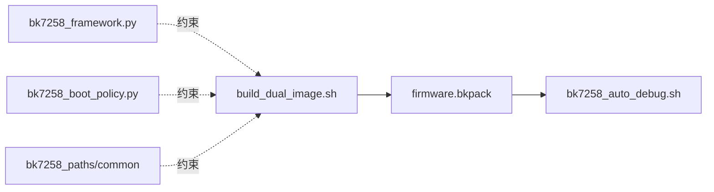
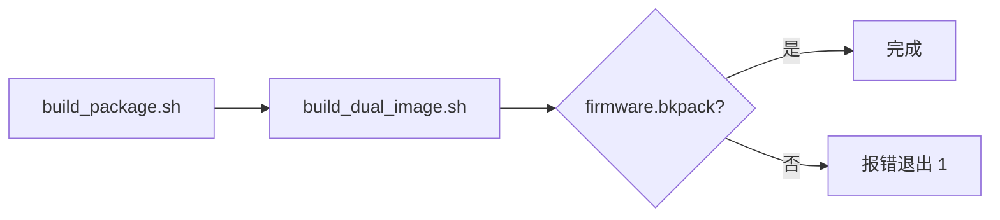
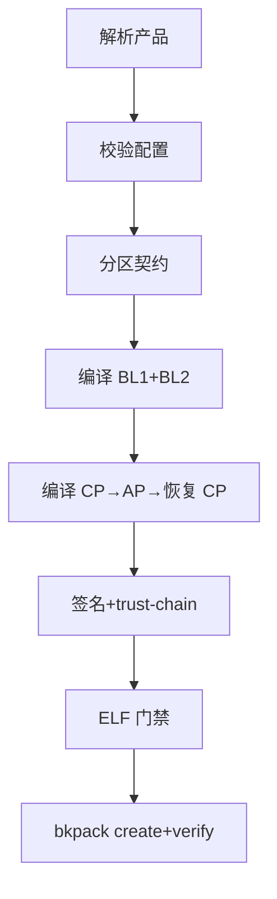
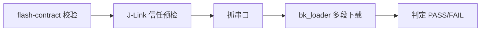
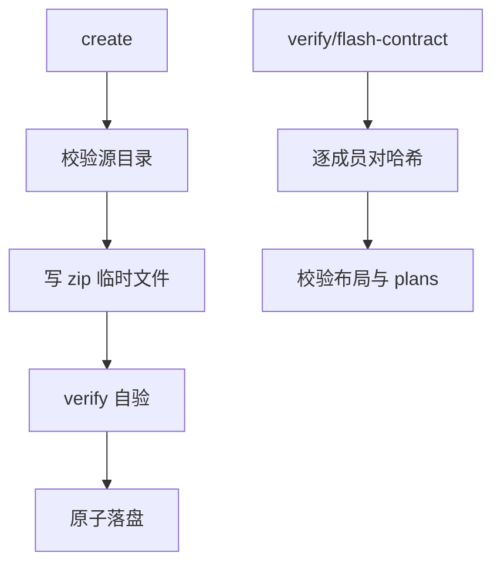
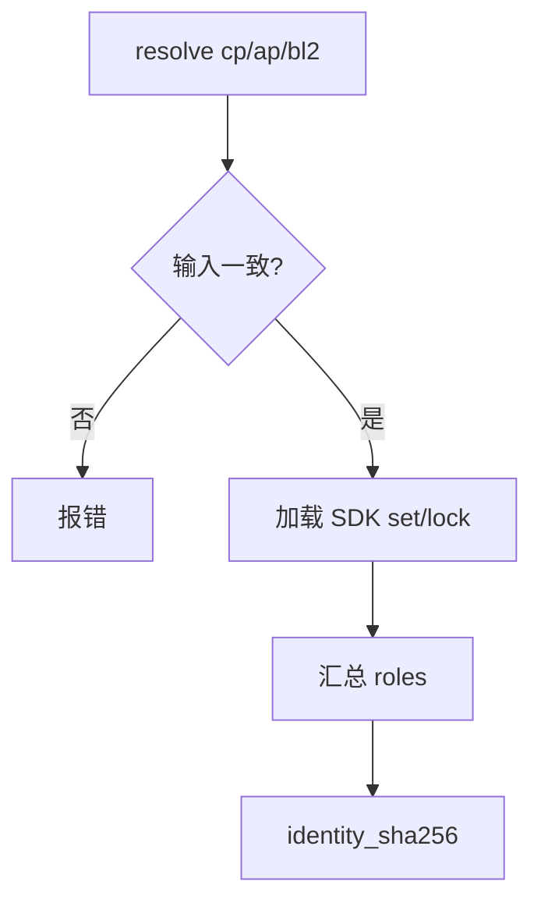

# 构建与打包工具

## 本组导读

这一组代码解决一个问题：**把 BK7258 芯片上一堆分散的二进制"零件"，打包成一个可信、可烧录、可复现的"整机固件包"**。

先记住 BK7258 的启动链条：`BL1 → BL2(MCUboot) → CP(CPU0) / AP(CPU1)`。
- **BL1**：芯片上电后最早运行的引导代码，负责校验并交出控制权；
- **BL2**：SRAM 里运行的 MCUboot 引导程序，负责 A/B 双区升级；
- **CP / AP**：两个 CPU 核上各自运行的 NuttX 镜像，CP 管底层外设与跨核通信（IPC），AP 跑上层应用。

本组工具就是这条链路的"生产线"：先编译出 BL1/BL2/CP/AP 四个镜像，再用 `firmware.bkpack`（zip 兼容容器）把镜像、分区表、签名信息、烧录方案全部装进去，最后交给 Windows 下的 `bk_loader.exe` 下载到板子。

```
源码/配置/SDK bundle ──► build_dual_image.sh（主编排）
        ──► BL1 → BL2 → CP/AP 编译 → 签名 → pack_dual_image
        ──► bk7258_bkpack.py 打 firmware.bkpack + 校验
        ──► bk7258_auto_debug.sh 校验→J-Link 信任预检→bk_loader 下载→抓串口
```

辅助角色：**bk7258_framework.py** 用 JSON 文档描述产品该用什么板/SDK/启动方式并生成不可篡改的 build plan；**bk7258_boot_policy.py** 把启动策略写成"政策文档"并严格校验；**bk7258_validation.py** 校验板上验证用例；**bk7258_common.py / bk7258_paths.py** 是公共工具库与路径解析库。



---

## 文件：build_package.sh

### 它干什么

个人日常构建的一键入口：**只把参数翻译成环境变量转发给 `build_dual_image.sh`，最后检查 `firmware.bkpack` 是否生成**。

### 💡 【背景知识】

就像餐厅服务员：帮你把"来一碗牛肉面"翻译成后厨能懂的菜单（环境变量），喊一声"下单！"（调用 `build_dual_image.sh`），端菜时看一眼菜有没有上齐。它自己不炒菜，也不负责验证菜是否新鲜。

### 【核心结构】

- `usage()`：打印帮助信息；`PRODUCT/CP_CONFIG/AP_CONFIG`：产品与双核配置名。
- `MCUBOOT_KEY/BL1_KEY`：两把签名私钥路径，默认去 `~/.bk7258/keys/` 找。
- 尾部 `if [[ -f "$OUT/firmware.bkpack" ]]`：构建完成后的"验收检查"。

### 【关键代码逐段讲解】

**把命令行参数转成环境变量，转发给真正的构建脚本**（build_package.sh:91-102）

```bash
BK7258_PRODUCT="$PRODUCT" \
CP_CONFIG_NAME="$CP_CONFIG" \
AP_CONFIG_NAME="$AP_CONFIG" \
BK7258_OUTPUT_ROOT="$OUT" \
MCUBOOT_SIGNING_KEY="$MCUBOOT_KEY" \
BL1_MANIFEST_KEY="$BL1_KEY" \
  "$SCRIPT_DIR/build_dual_image.sh"
```

人话：bash 里 `VAR=xxx 命令` 只对该命令注入环境变量。构建脚本约定**只读环境变量、不读命令行参数**，便于 CI 与手动调用统一。脚本开头还检查 `cp.config`/`ap.config` 和两把密钥是否存在——配置都没有编译必败，不如早退（**fail-closed**，失败即关闭）。

### 【流程/关系图】



---

## 文件：build_dual_image.sh

### 它干什么

**整个构建链路的总指挥**：解析产品定义 → 生成分区契约 → 依次编译 BL1/BL2/CP/AP → 签名 → 打包 `firmware.bkpack`，并做一长串自检。

### 💡 【背景知识】

这是"四菜一汤"宴席的主厨：检查菜谱（profile.conf）有没有自相矛盾、原料（SDK bundle）版本对不对、先做哪道菜（BL1 要先于 CP），出锅后还用 `arm-none-eabi-nm` 检查每道菜有没有混入不该有的东西。

### 【核心结构】

- `validate_output_root()`：拒绝把输出目录设成仓库根这类"危险宽范围"路径。
- `profile_value()/validate_profile_enum()`：读 `profile.conf` 字段并校验枚举；`config_enabled()` 读 Kconfig `defconfig` 中某符号开了没。
- `flock` 构建锁：防止两个构建在同一个 NuttX 源码树里互相踩踏。
- `build_config()/save_role()`：配置并编译某角色，再把产物快照存进临时目录。
- `require_elf_symbol()/forbid_elf_symbol()`：ELF 符号门禁：要求某函数必须/必须不被链接。

### 【关键代码逐段讲解】

**1. 编译时用 flock 抢占共享构建锁**（build_dual_image.sh:821-832）

```bash
BK7258_BUILD_LOCK="/tmp/openvela-bk7258-build-${UID}.lock"
exec {BK7258_BUILD_LOCK_FD}>"${BK7258_BUILD_LOCK}"
if ! flock -n "${BK7258_BUILD_LOCK_FD}"; then
    if ! flock -w "${BK7258_BUILD_LOCK_TIMEOUT_SECONDS}" "${BK7258_BUILD_LOCK_FD}"; then
        exit 2
    fi
fi
```

人话：openvela 构建是"在共享的 `nuttx/` 目录里原地配置"，两个构建同时跑会互相覆盖。`flock` 是文件锁，像公厕门闩——没抢到就等一会儿，超时放弃。

**2. MCUboot 公钥"只进不出"**（build_dual_image.sh:1240-1251）：BL2 验签只需公钥。脚本用 `imgtool.py getpub --key <私钥> --encoding lang-c` 把私钥转换成 C 代码（`struct bootutil_key bootutil_keys[]`）编译进 BL2。私钥本身从不进入构建产物或仓库——这是"私钥隔离"的关键设计。

**3. ELF 符号门禁**（build_dual_image.sh:1542-1555）

```bash
require_elf_symbol()
{
    local elf="$1"; local symbol="$2"
    if ! arm-none-eabi-nm -S --defined-only "${elf}" |
         awk -v symbol="${symbol}" \
             'NF >= 4 && $NF == symbol && $(NF - 2) != "00000000" \
              { found = 1 } END { exit !found }'; then
        exit 1
    fi
}
```

人话：`arm-none-eabi-nm` 列出 ELF 符号表。这里要求关键函数必须被链接进镜像且地址非 0，专门抓"配置打开了但驱动其实没编进去"的静默失败。构建末尾写 `build-profile.txt`（配置、SDK 版本、分区布局 ID、签名参数），作为后续所有校验的"构建身份证"。

### 【流程/关系图】



---

## 文件：bk7258_auto_debug.sh

### 它干什么

**把"编译 + 下载 + 抓串口日志 + 自动判定启动进度"串成一条流水线**，跑在 WSL2 里，调用 Windows 侧的 `bk_loader.exe` 和 PowerShell 抓串口。

### 💡 【背景知识】

传统调试：手动编译 → 开烧录工具 → 点按钮 → 开串口 → 肉眼看日志。这个脚本把五步合并成一条命令，还会自己读日志、按"检查点"判断启动到哪个阶段、给出 PASS/FAIL。它还有个安全强迫症：**烧录前必须验证固件包与分区表严格一致，否则拒绝下载**。

### 【核心结构】

- `flash-contract` 校验：用 `bk7258_bkpack.py` 生成"烧录契约"，逐字段核对偏移/长度/哈希。
- trust preflight：用 J-Link **非侵入式读取**目标板上的 BL1/BL2 信任指纹，对不上就拒绝。
- `MAIN_BIN_MULTI`：拼出 `文件@偏移-长度,文件@偏移-长度...` 的烧录参数。
- 串口检查点解析：把原始串口数据翻译成"启动到 U1/U2/C8..."的进度结论。

### 【关键代码逐段讲解】

**1. 烧录前用 J-Link 做信任预检**（bk7258_auto_debug.sh:585-605）

```bash
if ((DO_FLASH)) && [[ "$PACKAGED_MCUBOOT_PROFILE" == true ]]; then
  python3 "$TRUST_CHAIN_TOOL" commands \
    --contract "$TRUST_CHAIN_CONTRACT" > "$TRUST_JLINK_COMMANDS"
  "$JLINK_EXE" -device CORTEX-M33 -if SWD -speed 1000 -autoconnect 1 \
    < "$TRUST_JLINK_COMMANDS" 2>&1 | tee "$TRUST_JLINK_LOG"
  ...
  if ! python3 "$TRUST_CHAIN_TOOL" verify \
      --contract "$TRUST_CHAIN_CONTRACT" --jlink-log "$TRUST_JLINK_LOG"; then
    echo "ERROR: target trust roots do not match this package; refusing download" >&2
    exit 1
  fi
fi
```

人话：板子上已烧过一组公钥指纹（信任锚）。若新固件包的公钥和板上对不上，下载后新镜像验签失败、板子起不来。所以烧录前用 J-Link 做**只读**检查比对公钥指纹，失败即拒绝下载，绝不让板子变砖。

**2. 按检查点自动判定启动结果**（bk7258_auto_debug.sh:843-864）

```python
present = [m for m in ordered if m in checkpoint_lines]
if "NuttShell (NSH)" in text or "nsh>" in text:
    verdict = "PASS_NSH"
elif "U1" in checkpoint_lines and "U2" not in checkpoint_lines:
    verdict = "STOP_BETWEEN_U1_U2"
```

人话：固件调试打印会输出 B2GO、U1、C8 等检查点标记，脚本按固定顺序判断启动到哪一格：到 NSH（NuttX 的 shell）算全通，卡在 U1/U2 之间说明 UART 初始化前出了问题。下载时用 `MAIN_BIN_MULTI` 拼多段参数实现**稀疏烧录**——只更新需要的分区，保留 LittleFS 用户数据。

### 【流程/关系图】



---

## 文件：bk7258_bkpack.py

### 它干什么

**`firmware.bkpack` 容器的"造包 + 验包 + 烧录契约"三合一工具**：从已验证的双镜像目录造出确定性 zip 容器，并能反向验证任何包、生成烧录计划。

### 💡 【背景知识】

bkpack 像一个"密封快递箱"：箱子是标准 zip，每个文件都记了 SHA-256 指纹；箱盖贴着"物品清单"（manifest）；箱里还塞了分区表 CSV 和 Windows 手动烧录说明书。**收货必须验指纹**：哈希对不上直接拒收。它绝不编译、绝不签名、绝不碰硬件，但它的哈希是后续一切烧录动作的可信依据。

### 【核心结构】

- `_safe_name()`：拒绝 `../`、绝对路径、嵌套路径等不安全成员名（防 zip-slip 漏洞）。
- `_canonical_json()`：确定性 JSON（键排序、紧凑分隔），保证同一内容哈希相同。
- `create()/verify()`：造包（先校验源目录再写 zip，最后自验）/ 验包（逐成员对哈希）。
- `flash_contract()`：返回烧录契约（layout 权威 + 每段偏移/长度）。

### 【关键代码逐段讲解】

**1. 成员名安全校验**（bk7258_bkpack.py:110-121）

```python
def _safe_name(value: Any, description: str = "member") -> str:
    _require(isinstance(value, str) and value and "\x00" not in value,
             f"invalid {description}")
    _require("\\" not in value and not value.startswith("/"),
             f"unsafe {description}: {value!r}")
    path = PurePosixPath(value)
    _require(not path.is_absolute() and ".." not in path.parts,
             f"unsafe {description}: {value!r}")
    return value
```

人话：zip 解压时若成员名是 `../../etc/passwd`，可能把文件写到包外面——这就是 zip-slip 漏洞。这里从源头禁止反斜杠、绝对路径、`..`，堵死路径穿越。

**2. 造包：先写临时、自验、再原子落盘**（bk7258_bkpack.py:717-729）

```python
fd, temporary_name = tempfile.mkstemp(prefix=f".{output.name}.", suffix=".tmp", dir=output.parent)
...
with zipfile.ZipFile(temporary, "w", allowZip64=False) as archive:
    archive.writestr(_zip_info(MANIFEST_MEMBER), manifest_payload)
    for name in sorted(payloads):
        archive.writestr(_zip_info(name), payloads[name])
result = verify(temporary)
os.replace(temporary, output)
output.chmod(0o644)
```

人话：先写临时文件（中途失败不留半个坏包），写完调 `verify()` 自验，通过后才用 `os.replace` 原子改名成正式文件。验包时逐个比对清单哈希：清单写了 N 个文件，包里就必须恰好是这 N 个，多一少一都拒收（bk7258_bkpack.py:814-818）。

### 【流程/关系图】



---

## 文件：bk7258_framework.py

### 它干什么

**"产品组合框架"**：用严格 JSON 文档（产品目录、SDK 注册表、构建计划）描述某产品该用什么板/SDK/启动方式，产出不可篡改的 build plan 与包清单。它只动元数据，不碰 SDK 二进制。

### 💡 【背景知识】

就像餐厅的"中央菜谱系统"：每个菜品（产品）有一张标准卡（product catalog），写清用什么食材（SDK set/lock）、什么锅（board）、几成熟（boot 模式）。`build_plan()` 按菜谱下单，把 CP/AP/BL2 三份"身份哈希"汇总成一份计划——任何一项改动，计划身份就变，**改动即暴露**。

### 【核心结构】

- `ACTIVE_ROLES_BY_BOOT`：raw 只用 bl1/cp/ap，mcuboot 才加 bl2。
- `validate_product()/validate_board()`：严格校验产品/板子 JSON 字段与枚举。
- `build_plan()`：把 CP/AP/BL2 解析结果汇总成隔离、只读的构建计划。
- `validate_build_plan()`：校验结构并重算身份哈希；`pack_prepare()/pack_verify()`：生成/校验包清单。

### 【关键代码逐段讲解】

**build_plan 核心：三个角色必须描述同一个产品**（bk7258_framework.py:1429-1439）

```python
cp_ir = resolve(repository, product_id, "cp", board_id, mode)
ap_ir = resolve(repository, product_id, "ap", board_id, mode)
bl2_ir = resolve(repository, product_id, "bl2", board_id, mode)
for other in (ap_ir, bl2_ir):
    if other["inputs"]["product"] != cp_ir["inputs"]["product"] or \
       other["inputs"]["boot"] != cp_ir["inputs"]["boot"] or \
       ...
       raise FrameworkError("role resolution produced mismatched product inputs")
```

人话：CP/AP/BL2 各自独立解析成中间表示（IR），但产品 ID、家族、模式、板子、启动方式、分区布局全得一致，任何角色跑偏整个计划作废——"三份证词必须互相印证"。raw 模式不需要 BL2 角色，只有 mcuboot 才有完整链条（bk7258_framework.py:54-57）。最后对整份计划做 `sha256(canonical_json(body))` 得出身份指纹，任何改动都会暴露。

### 【流程/关系图】



---

## 文件：bk7258_validation.py

### 它干什么

**校验"验证用例描述符"**：板上跑的 `bkvalidate` 测试，每个用例必须格式严格，且只能调用公开 API，不能碰 vendor/SDK 私有接口。

### 💡 【背景知识】

把验证测试想象成"安检培训考试"：出题人写考试说明（descriptor JSON）——考什么（run）、准备什么（prepare）、超时多久、占用哪些资源。本脚本负责检查这份"考试说明"本身合不合规。

### 【核心结构】

- `FORBIDDEN_COMMAND_TERMS`：命令里禁止出现的私有接口关键字。
- `COMMAND_PREFIX`：run 命令必须带 `public_api:` 前缀。
- `validate_descriptor_set()`：主入口，校验整份描述符集并重算身份。

### 【关键代码逐段讲解】

**命令必须走公开 API**（bk7258_validation.py:71-79）

```python
def _command(value: Any, field: str, prefix: str | None = None) -> str:
    if not isinstance(value, str) or not value:
        raise FrameworkError(f"{field} must be a non-empty command token")
    lowered = value.lower()
    if any(term in lowered for term in FORBIDDEN_COMMAND_TERMS):
        raise FrameworkError(f"{field} contains a vendor or layer-private call")
    if prefix is not None and not value.startswith(prefix):
        raise FrameworkError(f"{field} must use the public-device API adapter")
    return value
```

人话：测试命令字符串必须只走公开设备 API（`public_api:`），出现 `vendor`、`sdk`、`bk_` 等字样就拒绝。因为验证的意义在于"测公开能力"，悄悄调用 SDK 私有接口的测试不代表真实用户能力。

---

## 文件：bk7258_boot_policy.py

### 它干什么

**启动策略的"政策审核员"**：加载并严格校验每个产品的启动策略 JSON（启动顺序、签名职责、密钥供给、禁止动作），并能与分区布局绑定、推导 BL2 主副区几何参数。**全程不碰密钥、不签名、不动硬件**。

### 💡 【背景知识】

启动策略像一份"公司规章制度"：写清"值夜班顺序"（BL1→BL2→MCUboot）、"保险柜钥匙谁保管"（凭据只记 ID 不存路径）、"哪些事绝对不许干"（flash/network 一律 forbidden）。审核员逐条检查制度有没有自相矛盾。

### 【核心结构】

- `_validate_mechanism()`：mcuboot 必须 BL1→BL2→MCUboot，raw 必须关死 BL2。
- `_validate_credentials()/_validate_permissions()`：凭据只记 ID 禁止路径；compile/sign 需用户授权，flash/network/key_read 一律 forbidden。
- `_resolved_geometry()`：从分区布局推导 BL2 主/副区地址；`load_policy()/resolve_policy()`：加载校验/解析。

### 【关键代码逐段讲解】

**1. 启动机制必须"表里如一"**（bk7258_boot_policy.py:227-238）

```python
if boot == "mcuboot":
    if (mcuboot["enabled"] is not True or mcuboot["loader"] != "bl2" or
            bl1["handoff"] != "bl2" or bl2["loader"] != "mcuboot" or
            bl2["role"] != "bl2"):
        raise BootPolicyError("MCUboot policy must explicitly use BL1 -> BL2 -> MCUboot")
else:
    if (mcuboot["enabled"] is not False or bl2["loader"] != "not-used" or
            bl2["role"] != "not-applicable"):
        raise BootPolicyError("raw policy must fail closed without MCUboot/BL2")
```

人话：写了 mcuboot 就必须逐字声明 BL1 交权给 BL2、BL2 加载 MCUboot，少一项就拒绝；raw 模式则必须把 MCUboot/BL2 全部标成 `not-used`/`not-applicable`。**文档要么完整自洽，要么直接作废**。

**2. 密钥只记 ID，绝不记路径**（bk7258_boot_policy.py:187-206）：`_validate_no_key_paths()` 递归扫描凭据子树，任何字段名含 `path`/`filename`/`_file` 或叫 `key`/`private_key` 的一律拒绝。因为策略文档会进仓库，若里面写了私钥路径甚至密钥内容，等于把保险柜密码贴在门上。凭据只能用 ID 表示（如 `bk7258-mcuboot-signing`），真实密钥由外部授权边界提供。

**3. BL2 双区几何推导**（bk7258_boot_policy.py:763-798）：`_resolved_geometry()` 从分区布局推导副区地址（副区物理偏移 = 主区偏移 + 主区大小），并验证副区不越界到 LittleFS。

---

## 文件：bk7258_common.py

### 它干什么

**全工具链共享的"公共工具箱"**：严格的 JSON 加载、规范化序列化、标识符/哈希/路径校验等无依赖小函数。

### 💡 【背景知识】

就像公司统一采购的办公用品。`canonical_json` 是"标准盖章机"（同一内容永远盖出同样的章），`exact` 是"字段检查表"（文档必须正好是这些字段）。

### 【核心结构】

- `canonical_json()`：键排序、紧凑分隔的确定性 JSON 序列化；`sha256()`：十六进制小写 SHA-256。
- `load_json()`：拒绝重复 JSON 键的严格加载。
- `exact()`：字段集合必须精确匹配；`identifier()/symbols()`：校验安全标识符与 Kconfig 符号格式。

### 【关键代码逐段讲解】

**确定性 JSON 是"身份哈希"的根基**（bk7258_common.py:32-37）

```python
def canonical_json(value: Any) -> bytes:
    return (json.dumps(value, sort_keys=True, separators=(",", ":")) + "\n").encode()

def sha256(data: bytes) -> str:
    return hashlib.sha256(data).hexdigest()
```

人话：JSON 键顺序不影响语义但影响哈希。`sort_keys=True` + 紧凑分隔符保证**同一份数据无论谁来序列化字节都完全一样**，于是 `sha256(canonical_json(x))` 才能成为稳定身份指纹——框架的 build-plan 身份、策略身份全建立在它之上。

---

## 文件：bk7258_paths.py

### 它干什么

**全工具链唯一的"路径解析层"**：统一找出 contest 仓库根、board 目录、SDK 目录等，支持三种仓库形态（源码 checkout、repo manifest 映射、隔离快照），拒绝路径越界与符号链接逃逸。

### 💡 【背景知识】

以前每个脚本靠"当前脚本在哪、往上数几级"猜仓库根，猜错全崩。这模块像"GPS 导航"：先校准全局坐标（用标记目录 `board/bk7258`、`tools/bk7258` 判定根），再算所有目的地，还带"限行规则"：禁止 `..` 出界、禁止经符号链接逃出仓库。
### 【核心结构】

- `_module_contest_root()`：以模块自身位置锚定 contest 根（`parents[2]`）。
- `discover_contest_root()/discover_workspace_root()`：探测源码/workspace 根。
- `load_board_script()`：白名单方式加载 board 构建钩子（如 `gen_bk7258_partitions`）。
- `safe_join()`：根内安全拼接路径，防 `..` 与 symlink 逃逸；`Bk7258Layout`：布局类，一键导出各目录。

### 【关键代码逐段讲解】

**形态判定：优先"源码仓真实目录"**（bk7258_paths.py:290-305）

```python
candidate = _module_contest_root()
if _is_real_dir(candidate / CONTEST_BOARD_REL) and _is_real_dir(
        candidate / CONTEST_TOOLS_REL
):
    self._init_source_work(discover_contest_root())
    return
ws = discover_workspace_root(str(candidate))
if ws is not None and self._manifest_complete(ws):
    self._init_manifest(ws)
    return
```

人话：当源码仓嵌套在 manifest workspace 里（workspace 用符号链接指回源仓），只看符号链接会把根错误锚定到父 workspace。这里用"**真实目录**（非符号链接）标记"优先识别 source-work 形态，避开这个最刁钻的坑。
**board 钩子必须走白名单**（bk7258_paths.py:155-160）：`load_board_script` 只放行白名单里的模块（`gen_bk7258_partitions`、`bk7258_crc_expand`、`bk7258_crc16`），且文件必须在 `scripts/` 目录内、不能是符号链接（bk7258_paths.py:180-187）。三层防护（名字白名单 + 路径包含性 + 拒绝 symlink）防止偷换构建逻辑。

---

## 【相关学习文档】

- [03-基础概念铺垫](../03-基础概念铺垫.md) — BL1/BL2/CP/AP、启动链、XIP 等前置概念
- [10-Bootloader总览与启动链](../10-Bootloader总览与启动链.md) — 启动链条与各阶段职责
- [11-BL1深度解析](../11-BL1深度解析.md) — BL1 的 manifest 校验与 BL1→BL2 交接
- [12-BL2-MCUboot深度解析](../12-BL2-MCUboot深度解析.md) — MCUboot 的 A/B 双区与验签机制
- [13-Flash分区布局](../13-Flash分区布局.md) — 分区 CSV、物理偏移/长度、LittleFS 边界
- [14-安全启动与签名](../14-安全启动与签名.md) — 签名密钥、security counter、信任根
- [21-armino-SDK集成](../21-armino-SDK集成.md) — SDK bundle 的组织方式
- [30-构建-烧录-调试实战](../30-构建-烧录-调试实战.md) — 实际编译与烧录操作

## 【源码路径】

以下工具统一位于 `$CONTEST/tools/bk7258/` 下：

```
build_package.sh         个人构建入口（转发给 build_dual_image.sh）
build_dual_image.sh      双镜像主编排（BL1/BL2/CP/AP 编译、签名、打包）
bk7258_auto_debug.sh     自动构建+下载+串口抓取与检查点判定
bk7258_bkpack.py         firmware.bkpack 容器 create/verify/flash-contract
bk7258_framework.py      产品组合框架：build-plan、pack 清单、transport 解析
bk7258_validation.py     bkvalidate 验证用例描述符校验
bk7258_boot_policy.py    启动策略校验与解析
bk7258_common.py         公共小工具（canonical JSON、哈希、路径校验）
bk7258_paths.py          路径解析层（根目录发现、形态判定、safe_join）
```
