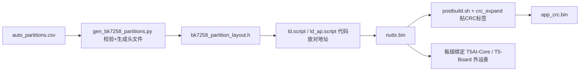
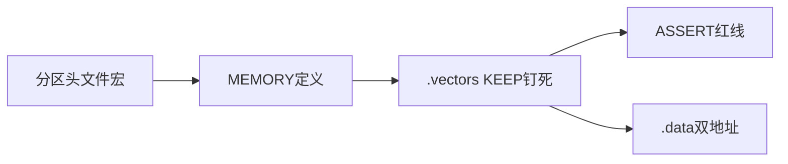
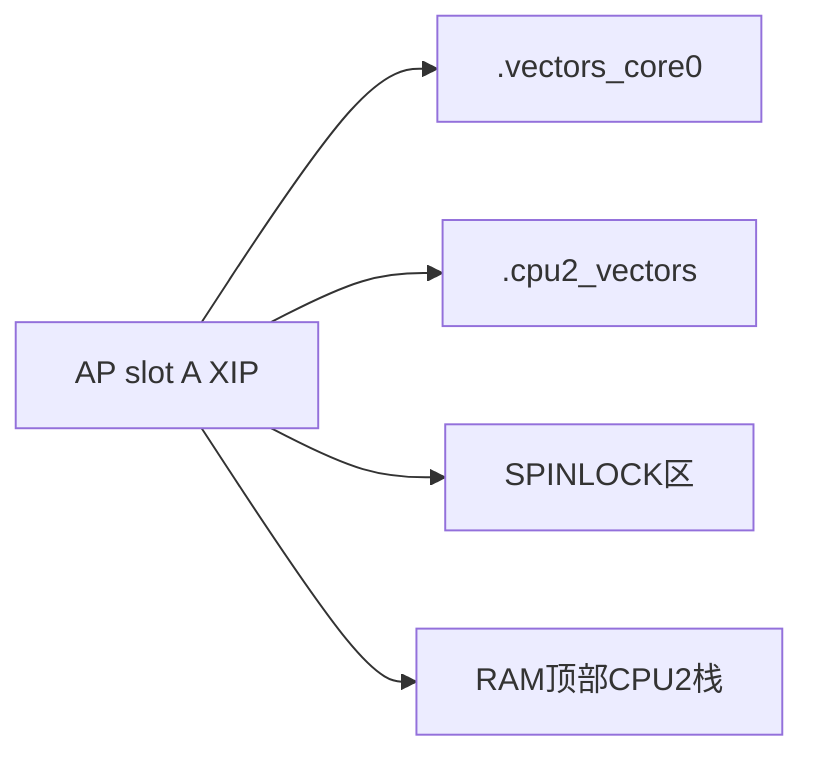
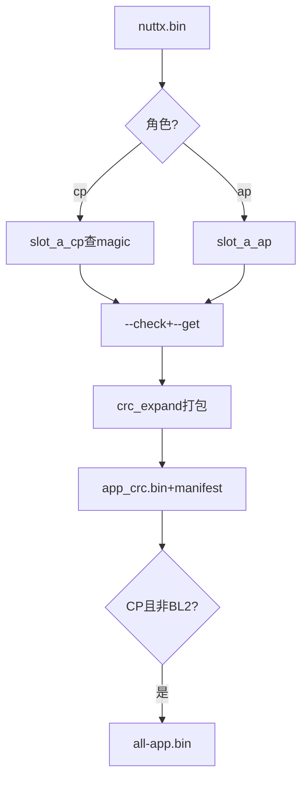
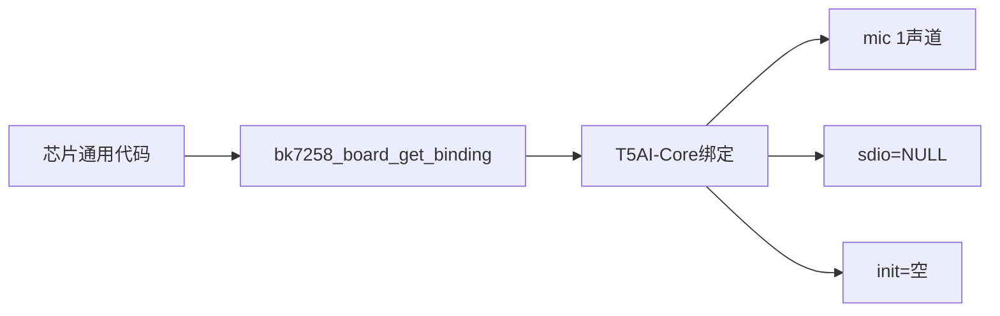
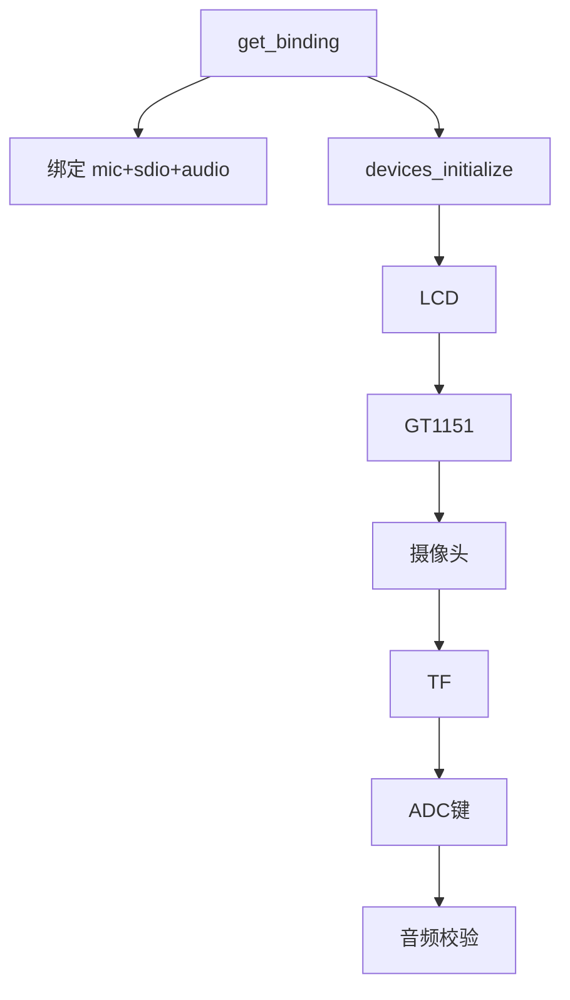
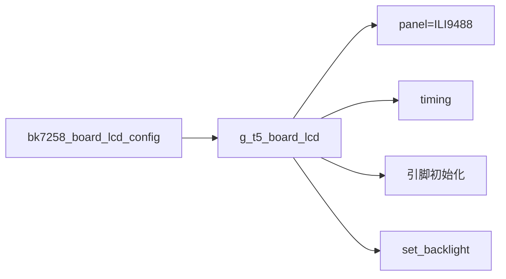
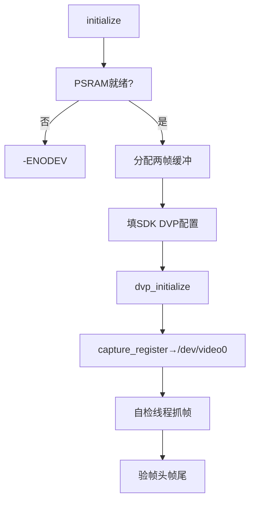

# 分区与板级变体

> 目标：看懂 BK7258 的 Flash 分区怎么"从一张 CSV 变成 C 头文件"、镜像怎么带 CRC 烧进 Flash、链接脚本怎么把 CP/AP 两个核的代码放到正确地址，以及 T5AI-Core / T5-Board 两块板子的"外设接线表"。

---

## 本组导读

固件从源码到能跑要经过这条流水线，本组代码就是"切磁盘、打包、装货、填外设接线表"这几道工序：



打比方：**分区脚本**=房产规划局（把 8 MiB Flash 划格子）；**链接脚本**=搬家公司（代码精确进格）；**CRC 打包**=贴防伪标签；**板级变体**=电器说明书（哪个灯在哪个引脚）。

> 💡 名词预热：**XIP**（原地执行）= CPU 直接跑 Flash 上的代码。**CRC16** = 循环冗余校验，32 字节数据后附 2 字节校验值。**lower-half/upper-half** = 驱动分层，下层操作寄存器、上层给应用标准接口。**V4L2** = 视频采集标准 API。**PSRAM** = 芯片外扩展内存。

---

## 文件：gen_bk7258_partitions.py

**它干什么**：读 `auto_partitions.csv`，校验后一次生成 4 份产物——SDK 兼容 CSV、C 头文件、JSON、txt 布局图。

> 💡 【背景知识】官方 SDK 只认它自己的 CSV 解析器，NuttX 侧需要 C 宏。两边各写一份分区表必然"跑偏"。这脚本把翻译、校验、生成收口到一处——**一份 CSV 进，四个文件出**。

【核心结构】`Partition` 一条分区记录；`PartitionLayout` 整个布局（Flash 大小、擦除粒度、CRC 几何、SHA-256）；`_validate_layout()` 硬性检查；`render_header()` 渲染 C 头文件；`verify_sdk_compatibility()` 官方 SDK 交叉验证。
【关键代码逐段讲解】

**1. 一条分区**（第 185-199 行）：`@dataclass(frozen=True)` 的 `Partition` 记录名字/偏移/大小/类型/读写/role。`frozen=True` 建好不可改——分区表是"合同"。`offset_is_auto`：CSV 里 offset 留空就自动接上一条（第 695 行），省得手数地址。

**2. 加载 + 算 SHA-256**（第 672-745 行）：

```python
digest = hashlib.sha256(canonical_bytes).hexdigest()
layout = PartitionLayout(..., layout_sha256=digest, ...)
_validate_layout(layout)
```

给整张表算指纹：**任何改动都让指纹变化**，编译时与预期值比对，杜绝"用过期分区表"。渲染头文件时（第 793-815 行）生成 `BK7258_PARTITION_xxx_OFFSET/SIZE` 宏，顶部 `#error` 自检：CRC 几何、XIP 基址与 SoC 内存映射头不符就拒绝编译——**配置漂移消灭在编译期**。

**3. 官方交叉验证**（第 1029-1091 行）：把生成的 CSV 丢给官方 `bk_partitions_table` 重新生成头文件，再和自己算的 `sdk_id/sdk_name` 逐项比对，不一致抛错——与官方生成器永不悄悄分叉。

【流程/关系图】


---

## 文件：bk7258_crc16.py

**它干什么**：BK7258 官方 Flash 打包格式编解码器——逻辑镜像切成 **32 字节数据 + 2 字节 CRC16** 小包，也负责解包校验。

> 💡 【背景知识】Flash 按 34 字节一个小包组织：每 32 字节数据后跟 2 字节校验，任何一字节损坏都能定位。**为什么抽单文件？** CRC 有两个使用方（镜像扩展器、BL1 打包器），共用一份保证永不漂移。

【核心结构】`PACKET_DATA = 32`、`PACKET_TOTAL = 34`、`PADDING_BYTE = b"\xff"`；`crc16()` / `expand()`（编码）/ `decode()`（解包验 CRC）。
【关键代码逐段讲解】

**1. 从 SDK 借权威实现**（第 25-36 行）：直接加载随仓库固定版本存放的 SDK `bk_crc16.py` 来算 CRC，而非自己重写——**和官方打包器字节级一致**（多项式/初值/字节序手写错一处就白搭）。

**2. 解包逐包验 CRC**（第 55-79 行）：

```python
for offset in range(0, len(data), PACKET_TOTAL):
    block = data[offset : offset + PACKET_DATA]
    stored_crc = struct.unpack_from(">H", data, offset + PACKET_DATA)[0]
    observed_crc = crc16(block)
    if stored_crc != observed_crc:
        raise CodecError(f"CRC16 mismatch at encoded offset 0x{offset:x}...")
```

`>H` 按**大端**读 2 字节 CRC。坏一个包就报错并给偏移——BL1 加载镜像时的"安检门"。

【流程/关系图】


---

## 文件：bk7258_crc_expand.py

**它干什么**：postbuild 核心工具——读 `nuttx.bin`，先做"向量表体检"，再编成 32+2 小包，写 JSON 清单。

> 💡 【背景知识】裸的 `nuttx.bin` 不能直接烧：CPU 上电最先读**向量表**（异常处理地址表，第 0 项是 MSP 主栈指针，第 1 项是复位入口），地址写错芯片"跑飞"，所以打包前必须验——**装货前先称重验货**。

【核心结构】`APP_MAGIC = b"BK7236\0\0"` 是 CP 镜像在 `0x100` 处的 SDK 记号；`main()` 做校验 → 填充 → 编码 → 写清单一条龙。
【关键代码逐段讲解】

**1. 向量表体检**（第 58-71 行）：

```python
msp, reset = struct.unpack_from("<II", raw)
if not (0x28000000 <= msp < 0x280A0000):
    raise SystemExit(f"MSP 0x{msp:08x} is outside BK7258 SRAM")
if (reset & 1) == 0:
    raise SystemExit(f"Reset vector 0x{reset:08x} is not Thumb")
if args.require_magic and raw[0x100:0x108] != APP_MAGIC:
    raise SystemExit("CP image is missing BK7236 magic at raw offset 0x100")
```

MSP 必须是 SRAM 地址（BK7258 从 `0x28000000` 起）。ARM Thumb 指令地址最低位是 1，`reset & ~1` 剥掉标志。`0x100` 处 magic 是 SDK 记号——CP 必须有，AP 不需要。

**2. 0xff 补齐 + 编码**（第 45-56、73-75 行）：`raw.ljust(args.pad_size, b"\xff")` 后 `expand(raw)`。`0xff` 是 Flash 擦除后的"空状态"，用它填充不增加实际写量。最后写 JSON 清单（第 77-92 行）：大小、xip 基址、MSP、SHA-256 全记录——"bin 从哪来、验过什么、烧到哪"可审计。

【流程/关系图】


---

## 文件：ld.script

**它干什么**：CP（CPU0，NuttX 主系统）镜像链接脚本——决定代码段、数据段、栈、堆在 Flash/RAM 的精确位置。

> 💡 【背景知识】**链接脚本** = "装修施工图"：编译器产出零件（段），链接器按图摆放。BK7258 有 A/B 双镜像升级，CP 代码必须放在官方规定的 Flash 地址，否则 Bootloader 找不到它。

【核心结构】`MEMORY` 定义 Flash（RX）与 RAM（RWX）；`.vectors` 段 KEEP 钉死排第一；一串 `ASSERT` 尺寸/地址不符即链接失败；RPTUN 共享内存符号 CP/AP 两镜像保持同组地址。
【关键代码逐段讲解】

**1. 按配置选镜像"落点"**（第 66-83 行）：

```c
#elif defined(CONFIG_BK7258_MCUBOOT_IMAGE)
#  define BK7258_CP_IMAGE_HEADER_SIZE 0x200
#  define BK7258_CP_IMAGE_FLASH_BASE BK7258_ROLE_SLOT_A_CP_XIP_START
#else
#  define BK7258_CP_IMAGE_HEADER_SIZE 0
#  define BK7258_CP_IMAGE_FLASH_BASE BK7258_ROLE_SLOT_A_CP_XIP_START
#endif
```

`BK7258_ROLE_SLOT_A_CP_XIP_START` 来自分区脚本生成的头文件——**链接脚本直接消费分区结果**。MCUboot 场景前面 0x200 留作其头部（保证 80 项向量表 0x200 对齐）；BL2 场景基址改 `0x28020000`（BL2 由 BL1 拷进 RAM 执行）。

**2. 向量表钉在 Flash 起点**（第 126-140 行）：

```c
.vectors : ALIGN(4)
{
    KEEP(*(.vectors))
} > FLASH
ASSERT(_vectors == ORIGIN(FLASH), "...")
ASSERT(SIZEOF(.vectors) == 0x140, "...")
```

`KEEP()` 防链接器 GC 掉向量表；`ASSERT` 是红线：`_vectors` 必须正好在 Flash 起点、大小正好 0x140（80 项 × 4 字节）。**上电硬件就从这读 MSP 和复位向量，错一位芯片起不来。**

**3. 初始化数据双地址**（第 245-261 行）：`.data` 的 `> RAM AT > FLASH` = 运行时在 RAM、初值存 Flash，`_eronly` 是初值在 Flash 的起点，复位代码把整段拷进 RAM——"全局变量有初值"的来源。

【流程/关系图】



---

## 文件：ld_ap.script

**它干什么**：AP（物理 CPU1 / 逻辑核 0）镜像链接脚本。区别：RAM 更靠上、多了专门的**自旋锁区**和**第二套向量表**。

> 💡 【背景知识】BK7258 多核，CP/AP 各跑一份 NuttX，用共享内存通信（RPTUN）。共享内存里的**锁**必须放在所有核都能原子操作的特殊 SRAM（`0x28000000` 起 64 KiB），否则多核抢数据互相踩脚——这就是 `SPINLOCK` 区域的意义。

【核心结构】`MEMORY`：FLASH（AP slot A XIP）、SPINLOCK（0x28000000，64 KiB）、RAM（0x28050000 起）；`.vectors_core0` + `.cpu2_vectors` 双向量表；`.spinlock_data/.spinlock_bss` 锁变量区；CPU2 探针栈在 RAM 顶部预留。
【关键代码逐段讲解】

**1. 双向量表**（第 62-92 行）：

```c
.vectors : ALIGN(4)
{
    KEEP(*(.vectors_core0))
    KEEP(*(.vectors))
} > FLASH
.cpu2_vectors : ALIGN(4)
{
    KEEP(*(.vectors_core1))
} > FLASH
ASSERT((__vector_core1_table & 0x1ff) == 0, "...")
```

AP 镜像同时装两套向量表：逻辑核 0 的放开头，物理 CPU2 的独立存放且 512 字节对齐（VTOR 硬件限制）。**一份 Flash 镜像喂两个核用**。

**2. 自旋锁进专门区域**（第 179-196 行）：

```c
.spinlock_bss (NOLOAD) : ALIGN(4)
{
    *(.bss.g_*lock*)
    *(.bss.g_bk7258_ap_smp_pending)
} > SPINLOCK
```

凡 `g_*lock*` 命名的全局锁（如 NuttX 的 `g_schedlock`）都塞进 SPINLOCK 区，因为这里的 **LDREX/STREX 独占监视器**两核共享（LDREX/STREX = ARM 原子读-改-写，类似"锁门再进屋"），第 281-283 行还专门 `ASSERT(g_schedlock >= ORIGIN(SPINLOCK) ...)`。

**3. 给 CPU2 预留"启动小窝"**（第 253-261 行）：`_bk7258_cpu2_probe_stack_top = ORIGIN(RAM) + LENGTH(RAM)`，堆到此为止、顶部留栈给 CPU2，后续 `ASSERT` 钉死边界契约。

【流程/关系图】



---

## 文件：postbuild.sh

**它干什么**：编译后"打包分发"——按角色起规范名、查分区一致性、调 CRC 扩展器打包、写 SHA-256 清单。

> 💡 【背景知识】**postbuild** = 出厂包装线：`nuttx.bin` 像没贴牌的衣服，脚本贴标签（app.bin/app1.bin）、附防伪码（CRC）、套包装（all-app.bin）。两种模式：`legacy`（兼容旧路径）和 `isolated`（每个路径验真伪、禁软链接，防构建系统被劫持）。

【核心结构】角色表：`cp → app.bin + --require-magic`、`ap → app1.bin`；`--check` 查产物过期、`--get` 实时查 `xip_start/logical_size/offset`；BL2 特判 `--execution-base 0x28020000`；`all-app.bin = bl_crc.bin + app_crc.bin`。
【关键代码逐段讲解】

**1. 打包前查分区"身份证"**（第 285-290 行）：

```bash
XIP_BASE="$(python3 "${PARTITION_GENERATOR}" \
    "${PARTITION_ARGS[@]}" --get "${PARTITION_ROLE}.xip_start")"
MAX_SIZE="$(python3 "${PARTITION_GENERATOR}" \
    "${PARTITION_ARGS[@]}" --get "${PARTITION_ROLE}.logical_size")"
```

xip_start 告诉打包器"烧在哪"（验证向量表地址），logical_size 是"槽位最大能装多少"。**打包器数字全部来自同一份分区源头，杜绝手抄地址抄错。**

**2. MCUboot 场景 0x200 位移**（第 296-300 行）：

```bash
if grep -qx 'CONFIG_BK7258_MCUBOOT_IMAGE=y' "${CONFIG_PATH}"; then
    XIP_BASE=$(printf '0x%x' "$((XIP_BASE + 0x200))")
    MAX_SIZE=$((MAX_SIZE - 0x200))
    MAGIC_ARG=""
fi
```

MCUboot 在镜像前放 0x200 头，NuttX 裸镜像从"槽位起点 + 0x200"开始——**与两个链接脚本的 `HEADER_SIZE 0x200` 呼应**。随后调 packer 出 `app_crc.bin`、写 JSON 清单（schema/role/sha256），并校验别名文件与原始 bin 逐字节相同（第 413-418 行）。

【流程/关系图】



---

## 文件：t5ai_core 的 bk7258_board_bringup.c

**它干什么**：T5AI-Core 的"外设接线表"——1 个麦克风、没 SD 卡、没板载屏/摄像头，早期和设备初始化都是空操作。

> 💡 【背景知识】**板级变体**（board variant）= 同一芯片焊在不同外设的开发板。用**绑定（binding）**模式：每块板子实现 `bk7258_board_get_binding()`，芯片代码拿"这块板子的外设清单"。**T5AI-Core 主打 AI 语音**，所以只有麦克风绑定。

【核心结构】`g_bk7258_t5ai_core_mic_config`（1 声道 MIC1）；`g_bk7258_t5ai_core_binding` 板级总绑定（mic 有、sdio/audio 为 NULL）；`bk7258_board_gpio_config()` 提供 LED/按键 GPIO；early/devices 初始化空实现。
【关键代码逐段讲解】

**板级绑定结构体**（第 48-61 行）：

```c
static const struct bk7258_board_binding_s g_bk7258_t5ai_core_binding =
{
  .version = BK7258_BINDING_VERSION,
  .size = sizeof(struct bk7258_board_binding_s),
  .mic = &g_bk7258_t5ai_core_mic_binding,
  .sdio = NULL,
#ifdef CONFIG_BK7258_AUD
  .audio = &g_bk7258_board_audio_binding,
#else
  .audio = NULL,
#endif
  .early_initialize = bk7258_board_early_initialize,
};
```

`version + size` 是**二进制 ABI 保护**：芯片层与板级代码版本对不上立刻被发现，而非内存越界崩溃。`.audio` 用 `#ifdef` 决定装不装——编译期决定外设。mic 初始化回调是空函数（第 21-29 行）：走线在 PCB 固定无需切引脚，但保留入口，未来改版加电源控制时不动芯片层。

【流程/关系图】



---

## 文件：t5_board 的 bk7258_board_bringup.c

**它干什么**：T5-Board 的"外设接线表"——外设全：双麦克风、SD 卡、LCD、GT1151 触摸、摄像头、SARADC 按键、音频校验。

> 💡 【背景知识】**T5-Board 是"全家桶"开发板**。`devices_initialize` 按 `#ifdef` 逐个启动外设，只负责"注册设备到 NuttX"（如 `bk7258_lcd_initialize()` 注册成 framebuffer），具体干活的是各驱动 lower-half。

【核心结构】`g_bk7258_t5_board_mic_config`（2 声道 MIC1+MIC2）；`g_bk7258_t5_board_sdio_binding`；5 个 `_Static_assert` 编译期钉死 ADC 按键引脚/通道/极性；`devices_initialize()` 按配置逐个初始化。
【关键代码逐段讲解】

**1. 编译期断言钉死硬件常量**（第 131-137 行）：

```c
_Static_assert(BK7258_BOARD_ADC_KEY_GPIO == 12,
               "T5-Board ADC key must remain on P12");
_Static_assert(BK7258_BOARD_ADC_KEY_SARADC_CHAN ==
               CONFIG_BK7258_SARADC_CHAN,
               "T5-Board ADC key requires SARADC channel 14");
```

`_Static_assert` 编译期断言：不满足编译直接失败。"ADC 按键必须在 P12、通道 14"这类硬件事实用它钉死，比运行时检查更早暴露配置错误。

**2. 设备初始化主流程**（第 194-252 行，节选）：

```c
int bk7258_board_devices_initialize(void)
{
  int ret = OK;

#ifdef CONFIG_BK7258_LCD
  ret = bk7258_lcd_initialize();
  if (ret < 0)
    { lcderr("ERROR: LCD framebuffer registration failed: %d\n", ret); }
#endif
  return OK;
}
```

每个外设"尝试初始化 + 失败打日志"，但**不因单个外设失败让整板起不来**（只有 TF/音频校验失败提前返回）——屏幕坏了系统照样能串口调试。这段是板级初始化"总闸"，摄像头/TF/ADC 键等其余外设同样按 `#ifdef` 逐个启动。`bk7258_board_early_initialize()` 只在背光校验配置开启时才工作（第 185-192 行）。

【流程/关系图】



---

## 文件：bk7258_t5_board_lcd.c

**它干什么**：T5-Board V1.0.2 的 LCD 绑定——把 ILI9488 RGB 屏的时序、引脚、背光翻译给通用 LCD 驱动。

> 💡 【背景知识】LCD 两种控制：**SPI 命令屏**（三根线发命令，慢）和 **RGB 并口屏**（像显示器，像素时钟+行/场同步持续刷屏，快）。ILI9488 是 RGB 屏，本文件把芯片 GPIO **复用（map）**到 R/G/B 数据线和同步信号。

【核心结构】`t5_board_lcd_control_pins_initialize()` 控制脚 + 背光脚初始化成输出；`t5_board_lcd_rgb_pins_initialize()` 20 根 RGB 脚 map 到 LCD 复用；`t5_board_lcd_set_backlight()` 开关背光；`g_t5_board_lcd` 完整绑定。
【关键代码逐段讲解】

**1. RGB 引脚映射表**（第 100-126 行，节选）：

```c
const struct { gpio_id_t pin; gpio_dev_t dev; } pins[] =
{
    { GPIO_23, GPIO_DEV_LCD_R3 },
    { GPIO_14, GPIO_DEV_LCD_CLK },
    { GPIO_16, GPIO_DEV_LCD_DE },
    { GPIO_17, GPIO_DEV_LCD_HSYNC },
    { GPIO_18, GPIO_DEV_LCD_VSYNC },
};
```

R3~R7（红 5 位）、G2~G7（绿 6 位）、B3~B7（蓝 5 位）+ CLK/DE/HSYNC/VSYNC，共 16 位色 RGB 屏全部信号。**每根 GPIO 都能"兼职"，用 `gpio_dev_map` 切到 LCD 功能**（第 142 行）。

**2. 控制脚先"解绑"再当输出**（第 61-92 行）：每根控制脚按 `gpio_dev_unmap`（解绑）→ `bk_gpio_disable_input` → `bk_gpio_enable_output` → `bk_gpio_set_capacity`（配驱动强度）的顺序初始化，顺序不能乱：**先解绑、再改方向、最后配驱动强度**。寄存器 `GPIO_CONFIG6`（第 37、72 行）只清除 4 个屏控制选择器位段，避免误动共用引脚。面板时序（第 180-190 行）`pixel_clock_mhz = 15`、`hsync_back_porch = 80` 等来自数据手册，通用驱动按它生成波形——**"空白区多久、有效区多久"全在这几个数字里**。

【流程/关系图】



---

## 文件：bk7258_t5_board_camera.c

**它干什么**：T5-Board 摄像头绑定——把 SDK 的 DVP 摄像头包装成 NuttX V4L2 设备，配 PSRAM 帧缓冲，还带开机自检线程。

> 💡 【背景知识】**DVP** = 芯片并口摄像头接口。**V4L2** = 视频采集标准 API（open/ioctl）。**PSRAM** = 芯片外扩展内存，一帧 640×480×2 字节 YUV 图约 600 KB，放普通 SRAM 太挤。本文件只做"接线+注册"，寄存器操作在 SDK——所以叫"真实的传感器门面"。

【核心结构】格式宏族 H264/YUYV/MJPEG 三选一（第 70-96 行）；`imgsensor_ops` 传感器能力表；`g_t5_camera_dvp_binding` I2C 写过滤器（拦截 GC2145 输出使能）；`bk7258_t5_board_camera_initialize()` 初始化+注册；`t5_camera_validate_frame()` 自检抓帧。
【关键代码逐段讲解】

**1. 传感器能力表**（第 170-230 行）：`imgsensor_ops` 回答 V4L2 框架"支持什么"：只支持 640×480、30 fps（校验函数里 `width != T5_CAMERA_WIDTH || ...` 返回 `-ENOTSUP`，帧率用 `FPS * numerator == denominator` 精确匹配）。`is_available` 只答"板子上有没有接口"，真正的传感器探测由 SDK 在 open 时做——**各司其职**。

**2. 拦截 GC2145 输出使能写**（第 106-121 行）：DVP 初始化会给传感器发一串 I2C 命令，其中"写 0xf2=0x0f"（GC2145 输出使能）被 `i2c_write` 钩子拦下（`return BK7258_DVP_I2C_WRITE_DEFER`），因为 T5-Board 接线要求它延迟到流启动再发。**SDK 代码不可改，就在板级层钩住它。**

**3. 主初始化流程**（第 779-916 行，节选）：

```c
if (!bk7258_psram_ready())
  return -ENODEV;
sdk.i2c_config.scl_pin = BK7258_BOARD_DVP_I2C_SCL_GPIO;
sdk.width = T5_CAMERA_WIDTH; sdk.height = T5_CAMERA_HEIGHT;
sdk.fps = FPS30; sdk.img_format = T5_CAMERA_SDK_FORMAT;

ret = bk7258_dvp_initialize(&config, &g_t5_camera_dvp);
ret = capture_register(T5_CAMERA_DEVPATH,
                       bk7258_dvp_get_imgdata(g_t5_camera_dvp),
                       sensors, 1);
```

流程：确认 PSRAM 就绪 → 分配两帧对齐缓冲 → 把板子实际引脚/分辨率/格式填进 SDK 配置 → 初始化 DVP lower-half → `capture_register` 挂到 `/dev/video0`。**所有 GPIO 编号来自 `BK7258_BOARD_*` 宏，改板子只改一处。**

**4. 自检走完整 V4L2 流程**（第 497-606 行）：自检线程用用户态同一套 API 抓一帧——`open → VIDIOC_S_FMT（设格式）→ REQBUFS（申请缓冲）→ QBUF（入队）→ STREAMON（开流）→ poll（等帧）→ DQBUF（取帧）`，然后验帧：MJPEG 必须 `0xFFD8` 开头、`0xFFD9` 结尾——判断"真抓到完整图像"最便宜的判据；H264 模式检查 `00 00 01` Annex B 起始码并算校验和。结果存共享内存（第 139-159 行）供调试器读取，上电阶段就能发现硬件/接线问题。

【流程/关系图】



---

## 相关学习文档

- [../13-Flash分区布局.md](../13-Flash分区布局.md) —— 分区脚本生成的布局长什么样、每个分区干嘛的
- [../14-安全启动与签名.md](../14-安全启动与签名.md) —— CRC 之外镜像如何签名、BL1/BL2 如何验签
- [../10-Bootloader总览与启动链.md](../10-Bootloader总览与启动链.md) —— 上电后 BL1→BL2→CP/AP 完整链条
- [../12-BL2-MCUboot深度解析.md](../12-BL2-MCUboot深度解析.md) —— 链接脚本里 `0x200` MCUboot 头的来龙去脉
- [../22-驱动适配范式.md](../22-驱动适配范式.md) —— 绑定（binding）模式、lower-half/upper-half 分层
- [../25-跨核通信-RPTUN.md](../25-跨核通信-RPTUN.md) —— ld_ap.script 里 SPINLOCK 区与共享内存用途
- [../30-构建-烧录-调试实战.md](../30-构建-烧录-调试实战.md) —— postbuild 产物的烧录与调试实战

## 源码路径

统一用仓库前缀 `$CONTEST/`（仓库根 `contest2026_135_yongwangzhiqian`）：

```
$CONTEST/board/bk7258/scripts/gen_bk7258_partitions.py
$CONTEST/board/bk7258/scripts/bk7258_crc16.py
$CONTEST/board/bk7258/scripts/bk7258_crc_expand.py
$CONTEST/board/bk7258/scripts/ld.script
$CONTEST/board/bk7258/scripts/ld_ap.script
$CONTEST/board/bk7258/scripts/postbuild.sh
$CONTEST/board/bk7258/boards/t5ai_core/src/bk7258_board_bringup.c
$CONTEST/board/bk7258/boards/t5_board/src/bk7258_board_bringup.c
$CONTEST/board/bk7258/boards/t5_board/src/bk7258_t5_board_lcd.c
$CONTEST/board/bk7258/boards/t5_board/src/bk7258_t5_board_camera.c
```
