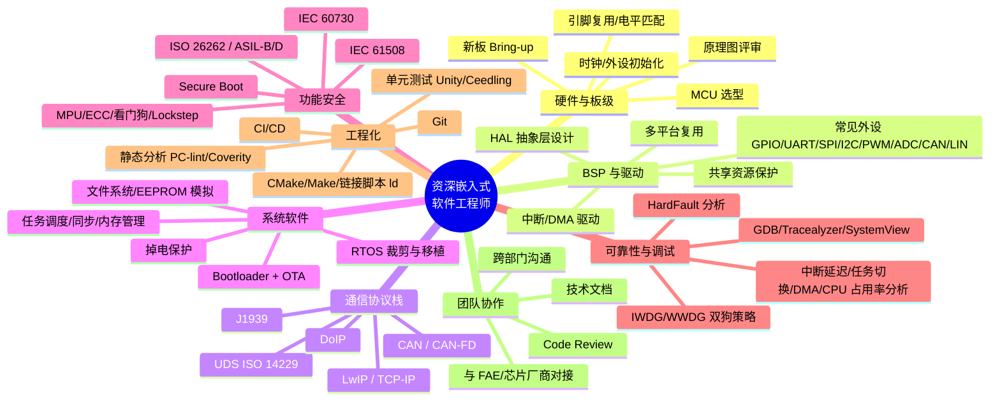

# 从零到资深嵌入式软件工程师 · 求职路线图

> 基于 JD 截图拆解：资深嵌入式软件工程师（汽车电子/功能安全方向）
> 目标：让零基础/转行/在校学生也能看懂这份 JD 的每一项要求，并知道怎么一步步补上。

---

## 0. 先给你的定心丸

这份 JD 是**资深岗（6 年以上 + 量产交付经验）**，不是应届生岗位。但 JD 里的每一项技能都是可拆、可学、可积累的。

**正确的心态**：不要把它当成"明天就要全会的考试清单"，而是当成一张**能力地图**。你每学会一个点，就离这个目标近一步。3 年认真积累，完全有机会摸到这类岗位的门槛。

> 💡 **一个基本公式**：
> 
> **嵌入式工程师价值 = 能用 C 语言让硬件稳定跑起来 + 能调试别人调不出来的 bug + 能把项目从 0 推到量产**
>
> JD 里所有要求，最终都落在这三句话上。

---

## 1. JD 能力树拆解（把招聘要求翻译成学习主题）

把 JD 里所有要求归类后，你会得到一棵能力树：

---

## 2. 阶段式学习路线（0 基础 → 3 年可达）

### 阶段一：入门期（0 ~ 6 个月）
**目标**：建立"C 语言 + 单片机 + 调试"的基本盘。

| 学习主题 | 具体动作 | 学到什么程度算过关 |
|---|---|---|
| C 语言 | 刷完《C Primer Plus》+ 写 10 个以上小练习 | 指针、结构体、位运算、宏、链表信手拈来 |
| 数据结构 | 数组/链表/队列/栈/哈希表 | 能手写链表、环形缓冲区、简单状态机 |
| 数字电路基础 | 看《数字电子技术基础》前几章 | 知道 GPIO、上拉/下拉、电平、时序、复位 |
| 第一款 MCU | STM32F103（资料最多、最经典） | 会用 HAL 库点灯、读按键、串口收发、定时器 PWM |
| 第一个开发板 | 买一块 STM32 最小系统板 + J-Link OB | 能独立点灯、烧录、串口打印 |
| 调试工具 | J-Link / ST-Link + 串口助手 | 会单步调试、看寄存器、看栈 |
| 第一个项目 | **智能小车/温湿度监测/简易示波器** | 能写 5 个以上 .c 文件，有 README |

> 💡 **背景知识**：什么是 MCU？
> 
> MCU（Microcontroller Unit）就是"单片机"——把 CPU、内存、Flash、外设接口做在一颗芯片里。你可以把它理解成一台超小的电脑，专门用来控制硬件。STM32、ESP32、BK7258 都是 MCU/MPU。

**阶段一结束标志**：你能独立用 STM32 做一个带串口菜单的小项目，遇到 bug 会用调试器定位。

---

### 阶段二：夯实期（6 ~ 12 个月）
**目标**：理解 RTOS、驱动、通信协议，开始接触真实工程。

| 学习主题 | 具体动作 | 学到什么程度算过关 |
|---|---|---|
| RTOS | 学 FreeRTOS（官方文档 + 源码） | 理解任务、信号量、互斥量、队列、中断与任务交互 |
| RTOS 移植 | 在 STM32 上把 FreeRTOS 跑起来 | 会写 FreeRTOSConfig.h，能解释 SysTick/PendSV |
| 中断与 DMA | 用 DMA 做串口收发、ADC 采样 | 理解中断优先级、ISR 越短越好、DMA 减轻 CPU 负担 |
| 常用通信协议 | SPI/I2C/CAN/UART | 会用逻辑分析仪抓波形，能解释帧格式 |
| CAN 协议基础 | 买 CAN 收发器 + 两个节点互发 | 理解 ID、数据帧、远程帧、波特率 |
| 链接脚本 | 看 STM32 启动文件 + .ld 文件 | 知道 .text/.data/.bss 放哪里 |
| Git | 日常用 git 管理自己的项目 | 会 add/commit/branch/merge/push |
| 第二个项目 | **基于 FreeRTOS 的多任务数据采集器** | 任务间用队列传数据，有看门狗、有错误处理 |

> 💡 **背景知识**：为什么需要 RTOS？
> 
> 裸机程序用"轮询"处理多件事，代码一大就乱。RTOS 让 CPU"分时"执行多个任务，每个任务仿佛独占 CPU。汽车电子里 FreeRTOS/RT-Thread/Zephyr 非常常见。

**阶段二结束标志**：你能在 STM32 + FreeRTOS 上同时跑 3-5 个任务，会用队列和信号量同步，能解释调度时机。

---

### 阶段三：进阶期（1 ~ 2 年）
**目标**：接触 BSP、Bootloader、协议栈、功能安全初探。

| 学习主题 | 具体动作 | 学到什么程度算过关 |
|---|---|---|
| BSP 开发 | 为一块新板子写初始化代码 | 会写 board.c、时钟配置、引脚初始化 |
| 驱动框架 | 用"设备-驱动-总线"思想封装 HAL | 同一套 UART 驱动能在不同板子上复用 |
| Bootloader | 手写一个简易 IAP Bootloader | 理解向量表重定位、跳转、双区升级 |
| OTA | 实现串口/TFTP 升级 APP | 理解 A/B 分区、签名、回滚、防掉电 |
| 网络协议 | 学 LwIP（在 STM32 或 Linux 上） | 理解 socket、TCP/UDP、DHCP、DNS |
| 汽车协议 | 学 UDS（ISO 14229）+ J1939 基础 | 会用 CANoe/PCAN 发诊断请求 |
| 看门狗 | 实现 IWDG + WWDG 组合策略 | 知道喂狗位置、窗口狗怎么用 |
| 调试进阶 | 学 GDB + Tracealyzer/SystemView | 能分析任务切换时间、中断延迟 |
| 第三个项目 | **带 OTA 的车载/工业控制器原型** | 有 Bootloader + APP + UDS 诊断 + 看门狗 |

> 💡 **背景知识**：什么是 Bootloader？
> 
> Bootloader 是芯片上电后先跑的一小段程序。它负责初始化硬件、校验主程序、必要时升级主程序，最后跳转到主程序。手机 OTA、汽车 ECU 升级都靠它。

**阶段三结束标志**：你能独立设计一个带 Bootloader + OTA + 看门狗的系统，能向面试官讲清楚向量表重定位和风险点。

---

### 阶段四：突破期（2 ~ 3 年）
**目标**：补齐汽车电子/功能安全/工程化短板，做出"能见人"的项目。

| 学习主题 | 具体动作 | 学到什么程度算过关 |
|---|---|---|
| 功能安全 | 读 ISO 26262 入门资料（不用啃全文） | 理解 ASIL-A/B/C/D、安全目标、FMEA/FTA 概念 |
| MPU/ECC/Lockstep | 在 AURIX TC3xx 或 STM32H7 上实验 | 知道内存保护、ECC 纠错、双核锁步是干嘛的 |
| 安全启动 | 实现 Secure Boot + 签名验签 | 理解 ECDSA、密钥链、HSM/TEE 概念 |
| 静态分析 | 用 PC-lint/Cppcheck 扫自己的代码 | 能消 MISRA-C 规则告警 |
| 单元测试 | 用 Unity/Ceedling 写测试 | 核心函数有单元测试覆盖 |
| CI/CD | 用 GitHub Actions/GitLab CI 做自动构建 | 提交代码自动编译、跑测试 |
| CMake/Make | 把自己的项目改成 CMake 构建 | 会写 CMakeLists.txt、交叉编译 |
| 汽车 MCU | 接触 NXP S32K / Infineon AURIX TC3xx | 至少跑通官方例程，理解安全核概念 |
| 第四个项目 | **符合功能安全思路的 ECU 原型** | 有需求文档、架构图、测试报告、代码审查记录 |

> 💡 **背景知识**：什么是功能安全？
> 
> 汽车里的 ECU 如果出 bug 可能出人命。功能安全（ISO 26262）就是一套方法论，要求你证明"即使某些部件坏了，系统仍然安全"。ASIL-D 最高、ASIL-A 最低。

**阶段四结束标志**：你能完整交付一个带文档、有测试、经过简单安全分析的嵌入式项目，能在简历上写"独立完成 Bootloader + OTA + UDS + FreeRTOS 驱动开发"。

---

## 3. 针对 JD 逐条的"小白路径"

| JD 原文要求 | 小白怎么补 | 学习时间 | 验证方式 |
|---|---|---|---|
| MCU 选型、新板 Bring-up | 多玩几款开发板，学会读 datasheet、原理图，练习从 0 点亮一块板 | 6~12 月 | 独立完成一块陌生板子的首次点灯 |
| 时钟配置、外设初始化 | 精读 STM32 RCC 章节，手写 SystemClock_Config | 1~2 月 | 能改系统时钟到外设仍能工作 |
| 引脚复用、电平匹配 | 做 SPI/I2C/UART 外设互联项目 | 1~2 月 | 会看原理图、会查引脚复用表 |
| 封装统一 HAL、多平台复用 | 设计一套自己的 board abstraction | 6 月+ | 同一段驱动能在两块板子跑 |
| 中断/DMA 驱动，ISR 上下文安全 | 读 FreeRTOS 中断相关章节，写 ISR + 队列 | 2~3 月 | 中断里不调用阻塞 API |
| CAN/J1939/UDS/LwIP | 学 CAN 协议→UDS→J1939→LwIP，由近到远 | 6~12 月 | 能用 PCAN 做诊断会话控制 |
| RTOS 裁剪移植 | 在裸机上移植 FreeRTOS，改 port.c | 3~6 月 | 能说清上下文切换原理 |
| Bootloader + OTA 双区架构 | 手写 Bootloader，做 A/B 升级 | 3~6 月 | 真实跑通升级+失败回滚 |
| 签名验签、防回滚 | 用 imgtool 给固件签名，Bootloader 验签 | 1~2 月 | 改一个字节让升级失败 |
| IWDG/WWDG 双狗 | 设计喂狗策略，模拟死机恢复 | 1 月 | 死锁时系统自动复位 |
| HardFault 分析 | 故意制造 HardFault，用 GDB 看 CFSR/BFAR | 1~2 月 | 能定位非法内存访问 |
| 原理图、上电时序、复位电路 | 学模电基础，做电源时序实验 | 3~6 月 | 能指出原理图潜在问题 |
| 示波器/逻辑分析仪/J-Link/CAN 分析仪 | 借钱买/实验室用，每个工具做一个小实验 | 3~6 月 | 会用这些工具定位 80% 硬件问题 |
| GDB/Tracealyzer/SystemView | 在项目中持续使用 | 2~3 月 | 能给出任务切换耗时、DMA 利用率 |
| ISO 26262 / IEC 61508 / IEC 60730 | 读入门书/网课，理解 ASIL 等级 | 3~6 月 | 能解释 MPU/ECC/Lockstep 作用 |
| Git/CMake/Make/ld/CI/CD/静态分析/单元测试 | 工程化训练，每个项目都用 | 贯穿始终 | 仓库有 CI、有测试、有 lint |
| AI Agent 工具 | 把 AI 当成学习/编程助手 | 现在就开始 | 能用 AI 加速阅读源码、写脚本 |

---

## 4. 项目建议（简历上能写的）

项目是最好背书。建议按阶段做：

1. **入门**：STM32 智能小车/环境监测仪（2~3 个月）
2. **进阶**：基于 FreeRTOS 的多传感器数据采集与上传系统（3~4 个月）
3. **高级**：带 Bootloader + OTA + UDS 诊断的汽车 ECU 原型（6 个月）
4. **冲刺**：基于 AURIX TC3xx 或 NXP S32K 的功能安全相关 Demo（6 个月+）

每个项目都要留下：
- GitHub 仓库（代码 + README + 视频/截图）
- 架构图
- 踩坑记录（博客/Obsidian 笔记）
- 如果可能，跑起来的实物照片/视频

---

## 5. 简历与面试策略

### 简历怎么写（针对这份 JD）

不要只列"熟悉 C 语言"，要写成：

> ❌ 熟悉 FreeRTOS  
> ✅ 在 STM32F4 上完成 FreeRTOS 移植，实现 5 个任务调度，使用队列/信号量同步，系统稳定运行 72 小时无复位

> ❌ 了解 Bootloader  
> ✅ 独立设计并实现 STM32 Bootloader，支持 Flash 双区升级、CRC 校验、向量表重定位，升级失败自动回滚旧版本

### 面试高频问题（这份 JD 的）

1. 讲一下从芯片上电到进入 main 函数的完整过程。
2. Bootloader 怎么跳转到 APP？向量表重定位怎么做的？
3. OTA 升级失败了怎么办？怎么保证不死机？
4. ISR 里为什么不能调用阻塞 API？
5. FreeRTOS 任务切换是怎么触发的？
6. CAN 和 UART 有什么区别？CAN 为什么抗干扰？
7. UDS 的诊断会话控制是怎么回事？
8. 你遇到过最难的 bug 是什么？怎么定位的？
9. 什么是功能安全？ASIL-D 和 ASIL-A 有什么区别？
10. 看门狗怎么设计才能既不死机也不误复位？

---

## 6. 学习资源推荐

| 主题 | 推荐资源 |
|---|---|
| C 语言 | 《C Primer Plus》《C 和指针》 |
| STM32 | 正点原子/野火视频 + 官方 HAL 例程 |
| FreeRTOS | 官方 FreeRTOS 教程 + 源码 |
| RT-Thread/Zephyr | 官方文档 + QEMU 仿真 |
| CAN/UDS | 《CAN 总线入门书》、ISO 14229 公开资料、PCAN 示例 |
| LwIP | 官方文档 + STM32 以太网例程 |
| Bootloader/OTA | MCUboot 官方文档、各种开源 IAP 项目 |
| 功能安全 | 《ISO 26262 汽车功能安全》、陆惊涛《汽车功能安全》 |
| AURIX TC3xx | Infineon 官方 iLLD 例程 |
| NXP S32K | NXP S32 Design Studio + 官方 SDK |
| 调试工具 | J-Link 官方文档、SystemView 教程 |
| 工程化 | 《CMake 实践》、Git 官方文档、MISRA-C 规则 |
| AI 辅助 | 用 AI 读 datasheet、解释报错、Review 代码 |

---

## 7. 一句话总结

> 这份 JD 是**终点画像**，不是起点要求。路径是：**C 语言 → STM32 裸机 → FreeRTOS → 驱动/BSP → Bootloader/OTA → 协议栈 → 功能安全/工程化**。每 6~12 个月做一个能见人、能写进简历的项目，3 年后你完全有机会拿到同等级别岗位。

现在开始，先做第一件小事：**今天就把 STM32 开发板点亮**。
